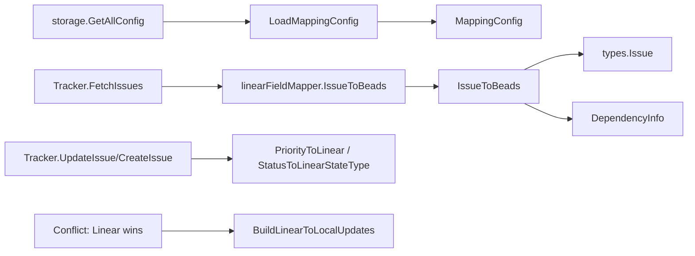

# mapping_config_and_conversion

`mapping_config_and_conversion`（`internal.linear.mapping` 中以 `MappingConfig` / `LoadMappingConfig` / `IssueToBeads` 为核心的一组函数）解决的不是“能不能连上 Linear”，而是“连上之后语义会不会悄悄跑偏”。Linear 和 Beads 在字段上看起来很像：都有优先级、状态、类型、依赖，但编码方式、状态模型、字段边界都不一致。这个模块的职责就是把两边的数据模型做成**可配置、可回退、可容错**的语义映射层，避免同步过程中出现“值能写进去，但意思错了”的隐性数据损坏。

## 这个模块在系统里的位置：为什么需要它

如果把 `internal.linear.tracker.Tracker` 看成“同步调度器”，那本模块就是它的“翻译引擎 + 归一化器”。

朴素方案通常是把映射规则硬编码在 `Tracker` 里，例如 `if priority == 1 => 0`、`if state == completed => closed`。这种做法短期简单，但会立刻遇到三个问题：

第一，**团队工作流差异**。Linear 的 `state.name` 经常是团队自定义的，硬编码只适用于默认 workflow。  
第二，**双向同步语义不对称**。例如 `blockedBy`/`blocks` 的方向在图上不是简单同义词，需要反向处理。  
第三，**冲突检测噪声**。Beads 的 `Description`、`AcceptanceCriteria`、`Design`、`Notes` 在 Linear 里会被折叠进单一 description 字段；如果不做归一化，哈希比较会误报冲突。

所以这里的设计不是“写几个转换函数”，而是“把转换策略抽成配置、把模型差异显式化、把异常输入设默认回退”，从而让同步链路在真实团队数据下可运行。

## 心智模型：把它当作“海关申报 + 货物重打包”

可以把 `MappingConfig` 想象成一张海关申报表：

- `PriorityMap`：数值税则编码转换。
- `StateMap`：流程状态语义对照。
- `LabelTypeMap`：标签推断业务类别。
- `RelationMap`：关系类型到依赖语义的映射。

而 `IssueToBeads` / `BuildLinearToLocalUpdates` / `ProjectToEpic` 则是“重打包工序”：输入是 Linear API 形状（`Issue`、`Project`），输出是 Beads 或更新补丁可接受的形状（`*types.Issue` 或 `map[string]interface{}`）。

`NormalizeIssueForLinearHash` 则是“报关前统一包装标准”：把 Beads 多段文本拼成 Linear 风格 description，并清理不在 Linear 模型中的字段，减少比较噪声。

## 架构与数据流



从调用关系看，关键路径有三条。

第一条是**配置加载路径**。`Tracker.Init` 通过 `LoadMappingConfig(&configLoaderAdapter{...})` 构建映射配置；`configLoaderAdapter.GetAllConfig` 最终调用 `storage.Storage.GetAllConfig`。这条路径决定“翻译词典”的内容，属于低频但高影响路径。

第二条是**Pull 转换路径**。`Tracker.FetchIssues` 拿到 Linear `Issue` 后包装成 `tracker.TrackerIssue`；随后 `linearFieldMapper.IssueToBeads` 取 `Raw.(*Issue)`，调用 `IssueToBeads` 产出 `IssueConversion`，再转成 `tracker.IssueConversion`。这是高频路径，任何映射错误会直接污染本地数据。

第三条是**Push/冲突处理路径**。创建/更新时，`Tracker.CreateIssue` 与 `Tracker.UpdateIssue` 分别使用 `PriorityToLinear`、`StatusToLinearStateType`；当冲突策略为“Linear 胜出”时，`BuildLinearToLocalUpdates` 生成局部字段补丁。它是“改写本地事实”的路径，因此回退策略（默认值）非常关键。

## 组件深潜

### `MappingConfig`

`MappingConfig` 是整个模块的核心抽象：它把映射规则数据化，而不是散落在 if/else 里。设计上的关键点是“面向不确定 workflow”。例如 `StateMap` 的 key 支持 state type 或 state name，且在 `LoadMappingConfig` 里统一 lower-case，避免大小写造成配置失效。

隐含契约：调用方需要传入非 nil 的 `*MappingConfig` 给各类映射函数；当前函数内部没有做 `config == nil` 防御。

### `DefaultMappingConfig()` + `LoadMappingConfig(loader ConfigLoader)`

两者配合形成“默认值优先、配置覆盖”的启动策略。`LoadMappingConfig` 先拿默认配置，再尝试覆盖；若 `loader == nil` 或 `GetAllConfig()` 出错，直接保留默认值。

这个设计选择偏向**可用性优先**：即使配置系统故障，同步仍可用，不会因配置读取失败直接中断。代价是配置错误可能被静默吞掉（例如 priority 值非整数，`parseIntValue` 失败后该条被忽略）。

`ConfigLoader` 只有 `GetAllConfig() (map[string]string, error)` 一个方法，边界非常薄，目的是让 mapping 层不依赖具体存储实现。

### `BuildLinearDescription(issue *types.Issue)` 与 `NormalizeIssueForLinearHash(issue *types.Issue)`

这是冲突比较正确性的关键组合。

`BuildLinearDescription` 按固定顺序拼接 `Description`、`AcceptanceCriteria`、`Design`、`Notes`，模拟推送到 Linear 时 description 的合成形态。`NormalizeIssueForLinearHash` 在此基础上返回 issue 副本，并清空 `AcceptanceCriteria`/`Design`/`Notes`，同时对 `ExternalRef` 做 `CanonicalizeLinearExternalRef`。

它解决的是“结构不一致导致的假差异”：同一业务内容在两端字段布局不同，直接比较会误判“已修改”。

### `GenerateIssueIDs(issues, prefix, creator, opts)` 与 `IDGenerationOptions`

这个函数用于“导入/补齐 ID”场景，核心策略是：

- 先记录已有 `issue.ID` 到 `usedIDs`；
- 对无 ID 记录，按 `length = BaseLength..MaxLength`、`nonce = 0..9` 组合生成候选；
- 调用 `idgen.GenerateHashID(...)`，找到未占用值即写回。

`IDGenerationOptions` 的 `BaseLength`/`MaxLength` 会被约束到 3..8，且默认 6..8。它体现的是**可读性与碰撞概率折中**：短 ID 更好读，但更易碰撞；通过长度递增和 nonce 重试拉平风险。若仍无法生成，函数返回 error，而不是冒险写重复 ID，这是 correctness-first 选择。

### 优先级与状态映射族

`PriorityToBeads` / `PriorityToLinear`、`StateToBeadsStatus` / `StatusToLinearStateType` 共同定义双向状态语义。

- `PriorityToLinear` 不是硬编码反向表，而是运行时反转 `config.PriorityMap`。优点是配置一处生效双向；缺点是若出现多对一映射，逆向会发生覆盖，结果取决于 map 迭代写入结果。
- `StateToBeadsStatus` 先匹配 `state.Type` 再匹配 `state.Name`，先标准语义、后兼容自定义命名。
- `StatusToLinearStateType` 明确把 `types.StatusBlocked` 映射为 `"started"`，因为 Linear 的状态类型集中没有 blocked 类型。这个选择保证可推送，但会损失 blocked 的语义精度。

`ParseBeadsStatus` 以及 `ParseIssueType` 都采用“宽松字符串归一 + 默认回退”的策略，目的是吞掉外部脏值并保持流水线不断。

### `LabelToIssueType(labels, config)` 与 `RelationToBeadsDep(relationType, config)`

`LabelToIssueType` 的策略是“先精确匹配，再关键字包含匹配”。这使它对标签命名风格更鲁棒（如 `kind:bug`、`feature-request`），但也引入误判风险：关键字过于宽泛时会抢占匹配。

`RelationToBeadsDep` 只负责关系类型名到依赖类型名的字典映射；真正的方向语义在 `IssueToBeads` 里处理。这个分工很关键：把“是什么关系”和“箭头方向”拆开，避免函数职责混杂。

### `IssueToBeads(li, config)`

这是该模块最核心的转换函数，承担完整 pull 侧对象转换：

1. 解析 `CreatedAt` / `UpdatedAt`（RFC3339）；失败时回退 `time.Now()`。
2. 构建 `types.Issue` 主体字段（标题、描述、优先级、类型、状态、assignee、labels）。
3. 解析 `CompletedAt` 设置 `ClosedAt`。
4. 规范化 `ExternalRef`（`CanonicalizeLinearExternalRef`）。
5. 额外提取依赖 `[]DependencyInfo`：
   - `Parent` -> `parent-child`
   - `Relations` 中根据 `rel.Type` 映射类型，并对 `blockedBy` / `blocks` 做方向修正。

这里体现了一个重要建模决策：返回 `*IssueConversion`，把依赖与 issue 主体分离。原因是依赖创建通常需要“所有 issue 先落库、有 ID 对照表后再连边”。这在 `types.go` 中也有注释说明。

### `BuildLinearToLocalUpdates(li, config)`

当冲突决策选择“用 Linear 覆盖本地”时，这个函数生成可直接应用的字段补丁 `map[string]interface{}`。它更新标题、描述、优先级、状态、assignee、labels、时间戳等，并在 assignee 为空时写空字符串做显式清空。

这种“补丁 map”方式在灵活性上优于强类型 struct（可只写变化字段），但也更依赖 key 名契约正确性（如 `"updated_at"`、`"closed_at"` 必须与上层更新逻辑一致）。

### `ProjectToEpic(lp)` 与 `MapEpicToProjectState(status)`

这组函数处理 Linear Project 与 Beads Epic 的对齐：

- `ProjectToEpic` 将 `Project.State` 映射到 `types.Status`，并固定 `IssueType=types.TypeEpic`、`Priority=2`。
- `MapEpicToProjectState` 反向映射 status 到 Linear project state（`closed -> completed`，`in_progress -> started`，其他 -> `planned`）。

它不是通用 issue 映射，而是“项目维度语义桥接”，用于同步 Epic/Project 层级对象。

## 依赖分析：它依赖谁、谁依赖它

在 `mapping_config_and_conversion` 子模块范围内，核心依赖关系如下：

该模块向下依赖：

- `internal/types`：目标域模型（`types.Issue`、`types.Status`、`types.IssueType`）。
- `internal/idgen.GenerateHashID`：无 ID 场景的哈希 ID 生成。
- 同包工具函数 `IsLinearExternalRef` / `CanonicalizeLinearExternalRef`：外链识别与规范化。
- `internal/linear/types` 中的 `Issue`、`Project`、`State`、`Labels`、`Relations`、`DependencyInfo`、`IssueConversion` 等数据类型。

上游调用方主要是：

- `internal.linear.tracker.Tracker`：`Init` 调用 `LoadMappingConfig`，创建/更新调用优先级和状态映射函数。
- `internal.linear.fieldmapper.linearFieldMapper`：实现 `tracker.FieldMapper` 时调用 `IssueToBeads`、`PriorityToLinear`、`StateToBeadsStatus`、`LabelToIssueType` 等。

这说明它的架构角色是**转换内核（translator core）**，既被 tracker orchestration 直接调用，也被 field mapper 作为适配层重复复用。

## 设计取舍与权衡

这里可以看到几组很典型的工程取舍。

第一组是**鲁棒性 vs 可观测性**。大量函数在异常输入时采用默认回退（如时间 parse 失败回 `time.Now()`、未知状态回 `StatusOpen`）。这让同步不中断，但也可能掩盖上游数据质量问题。

第二组是**灵活性 vs 确定性**。映射可配置极大增强了团队适配能力，但 `PriorityToLinear` 的逆向构建在配置非单射时会不稳定；这是“用户可配置系统”常见代价。

第三组是**解耦 vs 类型安全**。`ConfigLoader` 单方法接口和 `IssueConversion.Issue interface{}` 都是为了减耦（避免 mapping 层卷入存储细节、避免循环依赖），但换来运行时断言与更弱的编译期保护。

第四组是**语义保真 vs 平台限制**。`StatusBlocked -> "started"` 是明显的语义压缩：保持可写入 Linear，但丢失 blocked 的一阶状态表达。

## 如何使用与扩展

常见使用方式如下。

```go
// 在 tracker 初始化阶段加载映射配置
cfg := LoadMappingConfig(loader)

// Pull: Linear Issue -> Beads Issue + deps
conv := IssueToBeads(linearIssue, cfg)

// Push: Beads priority/status -> Linear
linearPriority := PriorityToLinear(localIssue.Priority, cfg)
linearStateType := StatusToLinearStateType(localIssue.Status)

// 冲突时（Linear wins）构建本地更新补丁
updates := BuildLinearToLocalUpdates(linearIssue, cfg)
```

配置覆盖的 key 规则：

- `linear.priority_map.<linear_priority> = <beads_priority>`
- `linear.state_map.<state_type_or_name> = <beads_status>`
- `linear.label_type_map.<label_name> = <beads_issue_type>`
- `linear.relation_map.<relation_type> = <beads_dep_type>`

扩展时建议遵循：新增可变语义优先进入 `MappingConfig`，新增不变规范优先作为纯函数；这样可以保持“策略可配、机制稳定”。

## 边界条件与新贡献者易踩坑

- `config` 为空会 panic：映射函数普遍假设传入 `*MappingConfig` 非 nil。
- `LoadMappingConfig` 对非法整数配置静默忽略，可能导致“以为生效其实没生效”。
- `LabelToIssueType` 的子串匹配与 map 迭代顺序组合，会让某些重叠关键词出现不稳定命中。
- `PriorityToLinear` 对多对一映射反推有覆盖风险，不适合配置成非单射。
- `IssueToBeads` 在时间解析失败时使用当前时间，这会影响审计/冲突判断。
- `BuildLinearToLocalUpdates` 返回动态 map，字段 key 的拼写和语义完全依赖上游约定。
- 依赖方向处理中，`blockedBy` 和 `blocks` 都做了显式方向处理；改这里时必须同时验证依赖图语义，不要只看字符串映射。

## 相关参考

- [linear_mapping_and_field_translation](linear_mapping_and_field_translation.md)
- [linear_tracker_adapter_layer](linear_tracker_adapter_layer.md)
- [sync_statistics_and_conflicts](sync_statistics_and_conflicts.md)
- [tracker_plugin_contracts](tracker_plugin_contracts.md)
- [linear_api_types_and_payloads](linear_api_types_and_payloads.md)
