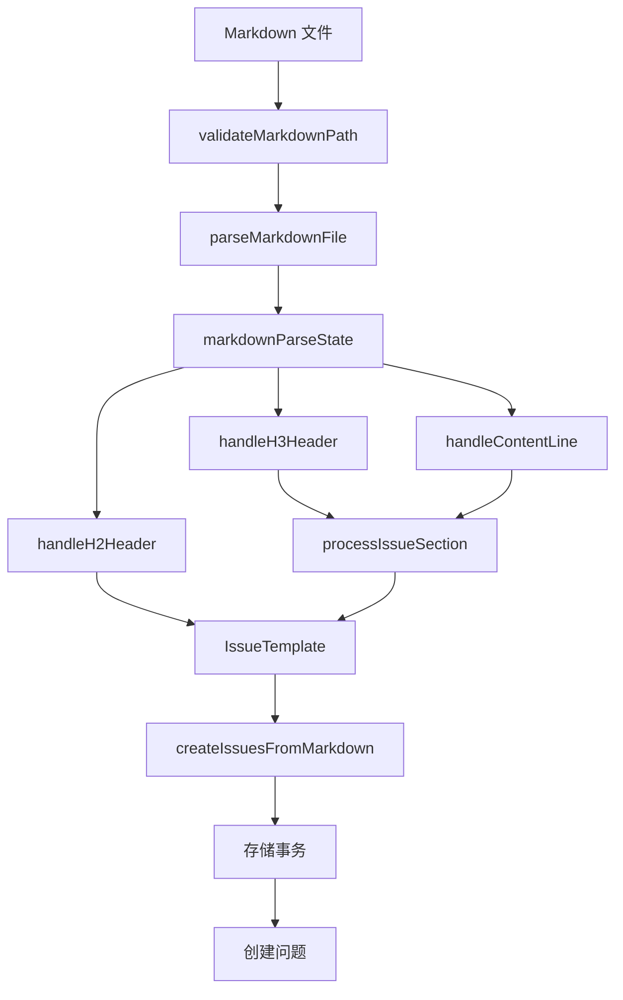

# Markdown 解析组件技术深度解析

## 1. 模块概述

### 问题空间
想象一下，你需要批量创建多个问题（issues）到项目管理系统中。手动逐个创建是一项繁琐且容易出错的工作。如果能够从一个结构化的 Markdown 文件中一次性解析并创建多个问题，那将大大提高效率。这就是 `markdown_parsing_components` 模块要解决的核心问题。

### 核心价值
该模块提供了一种从结构化 Markdown 文件中批量解析和创建问题的机制。它定义了一种清晰的 Markdown 格式，允许用户在一个文件中定义多个问题，包括它们的标题、描述、优先级、类型、验收标准、标签和依赖关系等信息。

## 2. 核心架构与数据流程

### 架构视图
下面是该模块的核心架构和数据流程图：



### 数据流程详解
1. **文件验证阶段**：首先通过 `validateMarkdownPath` 验证文件路径的合法性，防止目录遍历攻击，并确保文件是有效的 Markdown 文件。
2. **解析阶段**：使用 `parseMarkdownFile` 函数解析 Markdown 文件。
3. **状态管理**：`markdownParseState` 结构体管理解析过程中的状态，包括当前正在处理的问题和当前节。
4. **事件处理**：
   - `handleH2Header` 处理 H2 标题（新问题的开始）
   - `handleH3Header` 处理 H3 标题（问题内的节）
   - `handleContentLine` 处理普通内容行
5. **节处理**：`processIssueSection` 函数将解析到的节内容映射到 `IssueTemplate` 的相应字段。
6. **问题创建**：`createIssuesFromMarkdown` 函数将解析到的 `IssueTemplate` 转换为实际的 `types.Issue` 对象，并在一个事务中创建所有问题、标签和依赖关系。

## 3. 核心组件深度解析

### 3.1 IssueTemplate 结构体

#### 设计意图
`IssueTemplate` 是一个数据传输对象（DTO），用于在解析过程中临时存储问题的所有信息。它充当了 Markdown 文件内容和实际 `types.Issue` 对象之间的桥梁。

#### 字段解析
```go
type IssueTemplate struct {
    Title              string        // 问题标题（来自 H2 标题）
    Description        string        // 问题描述
    Design             string        // 设计说明
    AcceptanceCriteria string        // 验收标准
    Priority           int           // 优先级
    IssueType          types.IssueType  // 问题类型
    Assignee           string        // 负责人
    Labels             []string      // 标签列表
    Dependencies       []string      // 依赖关系列表
}
```

#### 默认值
- **Priority**：默认值为 2（中等优先级）
- **IssueType**：默认值为 "task"（任务类型）

### 3.2 markdownParseState 结构体

#### 设计意图
这是一个典型的状态机实现，用于管理 Markdown 解析过程中的上下文。它跟踪当前正在处理的问题、当前节以及已解析的问题列表。

#### 状态转换
```go
type markdownParseState struct {
    issues         []*IssueTemplate  // 已解析的问题列表
    currentIssue   *IssueTemplate    // 当前正在处理的问题
    currentSection string            // 当前节名称
    sectionContent strings.Builder   // 当前节内容缓冲区
}
```

#### 核心方法
1. **finalizeSection**：完成当前节的处理，将节内容应用到当前问题，并重置节内容缓冲区。
2. **handleH2Header**：处理新问题的开始，完成上一个问题的处理，开始新问题。
3. **handleH3Header**：处理新节的开始，完成上一个节的处理，开始新节。
4. **handleContentLine**：处理普通内容行，根据当前状态将内容添加到适当的位置。
5. **finalize**：完成整个解析过程，返回所有解析到的问题。

### 3.3 解析算法详解

#### Markdown 格式规范
模块期望的 Markdown 格式如下：
```markdown
## 问题标题
描述文本...

### Priority
2

### Type
feature

### Description
详细描述...

### Design
设计说明...

### Acceptance Criteria
- 标准 1
- 标准 2

### Assignee
username

### Labels
label1, label2

### Dependencies
bd-10, bd-20
```

#### 解析流程
1. **初始化**：创建一个新的 `markdownParseState` 对象。
2. **逐行扫描**：使用 `bufio.Scanner` 逐行读取 Markdown 文件。
3. **模式匹配**：
   - 如果行匹配 H2 标题模式（`^##\s+(.+)$`），则调用 `handleH2Header`。
   - 如果行匹配 H3 标题模式（`^###\s+(.+)$`），则调用 `handleH3Header`。
   - 否则，调用 `handleContentLine` 处理普通内容。
4. **最终化**：调用 `finalize` 完成解析过程。

#### 关键设计决策
- **状态机模式**：使用状态机管理解析过程，使代码结构清晰，易于理解和维护。
- **缓冲区预分配**：`createMarkdownScanner` 函数为扫描器分配了 1MB 的缓冲区，以处理大型 Markdown 文件。
- **正则表达式预编译**：`h2Regex` 和 `h3Regex` 在包初始化时预编译，以提高性能。

## 4. 依赖分析

### 4.1 内部依赖
| 依赖组件 | 用途 | 耦合度 |
|---------|------|--------|
| `types.Issue` | 实际创建的问题对象 | 高 |
| `types.Dependency` | 问题依赖关系对象 | 中 |
| `validation.ParsePriority` | 解析优先级字符串 | 中 |
| `validation.ParseIssueType` | 解析问题类型字符串 | 中 |
| `storage.Transaction` | 存储事务接口 | 高 |
| `ui.RenderPass` | UI 渲染功能 | 低 |

### 4.2 外部依赖
| 依赖 | 用途 |
|-----|------|
| `bufio` | 文件扫描 |
| `regexp` | 正则表达式匹配 |
| `strings` | 字符串操作 |
| `os` | 文件系统操作 |
| `path/filepath` | 路径操作 |
| `github.com/spf13/cobra` | 命令行界面 |

## 5. 设计决策与权衡

### 5.1 状态机 vs 递归下降解析
**决策**：使用状态机模式
**原因**：
- Markdown 结构相对简单，状态机足够处理
- 状态机代码更直观，易于理解和维护
- 性能更好，不需要递归调用栈

### 5.2 正则表达式 vs 手动解析
**决策**：使用正则表达式匹配标题
**权衡**：
- 优点：代码简洁，易于理解
- 缺点：正则表达式有一定的学习曲线，性能可能略低于手动解析
**缓解措施**：正则表达式在包初始化时预编译

### 5.3 单事务 vs 多事务
**决策**：在单个事务中创建所有问题
**原因**：
- 原子性：要么所有问题都创建成功，要么都失败
- 性能：减少事务开销
**权衡**：
- 优点：原子性保证，性能更好
- 缺点：如果创建过程中有一个问题失败，所有问题都不会被创建

### 5.4 路径验证 vs 直接使用
**决策**：严格验证文件路径
**原因**：
- 安全性：防止目录遍历攻击
- 可靠性：确保文件存在且是有效的 Markdown 文件
**权衡**：
- 优点：更安全，更可靠
- 缺点：增加了一些代码复杂度

## 6. 使用指南与常见模式

### 6.1 基本使用
```go
// 解析 Markdown 文件
templates, err := parseMarkdownFile("issues.md")
if err != nil {
    // 处理错误
}

// 使用解析到的模板创建问题
// ...
```

### 6.2 支持的节
| 节名称 | 别名 | 说明 |
|-------|------|------|
| Priority | - | 优先级（数字） |
| Type | - | 问题类型 |
| Description | - | 描述 |
| Design | - | 设计说明 |
| Acceptance Criteria | Acceptance | 验收标准 |
| Assignee | - | 负责人 |
| Labels | - | 标签列表 |
| Dependencies | Deps | 依赖关系列表 |

### 6.3 依赖关系格式
依赖关系可以使用以下格式：
1. **简单格式**：`issue-id`（默认类型为 `blocks`）
2. **完整格式**：`dependency-type:issue-id`

支持的依赖类型：
- `blocks`：阻塞
- `blocked-by`：被阻塞
- `relates-to`：相关

## 7. 边缘情况与陷阱

### 7.1 文件路径安全
- **陷阱**：未验证文件路径可能导致目录遍历攻击
- **缓解**：始终使用 `validateMarkdownPath` 验证文件路径

### 7.2 大型文件处理
- **陷阱**：默认扫描器缓冲区可能不足以处理大型 Markdown 文件
- **缓解**：`createMarkdownScanner` 函数已经将缓冲区大小增加到 1MB

### 7.3 无效的问题类型
- **陷阱**：指定无效的问题类型会导致错误
- **缓解**：代码会捕获无效的问题类型，并使用默认的 "task" 类型，同时输出警告

### 7.4 空文件或无问题
- **陷阱**：空文件或没有 H2 标题的文件会导致解析失败
- **缓解**：`finalize` 方法会检查是否找到任何问题，如果没有则返回错误

### 7.5 内容顺序
- **陷阱**：节的顺序很重要，H2 标题必须在 H3 标题之前
- **缓解**：状态机会正确处理顺序问题，只要 Markdown 格式符合规范

## 8. 扩展与维护建议

### 8.1 可能的扩展点
1. **支持更多 Markdown 元素**：如表格、代码块等
2. **自定义节映射**：允许用户配置自定义节名称到字段的映射
3. **模板验证**：在解析前验证模板的完整性和正确性
4. **增量解析**：支持解析大型文件的部分内容

### 8.2 维护注意事项
1. **正则表达式修改**：修改 `h2Regex` 和 `h3Regex` 时要小心，确保它们不会破坏现有的解析逻辑
2. **状态机变更**：修改 `markdownParseState` 的状态转换逻辑时，要充分测试各种边缘情况
3. **事务处理**：修改事务处理逻辑时，要确保原子性保证不被破坏

## 9. 参考资料

- [CLI Issue Management Commands](cli_issue_management_commands.md)：了解如何使用此模块
- [Core Domain Types](core_domain_types.md)：了解 `types.Issue` 和相关类型
- [Storage Interfaces](storage_interfaces.md)：了解存储事务接口
