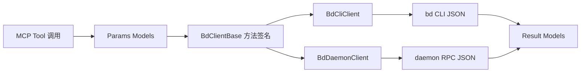

# mcp_models_and_data_contracts 深度解析

`mcp_models_and_data_contracts` 是 beads MCP 适配层里的“协议宪法”。它本身不执行业务命令，也不直接访问数据库；它定义的是**MCP 侧允许传什么参数、承诺返回什么结构**。如果把 `BdCliClient` / `BdDaemonClient` 看成运输公司，这个模块就是统一的集装箱标准：只要箱体尺寸一致，走海运（daemon）还是走陆运（CLI）都能安全到达。这个模块存在的核心原因，是要把“调用方式差异”隔离在传输层，把“数据形状稳定”前置为硬约束。

## 这个模块解决了什么问题

在没有这层模型契约时，最常见的失败模式不是“命令执行失败”，而是“上下游都成功了，但对同一份 JSON 的理解不同”。比如某些命令返回列表、某些返回对象、某些字段可空但调用方当成必填，最后导致 agent 或工具链在运行中出现隐式崩溃。

这个模块通过 Pydantic `BaseModel` 把契约显式化，解决了三类问题。第一，输入参数校验前移，像 `priority`、`limit` 这类边界值在进入传输层前就被约束。第二，返回结构统一，`Issue`、`BlockedIssue`、`Stats` 等对象成为稳定的“语言边界”，让调用方不必直接处理原始命令输出。第三，针对 MCP 上下文成本，提供了 `IssueMinimal`、`BriefIssue`、`CompactedResult` 这样的瘦身模型，避免列表场景无意义地携带全量字段。

一个朴素替代方案是“全用 `dict[str, Any]` 动态传递”，短期开发更快，但长期会让 CLI/daemon 差异渗透到每个调用点。当前设计选择了更严格的契约层，牺牲了一点改字段的灵活性，换来接口演进时的可控性。

## 心智模型：把它当作“协议分层 + 视图分级”

理解这个模块最有效的方式，是把模型分成两条轴线。

第一条轴线是**生命周期语义**：参数模型（`CreateIssueParams`、`UpdateIssueParams`、`ListIssuesParams` 等）描述“你想让系统做什么”，结果模型（`Issue`、`OperationResult`、`Stats` 等）描述“系统做完后如何回报”。

第二条轴线是**信息密度分级**：

- 全量视图：`Issue`（包含 `dependencies` / `dependents`）
- 中间视图：`IssueBase` / `LinkedIssue`
- 极简视图：`IssueMinimal` / `BriefIssue`

可以把它想成地图应用：同一个地点，在全国缩放级别只显示点，在街道级别才展示细节。这个模块做的就是把“缩放级别”做成明确的数据合同，而不是让调用方随意裁剪字段。

## 架构与数据流（结合依赖关系）



从模块依赖看，`mcp_models_and_data_contracts` 是一个典型的“被依赖中枢”。它被 [MCP Integration](MCP Integration.md) 中的客户端实现消费：

- `BdClientBase` 把几乎所有抽象方法都绑定到本模块模型（如 `ready(params: ReadyWorkParams) -> List[Issue]`、`stats() -> Stats`、`blocked(...) -> List[BlockedIssue]`）。
- `BdCliClient` 在收到 CLI JSON 后通过 `Issue.model_validate(...)`、`Stats.model_validate(...)`、`BlockedIssue.model_validate(...)` 回填契约对象。
- `BdDaemonClient` 在 RPC 请求前读取参数模型字段组装 `args`，响应后构造成 `Issue` / `Stats` / `BlockedIssue`。

模块内的依赖图也体现了数据层次：`IssueBase` 被 `Issue` 和 `LinkedIssue` 复用，`BlockedIssue` 再扩展 `Issue`。这形成一个稳定的继承梯度：共享字段只放在基类，场景特有字段在子类叠加。

## 组件深潜：为什么这样建模

`IssueStatus` 与 `IssueType` 被定义为 `str`，而不是 `Literal[...]`。这不是类型偷懒，而是对 beads 可配置状态/类型的适配：系统允许用户通过配置扩展状态和值域。如果在 MCP 契约层写死 Literal，模型会和运行时配置冲突。对应地，模型层放宽，值合法性由 CLI 配置体系兜底，这是“灵活性优先”的选择。

`DependencyType` 与 `OperationAction` 则使用了 `Literal`。这里反过来选择了“收紧约束”，因为依赖关系语义和写操作动作是跨通道共享的核心协议，随意扩展反而会破坏兼容。

`IssueBase` 是核心基类，承载稳定且高复用字段（ID、文本、状态、时间戳、计数字段等）。它对 `priority` 同时使用 `Field(ge=0, le=4)` 和 `field_validator`。这看起来重复，但实质是双保险：既有 schema 约束，也保留自定义报错语义。`Issue` 在此基础上追加 `dependencies`、`dependents`，`LinkedIssue` 只增加 `dependency_type`，避免依赖里再嵌套完整 `Issue` 造成递归爆炸。

`BlockedIssue` 继承 `Issue` 并新增 `blocked_by_count`、`blocked_by`，体现“按查询场景扩展结果模型”的思想：阻塞查询需要的解释信息，不必污染所有 issue 读取接口。

参数模型方面，`CreateIssueParams`、`UpdateIssueParams`、`ClaimIssueParams`、`CloseIssueParams`、`ReopenIssueParams`、`AddDependencyParams`、`InitParams` 对应写路径；`ListIssuesParams`、`ReadyWorkParams`、`BlockedParams`、`ShowIssueParams` 对应读路径。几个关键设计点值得注意：

- `ListIssuesParams.limit` 默认 20 且上限 100，注释明确是为了避免 MCP buffer overflow。
- `ReadyWorkParams` 与 `ListIssuesParams` 同时支持 `labels`（AND）和 `labels_any`（OR），把过滤语义写进字段本身，减少调用方歧义。
- `CloseIssueParams.reason`、`ReopenIssueParams.reason` 把审计语义显式化，避免“仅状态变更无上下文”。

统计与初始化结果由 `StatsSummary`、`RecentActivity`、`Stats`、`InitResult` 组成，保持和 `bd stats --json` / `bd init` 的输出对齐。`Stats` 中 `recent_activity` 可空，反映“统计源可能不返回近期活动”的现实，不强制伪造空对象。

`IssueMinimal`、`BriefIssue`、`BriefDep`、`CompactedResult`、`OperationResult` 是该文件最有“设计意图”但最容易被忽略的一组。它们不是替代全量模型，而是针对 MCP 环境（token 与上下文窗口）做的响应分层策略。尤其 `CompactedResult` 明确提供 `preview` + `total_count` + `hint`，说明系统承认“大结果集不应默认全量返回”。

## 依赖与契约分析

这个模块几乎不主动调用其他业务模块；它的架构角色是**契约枢纽（contract hub）**。因此耦合重点不在“它调用谁”，而在“谁对它有强假设”。当前最关键的上游假设来自客户端层：

- `BdCliClient` 假设 `Issue` / `BlockedIssue` / `Stats` 的字段名与 CLI JSON 可映射。
- `BdDaemonClient` 假设参数模型字段可以稳定映射到 RPC `args`（例如 `CreateIssueParams.acceptance` 被写入 `acceptance_criteria`）。

这带来一个典型张力：模型层字段一旦改名，即使类型没变，也会引发 transport 层映射断裂。换句话说，这个模块“看起来只是数据类”，实际上是高耦合边界，变更成本不低。

## 设计取舍与合理性

最核心的取舍是“显式契约 vs 快速迭代”。团队选择了显式契约，并通过大量小模型覆盖不同操作。短期看模型数量变多，但长期收益是：错误更早暴露，通道切换（CLI/daemon）不影响上层语义。

第二个取舍是“向后兼容 vs 结构纯粹”。文件里保留了 `ORIGINAL MODELS (unchanged for backward compatibility)`，同时新增最小化模型。这说明团队倾向渐进演进：不直接推倒旧响应结构，而是在新场景引入轻量模型。

第三个取舍是“严格类型 vs 可配置域值”。状态和类型用 `str`，牺牲一部分静态约束，换取和 beads 配置系统的一致性。这在集成层是合理的，因为真正的源真相在 `bd` 配置与执行端。

## 使用方式与示例

典型输入构造：

```python
params = ListIssuesParams(
    status="open",
    labels=["backend", "urgent"],
    labels_any=["agent"],
    limit=20,
)
issues = await client.list_issues(params)
```

典型写操作：

```python
created = await client.create(CreateIssueParams(
    title="Add migration guard",
    issue_type="task",
    priority=2,
    deps=["ABC-123"],
))
```

统计读取：

```python
stats = await client.stats()
print(stats.summary.ready_issues)
```

如果是大列表场景，优先考虑最小化模型/压缩返回策略，而不是默认传递完整 `Issue`。

## 新贡献者要特别注意的边界与坑

第一，`priority` 约束在多处出现（`Field` + validator），修改范围值时必须全量同步，不要只改一处。第二，`CreateIssueParams` 用 `acceptance`，而 `UpdateIssueParams` 用 `acceptance_criteria`；这是现实兼容导致的字段差异，做通用映射时很容易踩坑。第三，`IssueStatus` / `IssueType` 是开放字符串，不能在上层偷偷硬编码固定枚举，否则会和自定义配置冲突。第四，`LinkedIssue` 的存在是为了避免递归对象爆炸，若把 `Issue.dependencies` 改成 `Issue` 自引用，会让序列化和上下文体积都失控。第五，`ListIssuesParams.limit` 的默认/上限是 MCP 运行约束的一部分，不只是“任意产品参数”。

## 参考文档

- [MCP Integration](MCP Integration.md)
- [Configuration](Configuration.md)
