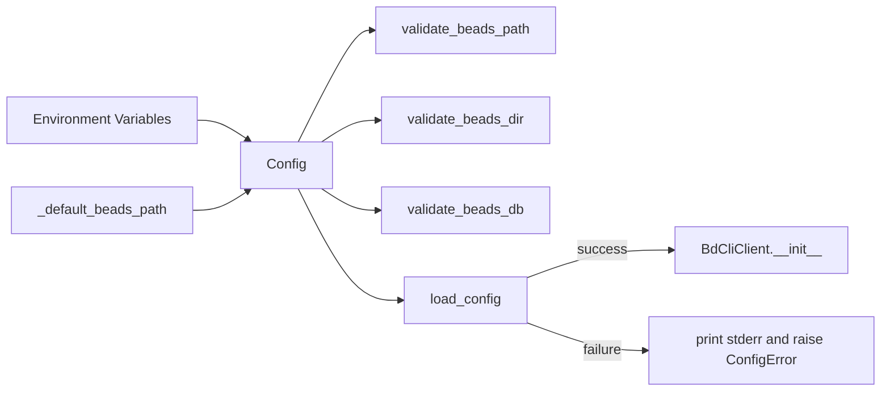

# mcp_runtime_config

`mcp_runtime_config`（对应 `integrations/beads-mcp/src/beads_mcp/config.py`）是 Beads MCP 里的“启动前闸门”。它不负责业务操作本身，而是确保 MCP 进程在真正执行任何 `bd` 命令前，已经拿到一份**可执行、可落地、可诊断**的运行时配置。可以把它想成机场登机口前的证件检查：你真正要飞的是 `BdCliClient` 的各种 issue 操作，但如果 `bd` 二进制不存在、路径不可执行、数据库目录是错的，后面所有流程都会在运行时随机崩。这个模块的价值，就是把这些失败前置到启动阶段，并把错误信息做成“可直接修复”的指引。

## 这个模块在解决什么问题（以及为什么朴素做法不够）

在 MCP 场景里，最朴素的做法是：`BdCliClient` 每次调用 `subprocess` 时再去碰运气，找不到 `bd` 就报错，目录不对就让命令失败。这种方式实现简单，但在工程上有三个明显问题。第一，错误出现得太晚：用户可能在执行第一个命令时才发现环境没装好。第二，错误语义分散：有的错误来自 shell，有的来自 `bd`，用户需要拼凑线索。第三，恢复路径不清晰：告诉用户“命令失败”不等于告诉用户“下一步该怎么修”。

`mcp_runtime_config` 采取的是“配置先决（configuration as precondition）”策略：把关键运行条件收敛为一个 `Config` 对象，通过 `BaseSettings` 从环境变量统一装配，再用字段级校验器做硬校验，最后由 `load_config()` 包装成统一错误出口 `ConfigError`。这样做的结果是：失败更早、报错更一致、修复建议更具体。

## 心智模型：一份“可执行契约”而不是“参数袋子”

理解这个模块最好的方式，不是把它看成几个环境变量的映射，而是看成一份 **runtime contract**：

- `Config` 描述“运行 `bd` 所需的最小事实集合”；
- 各 `field_validator` 保证这些事实是“可用事实”；
- `load_config()` 把底层异常翻译成面向操作者的诊断文本；
- `BdCliClient` 只消费这份契约，不再重复做环境探测。

这和“参数对象”最大的区别在于：参数对象只承载值，而这个契约对象承载**可执行性保证**。

## 架构与数据流



从调用链看，核心热路径很短但非常关键：`BdCliClient.__init__` 调用 `load_config()`，`load_config()` 实例化 `Config()`，实例化过程触发默认值计算与字段校验，成功后把字段值分发给 `BdCliClient` 的实例属性（`bd_path`, `beads_dir`, `beads_db`, `actor`, `no_auto_flush`, `no_auto_import`, `working_dir`）。后续每个 CLI 命令执行都依赖这些属性。

因此它在架构中的角色更像“启动期配置网关”，而不是运行期 orchestrator。它的运行频率不高（通常是 client 构造时一次），但一旦失败会阻断整个 MCP CLI 路径。

## 组件深潜

### `_default_beads_path()`

这个函数的意图是“在零配置下尽量可用”。它先用 `shutil.which("bd")` 探测 PATH，再回退到 `~/.local/bin/bd`。这体现了一个现实假设：很多开发环境会把 `bd` 放进 PATH，但也有一部分按默认安装脚本落在用户本地 bin 目录。

它不做可执行权限校验，也不保证路径存在；这些由后续 `validate_beads_path()` 统一处理。设计上这是合理分层：默认值函数只负责“候选值”，校验器负责“真正确认”。

### `Config(BaseSettings)`

`Config` 是模块的核心抽象。它继承 `BaseSettings`，并设置 `model_config = SettingsConfigDict(env_prefix="")`，意味着字段直接映射到同名环境变量（如 `beads_path` 对应 `BEADS_PATH` 语义）。

字段按职责分三类：

1. **定位与路由**：`beads_path`, `beads_dir`, `beads_db`, `beads_working_dir`。
2. **身份与审计**：`beads_actor`。
3. **行为开关**：`beads_no_auto_flush`, `beads_no_auto_import`。

这里最关键的设计点是：`beads_path` 使用 `default_factory=_default_beads_path`，不是硬编码常量。这样默认值具备“环境感知”，降低首次使用门槛。

### `validate_beads_path(cls, v)`

这是最重要的校验器，因为 `bd` 二进制不存在会让所有 CLI 操作失效。它的流程是两段式：

- 先把输入当成路径；若路径不存在，则把输入当命令名走 `shutil.which(v)` 二次解析；
- 找到后再用 `os.access(v, os.X_OK)` 校验可执行权限。

这套逻辑隐含了一个很实用的兼容性目标：既支持绝对路径，也支持命令名（例如 `bd`）。而报错信息不是简单 `ValueError("not found")`，而是带安装命令和重启提示，这是一种明显偏运维友好的错误设计。

### `validate_beads_dir(cls, v)`

这个校验器只在 `v is not None` 时生效。它验证两件事：路径存在、且必须是目录。注意它没有强制检查“是不是 `.beads` 命名”或“目录内部结构是否完整”。这是一个刻意的边界：它做的是基本文件系统健全性检查，不做仓库语义验证，把更深层正确性交给下游 `bd`。

### `validate_beads_db(cls, v)`

与 `beads_dir` 类似，只在提供值时验证存在性。它没有检查文件类型或 schema 可读性。结合代码注释和错误文案可以看出 `BEADS_DB` 已是兼容路径（deprecated），模块策略是“尽量不打断旧配置，但不给过多新能力承诺”。

### `ConfigError`

`ConfigError` 是一个薄包装异常，价值不在类型复杂度，而在语义统一：调用方可以明确区分“配置阶段失败”和“命令执行阶段失败”（如 `BdCommandError` 一类执行期错误）。

### `load_config()`

`load_config()` 是配置子系统的 façade。它做两件事：

1. 成功路径直接 `return Config()`；
2. 失败路径捕获异常，拼装带默认路径、安装命令和可选环境变量说明的长诊断文本，打印到 `stderr`，再抛出 `ConfigError`。

这里一个值得注意的非显式选择是：它捕获的是广义 `Exception`。好处是不会漏掉 Pydantic 或文件系统层面的异常变体，错误出口稳定；代价是粒度较粗，不利于上层做细分恢复。当前场景下这个取舍是合理的，因为该模块更偏“fail-fast + human guidance”，不是“自动恢复引擎”。

## 依赖关系与契约分析

基于当前提供代码与关系信息，可以确认的关键关系如下。

`mcp_runtime_config` 对外部的主要依赖是 `pydantic` / `pydantic_settings`（用于声明式配置与校验）、`pathlib`/`os`/`shutil`（用于路径与可执行文件检查）、`sys`（错误输出）。它本身不依赖业务模型，不触碰存储层，也不发起网络调用。

上游调用者方面，已确认 `BdCliClient.__init__` 调用 `load_config()` 并用其结果填充客户端运行参数。因此这个模块对 `cli_transport_client` 是强依赖前置；而 `daemon_transport_client` 的构造流程不走 `load_config()`，其配置策略不同（偏 socket/cwd 发现）。这也是为什么 CLI 与 daemon 两条传输路径在“配置入口”上呈现解耦。

数据契约层面，`Config` 输出的是一组经过最小可执行性验证的字符串/布尔值；`BdCliClient` 假设这些值可直接用于 `subprocess` 与环境变量注入。如果未来 `BdCliClient` 改为需要结构化路径对象或更严格 schema，这里会成为联动修改点。

相关上下文建议配套阅读：[cli_transport_client](cli_transport_client.md)、[daemon_transport_client](daemon_transport_client.md)、[MCP Integration](MCP%20Integration.md)。

## 关键设计取舍

这份实现整体偏“简单且可靠”的路线，而不是“高度可扩展配置系统”。例如它选择字段级 validator + 单一 `load_config()` 入口，而不是复杂的多层配置源合并器。收益是可读性和可诊断性非常高，维护成本低；代价是当配置来源增多（例如 per-project profile、远端配置中心）时，需要显式扩展而非天然支持。

另一个取舍是“浅校验 vs 深校验”。当前只验证路径存在与可执行，不验证 `bd` 版本、数据库 schema、目录内容完整性。这样启动快、耦合低，但会把一部分错误延后到命令执行期。考虑到版本兼容检查已经在 `BdCliClient._check_version()` 里实现，这种分工保持了关注点分离。

## 使用方式与示例

最常见用法是让 `BdCliClient` 自动加载：

```python
from beads_mcp.bd_client import BdCliClient

client = BdCliClient()  # 内部调用 load_config()
```

也可以直接在启动逻辑里提前探测：

```python
from beads_mcp.config import load_config, ConfigError

try:
    cfg = load_config()
except ConfigError as e:
    # 记录并快速失败
    raise
```

典型环境变量示例：

```bash
export BEADS_PATH=/usr/local/bin/bd
export BEADS_DIR=/path/to/repo/.beads
export BEADS_ACTOR=alice
export BEADS_NO_AUTO_FLUSH=false
export BEADS_NO_AUTO_IMPORT=false
export BEADS_WORKING_DIR=/path/to/repo
```

## 新贡献者最容易踩的坑

第一，`load_config()` 失败时会 `print(..., file=sys.stderr)` 再抛 `ConfigError`。如果上层也打印完整异常，容易出现重复日志。第二，`validate_beads_db()` 只检查“存在”，不保证“可用数据库”；不要把它误当成完整健康检查。第三，`beads_dir` 和 `beads_db` 的优先级不在本模块定义，而在 `BdCliClient` 执行命令时体现（优先注入 `BEADS_DIR`，否则 `BEADS_DB`）。修改字段语义时要联动审查客户端环境注入逻辑。第四，错误信息文本里包含安装指引和重启提示，这属于用户体验契约；改文案要考虑支持场景，而不只是技术准确性。

## 已知边界与限制

这个模块目前没有处理配置热重载；它假设配置在客户端初始化时确定。它也不负责 daemon socket 配置发现，因此不能代表整个 MCP 集成层的统一配置入口。若要做“单一全局配置中心”，需要同时协调 CLI 与 daemon 两端策略。

---

如果你要改这个模块，建议先明确你改动的是“值来源”、“值校验”还是“错误体验”。这三者在当前实现中边界清晰，保持这条边界会让后续维护成本显著更低。
