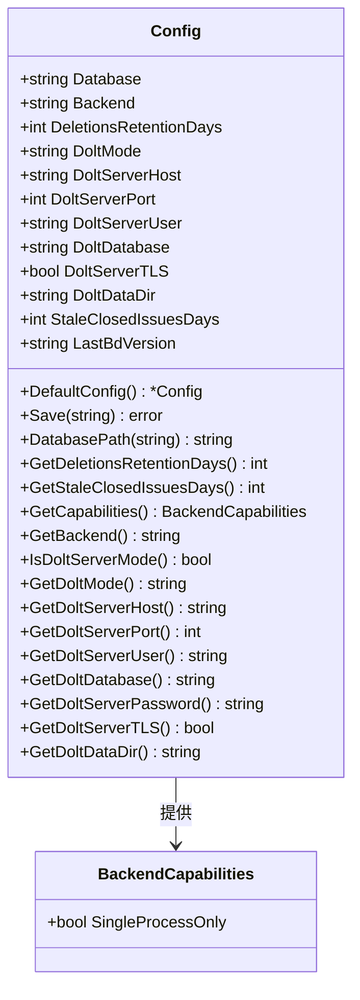

# Metadata Configuration 模块技术深度解析

## 1. 问题空间与模块定位

在任何复杂的应用程序中，配置管理是一个核心挑战。对于 Beads 项目而言，它需要支持多种存储后端（Dolt 和 SQLite），并在不同的部署模式（嵌入式与服务器模式），同时还要处理向后兼容性、安全考虑（如密码管理）和跨平台差异（如 WSL 性能优化）。

`metadata_configuration` 模块的核心任务是**定义、加载和管理 Beads 的元数据配置，确保系统能够根据环境变量、配置文件和默认值正确初始化，并提供统一的接口来访问这些配置。

想象一下这个模块就像是一个"配置指挥家"，它协调来自不同来源（文件、环境变量）的配置，确保系统的一致性，同时处理向后兼容旧版本的配置格式。

## 2. 核心架构与组件

### 2.1 核心数据结构



### 2.2 核心组件解析

#### `Config` 结构体是整个模块的核心，它包含了 Beads 系统的所有配置项。它不仅仅是一个简单的配置容器，还提供了一系列的方法来解析和访问这些配置。

关键配置项包括：

- **Database: 数据库名称或路径
- **Backend: 存储后端类型（Dolt 或 SQLite）
- **Dolt 相关配置: 支持嵌入式和服务器模式
- **功能配置: 如删除记录保留天数、已关闭问题的陈旧检查等

#### `BackendCapabilities` 结构体定义了存储后端的行为约束，目前只包含 `SingleProcessOnly` 标志，用于指示后端是否可以被多个 Beads 进程并发访问。

## 3. 数据流程分析

### 3.1 配置加载流程

配置加载是模块的关键功能，它通过以下步骤进行：

1. **查找配置文件**：首先尝试加载 `metadata.json`
2. **向后兼容**：如果找不到，尝试加载旧的 `config.json`
3. **迁移配置**：如果找到旧配置，解析并迁移到新格式
4. **保存新配置**：保存为 `metadata.json` 并删除旧配置文件

这种设计确保了系统的平滑升级路径，同时保持了向后兼容性。

### 3.2 配置访问流程

当系统需要访问配置项时，`Config` 结构体的方法会按照以下优先级提供值：

1. **环境变量**：最高优先级，作为紧急逃生通道
2. **配置文件**：用户明确设置的值
3. **默认值**：安全的默认设置

这种"环境变量 > 配置文件 > 默认值"的优先级机制是一个经典的配置管理最佳实践，它允许用户在不修改配置文件的情况下临时覆盖配置，同时保持了配置文件的持久性。

## 4. 设计决策与权衡

### 4.1 多后端支持设计

该模块支持两种主要后端：Dolt（默认）和 SQLite。这是一个重要的设计决策，它允许 Beads 在不同的场景下选择合适的存储方案。

**权衡**：
- **Dolt** 提供了版本控制和协作功能，但有进程锁定限制
- **SQLite** 简单轻量，但缺少版本控制能力

### 4.2 Dolt 模式设计

Dolt 支持两种模式：
- **嵌入式**：单进程模式，简单但不支持并发
- **服务器**：多进程模式，支持高并发场景

**设计选择**：默认使用嵌入式模式，通过配置切换到服务器模式。

**权衡**：
- 嵌入式模式简单易用，但限制了并发访问
- 服务器模式支持高并发，但增加了部署复杂度

### 4.3 安全考虑

密码从不存储在配置文件中，而是通过环境变量 `BEADS_DOLT_PASSWORD` 提供。这是一个明智的安全设计决策，避免了敏感信息泄漏风险。

### 4.4 向后兼容性策略

该模块通过以下方式保持向后兼容：
1. 保留 `LastBdVersion` 字段（虽然已弃用）
2. 支持从旧的 `config.json` 迁移到新的 `metadata.json`
3. 保留已弃用的方法但标记为弃用

这种设计确保了系统的平稳升级路径。

## 5. 关键使用场景与示例

### 5.1 基本配置加载

```go
// 加载配置
cfg, err := configfile.Load(beadsDir)
if err != nil {
    // 处理错误
}
if cfg == nil {
    // 使用默认配置
    cfg = configfile.DefaultConfig()
}
```

### 5.2 访问后端配置

```go
// 获取后端类型
backend := cfg.GetBackend()

// 检查是否是 Dolt 服务器模式
if cfg.IsDoltServerMode() {
    // 使用服务器连接
    host := cfg.GetDoltServerHost()
    port := cfg.GetDoltServerPort()
    // ...
}
```

### 5.3 获取数据库路径

```go
dbPath := cfg.DatabasePath(beadsDir)
```

## 6. 边缘情况与注意事项

### 6.1 配置文件迁移

当系统从旧版本升级时，配置文件会从 `config.json` 迁移到 `metadata.json`。这个过程是自动的，但需要注意：

- 迁移成功后，旧的配置文件会被删除
- 如果迁移失败，系统会返回错误

### 6.2 环境变量覆盖

环境变量提供了一个紧急逃生通道，但需要注意：

- 环境变量的优先级高于配置文件
- 不正确的环境变量值会被忽略并警告
- 环境变量只在当前会话有效

### 6.3 Dolt 数据目录

自定义 Dolt 数据目录是一个强大的功能，特别适用于 WSL 环境，但需要注意：

- 必须是绝对路径才能获得最佳性能
- 如果是相对路径，会相对于 beads 目录解析
- 只对 Dolt 后端有效

### 6.4 已弃用方法

一些方法如 `GetDoltServerPort` 已弃用，使用时需要注意：

- 已弃用的方法可能在未来版本中移除
- 替代方法通常提供更准确的功能

## 7. 与其他模块的关系

`metadata_configuration` 模块是一个基础模块，被多个其他模块依赖：

- [Configuration](configuration.md) 模块使用它来管理同步配置
- [Dolt Storage Backend](dolt_storage_backend.md) 模块使用它来配置 Dolt 存储
- [Storage Interfaces](storage_interfaces.md) 模块使用它来确定后端能力

## 8. 总结

`metadata_configuration` 模块是 Beads 系统的基础，它提供了一个灵活、安全、向后兼容的配置管理方案。通过精心设计的 API 和数据结构，它解决了多后端支持、多种部署模式、安全考虑和向后兼容性等复杂问题。

该模块的设计体现了几个重要的原则：
- 配置来源的优先级管理
- 安全的敏感信息处理
- 平滑的升级路径
- 清晰的 API 设计

对于新加入团队的开发者来说，理解这个模块的设计和实现是理解整个 Beads 系统的关键第一步。
