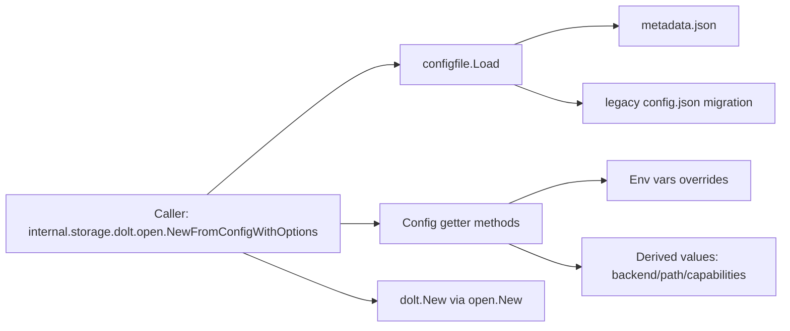

# metadata_json_config

`metadata_json_config`（对应 `internal/configfile/configfile.go`）是 Beads 的“仓库本地存储引导配置层”。它专门管理 `.beads/metadata.json`，决定**数据库放在哪里、用哪个 backend（`dolt`/`sqlite`）、Dolt 以什么模式连接（embedded/server）**，以及一些和存储行为强相关的运行参数。它存在的意义不是“读个 JSON”这么简单，而是把一组容易分叉、容易历史兼容失控的存储配置，收敛成一套**可迁移、可覆盖、保守安全**的规则。

如果没有这个模块，调用方很容易退化为“到处拼路径 + 到处读环境变量 + 每处自己做默认值”，最终出现同仓库不同命令行为不一致、旧配置无法平滑升级、甚至 Dolt 目录分裂（split-brain）的问题。

## 架构与数据流



从依赖角色上看，这个模块是一个 **configuration gateway + normalizer**：

它向上提供稳定的 `Config` 读取/推导 API，向下只依赖标准库（`os`/`filepath`/`encoding/json`/`strings`/`strconv`）。在已给出的代码关系中，最关键调用链是：`internal.storage.dolt.open.NewFromConfigWithOptions` 调用 `configfile.Load`，并进一步调用 `Config.DatabasePath`、`Config.GetDoltDatabase`、`Config.IsDoltServerMode`、`Config.GetDoltServerHost`、`Config.GetDoltServerUser` 等方法来构造实际存储连接参数。

这意味着它不是业务层配置（比如 sync policy），而是“存储入口前的最后一道配置裁决层”。

## 先讲问题：为什么需要 `metadata.json` 这一层

Beads 同时支持 `dolt` 和 `sqlite`，而且 Dolt 又有 embedded/server 两种连接模型。再加上历史演进（`config.json` 迁移到 `metadata.json`）、环境变量逃生口（修坏配置时可临时覆盖），如果没有集中策略，系统会遇到三个典型问题。

第一是路径不一致。最朴素做法是“直接使用配置里的 `database` 字段”，但 Dolt 历史上出现过目录名漂移，导致同一仓库不同命令写到不同目录。`DatabasePath` 里对 Dolt 默认强制使用 `beadsDir/dolt`，本质上是在防 split-brain。

第二是连接模式不一致。不同调用方若自行判断 server mode，很容易对默认值和环境变量优先级理解不一致。现在由 `IsDoltServerMode` 和相关 getter 统一裁决。

第三是升级不连续。老仓库可能仍是 `config.json`。`Load` 把兼容逻辑集中在一个地方：读取旧文件、解析、保存到新位置、尽力删除旧文件。调用方完全不需要关心迁移细节。

## 心智模型：把它当作“存储配置海关”

可以把这个模块想成海关闸口。上游带着原始配置进来（文件内容、环境变量、历史字段），模块做三类工作：

一是验明身份（backend 是谁，是否合法）；二是统一格式（路径归一、默认值补齐）；三是风险分级（backend capabilities，是否单进程限制）。

通过闸口后，下游拿到的是“可执行配置结论”，而不是半成品字符串。

## 组件深潜

### `Config`（struct）

`Config` 是 `metadata.json` 的数据契约载体。字段分三组：

一组是后端与路径相关（`Database`、`Backend`、`DoltDataDir`）；一组是 Dolt server 连接参数（`DoltMode`、`DoltServerHost`、`DoltServerPort`、`DoltServerUser`、`DoltDatabase`、`DoltServerTLS`）；还有一组是存储行为参数（`DeletionsRetentionDays`、`StaleClosedIssuesDays`）。`LastBdVersion` 明确标注为 deprecated，仅保留读取兼容。

设计上它故意保持扁平，避免嵌套结构带来的版本迁移复杂度；代价是字段数量增多时可读性会下降。

### `DefaultConfig()`

返回 `Database: "beads.db"` 的最小默认配置。注意这是“结构默认”，并不意味着最终一定使用 sqlite 文件；因为实际 backend 默认是 Dolt（由 `GetBackend` 决定），而 Dolt 路径最终由 `DatabasePath` 规则覆盖到 `beadsDir/dolt`（除非命中更高优先级分支）。

### `ConfigPath(beadsDir string)`

纯路径拼接：`<beadsDir>/metadata.json`。这个函数看似简单，但它把“配置文件名常量化”，避免上层硬编码路径。

### `Load(beadsDir string) (*Config, error)`

这是模块最关键的入口函数，包含完整读取策略：先读 `metadata.json`；不存在时尝试 legacy `config.json`；legacy 存在则自动迁移并保存；两者都不存在返回 `nil, nil`。

`nil, nil` 这个返回语义是一个重要契约：它表示“未初始化仓库配置”，不是错误。调用方（如 `NewFromConfigWithOptions`）据此回退到 `DefaultConfig()`。

另一个关键点是迁移策略：先写新文件，再 best-effort 删除旧文件。这样即使删除失败，也不会丢配置。

### `(*Config).Save(beadsDir string) error`

把当前配置写回 `metadata.json`，使用 `json.MarshalIndent`，权限 `0600`。这体现了两个意图：

一是输出人类可读，便于手工排查；二是配置文件默认私有权限，符合包含连接信息的安全预期。

### `(*Config).DatabasePath(beadsDir string) string`

这是路径决策核心，优先级可概括为：

1. 非 sqlite backend 且 `GetDoltDataDir()` 非空：优先用自定义 Dolt 数据目录（绝对路径直用，相对路径拼到 `beadsDir`）。
2. 若 `Database` 是绝对路径：直接返回。
3. backend 为 sqlite：返回 `<beadsDir>/<database or beads.db>`。
4. backend 为 dolt：强制返回 `<beadsDir>/dolt`。

这段逻辑的设计洞察是：Dolt 默认目录名不能漂移；但仍保留“显式绝对路径”和 `DoltDataDir` 作为高级逃生口（例如 WSL 下将 Dolt 数据放到更快文件系统）。

### `GetDeletionsRetentionDays()` / `GetStaleClosedIssuesDays()`

前者把 `<=0` 统一折叠到默认值 `3`；后者把负数钳制为 `0`（禁用）。这是典型“输入容错 + 语义规范化”，确保下游不会处理无意义负值。

### `BackendCapabilities` 与 `CapabilitiesForBackend()`

`BackendCapabilities` 当前只有 `SingleProcessOnly` 一个布尔位。看起来很小，但这是有意设计：稳定、跨调用方易理解。

`CapabilitiesForBackend` 对已知和未知 backend 都采取保守策略（都返回 `SingleProcessOnly: true`）。也就是说，未知配置不会被“乐观放行”。

### `(*Config).GetCapabilities()`

在 `CapabilitiesForBackend` 之上加一层上下文判定：如果 backend 是 Dolt 且 `IsDoltServerMode()` 为真，则返回 `SingleProcessOnly: false`。这把“静态 backend 类型”与“动态运行模式”合并，输出真正可执行能力。

### `(*Config).GetBackend()`

后端决策优先级：`BEADS_BACKEND` 环境变量 > `Config.Backend` > 默认 `dolt`。并且会做大小写归一；无效环境变量会打印 warning 到 `stderr` 后忽略。

这个设计是“可恢复优先”：当 `metadata.json` 被手改坏时，环境变量可以作为紧急旁路。

### Dolt 模式与连接参数 getter 组

`IsDoltServerMode`：仅在 backend 为 Dolt 时生效；优先看 `BEADS_DOLT_SERVER_MODE == "1"`，否则看 `DoltMode == "server"`。

`GetDoltMode`：空值回退到 `embedded`。

`GetDoltServerHost` / `GetDoltServerPort` / `GetDoltServerUser` / `GetDoltDatabase` / `GetDoltServerTLS` / `GetDoltDataDir`：都遵循“环境变量优先，其次配置字段，最后默认值”的模式（`GetDoltDataDir` 无内置默认）。

`GetDoltServerPassword` 只读 `BEADS_DOLT_PASSWORD`，不从文件读取。这是显式的安全边界：密码不落盘。

特别注意 `GetDoltServerPort` 注释已标记 deprecated：它回退 `3307` 在某些 standalone 场景不正确，推荐由 `doltserver.DefaultConfig(beadsDir).Port` 计算。这一点在 `internal.storage.dolt.open.NewFromConfigWithOptions` 里已经按新方式处理。

## 依赖分析（调用关系与数据契约）

当前可确认的下游调用方关系（基于已提供代码）是：`internal.storage.dolt.open.NewFromConfigWithOptions` 直接依赖本模块，且依赖点覆盖读取、路径决策、Dolt server 参数、backend 能力判断相关 API。

数据流是：`Load` 产出 `*Config`（可能为 `nil`）→ 调用方做默认填充（`DefaultConfig`）→ 调用 getter 组得到归一化值 → 交给 Dolt open 层构建真实连接配置。

本模块本身几乎不调用 Beads 内部其他模块，只依赖标准库。这让它成为低耦合基础模块；但也意味着它必须稳定，因为上游很多地方会把它当作“配置事实来源”。

关于“谁还在调用它”的完整 `depended_by` 列表，当前给定材料未直接列出；因此这里不做超出已验证调用链的断言。

## 设计取舍与权衡

这个模块最明显的取舍是**保守正确性优先于灵活性**。例如未知 backend 一律按单进程处理、Dolt 默认目录固定为 `dolt`。这降低了误配置风险，但会让高级自定义看起来不够“自由”。

第二个取舍是**运维逃生口优先于配置纯洁性**。大量环境变量覆盖（`BEADS_BACKEND`、`BEADS_DOLT_*`）会增加行为分支复杂度，但在“配置文件损坏或紧急排障”场景非常实用。

第三个取舍是**平滑迁移优先于极简实现**。`Load` 内置 legacy 迁移逻辑，使读取函数承担更多职责；代价是函数比单纯 `ReadFile+Unmarshal` 更复杂，但它把历史负担封装掉了。

## 使用方式与示例

```go
import "internal/configfile"

func openStorage(beadsDir string) error {
    cfg, err := configfile.Load(beadsDir)
    if err != nil {
        return err
    }
    if cfg == nil {
        cfg = configfile.DefaultConfig()
    }

    backend := cfg.GetBackend()
    dbPath := cfg.DatabasePath(beadsDir)
    caps := cfg.GetCapabilities()

    _ = backend
    _ = dbPath
    _ = caps
    return nil
}
```

保存配置：

```go
cfg := &configfile.Config{
    Database: "beads.db",
    Backend:  configfile.BackendSQLite,
}
if err := cfg.Save(beadsDir); err != nil {
    return err
}
```

## 新贡献者最该注意的坑

`Load` 返回 `nil, nil` 不是错误，调用方必须显式处理默认配置。

`GetBackend` 和其他 getter 带环境变量覆盖；排查“为什么行为和 metadata.json 不一致”时，先检查 `BEADS_*`。

`IsDoltServerMode` 的环境变量判定只认字符串 `"1"`，不像 `GetDoltServerTLS` 支持 `"true"`。如果你新增类似开关，最好统一布尔解析策略。

`DatabasePath` 的优先级不是“backend 先判断到底”，而是先处理 `DoltDataDir`/绝对路径，再分 backend。修改此逻辑时要格外小心回归。

`GetDoltServerPort` 已被标注为 deprecated 语义，不应作为新代码的端口决策来源。

## 参考阅读

- [runtime_config_resolution](runtime_config_resolution.md)：全局 `config.yaml` 与环境变量覆盖策略（和本模块分工不同，但经常被混淆）。
- [store_core](store_core.md)：Dolt 存储核心，理解本模块输出配置如何驱动实际连接与运行时行为。
- [Dolt_Server](Dolt_Server.md)：Dolt server 运行模型与默认配置来源。
- [Configuration](Configuration.md)：配置体系全景。
