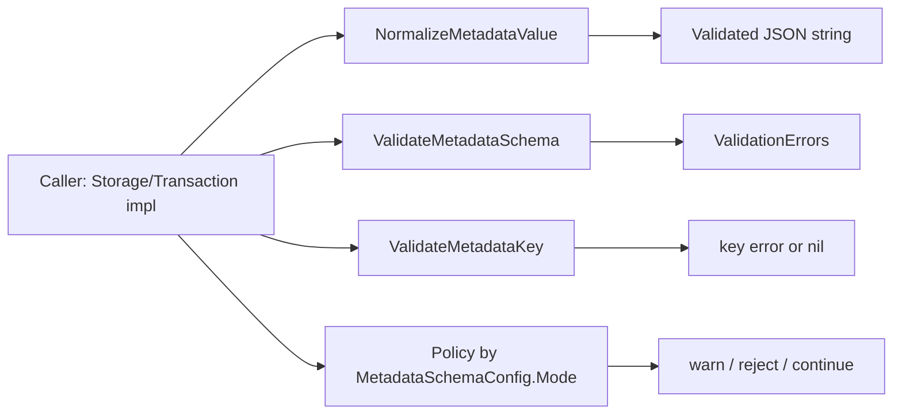

# metadata_validation 模块深度解析

`metadata_validation` 是存储层里那道“元数据海关”：它不关心业务字段（title、status 等），只负责把 `metadata` 这块高自由度 JSON 变成可控输入。这个模块存在的核心原因是：`metadata` 天生灵活，但灵活如果没有边界，最终会变成“写入时随意、读取时崩溃、查询时注入风险”的组合灾难。它用一组很小但明确的规则（值归一化、结构校验、键名约束）在入口处把问题拦截掉，让后续存储、查询、同步模块可以假设“输入至少是合法且可解释的”。

## 1. 它解决的是什么问题（先讲问题空间）

在这个系统里，`metadata` 本质上是扩展槽位：不同集成（GitLab/Jira/Linear）、不同自动化流程、不同团队都可能往里写字段。朴素方案是“只要是字符串就存”，但会立刻遇到三个现实问题。

第一，**输入形态不一致**。上游调用可能传 `string`、`[]byte`、`json.RawMessage`，如果每个调用点自己解析/判错，行为会碎片化。第二，**JSON 语义不稳定**。调用方以为传了对象，实际上可能传了数组、数字甚至损坏文本；如果不在边界统一校验，错误会在更深层才暴露，定位成本很高。第三，**自由键名带来的路径风险**。模块注释明确指出 metadata key 会用于 JSON path expression；如果不收敛字符集，后续路径拼接和查询层可能出现歧义甚至注入面。

因此这个模块的定位不是“做复杂 schema 引擎”，而是“在存储边界提供最小但关键的正确性保证”。

## 2. 心智模型：三道闸门，而不是一个万能验证器

理解这个模块最好的方式，是把它想成一个三段式安检通道：

1. `NormalizeMetadataValue`：先看“证件格式”——输入是不是允许的载体类型，内容是不是合法 JSON。
2. `ValidateMetadataSchema`：再看“携带物品规则”——字段是否满足 schema（类型、必填、范围、枚举）。
3. `ValidateMetadataKey`：最后看“命名规范”——字段键名是否适合进入 JSON path 语境。

它不是一个会自动决定“放行/告警/拒绝”的 orchestrator；它更像**纯校验库**，返回错误事实，策略（`MetadataSchemaConfig.Mode` 的 `none/warn/error`）留给调用方执行。这是有意的分层：保持模块无副作用、可复用、易测试。

## 3. 架构与数据流



从依赖角色看，这个模块是一个**边界验证器（boundary validator）**：

- 向下几乎不依赖业务模块，只依赖标准库（`encoding/json`、`fmt`、`regexp`）。
- 向上为存储接口实现提供契约保障，尤其是 `Storage.UpdateIssue(ctx, id, updates map[string]interface{}, actor string)` 这类接收 `interface{}` 输入的入口（见 [storage_contracts](storage_contracts.md)）。

需要说明的是：当前可见依赖数据给出了模块树与核心组件，但没有直接列出 `depended_by` 的完整函数级清单；因此这里对“谁调用它”的描述基于公开接口契约与该模块注释语义，而不是猜测具体调用点函数名。

## 4. 组件级深潜（设计意图 + 机制）

### `NormalizeMetadataValue(value interface{}) (string, error)`

这个函数解决的是“输入载体标准化”问题。它只接受三类输入：`string`、`[]byte`、`json.RawMessage`，并统一输出 JSON 字符串。其设计重点不是转换技巧，而是**强约束输入面**：任何其他类型直接报错，避免隐式 `fmt.Sprint` 一类“看似宽容、实则污染数据”的行为。

完成类型归一后，函数通过 `json.Valid` 做一次 JSON 语法验证。这一步有两个隐含收益：调用方拿到返回值时可直接假设“至少是合法 JSON 文本”，并且错误会在最靠近输入的地方暴露。

### `MetadataFieldType` 与常量

`MetadataFieldType` 定义了当前 schema 支持的原子类型：`string`、`int`、`float`、`bool`、`enum`。这里的取舍很明确：只保留最常见、最可解释的类型系统，不引入嵌套对象 schema、数组 schema、正则约束等高级功能。

这是一种“80/20”设计：覆盖大多数 metadata 管控需求，同时保持实现小而可维护。

### `MetadataFieldSchema`

`MetadataFieldSchema` 把单字段规则集中成一个结构：

- `Type`：字段类型
- `Values`：仅 enum 使用
- `Required`：是否必填
- `Min` / `Max`：数值边界（`int/float`）

值得注意的点是 `Min/Max` 用 `*float64`。这允许区分“未配置边界（nil）”与“配置为 0”。这是 Go 里常见但关键的建模细节。

### `MetadataSchemaConfig`

`MetadataSchemaConfig` 包含：

- `Mode string`：注释约定为 `"none" | "warn" | "error"`
- `Fields map[string]MetadataFieldSchema`

关键设计意图：该结构把“规则定义”和“策略强度”放在一起，但本模块只执行前者（产出错误），不执行后者（如何处理错误）。也就是说，`Mode` 是给上层决策器用的契约字段，而非本模块内部流程开关。

### `MetadataValidationError` 与 `Error()`

`MetadataValidationError` 是单条违规记录（`Field` + `Message`）。`Error()` 输出 `metadata.<field>: <message>`，保证日志和 CLI 输出时可直接定位字段。

这里采用“聚合返回 `[]MetadataValidationError`”而不是“首错即停”的策略，提升了用户体验：一次提交可以看到全部字段问题，减少反复修复-重试循环。

### `ValidateMetadataSchema(metadata json.RawMessage, schema MetadataSchemaConfig) []MetadataValidationError`

这是核心校验流程，内部机制有几个非常值得新同学记住的点。

它先处理空 schema：`len(schema.Fields)==0` 直接通过，避免不必要解析。随后把 metadata 解析为 `map[string]interface{}`。如果 metadata 是空、`{}` 或 `null`，函数主动视为空对象；如果无法解成对象，则返回 `(root)` 错误，明确指出“schema 校验只针对 JSON object”。

之后按 `schema.Fields` 迭代，而不是按输入 metadata 迭代。这意味着：**只校验 schema 里声明的字段，默认允许额外字段存在**。这是重要契约：模块偏向兼容和渐进约束，而不是全封闭 schema。

数值处理上，函数利用 Go JSON 反序列化默认把数字解成 `float64` 的事实：

- `int` 校验先断言 `float64`，再判断 `num == float64(int64(num))`，以区分 `3` 和 `3.14`。
- `float` 校验只要求是数字，再做 `Min/Max`。

`enum` 采用线性扫描 `Values`。在字段候选值通常很小的场景，这比额外维护哈希结构更直接、可读性更好。

### `ValidateMetadataKey(key string) error` 与 `validMetadataKeyRe`

`ValidateMetadataKey` 用正则 `^[a-zA-Z_][a-zA-Z0-9_.]*$` 约束键名：首字符必须是字母/下划线，后续允许字母数字下划线点号。注释已给出背景：键名会进入 JSON path 表达式，点号也被允许用于类似 `jira.sprint` 的路径式键。

这是一种“语义安全优先”的约束：牺牲一部分命名自由（比如不允许 `-` 开头等），换来路径解析语境下的稳定与可预测。

## 5. 依赖分析：它调用谁、谁依赖它、契约在哪里

该模块内部依赖非常克制，只使用标准库：

- `encoding/json`：`json.Valid`、`json.Unmarshal`、`json.RawMessage`
- `regexp`：键名正则检查
- `fmt`：错误格式化

这使它在架构上保持“低扇出、低耦合”特征，适合作为底层工具模块。

向上契约方面，它与存储接口层形成明确边界：`Storage`/`Transaction` 接口存在多个接收动态输入的路径（尤其 `UpdateIssue` 的 `updates map[string]interface{}`），这些路径需要在写入前把 metadata 归一化并校验。`MetadataSchemaConfig` 的 `Mode` 字段则把“错误事实”连接到“执行策略”（告警或拒绝）。

也就是说，模块输出的是**事实层**（有哪些错），调用方负责**策略层**（这些错是否阻断写入）。

## 6. 设计决策与权衡

这个模块做了几组很典型的工程权衡。

它优先选择“简单可解释”而不是“功能完备 schema 系统”。没有引入 JSON Schema 全量特性，也不做深层嵌套对象验证。这降低了灵活性，但极大降低认知和维护成本，且足够覆盖 metadata 的主流约束。

它选择“收集全部错误”而不是“遇错即停”。性能上会多做一些检查，但元数据字段规模通常较小，换来的是更好的开发者反馈闭环。

它选择“允许未知字段”而不是“严格白名单”。这提升了前向兼容与跨团队扩展能力，但代价是拼写错误字段可能悄悄通过（除非上层额外做 unknown-field 检查）。

它把 `Mode` 留在配置结构里却不在本模块执行，体现的是“校验与策略解耦”。这让模块更纯、更可复用；代价是调用方必须记得实现策略分支，否则会出现“配置了 `error` 但实际未阻断”的执行偏差。

## 7. 使用方式与示例

典型调用模式是：先归一化，再 schema 校验，再按 `Mode` 决策。

```go
raw, err := storage.NormalizeMetadataValue(input)
if err != nil {
    return err
}

errs := storage.ValidateMetadataSchema(json.RawMessage(raw), schema)
if len(errs) > 0 {
    switch schema.Mode {
    case "error":
        return errs[0] // 或聚合后返回
    case "warn":
        // 记录告警日志，但继续
    case "none":
        // 忽略
    }
}
```

如果你在构建涉及 JSON path 的查询条件（或配置化字段路径），应先调用：

```go
if err := storage.ValidateMetadataKey(key); err != nil {
    return err
}
```

## 8. 新贡献者最该注意的边界与坑

最容易踩坑的是数字语义。`ValidateMetadataSchema` 基于 `json.Unmarshal` 的默认行为处理数字，`int` 本质上是“数值且无小数部分”的判定；如果上游把整数写成 `3.0`，它会被判定为可转成 int（因为数值相等），这与某些语言里的严格整数字面量语义不同。

第二个坑是“只校验声明字段”。如果产品需求是“禁止 schema 外字段”，当前实现并不满足，需要在调用层补一段 unknown-field 检查逻辑。

第三个坑是 `Mode` 不在这里生效。你不能只传入 `MetadataSchemaConfig{Mode:"error"}` 就期待自动拦截；必须在上层显式消费 `[]MetadataValidationError`。

第四个点是根对象要求。即使 JSON 语法合法（例如 `[]`、`"x"`、`123`），对 schema 校验来说依然会失败并返回 `(root)` 错误，因为该校验器的目标数据模型是 object。

## 9. 参考文档

- [storage_contracts](storage_contracts.md)
- [Dolt Storage Backend](dolt_storage_backend.md)
- [Storage Interfaces](storage_interfaces.md)
