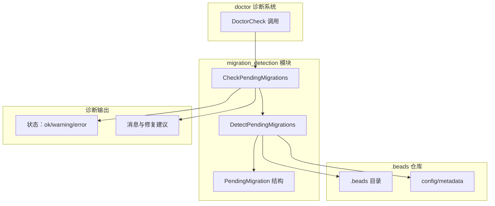

# migration_detection 模块深度解析

## 概述：为什么需要这个模块

想象一下，你正在维护一个不断演进的数据库系统。随着功能的增加，数据结构需要变化 —— 新的表、新的字段、新的索引。但用户的数据不能丢，系统不能停。**迁移（Migration）** 就是解决这个问题的机制：它是一套有序的、可重复的数据模式变更脚本。

`migration_detection` 模块的核心职责是：**在用户运行 `bd doctor` 诊断命令时，自动发现当前 beads 仓库有哪些待执行的迁移任务**。它不是迁移执行器本身，而是迁移系统的"雷达"——扫描环境，识别需要做什么，然后告诉用户。

这个模块存在的根本原因是：**迁移必须是显式的、可控的**。你不能在用户不知情的情况下偷偷修改他们的数据结构。所以系统需要一种机制来：
1. 检测当前状态与目标状态之间的差距
2. 以优先级排序的方式呈现给用户
3. 提供明确的修复命令

与 [`migration_validation`](migration_validation.md) 模块不同——后者验证迁移是否*可以*执行或是否*已经*完成——本模块关注的是*有什么需要执行*。

---

## 架构与数据流



### 数据流解析

1. **入口**：`CheckPendingMigrations(path string)` 被 `doctor` 命令调用，传入项目根目录路径
2. **目录解析**：通过 [`resolveBeadsDir`](resolve.md) 跟随可能的重定向/符号链接，定位真实的 `.beads` 目录
3. **迁移检测**：`DetectPendingMigrations` 扫描配置和状态文件，识别待执行的迁移
4. **结果封装**：将检测结果封装为 `DoctorCheck` 结构，包含状态、消息、详情和修复命令
5. **输出**：返回给 `doctor` 命令，汇总到整体诊断报告中

### 模块定位

这是一个**诊断型模块**（Diagnostic Module），在架构中扮演"观察者"角色：
- **不修改状态**：只读操作，不执行任何迁移
- **无副作用**：检测过程不应改变系统状态
- **幂等性**：多次调用应返回相同结果（除非外部状态变化）

---

## 核心组件深度解析

### PendingMigration 结构

```go
type PendingMigration struct {
    Name        string // e.g., "sync"
    Description string // e.g., "Configure sync branch for multi-clone setup"
    Command     string // e.g., "bd migrate sync beads-sync"
    Priority    int    // 1 = critical, 2 = recommended, 3 = optional
}
```

**设计意图**：这个结构是模块的核心抽象，它将一个待执行的迁移任务建模为四个维度：

| 字段 | 作用 | 设计考量 |
|------|------|----------|
| `Name` | 迁移的唯一标识符 | 用于日志、错误消息和用户沟通 |
| `Description` | 人类可读的说明 | 解释*为什么*需要这个迁移，帮助用户理解必要性 |
| `Command` | 可执行的修复命令 | 遵循"诊断即修复建议"模式，用户可直接复制运行 |
| `Priority` | 优先级（1-3） | 决定诊断报告的整体状态：1=error, 2=warning, 3=ok |

**优先级的语义**：
- **Priority 1 (critical)**：阻塞性问题，系统可能无法正常工作。例如：数据结构不兼容、关键配置缺失。诊断状态为 `StatusError`。
- **Priority 2 (recommended)**：建议执行，但不执行也能用。例如：性能优化、新功能启用。诊断状态为 `StatusWarning`。
- **Priority 3 (optional)**：可选改进。例如：清理旧数据、启用实验性功能。诊断状态为 `StatusOK`。

这种设计借鉴了包管理器（如 `apt`、`npm audit`）的安全更新通知模式——用户一眼就能看出哪些是必须处理的。

### DetectPendingMigrations 函数

```go
func DetectPendingMigrations(path string) []PendingMigration
```

**职责**：扫描给定的 beads 目录，返回所有待执行的迁移列表。

**当前实现状态**：⚠️ **这是一个框架实现**。当前代码只做了目录存在性检查，实际的迁移检测逻辑尚未实现。这是一个**有意为之的设计决策**——先定义接口和数据结构，再逐步填充检测逻辑。

**预期的检测逻辑**（根据代码注释和系统架构推断）：

```go
// 伪代码：预期的完整实现
func DetectPendingMigrations(path string) []PendingMigration {
    var pending []PendingMigration
    
    beadsDir := resolveBeadsDir(filepath.Join(path, ".beads"))
    
    // 1. 检查 metadata.json 中的后端类型
    cfg := loadConfig(beadsDir)
    
    // 2. 检测 JSONL → SQLite 迁移
    if cfg.Backend == "jsonl" && hasSQLiteSchema(beadsDir) {
        pending = append(pending, PendingMigration{
            Name: "sqlite",
            Description: "Migrate from JSONL to SQLite backend",
            Command: "bd migrate sqlite",
            Priority: 2,
        })
    }
    
    // 3. 检测 SQLite → Dolt 迁移
    if cfg.Backend == "sqlite" && hasDoltSchema(beadsDir) {
        pending = append(pending, PendingMigration{
            Name: "dolt",
            Description: "Migrate from SQLite to Dolt backend",
            Command: "bd migrate dolt",
            Priority: 2,
        })
    }
    
    // 4. 检测同步配置迁移（多仓库场景）
    if needsSyncConfig(cfg) {
        pending = append(pending, PendingMigration{
            Name: "sync",
            Description: "Configure sync branch for multi-clone setup",
            Command: "bd migrate sync beads-sync",
            Priority: 1,
        })
    }
    
    return pending
}
```

**为什么是框架先行？** 迁移检测逻辑需要访问多种状态源（配置文件、数据库 schema、文件系统），这些依赖在系统演进过程中可能变化。先定义清晰的接口，可以让检测逻辑独立演进，不影响调用方。

### CheckPendingMigrations 函数

```go
func CheckPendingMigrations(path string) DoctorCheck
```

**职责**：将迁移检测结果转换为标准的 `DoctorCheck` 格式，供 `doctor` 命令统一处理。

**关键设计决策**：

1. **状态推导逻辑**：
   ```go
   status := StatusOK
   for _, m := range pending {
       if m.Priority == 1 {
           status = StatusError
           break
       } else if m.Priority == 2 && status != StatusError {
           status = StatusWarning
       }
   }
   ```
   
   这个循环体现了**最坏情况优先**原则：只要有一个 critical 迁移，整体状态就是 error。这确保用户不会忽略关键问题。

2. **信息分层**：
   - `Message`：简洁摘要（如 "1 available"）
   - `Detail`：详细列表，包含每个迁移的描述和优先级标签
   - `Fix`：可执行的命令列表，用户可直接复制运行
   
   这种分层设计考虑了不同使用场景：快速扫描时只看 Message，深入诊断时看 Detail，准备修复时看 Fix。

3. **空结果处理**：
   ```go
   if len(pending) == 0 {
       return DoctorCheck{
           Name:     "Pending Migrations",
           Status:   StatusOK,
           Message:  "None required",
           Category: CategoryMaintenance,
       }
   }
   ```
   
   明确返回 "None required" 而不是空消息，避免用户困惑"是没检查还是没问题"。

### hasGitRemote 辅助函数

```go
func hasGitRemote(repoPath string) bool
```

**当前状态**：定义但未在当前文件中被调用。

**设计意图**：这是一个**预留的依赖检查**。某些迁移（特别是同步相关的）可能要求仓库配置了 git remote。这个函数的存在表明模块设计者预见到未来需要基于 git 配置做迁移决策。

**使用场景示例**：
```go
// 如果迁移需要 git remote 但没有配置
if needsRemoteForMigration(cfg) && !hasGitRemote(path) {
    pending = append(pending, PendingMigration{
        Name: "git-remote",
        Description: "Configure git remote for sync",
        Command: "git remote add origin <url>",
        Priority: 1,
    })
}
```

---

## 依赖关系分析

### 上游依赖（被谁调用）

| 调用方 | 位置 | 期望 |
|--------|------|------|
| `bd doctor` 命令 | `cmd/bd/doctor/` | 期望返回标准 `DoctorCheck`，可与其他检查汇总 |
| 自动化诊断工具 | MCP 集成、CI/CD | 期望稳定的输出格式，可机器解析 |

**契约**：调用方期望：
1. 函数不会 panic，即使 `.beads` 目录不存在或损坏
2. 返回的 `DoctorCheck` 字段完整（至少 `Name`、`Status`、`Message`）
3. `Category` 始终为 `CategoryMaintenance`，便于分类展示

### 下游依赖（调用谁）

| 被调用方 | 位置 | 用途 |
|----------|------|------|
| `resolveBeadsDir` | `cmd/bd/doctor/resolve.go` | 跟随符号链接，定位真实 `.beads` 目录 |
| `os.Stat` | Go 标准库 | 检查目录/文件存在性 |
| `exec.Command` | Go 标准库 | （通过 `hasGitRemote`）执行 git 命令 |

**关键依赖：resolveBeadsDir**

这个函数封装了符号链接解析逻辑。为什么需要它？因为 beads 支持**仓库重定向**——`.beads` 可以是一个符号链接，指向实际的数据目录（例如在共享存储或容器场景中）。如果不跟随链接，检测会失败。

```go
// resolve.go
func resolveBeadsDir(beadsDir string) string {
    return beads.FollowRedirect(beadsDir)
}
```

这体现了**关注点分离**：迁移检测不关心目录解析细节，委托给专门模块处理。

### 横向关联（相关模块）

| 模块 | 关系 | 差异 |
|------|------|------|
| [`migration_validation`](migration_validation.md) | 兄弟模块 | 本模块检测*有什么要执行*，后者验证*能否执行/是否完成* |
| [`broken_migration`](broken_migration.md) | 兄弟模块 | 检测*失败的迁移*（中间状态），本模块检测*待执行的迁移*（未开始） |
| [`server`](server.md) | 被检测对象 | 服务器模式可能影响迁移检测逻辑（如远程 Dolt） |

---

## 设计决策与权衡

### 1. 框架先行 vs 完整实现

**选择**：当前实现是一个框架，检测逻辑未完全实现。

**权衡**：
- ✅ **优点**：接口稳定，检测逻辑可独立演进；便于 TDD 开发（先写测试，再填实现）
- ❌ **缺点**：当前功能不完整，用户可能困惑"为什么检测不到迁移"

**为什么这样选**：迁移系统是 beads 的核心基础设施，接口稳定性比功能完整性更重要。先定义清晰的 `PendingMigration` 结构和 `DetectPendingMigrations` 签名，后续可以逐步添加检测规则，而不破坏现有调用方。

### 2. 优先级系统 vs 布尔标志

**选择**：使用 1/2/3 优先级，而不是简单的 `IsRequired: bool`。

**权衡**：
- ✅ **优点**：支持更细粒度的诊断状态（error/warning/ok）；用户可自主选择先处理哪些
- ❌ **缺点**：增加复杂度，需要解释优先级语义

**为什么这样选**：迁移不是非黑即白的。有些迁移是阻塞性的（如 schema 不兼容），有些是优化性的（如启用新功能）。优先级系统让诊断报告更有信息量，用户可以根据风险承受能力决定执行顺序。

### 3. 命令嵌入 vs 分离执行器

**选择**：`PendingMigration` 直接包含 `Command` 字段，而不是返回迁移 ID 让调用方查命令。

**权衡**：
- ✅ **优点**：自包含，用户可直接复制运行；减少模块间耦合
- ❌ **缺点**：命令格式硬编码在结构中，如果 CLI 命令变化需要更新结构

**为什么这样选**：遵循"诊断即修复建议"模式。用户看到诊断报告时，最自然的下一步是"怎么修？"。直接提供命令减少了认知负担和文档查找成本。

### 4. 只读检测 vs 主动修复

**选择**：本模块只做检测，不执行修复。

**权衡**：
- ✅ **优点**：职责单一，易于测试；用户有完全控制权
- ❌ **缺点**：需要额外步骤执行修复

**为什么这样选**：迁移是高风险操作。将检测和执行为两个步骤，给用户审查和确认的机会。这也符合 `doctor` 命令的整体设计哲学：诊断 → 建议 → 用户确认 → 执行。

---

## 使用指南

### 基本用法

```bash
# 运行完整诊断，包含迁移检测
bd doctor

# 输出示例：
# Maintenance
#   [ERROR] Pending Migrations: 1 available
#     • sync: Configure sync branch for multi-clone setup [critical]
#   Fix: bd migrate sync beads-sync
```

### 编程调用

```go
import "github.com/steveyegge/beads/cmd/bd/doctor"

// 检测待执行迁移
migrations := doctor.DetectPendingMigrations("/path/to/project")
for _, m := range migrations {
    fmt.Printf("Migration: %s - %s (Priority: %d)\n", 
        m.Name, m.Description, m.Priority)
}

// 获取诊断检查结果
check := doctor.CheckPendingMigrations("/path/to/project")
if check.Status == doctor.StatusError {
    fmt.Println("Critical migrations pending!")
    fmt.Println(check.Fix) // 可执行的修复命令
}
```

### 扩展检测逻辑

如果你想添加新的迁移检测规则：

```go
func DetectPendingMigrations(path string) []PendingMigration {
    var pending []PendingMigration
    
    // ... 现有逻辑 ...
    
    // 添加新检测规则
    if needsNewMigration(path) {
        pending = append(pending, PendingMigration{
            Name:        "new-feature",
            Description: "Enable new feature X",
            Command:     "bd migrate new-feature",
            Priority:    2, // recommended
        })
    }
    
    return pending
}
```

**关键原则**：
1. 检测逻辑应该是**只读的**，不修改任何状态
2. 优先级的选择要谨慎：1=critical 会阻塞用户工作流
3. `Command` 应该是用户可直接复制运行的完整命令

---

## 边界情况与陷阱

### 1. .beads 目录不存在

```go
if _, err := os.Stat(beadsDir); os.IsNotExist(err) {
    return pending // 返回空列表，不报错
}
```

**行为**：静默返回空列表，不视为错误。

**原因**：`doctor` 命令可能在非 beads 项目中运行（用户误用或探索性使用）。这种情况下，报告"无迁移"比报错更友好。

**陷阱**：调用方如果期望非空结果，需要自己处理空列表情况。

### 2. 符号链接解析失败

`resolveBeadsDir` 内部调用 `beads.FollowRedirect`，如果符号链接损坏或指向不存在的路径，可能返回无效路径。

**当前处理**：后续的 `os.Stat` 会失败，返回空列表。

**建议**：在生产环境中，应添加更明确的错误处理和日志记录。

### 3. 优先级冲突

如果有多个迁移，优先级可能不一致（如一个 critical，一个 optional）。

**当前处理**：取最高优先级（最严重）作为整体状态。

**潜在问题**：用户可能只看到 error 状态，忽略 warning/optional 迁移。

**建议**：在 `Detail` 中明确列出所有迁移及其优先级，确保用户看到完整信息。

### 4. 命令格式变化

`Command` 字段硬编码了 CLI 命令格式。如果未来命令变化（如 `bd migrate sync` 改为 `bd migration run sync`），需要更新所有检测规则。

**缓解策略**：
- 将命令模板集中管理，而不是分散在检测逻辑中
- 添加版本检查，根据 beads 版本生成不同命令

### 5. 并发修改

检测过程中，用户可能同时运行其他 `bd` 命令，改变迁移状态。

**当前处理**：无特殊处理，接受竞态条件。

**原因**：诊断是瞬时快照，不保证一致性。如果用户担心，应在静止状态下运行 `doctor`。

---

## 测试策略

当前测试文件 `migration_test.go` 覆盖了基本场景：

```go
func TestCheckPendingMigrations(t *testing.T) {
    tests := []struct {
        name           string
        setup          func(t *testing.T, dir string)
        wantStatus     string
        wantMessage    string
        wantMigrations int
    }{
        {"no beads directory", ...},
        {"empty beads directory", ...},
    }
    // ...
}
```

**测试覆盖的边界**：
- 无 `.beads` 目录
- 空的 `.beads` 目录

**缺失的测试**（待补充）：
- 有待执行迁移的场景
- 不同优先级的状态推导
- 符号链接解析
- 配置文件损坏场景

**建议**：使用表驱动测试，覆盖各种迁移组合和优先级场景。

---

## 与其他模块的对比

| 模块 | 职责 | 输出 | 执行操作 |
|------|------|------|----------|
| `migration_detection` | 检测待执行迁移 | `[]PendingMigration` | 否 |
| [`migration_validation`](migration_validation.md) | 验证迁移就绪/完成 | `MigrationValidationResult` | 否 |
| [`broken_migration`](broken_migration.md) | 检测失败迁移 | `DoctorCheck` | 否 |
| `cmd/bd/migrate_*` | 执行迁移 | 迁移结果 | 是 |

**关键区别**：
- 本模块关注"有什么要做"
- `migration_validation` 关注"能不能做/做完了没"
- `broken_migration` 关注"做失败了怎么办"
- `migrate_*` 命令真正执行迁移

这四个模块共同构成完整的迁移生命周期管理：**检测 → 验证 → 执行 → 恢复**。

---

## 未来演进方向

### 短期（待实现）

1. **完整检测逻辑**：填充 `DetectPendingMigrations`，支持 JSONL→SQLite→Dolt 全链路检测
2. **配置驱动规则**：从配置文件读取迁移规则，而不是硬编码
3. **版本感知**：根据 beads 版本动态生成可用迁移列表

### 中期

1. **依赖图**：迁移之间可能有依赖关系（如迁移 B 需要先执行迁移 A），需要建模为 DAG
2. **干运行模式**：`bd doctor --dry-run` 模拟执行迁移，显示预期变化
3. **回滚检测**：检测是否有可用的回滚迁移

### 长期

1. **自动修复**：`bd doctor --fix` 自动执行非破坏性迁移
2. **迁移市场**：社区贡献的迁移规则，可插拔加载
3. **影响分析**：执行前分析迁移对现有数据的影响

---

## 参考链接

- [`migration_validation.md`](migration_validation.md) - 迁移验证模块，检查迁移就绪性和完成度
- [`broken_migration.md`](broken_migration.md) - 检测失败迁移和中间状态
- [`server.md`](server.md) - 服务器模式配置，影响迁移检测逻辑
- [`config.md`](config.md) - 配置文件结构，迁移检测的主要数据源
