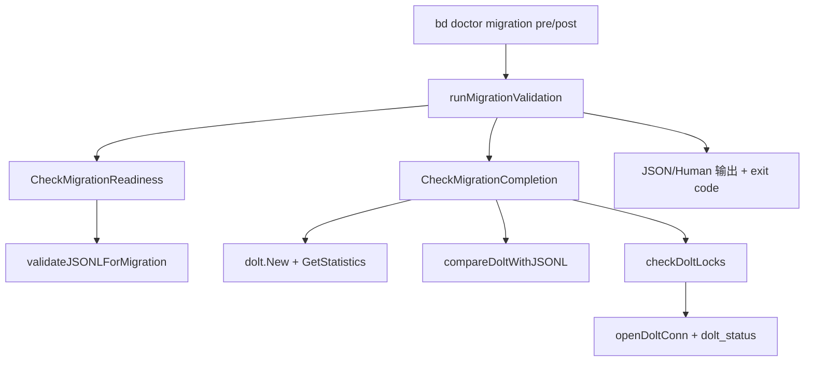

# migration_readiness_and_completion

`migration_readiness_and_completion` 模块是 `bd doctor` 里专门负责“迁移前验收 + 迁移后对账”的安全闸门。它解决的不是“能不能运行迁移命令”这么简单，而是“迁移之后你还能不能相信数据”的问题：在从 JSONL/旧状态切换到 Dolt 的过程中，最怕的是静默丢数据、脏工作区被误判、或者把跨 rig 的数据污染当成正常结果。这个模块的价值，就是把这些高风险点提前结构化暴露出来，并且同时给人类（`DoctorCheck`）和自动化系统（`MigrationValidationResult`）稳定输出。

---

## 架构角色与数据流



从系统分工看，这个模块是一个“迁移质检编排层（validator/orchestrator）”。它不执行迁移本身（不写入、不过度修复），而是做两件事：第一，给出迁移前是否具备最低前置条件；第二，在迁移后对 Dolt 与历史 JSONL 的一致性做抽样与计数校验。

关键数据路径是这样的：`cmd/bd/doctor.go` 中 `runMigrationValidation` 根据 `--migration=pre|post` 选择调用 `doctor.CheckMigrationReadiness` 或 `doctor.CheckMigrationCompletion`，并把结果同时封装为 CLI 可读状态和 JSON 机器可读对象。`--json` 模式下输出包含 `check` 和 `validation` 两层，并在 `result.Ready == false` 时返回非零退出码，方便 CI/自动化流程直接消费。

在普通 `bd doctor` 全量路径中，这个模块还通过 `CheckPendingMigrations` 与 `CheckDoltLocks` 参与“Maintenance”类别检查，其中 `CheckPendingMigrations` 负责迁移项摘要（当前实现基本是占位），`CheckDoltLocks` 则负责 Dolt 工作集脏状态提示。

---

## 这个模块解决了什么问题（以及朴素方案为什么不够）

朴素做法通常是：迁移前只看“文件在不在”，迁移后只看“Dolt 能不能打开”。这在 happy path 下可行，但在真实仓库会失效。因为真实世界里可能同时出现这些情况：JSONL 局部坏行、Dolt 比 JSONL 多数据、Dolt 比 JSONL 少数据、跨 rig 污染、wisp/ephemeral 表引起的伪脏状态、以及非 CGO 构建根本无法验证 Dolt。

这个模块的设计洞察是：迁移校验不是单一布尔值，而是一组“分层证据”。它把证据拆成：后端类型、文件可读性、记录计数、ID 对账、锁状态、差异分类（foreign prefix vs ephemeral）等维度，再汇总为 `Ready`。你可以把它想成机场安检：不是只看护照是否存在，而是“证件、行李、安检门、二检”都过了才允许登机；任何一层出问题都能定位在具体环节。

---

## 心智模型：双通道输出 + 分阶段校验

理解本模块最实用的心智模型是“两阶段、双通道”：

第一阶段是 pre-migration（`CheckMigrationReadiness`）：确认“现在适不适合迁”。核心关注输入质量（JSONL 是否存在且可解析）以及当前状态（是否已经是 Dolt）。

第二阶段是 post-migration（`CheckMigrationCompletion`）：确认“迁完是不是可信”。核心关注输出质量（Dolt 可打开、可统计、与 JSONL 对得上）以及运行状态（是否存在未提交变更）。

双通道是指每次检查都会同时产出两种契约：`DoctorCheck` 面向 CLI 人类阅读，`MigrationValidationResult` 面向机器消费。前者强调可行动建议（`Fix` 文案），后者强调结构化字段（计数、错误、警告、样本 ID）。这比只返回字符串更适合被 Claude/脚本/CI 编排。

---

## 组件深潜

### `PendingMigration`

`PendingMigration` 是“潜在迁移事项”的声明结构，包含 `Name`、`Description`、`Command`、`Priority`。设计上它像一个待办条目，允许 `CheckPendingMigrations` 按优先级映射成 `StatusError/StatusWarning/StatusOK`。其中优先级语义固定：`1` critical、`2` recommended、`3` optional。

值得注意的是，当前 `DetectPendingMigrations` 只做了路径解析与 `.beads` 存在性检查，最终直接返回空列表。这意味着该能力目前更像扩展点骨架，而非完整策略引擎。

### `DetectPendingMigrations(path string) []PendingMigration`

该函数先用 `resolveBeadsDir(filepath.Join(path, ".beads"))` 追踪重定向，再判断目录存在性。这里的意图是兼容 worktree/redirect 场景，避免在逻辑路径和物理路径不一致时误报。

函数当前无副作用，也不会抛错（通过空切片表达“无待迁移项”）。对调用者来说，这是一个“best-effort detector”。

### `CheckPendingMigrations(path string) DoctorCheck`

这个函数是 `DetectPendingMigrations` 的汇总器：把迁移项列表转成用户可读摘要（条目详情 + 修复命令清单），并根据最高优先级决定总体状态。

它的设计取舍是“保守升级”：一旦存在 priority=1，整体就是 `StatusError`；没有 critical 但有 recommended 时是 `StatusWarning`。这种聚合策略简单、可预测，但会牺牲细粒度（例如多个 optional 不会提升风险级别）。

### `MigrationValidationResult`

这是本模块的核心数据契约。它覆盖了阶段（`Phase`）、是否可继续（`Ready`）、后端、计数、差异样本、健康状态、告警与错误等信息。CGO 版本还包含 `ForeignPrefixCount` 与 `ForeignPrefixes`，用于标记跨 rig 污染。

设计亮点是：它既可表达最终结论，也可表达“证据链”。例如 `Ready=false` 时，不止有错误文本，还有 `DoltCount/JSONLCount/MissingInDB` 等可追踪字段，方便自动化系统决定是中止、重试还是人工介入。

### `CheckMigrationReadiness(path string) (DoctorCheck, MigrationValidationResult)`

这是 pre-check 主入口。执行顺序体现了“先 cheap fail，再 deep check”的策略：

先确认 `.beads` 是否存在；再读后端（`GetBackend`）；若已是 Dolt 直接返回 OK（无需迁移）；否则定位 JSONL（`findJSONLFile`）并校验内容（`validateJSONLForMigration`）。

`validateJSONLForMigration` 的阻断规则是一个重要设计点：只有“全部行都坏”才作为 blocking error 返回；如果只是部分坏行，会记录 warning 并继续。这是 correctness 与可恢复性之间的折中：尽量不中断可推进迁移，但把风险显式暴露给操作者。

### `CheckMigrationCompletion(path string) (DoctorCheck, MigrationValidationResult)`

这是 post-check 主入口，职责更重。它先验证当前后端必须是 Dolt，然后以只读方式打开 `dolt.New(... ReadOnly: true ...)`，通过 `store.GetStatistics` 读取 `TotalIssues`，再叠加三类校验：

1) `checkDoltLocks` 检查未提交变更；
2) 若 JSONL 存在，则用 `validateJSONLForMigration` 得到 ID 集合并调用 `compareDoltWithJSONL` 对账“JSONL 有而 Dolt 无”；
3) 当 Dolt 比 JSONL 多时，用 `categorizeDoltExtras` 区分 foreign-prefix 与 ephemeral。

其中一条关键策略是：计数不一致并不总是错误。只有 `DoltCount < JSONLCount` 才升级为 error；`DoltCount > JSONLCount` 会进一步分类后给 warning。这体现了领域判断：多出来的记录可能是可解释的（跨 rig 污染或临时数据），而少记录通常意味着潜在数据丢失。

### `CheckDoltLocks(path string) DoctorCheck` 与 `checkDoltLocks(beadsDir string) (bool, string)`

对外函数 `CheckDoltLocks` 只做门面：非 Dolt 后端直接 N/A，Dolt 后端调用内部 `checkDoltLocks`。

`checkDoltLocks` 通过 `openDoltConn` 查询 `dolt_status`，并过滤 `isWispTable` 命中的表（`wisps` 或 `wisp_` 前缀）。过滤 wisp 表是很关键的防误报设计：这些表是 ephemeral，预期就可能有未提交变化，如果不排除会制造“永远清不掉”的噪声告警。

### `findJSONLFile(beadsDir string) string`

按顺序探测 `issues.jsonl` 与 `beads.jsonl`。注释标明这是临时兼容逻辑（“Temporary: will be removed with Phase 2c”）。这说明模块有明确的过渡性边界：当前仍要兼容旧文件名，但目标是收敛。

### `validateJSONLForMigration(jsonlPath string) (int, int, map[string]bool, error)`

这是 JSONL 健康检查核心。它逐行扫描并尝试 `json.Unmarshal` 到只含 `id` 的最小结构，收集有效 ID 集与坏行计数。实现上有两个值得注意的点：

一是 scanner buffer 被提升到 2MB，防止大行导致默认扫描失败；二是返回 error 的条件非常保守，仅在“完全不可用”时阻断。

该函数还维护了 `parseErrors` 样本（最多 5 条），但当前返回值未把样本错误串回上层。这是一个可改进点：已有数据采集，尚未充分利用。

### `compareDoltWithJSONL(ctx, store, jsonlIDs) []string`

对 JSONL 的每个 ID 调 `store.GetIssue` 验证是否存在于 Dolt，最多采样 100 个缺失项。这个实现简单直接，但在超大数据集上是 N 次单点查询，偏向正确性与可读性，牺牲了批量查询性能。

### `categorizeDoltExtras(ctx, store, jsonlIDs) (int, map[string]int, int)`

该函数把“Dolt 比 JSONL 多出来的记录”分为两类：foreign-prefix（跨 rig 污染）与 ephemeral（同前缀或无法归类）。它先读 `issue_prefix` 作为本地前缀，再全表扫描 `issues.id`，借助 `utils.ExtractIssuePrefix` 分类。

这里的策略是 best-effort：取不到前缀、取不到 DB、SQL 失败都直接返回零值而不阻断主流程。这降低了误杀概率，但也意味着在异常场景下可能低估污染规模。

### `formatPrefixCounts(prefixes map[string]int) string`

这是纯展示辅助，把前缀计数拼成 `prefix (N)` 文本。实现没有排序，输出顺序依赖 map 迭代顺序，因此同样数据多次运行可能顺序不同。

### `hasGitRemote(repoPath string) bool`

执行 `git remote` 并检查是否有输出。当前在本模块内未被调用，更像历史遗留或未来迁移检测的预备工具。

### 非 CGO 版本：`migration_validation_nocgo.go`

`CheckMigrationReadiness`、`CheckMigrationCompletion`、`CheckDoltLocks` 在 `!cgo` 构建下都返回 N/A（`DoctorCheck.Status=StatusOK`），但 `MigrationValidationResult.Ready=false` 且 `Errors` 写明需要 CGO。这个双重语义很实用：CLI 不把平台能力缺失误判为仓库错误，但自动化依然能从结构化结果中识别“不可执行迁移验证”。

---

## 依赖分析：它调用谁，谁调用它

这个模块向下依赖主要分三类。

第一类是 doctor 基础设施：`resolveBeadsDir`（来自 `cmd/bd/doctor/resolve.go`）用于路径重定向解析，`GetBackend` / `IsDoltBackend` / `openDoltConn` / `isWispTable`（来自 `cmd/bd/doctor/dolt.go`）用于后端判断与 Dolt 状态访问。

第二类是 Dolt 存储：`dolt.New`、`DoltStore.GetStatistics`、`DoltStore.GetIssue`、`DoltStore.GetConfig`、`DoltStore.UnderlyingDB`。这些接口定义了本模块对数据层的隐式契约：必须支持只读打开、可统计 issue 总量、可按 ID 读取 issue、可暴露底层 SQL DB。

第三类是配置/工具：`configfile.BackendDolt` 提供后端常量，`utils.ExtractIssuePrefix` 用于 ID 前缀分类。

向上调用关系同样清晰：

`cmd/bd/doctor.go` 的 `runMigrationValidation` 直接调用 `doctor.CheckMigrationReadiness` / `doctor.CheckMigrationCompletion`，并基于 `MigrationValidationResult.Ready` 决定退出码；`runDiagnostics` 会把 `doctor.CheckPendingMigrations` 与 `doctor.CheckDoltLocks` 纳入常规体检清单。

此外，本模块输出契约与 `DoctorCheck` 分类系统对齐，具体分组与展示规范可参考 [doctor_contracts_and_taxonomy](doctor_contracts_and_taxonomy.md)。底层 Dolt 行为细节可参考 [store_core](store_core.md) 与 [database_state_checks](database_state_checks.md)。

---

## 关键设计决策与权衡

这个模块最明显的选择，是偏“保守正确性”而不是“极致吞吐”。例如 `compareDoltWithJSONL` 按 ID 逐条查询、`categorizeDoltExtras` 全表扫描并逐条分类，这对大库不是最省时的，但逻辑直观、错误边界清晰，适合作为诊断路径。

另一个选择是“分级失败”而不是“全-or-无”。部分 JSONL 坏行不会直接阻断 pre-check，Dolt 多记录也不会立即判错，而是先分类再警告。这个设计降低了误阻断，适合真实仓库中的过渡期噪声。

还有一个务实取舍在跨平台支持上：非 CGO 下返回 N/A + `Ready=false`。这保持了 CLI 体验的一致性，同时给自动化留出硬信号，不会把“平台能力不满足”伪装成“仓库健康”。

最后，`CheckPendingMigrations` 目前是“接口先行，策略后补”的骨架式设计。它为未来迁移项扩展预留了聚合和优先级机制，但当前检测逻辑尚未填充，这在短期内减少复杂度，也意味着该检查暂时信息量有限。

---

## 使用方式与示例

常见入口是：

```bash
# 迁移前验证
bd doctor --migration=pre

# 迁移后验证
bd doctor --migration=post

# 机器可读输出（适合 CI/自动化）
bd doctor --migration=post --json
```

`--json` 输出会包含 `check` 与 `validation` 两块，`validation` 对应 `MigrationValidationResult`。典型自动化用法是只看 `validation.ready` 与 `validation.errors`：

```json
{
  "check": { "name": "Migration Completion", "status": "warning" },
  "validation": {
    "phase": "post-migration",
    "ready": true,
    "backend": "dolt",
    "dolt_count": 1234,
    "warnings": ["Dolt has uncommitted changes: issues: modified"]
  }
}
```

如果你在扩展这个模块（比如新增迁移风险维度），建议遵循现有模式：

- 先把证据写入 `MigrationValidationResult` 字段（机器可消费）；
- 再把结论映射到 `DoctorCheck`（人类可行动）；
- 保持 pre/post 语义清晰，避免把“是否可开始迁移”和“迁移是否完成”混在同一个函数里。

---

## 新贡献者最容易踩的坑

第一，`resolveBeadsDir` 不是可选步骤。很多仓库是重定向 `.beads`，直接拼本地路径会导致假阴性。

第二，Dolt 脏状态检查必须过滤 wisp 表（`isWispTable`），否则会出现持续误报。

第三，`validateJSONLForMigration` 的错误语义是“完全不可用才阻断”；如果你把“有坏行”直接升级为 error，会改变当前迁移容忍策略。

第四，post-check 中“Dolt 比 JSONL 多”默认不是错误。贸然改成 error 会把跨 rig 或 ephemeral 场景误判成迁移失败。

第五，非 CGO 行为不要简单改成 `StatusError`。当前 N/A 语义是刻意设计，用于区分“环境能力缺失”和“仓库状态异常”。

第六，`formatPrefixCounts` 当前无排序，任何基于字符串全量匹配的测试都可能脆弱，建议测试时按集合比较而非整串比较。

---

## 已知限制

`DetectPendingMigrations` 当前返回空，说明“待迁移项目录”机制尚未实装，`CheckPendingMigrations` 目前更多承担框架占位角色。

`compareDoltWithJSONL` 与 `categorizeDoltExtras` 都是线性/逐条检查路径，在超大仓库上可能较慢。它们更适合 doctor 诊断频率，而不是高频在线请求。

`MigrationValidationResult` 在 CGO 与非 CGO 版本字段略有差异（CGO 版本包含 `ForeignPrefixCount` / `ForeignPrefixes`），调用方若做严格反序列化应考虑构建差异。

---

## 参考阅读

- [doctor_contracts_and_taxonomy](doctor_contracts_and_taxonomy.md)
- [database_state_checks](database_state_checks.md)
- [store_core](store_core.md)
- [repository_discovery_and_redirect](repository_discovery_and_redirect.md)
- [metadata_json_config](metadata_json_config.md)
