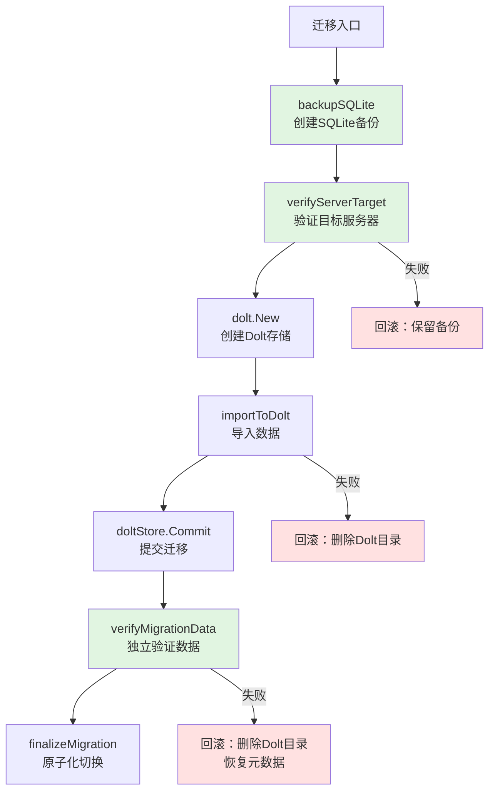

# migration_safety 模块技术深度解析

> **Status**: Implementation complete
> **Date**: 2026
> **Scope**: Beads SQLite to Dolt migration safety

---

## 1. 问题背景与模块定位

想象一下，你正在负责一个从 SQLite 到 Dolt 数据库的迁移系统。这不是一个简单的数据导出导入——它是一个**原子性、可回滚、安全第一**的迁移过程，必须保证：

1. **用户数据绝不丢失**：迁移失败时，原始数据必须完整保留
2. **不会写入错误的服务器**：在多项目环境中，确保迁移到正确的 Dolt 实例
3. **数据完整性验证**：不仅要迁移，还要确保迁移后的数据与源数据一致
4. **原子性切换**：从 SQLite 到 Dolt 的切换必须是瞬时的，不能出现中间状态

这就是 `migration_safety` 模块存在的原因。它是整个迁移系统的**安全防护层**，负责处理从 SQLite 到 Dolt 迁移过程中的所有安全保障、验证和回滚逻辑。

## 2. 核心心智模型

这个模块的设计基于一个**多阶段管道**的心智模型：

```
[备份] → [服务器验证] → [数据导入] → [数据验证] → [原子切换]
         ↓                    ↓                    ↓
      回滚点               回滚点               回滚点
```

每个阶段都是**幂等且可验证的**，如果任何阶段失败，系统都可以安全回滚到之前的状态。关键设计理念是：

1. **先验证，后操作**：在执行任何不可逆操作前，先验证所有前置条件
2. **独立验证通道**：使用与迁移不同的连接路径来验证数据，避免"自证清白"
3. **原子化切换**：只有在所有验证都通过后，才执行最终的元数据更新

## 3. 架构与数据流

让我们通过 Mermaid 图来可视化这个模块的架构和数据流：



### 组件角色说明

1. **backupSQLite**：安全网层，在任何操作前创建时间戳备份
2. **verifyServerTarget**：验证层，确保不会写入错误的 Dolt 服务器
3. **verifyMigrationCounts / verifyMigrationData**：验证层，从不同维度验证数据完整性
4. **runMigrationPhases**：编排层，协调所有迁移阶段并处理回滚
5. **finalizeMigration**：原子切换层，只有在所有验证通过后才执行

### 关键数据流

1. **数据导入路径**：SQLite → migrationData → DoltStore → Dolt 数据库
2. **独立验证路径**：直接通过 MySQL 驱动连接 Dolt 服务器查询，不经过 DoltStore
3. **元数据更新路径**：beadsDir/metadata.json → 更新后端配置 → 重命名 SQLite 文件

## 4. 核心组件深度解析

### 4.1 backupSQLite：时间戳备份函数

**设计意图**：在迁移开始前创建一个带时间戳的 SQLite 备份，作为最终的安全网。

**核心机制**：
- 使用 `20060102-150405` 格式的时间戳确保唯一性
- 如果同一秒内多次调用，会自动添加 `-1`、`-2` 等后缀
- 使用 `O_EXCL` 标志防止 TOCTOU（检查时间到使用时间）竞争条件
- 文件权限设为 `0600` 保证只有用户可读写

**设计决策**：为什么不直接使用 SQLite 的备份 API？
- 选择简单文件复制是为了**最大化兼容性**——不依赖 SQLite 版本或特定的 CGO 功能
- 在迁移场景中，SQLite 文件通常是关闭的，简单复制足够安全

### 4.2 verifyServerTarget：服务器目标验证

**设计意图**：防止迁移数据写入错误的 Dolt 服务器，这在多项目环境中是一个真实风险。

**验证逻辑**：
```
1. 检查端口是否有服务监听
   ├─ 无监听 → 安全（稍后会启动）
   └─ 有监听 → 继续验证
   
2. 连接并执行 SHOW DATABASES
   ├─ 找到目标数据库 → 安全（幂等）
   ├─ 只有系统数据库 → 安全（新服务器）
   └─ 有其他用户数据库 → 记录警告但继续（共享服务器模型）
```

**设计决策**：为什么允许有其他用户数据库的情况？
- 这是为了支持"Gas Town"共享服务器模型——一个 Dolt 实例可以托管多个项目的数据库
- 关键点：我们只检查**是否存在我们的数据库**，而不排他性地要求服务器只属于我们

### 4.3 verifyMigrationData：独立数据验证

**设计意图**：使用独立于迁移路径的连接来验证数据，避免"自己验证自己"的问题。

**验证层次**：
1. **数量验证**：Issue 数量 ≥ 源数量，Dependency 数量 ≥ 源数量
2. **抽样验证**：检查第一个和最后一个 Issue 的 ID 和标题是否匹配

**设计决策**：
- 为什么使用 `≥` 而不是 `==`？因为 Dolt 数据库中可能已经有一些数据
- 为什么只抽样检查首尾？这是在**验证成本**和**错误捕获概率**之间的权衡——首尾不匹配通常意味着整个导入都有问题

### 4.4 migrationParams：迁移参数结构体

**设计意图**：封装所有迁移阶段需要的参数，实现 CGO 和非 CGO 路径的代码复用。

**核心字段**：
```go
type migrationParams struct {
    beadsDir      string          // beads 目录路径
    sqlitePath    string          // SQLite 数据库路径
    backupPath    string          // 备份文件路径
    data          *migrationData  // 提取的源数据
    doltCfg       *dolt.Config    // Dolt 配置
    dbName        string          // 目标数据库名
    serverHost    string          // 独立验证用的服务器主机
    serverPort    int             // 独立验证用的服务器端口
    serverUser    string          // 独立验证用的用户名
    serverPassword string         // 独立验证用的密码
}
```

### 4.5 runMigrationPhases：迁移阶段编排

**设计意图**：这是模块的核心编排函数，实现了完整的迁移流水线和回滚逻辑。

**阶段分解**：
1. **服务器验证**：调用 `verifyServerTarget` 确保目标正确
2. **配置保存**：保存原始配置用于回滚
3. **Dolt 创建**：创建 Dolt 存储实例
4. **数据导入**：调用 `importToDolt` 导入数据
5. **数据验证**：调用 `verifyMigrationData` 独立验证
6. **最终切换**：调用 `finalizeMigration` 完成切换

**回滚策略**：
- 验证失败 → 保留备份，提示用户
- 导入失败 → 删除 Dolt 目录，保留备份
- 验证失败 → 删除 Dolt 目录，恢复元数据

### 4.6 finalizeMigration：原子化切换

**设计意图**：这是迁移的"最后一公里"，必须是原子性的——要么全部成功，要么全部失败。

**操作顺序**：
1. 加载并更新 `metadata.json`
2. 设置 `Backend = BackendDolt`
3. 设置 `DoltDatabase = dbName`
4. 尝试更新 `config.yaml` 中的 `sync.mode`（最佳努力）
5. 重命名 SQLite 文件为 `.migrated`

**设计决策**：为什么重命名 SQLite 是最后一步？
- 这是**不可逆转的信号**——只有在所有其他操作都成功后才执行
- 重命名是文件系统级的原子操作，保证了切换的原子性

## 5. 依赖关系分析

### 5.1 被哪些模块调用

从模块树可以看出，`migration_safety` 被以下模块依赖：
- **CLI Migration Commands** 模块的其他子模块，特别是 `migrate_auto.go` 和 `migrate_shim.go`

### 5.2 调用哪些模块

```
migration_safety
├─ configfile → 加载/保存 metadata.json
├─ config → 保存 config.yaml 配置
├─ dolt → Dolt 存储实现
└─ debug → 调试日志
```

### 5.3 数据契约

**输入契约**：
- `migrationData` 必须包含完整的 issues 和 depsMap
- `sqlitePath` 必须指向有效的 SQLite 数据库文件
- `doltCfg.Path` 必须是可写的目录路径

**输出契约**：
- 成功时返回 `(imported, skipped, nil)`
- 失败时返回 `(0, 0, error)` 并确保可回滚

## 6. 设计决策与权衡

### 6.1 独立验证 vs 性能

**决策**：使用独立的 MySQL 连接验证数据，而不是信任 DoltStore 的返回值

**理由**：
- 避免"自证清白"——如果 DoltStore 有 bug，它可能会报告成功但实际写入失败
- 独立验证可以发现配置错误（如连接到了错误的服务器）

**权衡**：
- 增加了一次完整的数据库连接和查询开销
- 但在迁移场景中，安全性比这一点性能损失更重要

### 6.2 部分验证 vs 完全验证

**决策**：只验证数量和首尾抽样，而不是逐行比较所有数据

**理由**：
- 逐行验证对于大型数据库来说太慢了
- 首尾不匹配通常意味着整个导入过程有问题
- 数量验证已经能捕获大多数严重错误

**权衡**：
- 理论上可能漏过一些中间行的错误
- 但在实践中，这种验证策略在安全性和性能之间取得了很好的平衡

### 6.3 最佳努力 vs 严格要求

**决策**：某些操作（如设置 `sync.mode`）是"最佳努力"的，失败不会中断迁移

**理由**：
- `metadata.json` 中的 `Backend` 字段是权威性的，`config.yaml` 只是辅助
- 如果设置失败，用户可以后续手动修复，或者 `bd doctor --fix` 可以修复

**权衡**：
- 避免了因为非关键问题而中断整个迁移
- 但可能导致配置不一致，需要后续的一致性检查

## 7. 使用指南与常见模式

### 7.1 基本使用流程

```go
// 1. 创建备份
backupPath, err := backupSQLite(sqlitePath)
if err != nil {
    // 处理错误
}

// 2. 准备参数
params := &migrationParams{
    beadsDir:      beadsDir,
    sqlitePath:    sqlitePath,
    backupPath:    backupPath,
    data:          extractedData,
    doltCfg:       doltConfig,
    dbName:        dbName,
    serverHost:    "127.0.0.1",
    serverPort:    port,
    serverUser:    "root",
    serverPassword: "",
}

// 3. 运行迁移
imported, skipped, err := runMigrationPhases(ctx, params)
if err != nil {
    // 错误已经包含了回滚提示
    log.Fatal(err)
}
```

### 7.2 错误处理模式

这个模块的错误消息设计得非常用户友好，通常包含：
1. 技术错误原因
2. 用户可操作的修复步骤
3. 备份文件位置提示

示例错误处理：
```go
if err != nil {
    // 错误消息已经包含了完整的上下文和修复建议
    fmt.Fprintln(os.Stderr, err)
    os.Exit(1)
}
```

## 8. 边缘情况与注意事项

### 8.1 已知边缘情况

1. **同一秒内多次迁移**：`backupSQLite` 会自动添加计数器后缀
2. **Dolt 服务器已有其他数据库**：会记录警告但继续执行（共享服务器模型）
3. **空数据库**：`verifyMigrationData` 会跳过验证
4. **旧版本没有 dependencies 表**：会记录调试日志但不报错

### 8.2 隐式契约

1. **SQLite 文件在迁移期间不会被修改**：模块假设在迁移过程中没有其他进程写入 SQLite
2. **beadsDir 是可写的**：需要创建备份、写入元数据等
3. **Dolt 配置的 Path 目录不存在或者为空**：模块会创建它，但如果已有内容可能会导致问题

### 8.3 操作注意事项

1. **不要中断迁移过程**：虽然设计了回滚机制，但在 `finalizeMigration` 期间中断可能导致不一致状态
2. **备份文件是手动恢复的最后手段**：如果自动回滚失败，用户可以手动从备份恢复
3. **运行 `bd doctor --fix` 可以修复部分问题**：如果迁移后出现配置不一致，可以尝试这个命令

## 9. 总结

`migration_safety` 模块是一个**安全优先**的迁移保障层，它的设计体现了几个关键原则：

1. **多层验证**：从服务器目标到数据内容，每个环节都有验证
2. **独立验证**：使用不同的路径验证，避免自证清白
3. **可回滚设计**：每个阶段都设计了回滚策略
4. **用户友好**：错误消息包含修复建议，而不只是技术细节
5. **原子切换**：最后一步才执行不可逆操作，保证一致性

这个模块虽然代码量不大，但它承担了整个迁移过程中最关键的安全保障职责——保护用户数据不丢失，确保迁移过程可信赖。
