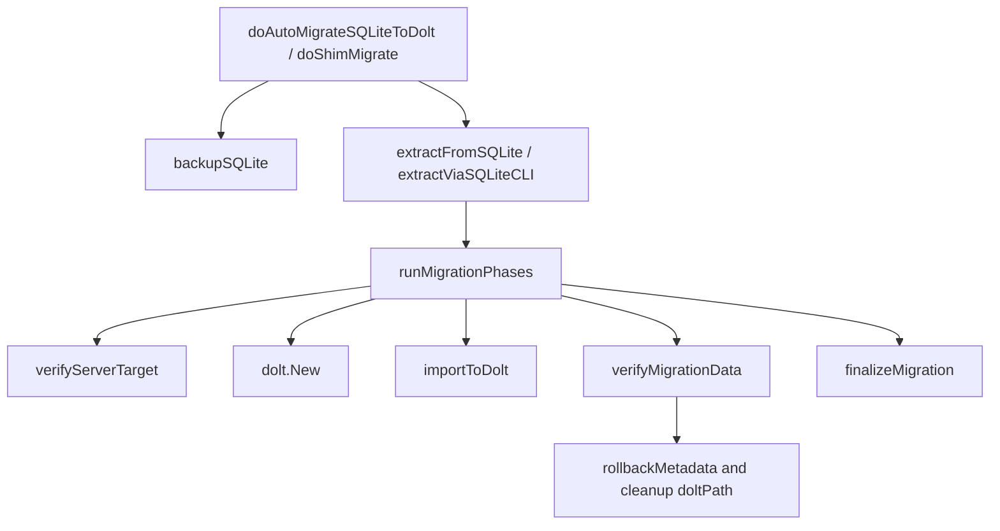

# migration_safety_and_cutover

`migration_safety_and_cutover` 模块是 SQLite→Dolt 自动迁移流程里的“安全闸门 + 最终切换器”。如果把迁移想象成给飞机更换发动机，这个模块不是负责拆装零件的人（那是 `extractFromSQLite` / `importToDolt`），而是塔台：先确认你要飞去的是正确机场（`verifyServerTarget`），再在起飞前做黑盒核对（`verifyMigrationData`），最后才允许正式切换航线（`finalizeMigration`）。它存在的核心原因是：**迁移成功不等于切换安全**。仅靠“导入函数返回成功”会漏掉写错服务器、部分写入、元数据半更新等灾难级问题。

## 架构角色与数据流



这个模块在系统中的架构位置非常清晰：它是 `migrate_auto.go`（CGO 路径）与 `migrate_shim.go`（无 CGO 路径）共享的后半段编排器。前半段抽取数据由不同实现负责，但一旦拿到 `migrationData`，两条路径都会进入 `runMigrationPhases`，走同一套“验证→导入→提交→再验证→切换”协议。这样的设计把“数据抽取差异”与“迁移安全语义”解耦：你可以替换抽取手段，却不该绕过安全切换逻辑。

从调用关系看，`doAutoMigrateSQLiteToDolt` 和 `doShimMigrate` 是上游入口；`runMigrationPhases` 是本模块的编排中枢；下游依赖是 `dolt.New`、`importToDolt`、`configfile.Load/Save`、`config.SaveConfigValue`，以及通过 `database/sql` + MySQL 驱动做独立校验查询。最关键的数据契约是 `migrationParams`：它把路径、备份位置、抽取结果、Dolt 连接配置、以及“独立校验连接参数”打包到一起，避免 phase 函数向外部散乱读全局状态。

## 心智模型：两阶段提交的“软事务”

理解这个模块最有效的模型是“文件系统 + 元数据上的软事务（soft transaction）”。它没有真正分布式事务能力，但用阶段化和补偿动作逼近事务语义：

- 第一阶段（准备阶段）：验证目标、写入 Dolt、做独立校验，但**不切换元数据入口**。
- 第二阶段（提交阶段）：`finalizeMigration` 一次性写 metadata/config 并重命名 SQLite，完成 cutover。

如果第一阶段失败，模块会删除新建的 `doltPath` 并尝试 `rollbackMetadata`，让系统回到“SQLite 仍是事实来源”的状态。这个思路的“why”是：真正不可逆的动作（切换后端标识、标记原 SQLite 为 migrated）必须最后发生，且只在验证通过后发生。

## 组件深潜

### `migrationParams`

`migrationParams` 不是简单参数容器，而是迁移协议的上下文对象。它把必须一致的一组信息集中传递给 `runMigrationPhases`：`beadsDir`、`sqlitePath`、`backupPath`、`data`、`doltCfg`、`dbName`，以及 `serverHost/serverPort/serverUser/serverPassword`。

这里一个非显而易见的设计点是：`doltCfg`（用于实际写入）与 server 连接字段（用于独立验证）并存。也就是说，模块刻意不完全信任 `DoltStore` 内部连接路径，而是要求用“第二条路径”复核结果，防止“写入成功但写到了错误实例”这类高风险场景。

### `backupSQLite(sqlitePath string) (string, error)`

这个函数是迁移前不可妥协的安全前置。它做了三件关键事：

第一，生成带时间戳的备份名，默认模式是 `*.backup-pre-dolt-<timestamp>.*`，并在同秒冲突时附加 `-1..-100` 计数后缀。

第二，目标文件使用 `os.O_CREATE|os.O_EXCL` 打开，避免覆盖已有文件，也降低 TOCTOU 风险。

第三，原文件只读打开并 `io.Copy`，原始 SQLite 保持不变。

它体现的是“先保存回滚支点，再做任何迁移动作”的原则。测试里也覆盖了计数耗尽（100 个冲突）等极端情况，说明这不是“方便功能”，而是流程安全边界。

### `verifyServerTarget(expectedDBName string, port int) error`

这一步解决的是“端口上跑着谁”这个现实问题。很多系统会天真地假设“连上了就对”，这里反过来：**连上只是开始，不是验证完成**。

函数先做 TCP 探测。如果是连接拒绝（无服务），判定为“可继续”（稍后可启动服务器）；但若是超时或其他未知网络错误，直接失败，因为目标状态不确定。

若端口有服务，它会连接后执行 `SHOW DATABASES`，并基于 `doltSystemDatabases` 过滤系统库：

- 发现 `expectedDBName`：明确匹配，安全。
- 只有系统库：视作干净新服务，安全。
- 有其他用户库但不含目标库：在共享服务器模型下允许继续，但会输出诊断提示。

这段逻辑体现的 tradeoff 是“防误写优先于严格独占”。它没有因为“存在其他库”就拒绝迁移，而是兼容共享 Dolt server 场景（如 Gas Town），提高可用性。

### `runMigrationPhases(ctx, params)`

这是模块核心 orchestrator。内部顺序不可随意重排：

1. `verifyServerTarget` 先验目标正确性。
2. 保存 `originalCfg` 作为回滚材料。
3. `dolt.New` 创建/打开目标 Dolt store。
4. `importToDolt` 导入数据；若失败，关闭 store 并删除 `doltPath`。
5. 尝试写 `sync.mode=dolt-native`，并尝试 `Commit`。
6. 关闭 store 后执行 `verifyMigrationData` 独立复核。
7. 仅当复核成功时调用 `finalizeMigration` 完成 cutover。

这里最值得注意的“why”是第 6 步：它没有复用导入阶段的连接，而是走独立 SQL 查询。这样才能检测出“导入层返回成功但结果不在预期数据库”这类隐蔽故障。若验证失败，会打印警告、删除 Dolt 目录、并尝试恢复 metadata。

### `verifyMigrationData(sourceData, dbName, host, port, user, password) error`

该函数不是全量校验器，而是低成本高收益的“可信度抽样+下限约束”校验器。

它做三类检查：issue 总数下限、dependency 总数下限、首尾 issue（ID+title）点验。注意它不是要求“目标 == 源”，而是“目标 >= 源”。这是因为目标 Dolt 可能已有预存数据，迁移是 merge-like 写入而非全库替换。

这种设计在性能与正确性间做了平衡：不做全量逐行比对（避免高成本），但用计数+首尾点验快速提升“写对库且写完整”的置信度。它还容忍超旧 schema 下 `dependencies` 查询失败（只记 debug，不立即失败），反映了对历史版本兼容的现实取舍。

### `verifyMigrationCounts(...) error`

这是一个纯计数校验工具函数，语义与 `verifyMigrationData` 的下限约束一致：Dolt 计数不能小于源计数。当前在核心迁移路径里主要由更强的 `verifyMigrationData` 承担验证职责；这个函数更像是可复用的简化校验构件（测试覆盖较完整）。

### `finalizeMigration(beadsDir, sqlitePath, dbName) error`

这是真正的 cutover 点，也是唯一被注释明确为“可修改 metadata 的最终步骤”的函数。它按顺序做：

- `configfile.Load`（或默认配置）
- 写 `Backend=BackendDolt`, `Database="dolt"`, `DoltDatabase=dbName`
- `cfg.Save(beadsDir)` 持久化 metadata.json
- best-effort 写 `config.yaml` 的 `sync.mode=dolt-native`
- `os.Rename(sqlitePath, sqlitePath+".migrated")`

关键设计是“双轨配置源”：`metadata.json` 被视为权威源，`config.yaml` 写入失败仅记录 debug，不阻断流程。这降低了初始化时序问题（auto-migration 可能早于完整 config 初始化）带来的失败概率。

也要看到其张力：若最后 rename 失败，函数会返回 error，但 metadata 已更新为 Dolt（测试 `TestFinalizeMigration_NonexistentSQLite` 也验证了这一点）。这就是典型的“无法原子覆盖多介质操作”的残余风险，需要 `bd doctor --fix` 兜底。

### `rollbackMetadata(beadsDir, originalCfg)`

这是简单但关键的补偿动作：把 `originalCfg` 回写。它只在 `runMigrationPhases` 的验证失败路径触发，用于避免 metadata 指向 Dolt 而数据未可信迁移的分裂状态。

## 依赖分析：谁调用它、它调用谁

上游调用方是两个入口：`doAutoMigrateSQLiteToDolt`（CGO）与 `doShimMigrate`（shim）。它们在完成各自的 SQLite 抽取后，都会组装 `migrationParams` 并调用 `runMigrationPhases`。二者还共享 `backupSQLite` 与若干 guard 语义（空文件、已迁移文件、显式 SQLite backend 跳过等）。

下游依赖分三层。第一层是存储写入层：`dolt.New` 和 `importToDolt`，负责把 `migrationData` 写入 Dolt。第二层是验证层：`verifyServerTarget` 用网络+SQL探测目标环境，`verifyMigrationData` 用独立连接复核写入结果。第三层是状态切换层：`configfile.Load/Save` 与 `config.SaveConfigValue` 更新配置，再通过 `os.Rename` 标记旧 SQLite 已迁移。

隐含契约主要有三条。其一，`migrationData.issues` 顺序可用于“首尾 spot-check”的代表性采样（上游抽取代码按 `created_at, id` 排序）。其二，`doltCfg.Path` 在失败回滚时会被 `os.RemoveAll` 删除，因此调用方必须保证该路径是新建迁移目标而非共享目录。其三，`dbName` 不能为空且与目标服务器预期一致，否则 `verifyServerTarget` 直接拒绝。

## 设计决策与权衡

这个模块整体偏向 correctness-first。它牺牲了一些迁移速度（多次连接、额外验证），换来“避免写错地方和错误切换”的安全性。尤其是独立验证连接这一点，本质上是增加冗余检查来降低灾难概率。

同时它在兼容性上采取“严格处置未知状态、宽容已知历史差异”。比如网络超时或无法判断目标服务时直接中止；但面对旧 schema 缺少 `dependencies` 表时不立即失败。前者是防灾，后者是面向存量用户升级现实。

在耦合方面，`runMigrationPhases` 与 `configfile`、`dolt`、`importToDolt` 耦合较紧，这是刻意的：迁移 cutover 需要跨越数据层和配置层，不可能完全纯函数化。模块通过 `migrationParams` 把耦合集中在一个边界对象内，已经是相对克制的组织方式。

## 使用方式与示例

通常你不会直接调用 `runMigrationPhases`，而是走自动迁移入口（CLI 启动时）或 `bd migrate --to-dolt` 流程。对开发者而言，最常见的扩展是新增一种“抽取 source 数据”的方式，然后复用现有安全切换。

```go
params := &migrationParams{
    beadsDir:       beadsDir,
    sqlitePath:     sqlitePath,
    backupPath:     backupPath,
    data:           data,
    dbName:         dbName,
    serverHost:     resolvedHost,
    serverPort:     resolvedPort,
    serverUser:     resolvedUser,
    serverPassword: resolvedPassword,
    doltCfg:        doltCfg,
}

imported, skipped, err := runMigrationPhases(ctx, params)
```

如果你要扩展校验策略，建议加在 `verifyMigrationData` 里，保持“finalize 前必须通过复核”的边界不变。不要把 metadata 更新提早到导入成功后，否则会破坏软事务语义。

## 新贡献者高频踩坑

最容易踩坑的是“以为导入成功就完成迁移”。真正完成的判据是 `finalizeMigration` 成功返回，并且 SQLite 文件被重命名为 `.migrated`。如果你在中间环节新增逻辑，要确保失败时不会提前改变 metadata。

第二个坑是误改回滚语义。`runMigrationPhases` 在导入失败和验证失败的处理不同：前者清理 Dolt 目录，后者还会尝试 metadata 回滚。你若调整 phase 顺序，必须同步审视补偿动作是否仍成立。

第三个坑是共享 server 场景。`verifyServerTarget` 对“端口已有其他用户库”是允许继续的，不是 bug；这是多库共享模型下的兼容设计。若你把这条改成 hard-fail，会破坏既有部署模式。

第四个坑是 `finalizeMigration` 的非原子尾部：metadata 先写、rename 后做。任何新增逻辑若插在两者之间，都可能扩大“不一致窗口”。若必须插入，务必提供对应 `doctor` 修复路径。

## 参考文档

- [CLI Migration Commands](CLI%20Migration%20Commands.md)
- [sqlite_to_dolt_import_pipeline](sqlite_to_dolt_import_pipeline.md)（若缺失请补充该模块文档）
- [Dolt Storage Backend](Dolt%20Storage%20Backend.md)
- [Configuration](Configuration.md)
- [migration_readiness_and_completion](migration_readiness_and_completion.md)
