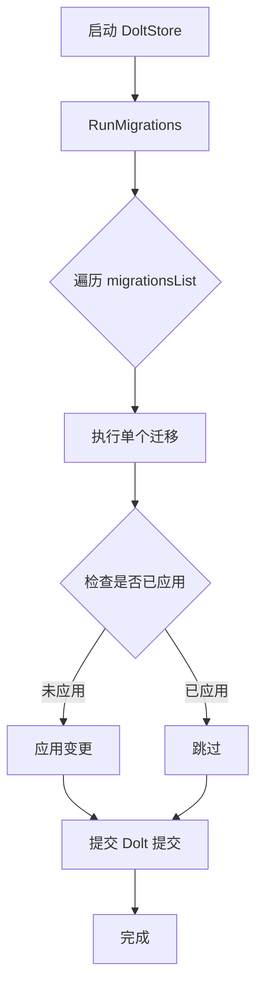

# migration_system 模块技术深度解析

## 1. 模块概述与问题解决

migration_system 模块是 Dolt 存储后端的重要组成部分，负责安全、可靠地管理数据库 schema 演化。在长期运行的软件系统中，随着功能迭代往往伴随着数据结构变化，如何在不丢失数据的情况下升级数据库 schema 是一个经典难题。migration_system 专门解决这个问题，它提供了一套机制，确保 schema 变更可以安全、有序地应用，支持幂等操作，并与 Dolt 的版本控制特性紧密结合。

### 核心设计理念：
- **向前兼容性：确保 schema 变更不会破坏现有数据库
- **幂等性：迁移可以多次安全执行而不会造成问题
- **与 Dolt 集成：利用 Dolt 的版本控制特性来记录 schema 变更

## 2. 架构与核心抽象

### 核心抽象是 `Migration` 结构体，它代表单个 schema 迁移的封装。每个 `Migration` 包含两个字段：
- `Name`：迁移的唯一标识符，用于诊断和日志
- `Func`：实际执行迁移的函数，它接收 `*sql.DB` 作为参数并返回错误

这个模块的设计采用了**线性迁移链的架构：
- 所有迁移按照添加到 `migrationsList` 中，严格按照顺序执行
- 每个迁移都是幂等的，这意味着可以多次运行不会产生副作用
- 迁移过程与 Dolt 版本控制系统集成，确保每次迁移都有记录

### 数据流程图



## 3. 核心组件详解

### Migration 结构体
```go
type Migration struct {
	Name string
	Func func(*sql.DB) error
}
```
这个简单但强大的抽象，将迁移的名称和逻辑封装在一起。名称用于日志和调试，而函数则包含实际的迁移逻辑。关键是，每个迁移函数都必须是幂等的。

### migrationsList 变量
这是一个有序的迁移列表，所有的迁移都必须按顺序添加到这里。新的迁移应该总是追加到列表的末尾，以确保正确的执行顺序。

### RunMigrations 函数
```go
func RunMigrations(db *sql.DB) error
```
这是模块的核心函数，它遍历 `migrationsList` 中的每个迁移，按顺序执行它们。执行完所有迁移后，它使用 Dolt 的 `DOLT_COMMIT 来提交 schema 变更。这个函数确保了：
- 严格的执行顺序
- 幂等执行
- 与 Dolt 版本控制集成

### CreateIgnoredTables 函数
```go
func CreateIgnoredTables(db *sql.DB) error
```
这个函数用于重新创建被 `dolt_ignore` 忽略的表（例如 `wisps` 和 `wisp_*`）。这些表只存在于工作集中，不会在分支时继承。这个函数是幂等的，可安全重复调用。

### ListMigrations 函数
```go
func ListMigrations() []string
```
返回所有注册迁移的名称列表，主要用于调试和诊断。

## 4. 迁移实现模式与 helper 函数

### 幂等性实现是迁移设计的关键。每个迁移函数都遵循一个标准模式：
1. 首先检查迁移是否已经应用
2. 如果没有应用，则执行相应的 schema 变更
3. 如果已经应用，则直接返回

辅助函数（在 `migrations/helpers.go` 中）提供了关键的检查功能：
- `columnExists`: 检查表中是否存在特定列
- `tableExists`: 检查数据库中是否存在特定表
- `isTableNotFoundError`: 检查错误是否为表不存在错误

这些辅助函数确保迁移可以安全地多次运行，不会造成重复操作。

## 5. 与其他模块的关系

migration_system 是 Dolt 存储后端的核心组成部分，被 `DoltStore` 在初始化时调用。它与 Dolt 的事务管理、版本控制等功能紧密配合。

依赖关系：
- 被 [Dolt Storage Backend](dolt_storage_backend.md) 模块的 `DoltStore` 在初始化时调用
- 使用了 Dolt 的事务系统
- 与 Dolt 的版本控制集成
- 与 Dolt 的 `dolt_ignore` 机制配合

## 6. 设计决策与权衡

### 设计决策：
1. **线性迁移链：所有迁移按固定顺序执行，简化了依赖关系管理
2. **幂等迁移：每个迁移都必须可安全多次运行，避免了状态管理的复杂性
3. **与 Dolt 版本控制集成：利用 Dolt 的特性来记录和管理 schema 变更
4. **没有版本表：不使用专门的版本表来追踪已应用的迁移，而是让每个迁移自己检查是否已应用

### 权衡与张力：
- 线性迁移链 vs 灵活的迁移依赖：线性链简化了实现，但限制了迁移的灵活性
- 无版本表 vs 有版本表：无版本表简化了架构，但每个迁移都需要自己实现检查逻辑
- Dolt 集成 vs 数据库独立性：与 Dolt 紧密集成使迁移更强大，但也使迁移系统与 Dolt 耦合

## 7. 使用场景与常见模式

### 新增迁移的步骤：
1. 在 `internal/storage/dolt/migrations` 目录下创建新的迁移文件
2. 实现迁移函数，确保它是幂等的
3. 在 `migrationsList` 中添加新的 `Migration` 结构体
4. 测试迁移，确保它可以多次安全运行

### 常见模式：
- 检查列是否存在后再添加
- 检查表是否存在后再创建
- 使用 Dolt 的事务来确保变更的原子性
- 提交变更到 Dolt 版本控制系统

## 8. 注意事项与常见陷阱

- **迁移顺序很重要：** 新的迁移必须总是追加到 `migrationsList` 的末尾
- **迁移必须是幂等的：** 确保迁移可以多次安全运行，不会造成重复操作
- **与 Dolt 的集成：** 迁移提交到 Dolt 版本控制系统，但要处理 "nothing to commit" 的情况
- **被忽略的表：** `wisps` 和 `wisp_*` 表不会在分支时继承，需要使用 `CreateIgnoredTables` 重新创建
