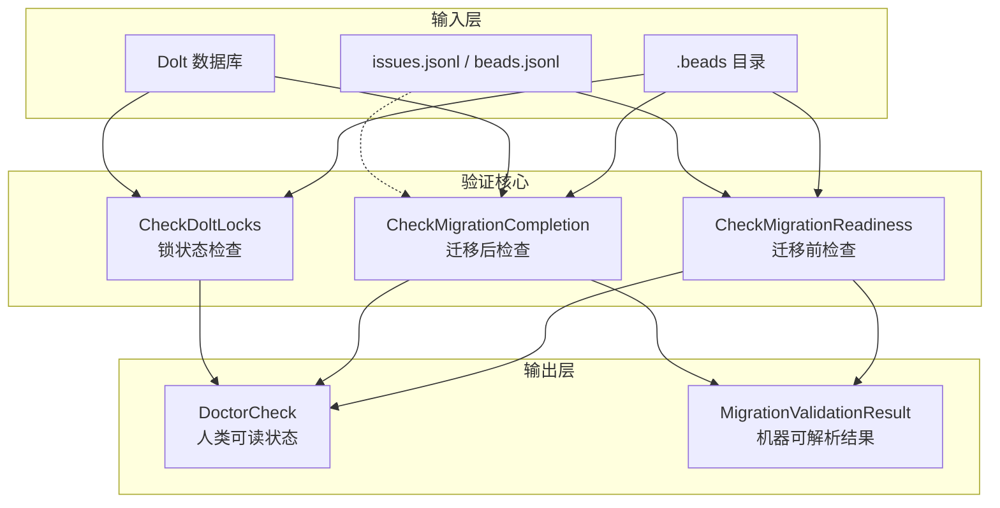

# Migration Validation 模块深度解析

## 概述：为什么需要这个模块

想象一下你要把一座正在运营的图书馆从旧建筑搬到新建筑 —— 你不能简单地关门、搬书、开门。你需要确保：(1) 旧建筑里的每本书都被清点过，(2) 新建筑的结构能容纳所有书籍，(3) 搬迁后没有书丢失或损坏，(4) 读者在搬迁期间不会遇到混乱。

`migration_validation` 模块正是 beads 系统从 SQLite/JSONL 存储后端迁移到 Dolt 版本控制数据库时的"搬迁监理"。它解决的核心问题是：**如何在不停机、不丢失数据的前提下，安全地完成存储层的重大架构升级**。

这个模块的设计洞察在于：迁移不是原子操作，而是一个需要验证的状态转换过程。 naive 的做法是"迁移完再检查"，但这会导致问题发现太晚。本模块采用**两阶段验证模型**——迁移前的"适航检查"和迁移后的"完整性审计"——确保每个阶段都有明确的进入/退出标准。

模块输出设计为双重消费模式：人类可读的 `DoctorCheck`（用于 CLI 显示）和机器可解析的 `MigrationValidationResult`（用于自动化脚本和 AI 助手如 Claude）。这种设计反映了 beads 系统的核心理念：**诊断工具本身应该是可组合的构建块，而非死胡同**。

## 架构与数据流



### 组件角色说明

**验证入口函数**是模块的对外接口，三个主要函数对应迁移生命周期的不同阶段：

| 函数 | 调用时机 | 核心职责 |
|------|----------|----------|
| `CheckMigrationReadiness` | 执行 `bd migrate dolt` 之前 | 验证 JSONL 文件完整性、确认后端状态、识别阻塞问题 |
| `CheckMigrationCompletion` | 迁移命令执行之后 | 对比 Dolt 与 JSONL 数据、检测数据丢失、识别跨 rig 污染 |
| `CheckDoltLocks` | 任意 Dolt 操作前后 | 检查未提交的变更，防止数据不一致 |

**数据流路径**（以迁移后检查为例）：

1. **定位阶段**：解析 `.beads` 目录路径 → 检测当前后端类型（必须是 `dolt`）
2. **连接阶段**：通过 `dolt.New()` 打开只读连接 → 获取 `DoltStore` 句柄
3. **统计阶段**：调用 `store.GetStatistics()` 获取 Dolt 中的 issue 总数
4. **对比阶段**：扫描 JSONL 文件构建 ID 集合 → 逐个查询 Dolt 验证存在性 → 记录缺失项（采样前 100 个）
5. **分类阶段**：对 Dolt 中多出的 issue，通过 `utils.ExtractIssuePrefix()` 区分"跨 rig 污染"和"临时 issue"
6. **输出阶段**：组装 `DoctorCheck`（含状态码、消息、修复建议）和 `MigrationValidationResult`（完整 JSON 数据）

### 架构定位

这个模块在 beads 系统中扮演**诊断网关**的角色：

- **上游依赖**：[Dolt Storage Backend](internal_storage_dolt_store.md) 提供数据存储访问，[Configuration](internal_config_config.md) 提供后端类型检测
- **下游消费者**：[CLI Doctor Commands](cmd_bd_doctor.md) 将检查结果格式化输出给用户或自动化系统
- **横向协作**：与 [Doctor 核心](cmd_bd_doctor.md) 共享 `DoctorCheck` 结构，形成统一的诊断协议

模块本身**不执行迁移**，只负责验证。这种职责分离是刻意的设计选择：迁移逻辑复杂且需要事务支持，而验证逻辑需要快速、只读、可重复执行。

## 核心组件深度解析

### MigrationValidationResult：机器可解析的验证结果

```go
type MigrationValidationResult struct {
    Phase              string         `json:"phase"`
    Ready              bool           `json:"ready"`
    Backend            string         `json:"backend"`
    JSONLCount         int            `json:"jsonl_count"`
    SQLiteCount        int            `json:"sqlite_count"`
    DoltCount          int            `json:"dolt_count"`
    MissingInDB        []string       `json:"missing_in_db"`
    MissingInJSONL     []string       `json:"missing_in_jsonl"`
    Errors             []string       `json:"errors"`
    Warnings           []string       `json:"warnings"`
    // ... 更多字段
}
```

**设计意图**：这个结构体是模块的"数据契约"，专为自动化消费设计。每个字段都有明确的语义：

- `Phase` 区分检查类型（`pre-migration` / `post-migration`），允许调用者根据阶段采取不同行动
- `Ready` 是布尔决策信号，自动化脚本可直接用它决定是否继续执行
- `Errors` vs `Warnings` 的分离体现了**阻塞性 vs 非阻塞性**问题的区分：错误必须修复才能继续，警告只是需要注意
- `ForeignPrefixCount` 和 `ForeignPrefixes` 揭示了 beads 系统的多 rig 架构特性——不同 rig 的 issue 可能意外混入

**为什么用 JSON 标签**：beads 系统深度集成 AI 助手（如 Claude），结构化输出允许 AI 直接解析验证结果并给出针对性建议。这是"AI-native 工具"设计哲学的体现。

**采样策略**：`MissingInDB` 和 `MissingInJSONL` 最多返回 100 个 ID。这是性能与完整性的权衡——如果数千个 issue 丢失，列出全部会淹没关键信息，且消耗大量内存。采样足够证明问题存在，详细列表可通过其他工具获取。

### CheckMigrationReadiness：迁移前的"适航检查"

**核心逻辑流程**：

```
1. 检查 .beads 目录存在性
   └─ 不存在 → 返回错误："No beads installation found"
   
2. 检测当前后端类型
   └─ 已是 dolt → 返回 OK："Already using Dolt backend"
   
3. 查找 JSONL 文件（issues.jsonl 或 beads.jsonl）
   └─ 找不到 → 返回错误："No JSONL file found"，建议运行 'bd export'
   
4. 验证 JSONL 完整性（调用 validateJSONLForMigration）
   └─ 完全损坏（0 个有效 issue）→ 返回错误
   └─ 部分损坏（有 malformed 行）→ 添加警告，继续
   
5. 构建输出
   └─ 有 Errors → StatusError
   └─ 有 Warnings → StatusWarning
   └─ 否则 → StatusOK
```

**关键设计决策**：

1. **JSONL 验证的容错性**：`validateJSONLForMigration` 只在**所有行都损坏**时才返回错误。部分损坏被视为警告。这是因为迁移过程本身可以从数据库重新导出 JSONL，不需要完美无瑕的源文件。

2. **后端检测的早期退出**：如果已经是 Dolt 后端，函数立即返回 OK。这避免了不必要的文件扫描和数据库查询，体现了"快速失败"原则。

3. **修复建议的上下文感知**：每个错误都附带 `Fix` 字段，给出具体命令（如 `bd export` 或 `bd migrate dolt`）。这降低了用户的认知负担——不需要记住命令，直接复制粘贴即可。

### CheckMigrationCompletion：迁移后的"完整性审计"

**与迁移前检查的本质区别**：

| 维度 | CheckMigrationReadiness | CheckMigrationCompletion |
|------|------------------------|--------------------------|
| 数据源 | JSONL 文件 | Dolt 数据库 + JSONL 文件 |
| 核心问题 | "能迁移吗？" | "迁移成功了吗？" |
| 关键验证 | JSONL 可解析性 | 数据一致性（Dolt vs JSONL） |
| 特殊处理 | 无 | 跨 rig 污染分类、临时 issue 识别 |

**数据对比算法**：

```go
// 伪代码展示对比逻辑
for each issue_id in jsonlIDs:
    _, err = store.GetIssue(ctx, issue_id)
    if err != nil:
        missing.append(issue_id)
        if len(missing) >= 100:
            break  // 采样限制
```

这个 O(n) 线性扫描看似低效，但有两个合理性：
1. 迁移验证是低频操作（每个 rig 只执行几次），性能不是首要考虑
2. `GetIssue` 在 Dolt 中是主键查询，时间复杂度接近 O(1)

**跨 rig 污染检测**（`categorizeDoltExtras` 函数）：

这是模块最精妙的设计之一。当 Dolt 中的 issue 数量多于 JSONL 时，模块不会立即报错，而是先分类：

```go
prefix := utils.ExtractIssuePrefix(id)
if localPrefix != "" && prefix != "" && prefix != localPrefix {
    foreignPrefixes[prefix]++  // 跨 rig 污染
} else {
    ephemeralCount++  // 临时 issue（如 wisp）
}
```

**为什么这样设计**：beads 系统支持多 rig 架构，不同 rig 的 issue 可能因配置错误或手动操作混入。这些 issue 不是"数据丢失"，而是"数据污染"，需要不同的修复策略。临时 issue（如 wisp 类型）则是系统正常运行的副产品，不应视为错误。

### CheckDoltLocks：锁状态检查

**问题背景**：Dolt 是版本控制数据库，未提交的变更会导致后续操作（如同步、合并）失败。这个函数检查 `dolt_status` 表，识别未提交的变更。

**特殊处理**：函数会跳过 wisp 表（`isWispTable(tableName)`），因为 wisp 是临时数据结构，预期会有未提交变更。这体现了**领域知识嵌入**——通用锁检查会误报，但了解 beads 业务语义后可以精确过滤。

**输出建议**：如果检测到锁，`Fix` 字段会建议运行 `bd vc commit -m "commit changes"`。这反映了 beads 的版本控制抽象——用户不需要直接操作 Dolt 命令，而是通过 beads 封装的接口。

## 依赖分析

### 上游依赖（被调用方）

| 依赖模块 | 调用内容 | 为什么需要 |
|----------|----------|------------|
| [Dolt Storage Backend](internal_storage_dolt_store.md) | `dolt.New()`, `store.GetStatistics()`, `store.GetIssue()` | 访问 Dolt 数据库的核心接口 |
| [Configuration](internal_config_config.md) | `configfile.BackendDolt`, `GetBackend()` | 检测当前存储后端类型 |
| [Utils](internal_utils.md) | `utils.ExtractIssuePrefix()` | 从 issue ID 提取 rig 前缀 |

### 下游依赖（调用方）

| 调用模块 | 使用方式 | 期望行为 |
|----------|----------|----------|
| [CLI Doctor Commands](cmd_bd_doctor.md) | 调用验证函数，格式化输出 `DoctorCheck` | 返回人类可读状态和机器可解析结果 |
| 自动化脚本 | 解析 `MigrationValidationResult` JSON | 根据 `Ready` 字段决定是否继续执行 |
| AI 助手（Claude） | 读取完整验证结果，生成修复建议 | 结构化数据便于 AI 理解上下文 |

### 数据契约

**输入契约**：
- `path` 参数：项目根目录路径（函数内部会拼接 `/.beads`）
- 文件系统：`.beads` 目录、JSONL 文件、Dolt 数据库文件必须可访问

**输出契约**：
- `DoctorCheck`：包含 `Name`, `Status`, `Message`, `Detail`, `Fix`, `Category` 字段
- `MigrationValidationResult`：完整 JSON 结构，所有字段都有默认值（空字符串、0、false、空切片）

**隐式契约**：
- 函数是**只读**的，不会修改任何文件或数据库
- 函数是**幂等**的，多次调用结果一致（除非底层数据变化）
- 错误是**累积**的，所有发现的问题都会报告，而不是遇到第一个错误就退出

## 设计决策与权衡

### 1. CGO 条件编译：功能 vs 可移植性

模块有两个源文件：
- `migration_validation.go`（`//go:build cgo`）：完整实现，依赖 Dolt
- `migration_validation_nocgo.go`（`//go:build !cgo`）：桩实现，返回 N/A

**权衡分析**：
- **选择**：用条件编译而非运行时检查
- **原因**：Dolt 依赖 CGO，非 CGO 构建根本无法导入 Dolt 包。条件编译允许同一套 API 在不同构建配置下编译通过
- **代价**：代码重复（结构体定义需要两份），但通过简化 nocgo 版本的结构体字段减少了重复

**替代方案**：
- 运行时检查：会导致非 CGO 构建编译失败
- 接口抽象：会增加调用方的复杂度，而条件编译对调用方透明

### 2. 采样 vs 完整报告：可用性 vs 完整性

`MissingInDB` 最多返回 100 个 ID，而不是全部。

**权衡分析**：
- **选择**：采样
- **原因**：
  1. 如果数百个 issue 丢失，列出全部会淹没终端输出
  2. 修复策略不依赖于具体丢失了哪些 issue——都需要重新迁移
  3. 内存效率：避免为大 rig 分配大量切片
- **代价**：用户无法一次性看到所有缺失 ID，但可通过其他工具（如直接查询 Dolt）获取

**设计洞察**：诊断工具的目标是**指导行动**，不是**提供完整审计日志**。100 个样本足以证明问题存在并触发修复流程。

### 3. 错误 vs 警告：阻塞性分类

模块严格区分 `Errors`（阻塞）和 `Warnings`（非阻塞）。

**分类规则**：
- **Errors**：JSONL 完全损坏、Dolt 无法打开、数据丢失（Dolt 计数 < JSONL 计数）
- **Warnings**：JSONL 部分损坏、Dolt 有未提交变更、跨 rig 污染、临时 issue

**设计意图**：这种分类允许自动化脚本做出智能决策。例如：
```bash
result=$(bd doctor --migration-validation)
if echo "$result" | jq -r '.errors | length > 0'; then
    echo "Migration blocked, fixing..."
    bd doctor --fix
else
    echo "Proceeding with warnings..."
fi
```

### 4. 只读验证：安全性 vs 修复能力

所有验证函数都是只读的，不修改任何数据。

**权衡分析**：
- **选择**：验证与修复分离
- **原因**：
  1. 验证应该快速、安全、可重复执行
  2. 修复可能需要事务、锁、用户确认，复杂度高
  3. 分离允许"先检查再决定"的工作流
- **代价**：用户需要运行两个命令（检查 + 修复），但这是更安全的模式

**对比**：某些工具会在检查时自动修复，但这会导致意外修改。beads 选择显式修复（`bd doctor --fix`），让用户有控制权。

### 5. JSONL 作为中间表示：兼容性 vs 复杂性

迁移验证依赖 JSONL 文件作为"真相来源"，而不是直接对比 SQLite 和 Dolt。

**设计意图**：
1. **解耦**：SQLite 和 Dolt 的 schema 可能不同，JSONL 作为中间格式屏蔽差异
2. **可审计**：JSONL 是人类可读的，便于手动检查
3. **可恢复**：如果迁移失败，可以从 JSONL 重新开始

**代价**：需要维护 JSONL 文件（通过 `bd export`），增加了存储开销。但这是为迁移安全性付出的合理代价。

## 使用指南

### 基本用法

```bash
# 迁移前检查
bd doctor --migration-readiness

# 迁移后检查
bd doctor --migration-completion

# 检查 Dolt 锁状态
bd doctor --dolt-locks
```

### 编程调用

```go
import "github.com/steveyegge/beads/cmd/bd/doctor"

// 迁移前检查
check, result := doctor.CheckMigrationReadiness("/path/to/project")
if !result.Ready {
    fmt.Printf("Migration blocked: %v\n", result.Errors)
    return
}

// 迁移后检查
check, result = doctor.CheckMigrationCompletion("/path/to/project")
if len(result.MissingInDB) > 0 {
    fmt.Printf("Data loss detected: %d issues missing\n", len(result.MissingInDB))
}
```

### 自动化集成

```bash
# CI/CD 中验证迁移
bd doctor --migration-completion --json | jq -e '.ready'
if [ $? -ne 0 ]; then
    echo "Migration validation failed"
    exit 1
fi
```

### 配置选项

模块本身没有独立配置，但行为受以下因素影响：

| 配置项 | 影响 | 设置方式 |
|--------|------|----------|
| `issue_prefix` | 跨 rig 污染检测的基准前缀 | Dolt 配置表 |
| JSONL 文件位置 | 验证的数据源 | 固定为 `.beads/issues.jsonl` 或 `.beads/beads.jsonl` |
| Dolt 数据库路径 | 验证的目标存储 | 固定为 `.beads/dolt/` |

## 边界情况与陷阱

### 1. CGO 不可用

**现象**：在非 CGO 构建中，所有验证函数返回 `N/A`。

**检测**：
```go
if result.Backend == "unknown" && len(result.Errors) > 0 {
    // CGO 不可用
}
```

**解决方案**：确保使用 CGO 构建 beads：
```bash
CGO_ENABLED=1 go build -o beads ./cmd/bd
```

### 2. 跨 rig 污染误报

**现象**：`ForeignPrefixCount` 显示有外来 issue，但实际是合法的。

**原因**：`issue_prefix` 配置未设置或错误，导致所有 issue 都被视为"外来"。

**解决方案**：
```bash
bd config set issue_prefix <your-rig-prefix>
```

### 3. JSONL 与 Dolt 计数不匹配

**现象**：`DoltCount > JSONLCount`，但没有显示缺失 issue。

**可能原因**：
1. 跨 rig 污染（`ForeignPrefixCount > 0`）
2. 临时 issue（wisp 类型，被 `isWispTable` 过滤）
3. 迁移后新创建的 issue（正常情况）

**诊断步骤**：
```bash
# 查看详细分类
bd doctor --migration-completion --json | jq '.foreign_prefixes'

# 手动查询 Dolt
bd vc query "SELECT id FROM issues WHERE id NOT LIKE '<prefix>-%'"
```

### 4. Dolt 锁状态误报

**现象**：`CheckDoltLocks` 报告有未提交变更，但实际没有。

**原因**：wisp 表被错误地包含在检查中（`isWispTable` 逻辑有 bug）。

**解决方案**：检查 `isWispTable` 函数实现，确保所有 wisp 相关表都被正确识别。

### 5. 大 rig 性能问题

**现象**：验证大 rig（>100k issues）时响应缓慢。

**原因**：`compareDoltWithJSONL` 是 O(n) 线性扫描，每个 issue 都需要一次数据库查询。

**优化建议**：
1. 使用批量查询而非逐个查询
2. 增加采样率（当前是前 100 个，可考虑随机采样）
3. 使用 Dolt 的 `IN` 子句进行集合对比

### 6. JSONL 文件编码问题

**现象**：`validateJSONLForMigration` 报告大量 malformed 行。

**原因**：JSONL 文件使用了非 UTF-8 编码，或包含 BOM 标记。

**解决方案**：
```bash
# 检查文件编码
file .beads/issues.jsonl

# 转换为 UTF-8
iconv -f LATIN1 -t UTF-8 .beads/issues.jsonl > .beads/issues_utf8.jsonl
mv .beads/issues_utf8.jsonl .beads/issues.jsonl
```

## 扩展点

### 添加新的验证规则

模块设计为**开放扩展**——可以添加新的验证函数，只要遵循以下模式：

```go
func CheckNewValidation(path string) (DoctorCheck, MigrationValidationResult) {
    result := MigrationValidationResult{
        Phase: "pre-migration", // 或 "post-migration"
        Ready: true,
    }
    
    // 验证逻辑...
    if problem {
        result.Ready = false
        result.Errors = append(result.Errors, "description")
    }
    
    return DoctorCheck{
        Name:     "New Validation",
        Status:   determineStatus(result),
        Message:  buildMessage(result),
        Fix:      "suggested fix",
        Category: CategoryMaintenance,
    }, result
}
```

### 自定义输出格式

`MigrationValidationResult` 的 JSON 标签允许自定义序列化：
```go
result := CheckMigrationCompletion("/path")
jsonBytes, _ := json.MarshalIndent(result, "", "  ")
```

### 集成外部验证工具

可以调用外部工具（如 `dolt fsck`）进行更深入的检查：
```go
cmd := exec.Command("dolt", "fsck")
output, err := cmd.CombinedOutput()
if err != nil {
    result.Errors = append(result.Errors, string(output))
}
```

## 相关模块

- **[服务器与迁移验证](../服务器与迁移验证.md)** — 父模块，聚合服务器检查和迁移验证的完整诊断系统
- [Dolt Storage Backend](internal_storage_dolt_store.md)：Dolt 数据库的底层实现
- [CLI Doctor Commands](cmd_bd_doctor.md)：验证结果的 CLI 展示
- [Configuration](internal_config_config.md)：后端类型检测和配置管理
- [Migration Commands](cmd_bd_migrate_issues.md)：实际执行迁移的命令

## 总结

`migration_validation` 模块体现了 beads 系统的核心设计哲学：

1. **安全优先**：两阶段验证确保迁移不会在未知状态下进行
2. **自动化友好**：机器可解析输出支持 CI/CD 和 AI 助手集成
3. **领域知识嵌入**：跨 rig 污染、临时 issue 等概念反映了 beads 的多 rig 架构
4. **职责分离**：验证与修复分离，检查与执行分离

理解这个模块的关键是认识到：**迁移不是技术问题，而是信任问题**。用户需要确信数据不会丢失，系统不会损坏。这个模块通过透明、可验证的检查建立这种信任——不是告诉用户"相信我"，而是展示"这是证据"。
