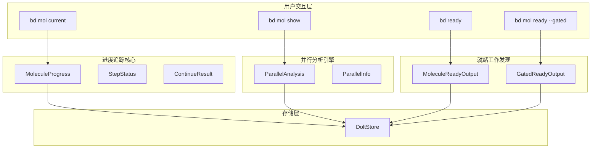

# molecule_progress_and_dispatch 模块深度解析

## 概述

`molecule_progress_and_dispatch` 模块是 beads CLI 的核心组件，负责**分子工作流的进度追踪与任务分发**。如果你把 beads 系统看作一个任务调度引擎，那么这个模块就是它的"仪表盘"和"调度台"——它告诉用户和代理当前在哪里、接下来可以去哪里、以及哪些工作已经就绪可以被认领。

**解决的问题**：在基于模板的分子工作流中，用户和代理需要一个方式来了解：
1. 我当前在哪一步？
2. 分子（工作流）的整体进度如何？
3. 哪些步骤可以并行执行？
4. 哪些工作没有阻塞、可以立即开始？
5. 哪些分子卡在门控（gate）处，等待条件满足后可以恢复？

---

## 架构概览



### 数据流概述

1. **进度查询流程**：`bd mol current` → `getMoleculeProgress()` → 加载分子子图 → 分析依赖关系 → 计算每步状态 → 返回进度
2. **并行分析流程**：`bd mol show --parallel` → `analyzeMoleculeParallel()` → 构建阻塞图 → 计算阻塞深度 → 分组可并行步骤
3. **就绪工作流程**：`bd ready` → `GetReadyWork()` → 过滤开放且无阻塞的议题 → 返回可认领工作
4. **门控恢复流程**：`bd ready --gated` → `findGateReadyMolecules()` → 查找已关闭门控 → 检查被阻塞步骤是否就绪 → 返回可恢复分子

---

## 核心设计决策

### 1. 为什么使用子图加载而非直接查询？

在 `getMoleculeProgress()` 中，模块首先调用 `loadTemplateSubgraph()` 加载整个分子的子图。这不是一个简单的查询，而是一个**关系遍历**过程。

**决策点**：分子是一个树形（或图形）结构，根节点是模板，子节点是具体步骤。追踪进度需要知道：
- 哪些步骤已完成（状态 = closed）
- 当前在哪一步（状态 = in_progress）
- 哪些步骤就绪（无开放阻塞依赖）

**未选择的替代方案**：直接在数据库中查询每步状态，但这会丢失分子内的依赖语义。例如，"哪些步骤可以并行"这个信息需要知道步骤间的 `blocks` 关系，而标准数据库查询难以表达这种图遍历逻辑。

### 2. 门控发现：为什么需要特殊处理？

门控（gate）是分子中的特殊步骤，它不是普通的工作项，而是一个**条件等待点**。例如：
- 等待 GitHub PR 合并
- 等待人工审批
- 等待定时器触发

当门控关闭时，被它阻塞的步骤应该变得可执行。但问题是：**系统不维护"谁在等谁"的显式跟踪**。

**决策点**：`findGateReadyMolecules()` 采用"反向发现"策略：
1. 找到所有已关闭的门控
2. 查找依赖这些门控的议题（`GetDependents`）
3. 检查这些议题是否现在就绪（无其他阻塞）
4. 排除已被其他人挂钩（hooked）的分子

这避免了维护"等待图"的复杂性——系统只需要知道"这个门控已关闭"，剩下的由查询逻辑推导。

### 3. 大分子处理：为什么需要阈值和摘要？

代码中定义了 `LargeMoleculeThreshold = 100`。当分子步骤超过 100 个时，`bd mol current` 默认显示摘要而非完整列表。

**决策点**：这是**性能与可用性的权衡**：
- 完整列表：O(n) 查询 + O(n) 渲染，大分子会卡顿
- 摘要视图：O(1) 查询，使用 `MoleculeProgressStats` 快速返回统计信息

用户可以通过 `--limit` 或 `--range` 显式查看大分子的具体步骤。

---

## 子模块概览

本模块由四个功能子模块组成，每个解决一个特定问题域：

| 子模块 | 文件 | 功能 |
|--------|------|------|
| **progress_tracking** | `mol_current.go` | 追踪分子进度、显示当前位置、推进到下一步 |
| **parallel_analysis** | `mol_show.go` | 分析并行步骤、识别可并发执行的工作 |
| **ready_work_query** | `ready.go` | 发现就绪工作、过滤可认领的议题 |
| **gate_discovery** | `mol_ready_gated.go` | 发现门控已关闭、可以恢复的分子 |

### 详细文档

- [progress_tracking](molecule-progress-and-dispatch-progress-tracking.md) — 进度追踪与状态管理
- [parallel_analysis](molecule-progress-and-dispatch-parallel-analysis.md) — 并行执行分析引擎
- [ready_work_query](molecule-progress-and-dispatch-ready-work-query.md) — 就绪工作查询
- [gate_discovery](molecule-progress-and-dispatch-gate-discovery.md) — 门控恢复发现

---

## 依赖关系分析

### 上游依赖（被依赖）

本模块为以下模块提供基础设施：

- **CLI 命令层**：`bd mol current`、`bd mol show`、`bd ready` 等命令依赖本模块的数据结构和逻辑
- **代理调度系统**：Deacon patrol 使用 `findGateReadyMolecules()` 来发现待分发的分子
- **进度展示**：其他模块可能调用 `AdvanceToNextStep()` 来自动推进工作流

### 下游依赖（依赖本模块）

- **[storage_contracts](storage-contracts.md)**：本模块大量使用 `DoltStore` 的查询接口
- **[query_and_projection_types](query-and-projection-types.md)**：使用 `IssueFilter`、`WorkFilter` 等类型定义查询条件
- **[issue_domain_model](issue-domain-model.md)**：使用 `Status`、`IssueType` 等核心领域类型

### 关键接口调用

```
MoleculeProgress
  ├── loadTemplateSubgraph()     → 获取分子子图
  ├── analyzeMoleculeParallel()  → 并行分析
  └── DoltStore.SearchIssues()   → 查找 in_progress/hooked 议题

ParallelAnalysis
  ├── DoltStore.GetDependencyRecords() → 获取依赖关系
  └── 构建阻塞图 → 深度计算 → 并行分组

GatedReadyOutput
  ├── DoltStore.SearchIssues()   → 查找关闭的门控
  ├── DoltStore.GetReadyWork()   → 检查就绪状态
  ├── DoltStore.GetDependents()  → 查找被阻塞的步骤
  └── findParentMolecule()       → 向上追溯找到分子根
```

---

## 注意事项：新人开发者须知

### 1. 理解"就绪"的语义

`GetReadyWork()` 过滤出的议题并非只是 `status = open`。它的语义是：
- 状态为 open（不是 in_progress/blocked/deferred/hooked）
- **没有开放（未关闭）的阻塞依赖**

这与 `bd list --ready` 不同，后者仅按状态过滤。新手常混淆这两者。

### 2. 临时问题（Ephemeral Issues）的隐藏

默认情况下，`GetReadyWork()` 排除临时问题（wisp），因为它们是自动生成的辅助议题（如合并请求检查）。

如果你的代码需要看到临时问题（例如 `findGateReadyMolecules`），必须显式设置 `IncludeMolSteps: true` 或 `IncludeEphemeral: true`。

### 3. 门控发现的边界条件

`findGateReadyMolecules()` 有几个隐含假设：
- 只查找前 100 个关闭的门控（`Limit: 100`）
- 不检查门控是否已超时
- 只检查直接依赖，不检查传递依赖

如果分子有"门控 A → 门控 B → 步骤 C"的深层依赖，当前实现可能无法发现。

### 4. 排序稳定性

`sortStepsByDependencyOrder()` 使用稳定排序（`sort.SliceStable`），按依赖数量升序。这意味着：
- 依赖少的步骤排在前面（更可能是根步骤）
- 同依赖数量的步骤保持原始顺序

这不是拓扑排序的替代品——如果依赖图中存在环，可能产生非确定性结果。

### 5. JSON 输出的一致性

模块在 JSON 输出时总是返回数组（即使是空数组），且字段命名与命令行输出不完全一致。这是 CLI 工具的常见模式——**不要假设 JSON 结构与人类可读输出相同**。

---

## 扩展点与边界

### 可扩展之处

1. **新的就绪条件**：可以在 `analyzeMoleculeParallel()` 中添加新的"就绪"定义（例如基于时间、基于标签）
2. **新的门控类型**：扩展 `AwaitType` 的解析逻辑
3. **并行分组策略**：当前使用"阻塞深度 + 无相互阻塞"的策略，可以添加更复杂的算法

### 锁死之处

1. **存储接口**：依赖 `DoltStore` 而非通用 `Storage` 接口（因为需要特定方法如 `GetDependents`）
2. **状态语义**：`StatusClosed` 表示完成、`StatusInProgress` 表示当前，这是领域契约，不能轻易更改
3. **依赖类型**：`DepBlocks`、`DepWaitsFor`、`DepParentChild` 是核心依赖语义，其他类型不会参与进度计算