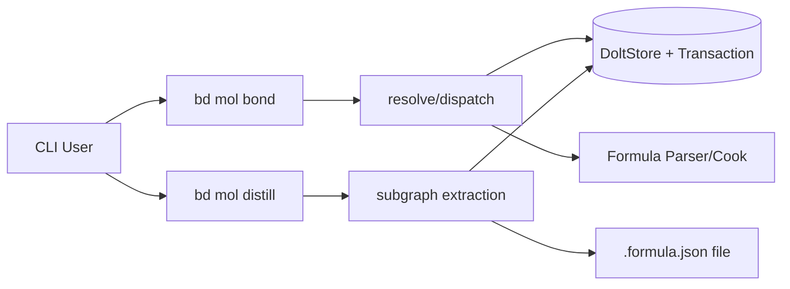

# molecule_composition_and_extraction

`molecule_composition_and_extraction` 是 CLI 分子系统里“最像化学实验台”的一层：`bond` 负责把两个工作单元（proto / molecule / formula）按规则组合成新的可执行结构，`distill` 负责把一个已经跑通的 epic 反向提炼成可复用 formula。前者解决“如何安全地拼装”，后者解决“如何把一次性经验沉淀为模板”。它存在的核心意义，是把**临场工作流演化**（先做事）和**模板化复用**（再抽象）接成闭环，而不是逼团队一开始就写完美模板。

## 架构总览

这张图里有两个并列入口：

- `bd mol bond`：组合路径，偏“写数据库 + 依赖编排”。
- `bd mol distill`：提炼路径，偏“读子图 + 生成文件”。

它们共享同一批底层能力：

1. **ID 与实体解析**：例如 `utils.ResolvePartialID`。
2. **子图抽取能力**：例如 `loadTemplateSubgraph`。
3. **公式能力**：加载 formula（`formula.NewParser().LoadByName`）或生成 formula（`formula.Formula`）。
4. **存储与事务能力**：`dolt.DoltStore` + `storage.Transaction`。

可以把这个模块理解为“分子系统的双向变压器”：
- 正向（bond）：把模板/实例变成更大执行单元；
- 反向（distill）：把执行单元变回模板。

---

## 1) 这个模块解决什么问题？（Problem Space）

### 如果没有它，会怎样？

团队会面临两种重复劳动：

- **组合劳动**：每次都手工判断“输入是公式名还是 issue ID？是 proto 还是 molecule？需要 clone 还是只加依赖？”
- **沉淀劳动**：每次都手工把一个成功 epic 转成模板，容易漏掉依赖、变量化不一致、命名混乱。

久而久之会造成：
- 组合语义不统一（parallel / sequential 在不同命令里含义漂移）；
- 中间态污染（先生成后挂接失败，留下孤儿 issue）；
- 知识不能稳定复用（经验留在人脑里，不在 formula 文件里）。

`molecule_composition_and_extraction` 的价值就在于：
**把“组合”与“提炼”两端都做成受约束、可预测、可脚本化的标准流程。**

---

## 2) 心智模型（Mental Model）

推荐新同学用“**装配线 + 蒸馏塔**”来记：

- `bond` 是装配线：先识别物料类型，再按工艺路线拼装。
- `distill` 是蒸馏塔：把复杂混合物（真实 epic 子图）提纯成标准配方（formula）。

关键抽象只有三个：

1. **操作数归一化**：不管输入来源，最终都尽量归到 `TemplateSubgraph` + root issue。
2. **关系语义映射**：`bondType`（`sequential` / `parallel` / `conditional`）最终要落到 `types.DependencyType`。
3. **模板参数化**：把具体文本替换成 `{{var}}`，并生成 `formula.VarDef`。

掌握这三点，你读这两个命令的代码会非常顺。

---

## 3) 关键数据流（End-to-End）

### A. `bd mol bond` 主链路

1. 命令入口 `runMolBond` 读取 flags（`--type`, `--var`, `--ephemeral`, `--pour`, `--ref`, `--dry-run`）。
2. 校验关键约束：
   - `--ephemeral` 与 `--pour` 互斥；
   - `bondType` 必须属于 `types.BondTypeSequential|Parallel|Conditional`。
3. 解析两个操作数：
   - dry-run：`resolveOrDescribe`（只判断，不 cook、不写库）；
   - execute：`resolveOrCookToSubgraph`（issue 走加载，formula 走 inline cook）。
4. 根据 `aIsProto/bIsProto` 四路分发：
   - proto+proto → `bondProtoProto`
   - proto+mol / mol+proto → `bondProtoMolWithSubgraph`（或对称封装）
   - mol+mol → `bondMolMol`
5. 在写入路径中通过事务能力（`transact` + `storage.Transaction`）落库依赖/标签/issue。
6. 返回统一 `BondResult`（支持 JSON 与人类输出）。

### B. `bd mol distill` 主链路

1. 命令入口 `runMolDistill` 读取 flags（`--var`, `--dry-run`, `--output`）。
2. `utils.ResolvePartialID` 解析 epic ID。
3. `loadTemplateSubgraph` 拉取 epic 子图。
4. 可选变量解析：`parseDistillVar` + `collectSubgraphText` 生成替换表。
5. `subgraphToFormula` 将子图转换为 `formula.Formula`：
   - root -> formula 元信息；
   - child issue -> `formula.Step`；
   - dependency -> `depends_on`；
   - 替换文本 -> `{{var}}` + `VarDef`。
6. 选择输出路径（`--output` 或 `findWritableFormulaDir`），写 `<name>.formula.json`。
7. 返回 `DistillResult`。

---

## 4) 关键设计取舍（Why these choices）

### 取舍一：单命令多态分发 vs 拆成多个子命令

- 现状选择：`bd mol bond` 单入口，多态分发。
- 优点：用户心智简单；解析和事务策略统一。
- 代价：`runMolBond` 控制面较重，后续扩展要谨慎保持分支一致性。

### 取舍二：formula inline cook（内存） vs 先落库再引用

- 现状选择：执行态可直接 cook 到内存子图。
- 优点：避免中间 proto 污染数据库。
- 代价：排错时没有持久化中间实体可回看。

### 取舍三：可用性优先的变量识别 vs 严格语法

- `distill` 中 `parseDistillVar` 支持双写法并做启发式判断。
- 优点：CLI 体验好，降低误用门槛。
- 代价：在文本重复/歧义场景，猜测可能偏离用户意图。

### 取舍四：一致性优先（原子挂接） vs 更松耦合流程

- `bond` 在 proto→molecule 路径里强调“spawn + attach”同事务。
- 优点：避免半成功状态。
- 代价：实现层耦合更紧，扩展时要维护事务边界。

---

## 5) 新贡献者需要注意的隐式契约与坑

1. **proto 判定信号不止一个**：既有 label 语义（`isProto`），也有 cooked/模板语义（执行分派中）。改判定规则时要覆盖 dry-run 与执行态一致性。
2. **依赖类型是语义落地点**：`bondType` 最终靠 `types.DependencyType` 承载；若下游调度对依赖类型解释变化，会直接改变运行行为。
3. **变量替换是字符串级别**：`distill` 的替换非 AST 级，可能受子串重叠与 map 迭代顺序影响。
4. **命名冲突风险**：`subgraphToFormula` 的 step ID 来源于标题清洗，缺少强去重会带来可读性/引用风险。
5. **文件输出默认可覆盖**：扩展时若引入防覆盖策略，需要兼容现有自动化脚本行为。

---

## 子模块说明（已生成详细文档）

### 1) `bond_polymorphic_orchestration`

聚焦 `cmd/bd/mol_bond.go` 的多态编排与事务写入语义，详细解释四类操作数组合如何分发、`bondType` 如何映射依赖类型、为何要强调原子挂接，以及 phase（`--ephemeral` / `--pour`）与动态 child ref（`--ref`）的设计含义。

详见：[bond_polymorphic_orchestration](bond_polymorphic_orchestration.md)

### 2) `distill_reverse_template_extraction`

聚焦 `cmd/bd/mol_distill.go` 的“反向模板提炼”流程，详细解释子图到 formula 的投影规则、变量占位提取策略、输出目录探测与落盘行为，以及启发式变量解析带来的可用性/准确性权衡。

详见：[distill_reverse_template_extraction](distill_reverse_template_extraction.md)

---

## 跨模块依赖与协作关系

这个模块在系统里的位置是“CLI 分子层中的编排/转换边界层”，上接命令树，下接存储、公式与类型系统。

- 与 [CLI Molecule Commands](CLI Molecule Commands.md)：命令归属与注册上下文。
- 与 [Formula Engine](Formula Engine.md)、[formula_loading_and_resolution](formula_loading_and_resolution.md)：formula 的加载、解析、模型定义。
- 与 [Storage Interfaces](Storage Interfaces.md)、[Dolt Storage Backend](Dolt Storage Backend.md)：事务、读取、依赖落库。
- 与 [Core Domain Types](Core Domain Types.md)、[issue_domain_model](issue_domain_model.md)：`Issue`、`Dependency`、`BondType`/`DependencyType` 等语义基础。
- 与 [molecule_progress_and_dispatch](molecule_progress_and_dispatch.md)、[molecule_lifecycle_cleanup](molecule_lifecycle_cleanup.md)：共同构成 molecule 命令族的“创建/组合/清理”生命周期。

当这些邻接模块的契约发生变化（尤其是 dependency 语义、formula schema、subgraph 加载规则）时，这个模块通常是最先暴露行为变化的地方。
