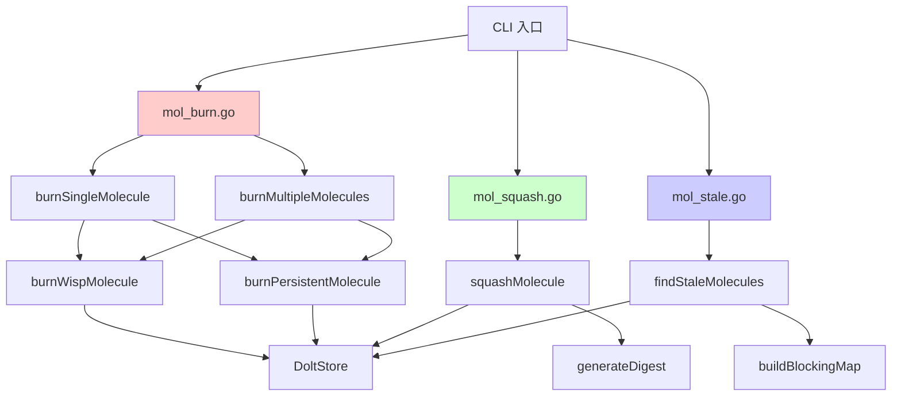

# Molecule Lifecycle Cleanup 模块深度解析

## 问题空间与模块定位

在复杂的工作流管理系统中，molecules（分子）作为工作单元的组合容器，会经历从创建到完成的完整生命周期。这个生命周期结束后，我们面临两个关键问题：

1. **临时数据清理**：当使用 wisps（短暂性 issue）进行快速迭代或实验时，完成后需要清理这些临时数据，避免污染持久存储
2. **工作成果归档**：对于已完成的 molecules，我们需要保留其执行历史的摘要，但不必保留所有中间步骤的完整细节
3. **状态一致性**：确保所有子任务完成后，父级 molecule 能被正确关闭，避免工作流"卡住"

这个模块就是专门解决这些问题的——它提供了三种核心操作：
- **burn**：彻底删除 molecule，不保留任何痕迹
- **squash**：将 molecule 的执行历史压缩成一个摘要（digest），同时清理临时数据
- **stale**：检测已完成但未关闭的 molecules

## 核心心智模型

把这个模块想象成**工作流的"垃圾收集器和档案管理员"**：

- **Burn** 就像碎纸机——把不需要的文件彻底销毁，不留痕迹
- **Squash** 就像档案管理员——把一叠工作记录整理成一份摘要报告，存入永久档案，然后把原始草稿销毁
- **Stale** 就像质检员——检查哪些项目已经完成但还没有"签收"

关键区分在于：
- **Wisp（短暂性）** vs **Mol（持久性）**：Wisp 是实验性、临时性的工作单元；Mol 是需要持久化的正式工作
- **有痕删除**（squash） vs **无痕删除**（burn）：取决于是否需要保留工作成果的记录

## 架构概览



### 数据流向

#### Burn 操作流程：
1. 解析 molecule ID 并验证
2. 加载 molecule 的完整子图
3. 根据 `Ephemeral` 标志区分处理：
   - **Wisp**：直接删除所有相关 issue
   - **Mol**：级联删除并同步到远程
4. 返回删除结果统计

#### Squash 操作流程：
1. 加载 molecule 子图
2. 筛选出 ephemeral 子 issue
3. 生成摘要 digest（或使用外部提供的摘要）
4. 在事务中：
   - 创建永久 digest issue
   - 建立父子关系
   - 删除原始子 issue（可选）
   - 关闭根 issue（如果是 wisp）
5. 返回 squash 结果

#### Stale 检测流程：
1. 查询所有符合条件的 epics
2. 检查子任务完成情况
3. 构建阻塞关系图
4. 应用过滤条件（blocking/unassigned/all）
5. 返回 stale molecules 列表

## 核心设计决策

### 1. 事务原子性（Squash 操作）

**决策**：将 digest 创建、子 issue 删除和根 issue 关闭放在单个事务中执行

```go
// 所有 squash 操作在单个事务中保证原子性
err := transact(ctx, s, fmt.Sprintf("bd: squash molecule %s", root.ID), func(tx storage.Transaction) error {
    // 创建 digest
    // 链接关系
    // 删除子 issue
    // 关闭根 issue
})
```

**权衡分析**：
- ✅ **一致性**：要么全部成功，要么全部回滚，避免部分完成的状态
- ✅ **可恢复性**：失败时数据库保持一致状态
- ⚠️ **性能开销**：事务持有锁的时间更长，可能影响并发
- **为什么这样设计**：squash 是一个"复合"操作，中间状态没有意义——要么完整归档，要么保持原样。原子性在这里比并发性能更重要。

### 2. Wisp vs Mol 的差异化处理

**决策**：根据 `Ephemeral` 标志采用完全不同的删除策略

**Wisp 处理**：
- 直接删除，不创建 digest
- 可以批量高效删除
- 不会同步到远程（因为是临时的）

**Mol 处理**：
- 级联删除整个子图
- 需要同步到远程
- 单个处理（因为需要加载子图）

**权衡分析**：
- ✅ **灵活性**：支持临时实验和正式工作两种场景
- ✅ **性能**：Wisp 可以批量删除，效率高
- ⚠️ **复杂度**：需要维护两套逻辑
- **为什么这样设计**：这是"为常用路径优化"的典型案例——80% 的删除操作是清理临时 wisps，应该快速；而 20% 的正式 molecules 需要更谨慎的处理。

### 3. 外部摘要注入（Agent 集成）

**决策**：允许通过 `--summary` 参数提供外部生成的摘要，而不是强制内部生成

```go
// 使用 agent 提供的摘要（如果有），否则生成基础摘要
var digestContent string
if summary != "" {
    digestContent = summary
} else {
    digestContent = generateDigest(root, children)
}
```

**权衡分析**：
- ✅ **关注点分离**：bd 保持为纯工具，AI 摘要由外部 agent 负责
- ✅ **可扩展性**：可以使用不同的 AI 模型生成摘要
- ⚠️ **责任边界**：需要确保外部摘要的质量
- **为什么这样设计**：这是"机制与策略分离"原则的体现——bd 提供 squashing 的机制，而摘要质量的策略由外部 agent 决定。

### 4. Stale 检测的阻塞关系映射

**决策**：构建完整的阻塞关系图，而不是仅检查子任务完成状态

```go
// 构建 issue ID → 它阻塞的 issues 列表的映射
func buildBlockingMap(blockedIssues []*types.BlockedIssue) map[string][]string {
    result := make(map[string][]string)
    for _, blocked := range blockedIssues {
        for _, blockerID := range blocked.BlockedBy {
            result[blockerID] = append(result[blockerID], blocked.ID)
        }
    }
    return result
}
```

**权衡分析**：
- ✅ **实用性**：优先显示阻塞其他工作的 stale molecules
- ✅ **可操作性**：直接给出关闭命令建议
- ⚠️ **计算开销**：需要额外查询和构建映射
- **为什么这样设计**：不是所有 stale molecules 都同等重要——阻塞其他工作的那些应该优先处理。这是"优先级排序"的设计决策。

## 核心组件详解

### BurnResult / BatchBurnResult

**职责**：记录 burn 操作的结果，支持单个和批量操作

```go
type BurnResult struct {
    MoleculeID   string   // 被 burn 的 molecule ID
    DeletedIDs   []string // 实际删除的 issue ID 列表
    DeletedCount int      // 删除总数
}

type BatchBurnResult struct {
    Results      []BurnResult // 每个 molecule 的结果
    TotalDeleted int          // 总删除数
    FailedCount  int          // 失败数
}
```

**设计意图**：
- 支持 JSON 输出，便于脚本集成
- 区分成功和失败，允许部分成功
- 提供详细的删除列表，便于审计

### SquashResult

**职责**：记录 squash 操作的完整结果

```go
type SquashResult struct {
    MoleculeID    string   // 原始 molecule ID
    DigestID      string   // 新创建的 digest ID
    SquashedIDs   []string // 被压缩的 issue 列表
    SquashedCount int      // 压缩数量
    DeletedCount  int      // 删除数量
    KeptChildren  bool     // 是否保留了子 issue
    WispSquash    bool     // 是否是 wisp→digest 的压缩
}
```

**设计亮点**：
- `WispSquash` 标志区分两种不同的 squash 场景
- `KeptChildren` 记录操作配置，便于重现
- 完整的 ID 追踪，支持从 digest 回溯到原始工作

### StaleMolecule / StaleResult

**职责**：表示 stale molecule 及其影响

```go
type StaleMolecule struct {
    ID             string   // molecule ID
    Title          string   // 标题
    TotalChildren  int      // 总子任务数
    ClosedChildren int      // 已完成子任务数
    Assignee       string   // 负责人
    BlockingIssues []string // 被它阻塞的 issues
    BlockingCount  int      // 阻塞数量
}
```

**设计意图**：
- 包含足够的上下文信息，无需额外查询
- `BlockingIssues` 列表让用户立即看到影响范围
- 进度信息（`ClosedChildren/TotalChildren`）一目了然

## 依赖关系分析

### 关键依赖

1. **[Dolt Storage Backend](dolt_storage_backend.md)**：所有操作的基础数据存储
   - `GetIssue()`：加载 molecule 信息
   - `DeleteIssue()`：执行删除操作
   - `GetEpicsEligibleForClosure()`：stale 检测的核心查询
   - `GetBlockedIssues()`：构建阻塞关系图

2. **[Core Domain Types](core_domain_types.md)**：核心数据模型
   - `Issue.Ephemeral`：区分 wisp 和 mol 的关键字段
   - `Issue.Status`：判断完成状态
   - `Issue.ID`：唯一标识

3. **[Storage Interfaces](storage_interfaces.md)**：保证 squash 操作的原子性
   - `Transaction` 接口

### 被依赖情况

这个模块主要被 [CLI Molecule Commands](cli_molecule_commands.md) 层直接调用，是一个"终端"模块——它不被其他核心模块依赖，而是作为用户操作的入口点。

## 使用指南与最佳实践

### 何时使用 Burn vs Squash

| 场景 | 推荐操作 | 理由 |
|------|---------|------|
| 实验性工作，不需要记录 | `burn` | 快速清理，不留痕迹 |
| 测试/调试 molecules | `burn` | 避免污染历史记录 |
| 正式工作流执行完成 | `squash` | 保留摘要，便于追溯 |
| Agent 执行的自动化工作 | `squash --summary "..."` | 保留智能摘要 |
| 失败的 patrol 循环 | `burn` | 清理无效工作 |

### 常见陷阱

1. **误用 Burn 处理正式工作**
   - 风险：永久丢失工作记录
   - 规避：先用 `--dry-run` 预览，确认后再执行

2. **忘记 Squash 时的 `--keep-children`**
   - 风险：意外删除需要保留的子 issue
   - 规避：默认行为是删除，保留需要显式指定

3. **忽略 Stale 检测的 `--blocking` 过滤**
   - 风险：被大量不重要的 stale molecules 淹没
   - 规避：优先处理 `--blocking` 的那些

### 新贡献者注意事项

- 任何涉及删除/关闭的改动，必须保持 `--dry-run` 与真实执行语义一致。
- `mol burn` 的 persistent 路径依赖 `loadTemplateSubgraph` 完整性；子图加载失败会导致部分跳过。
- `mol stale` 的 blocking 统计来自 `BlockedIssue.BlockedBy` 展开，若上游 blocked 计算变更，这里的判断会跟着漂移。

### 扩展点

1. **自定义 Digest 生成**
   - 当前：简单拼接或外部注入
   - 扩展：可以实现更智能的摘要生成策略

2. **Stale 检测的自定义规则**
   - 当前：基于子任务完成状态
   - 扩展：可以添加时间-based 的 staleness 判定

3. **Burn 的安全策略**
   - 当前：仅 `--force` 跳过确认
   - 扩展：可以添加基于标签或类型的保护机制

## 总结

Molecule Lifecycle Cleanup 模块是工作流管理系统的"清道夫"，它通过三个核心操作解决了工作流生命周期结束后的清理和归档问题：

- **Burn**：快速无痕删除，适用于临时工作
- **Squash**：智能归档，保留摘要的同时清理细节
- **Stale**：状态一致性检查，确保工作流完整关闭

这个模块的设计体现了几个关键原则：
1. **场景差异化**：对临时和正式工作采用不同策略
2. **事务安全**：关键操作保证原子性
3. **关注点分离**：工具与 AI 摘要生成解耦
4. **优先级感知**：Stale 检测优先显示阻塞工作的项目

对于新贡献者，理解这个模块的关键是把握 wisp/mol 的区别，以及事务原子性在 squash 操作中的重要性。
