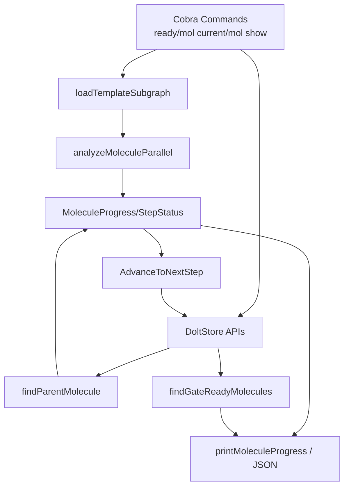

# molecule_progress_and_dispatch

`molecule_progress_and_dispatch` 这个模块（对应 `cmd/bd/mol_current.go`、`cmd/bd/mol_ready_gated.go`、`cmd/bd/ready.go`、`cmd/bd/mol_show.go` 中的一组核心结构与流程）本质上是在做一件很“调度系统”式的工作：把一个分子（molecule）里大量步骤的**真实可执行状态**算清楚，然后把“下一步该做什么”以人类和自动化都能消费的方式输出。它存在的原因不是“展示列表”这么简单，而是为了避免团队在复杂依赖图里靠猜测推进工作——尤其是 gate、hook、ephemeral（wisp）和并行步骤混在一起时，朴素的“按 status 过滤”会频繁给出错误结论。

## 模块要解决的问题（Why）

在分子工作流里，`open` 不等于可做，`closed` 也不总是意味着可以自动推进。现实问题包括：

- 步骤间有 `DepBlocks` / `DepConditionalBlocks` / `DepWaitsFor` / `DepParentChild` 等多种关系。
- 有些步骤是 gate 类型，关闭后会“解锁”别的步骤，但解锁后还要判断是否已被人 hook。
- 大分子（>100 steps）如果直接全量渲染，会拖慢查询且淹没关键信息。
- `GetReadyWork` 在某些场景会排除 ephemeral issue；而 wisp 分子步骤恰好就是 ephemeral，这会导致“明明能做却看不到”。

所以模块的核心价值是：把“状态字段”升级成“可执行语义”。它不是简单查询层，而是一个**轻量调度与派发决策层**。

## 心智模型（Mental Model）

可以把它想象成一个“小型机场塔台”：

- `mol show --parallel` 像空域雷达：告诉你哪些航班（步骤）互不冲突，可以并行起飞。
- `mol current` 像单条航线追踪：你现在在哪个航段、下一段是否可执行。
- `ready --mol` 像某条航线的待起飞队列。
- `ready --gated` 像“闸门恢复调度器”：某个闸门条件满足后，找出可重新派发、且尚未被占用的分子。
- `AdvanceToNextStep` 像自动衔接控制：上一步落地后，尝试把下一步推入 `in_progress`。

这套模型里最关键的抽象不是 Issue 本身，而是：

1. **分子子图（subgraph）**：根节点 + 子步骤 + 依赖边。
2. **并行分析（`ParallelAnalysis` / `ParallelInfo`）**：把依赖图转换成“ready / blocked / can_parallel / group”。
3. **进度视图（`MoleculeProgress` / `StepStatus`）**：面向执行者的线性叙述（done/current/ready/blocked/pending）。
4. **派发候选（`GatedMolecule`）**：面向调度器的恢复任务列表。

## 架构与数据流



从调用关系看，这个模块在 CLI 层扮演**编排器（orchestrator）**：

- 上游是 Cobra 命令入口（`readyCmd`、`molCurrentCmd`、`molShowCmd`、`molReadyGatedCmd`）。
- 下游主要是 `*dolt.DoltStore` 的查询与更新能力（如 `SearchIssues`、`GetReadyWork`、`GetDependencyRecords`、`GetDependents`、`GetIssue`、`UpdateIssue`、`GetMoleculeProgress`）。
- 中间通过 `loadTemplateSubgraph` + `analyzeMoleculeParallel` 把原始 issue/dependency 数据变成可执行语义，再投影为不同输出结构（人类文本或 JSON）。

热点路径有两条：

第一条是**分子内 readiness 计算链路**：`loadTemplateSubgraph` → `analyzeMoleculeParallel` → `StepStatus` / `MoleculeReadyStep`。这是 `mol current`、`ready --mol`、`mol show --parallel` 共用的语义核心。

第二条是**gate 恢复发现链路**：`findGateReadyMolecules` 先查 closed gate，再用 `GetDependents` + `GetReadyWork(IncludeMolSteps:true)` 验证依赖步骤是否可执行，再排除已 hooked 分子。这条链路直接服务自动 dispatch 场景。

## 核心组件深潜

### `StepStatus`

`StepStatus` 是单步骤的执行态投影：`Status`（done/current/ready/blocked/pending）+ `IsCurrent` + `Issue` 指针。它的设计意图是把底层 `types.Status*` 与依赖关系推导后的状态合并到一个 UI/API 友好模型里。换句话说，它承载的是“执行语义状态”，不只是存储状态。

### `MoleculeProgress`

`MoleculeProgress` 是 `mol current` 的核心输出模型，聚合了：分子身份（ID/标题/assignee）、游标（`CurrentStep`/`NextStep`）、全步骤状态以及 `Completed/Total`。它的价值在于把“图结构”压缩成“人类能快速决策的线性摘要”。

### `getMoleculeProgress(ctx, s, moleculeID)`

这是进度计算主入口。流程是：

1. 通过 `loadTemplateSubgraph` 取分子子图。
2. 初始化 `MoleculeProgress`，`Total = len(subgraph.Issues)-1`（排除 root）。
3. 调 `analyzeMoleculeParallel(subgraph)` 计算 ready 集合。
4. 遍历步骤生成 `StepStatus`：closed→done，in_progress→current，blocked→blocked，其余依据 readyIDs 判定 ready/pending。
5. 用 `sortStepsByDependencyOrder` 做依赖友好的排序。
6. 在无 current 情况下补 `NextStep`。

一个非直观点是：这里明确不用 `GetReadyWork` 来算分子步骤 ready，而是用并行分析。代码注释写得很清楚：`GetReadyWork` 会排除 ephemeral，而 wisp 步骤是 ephemeral。这个选择偏向**语义正确性**，牺牲了部分统一性（ready 语义有两套入口），但在当前业务下是合理的。

### `findParentMolecule(ctx, s, issueID)`

这个函数沿 `DepParentChild` 向上追溯父链，直到根；如果没有父，再判断当前节点是不是分子根（有 `BeadsTemplateLabel` 或 `IssueType == epic`）。

它是多个流程的共享“归属判定器”：`findInProgressMolecules`、`findHookedMolecules`、`findGateReadyMolecules`、`AdvanceToNextStep` 都依赖它。函数里用 `visited` 防止循环，体现了对脏数据/环依赖的防御式设计。

### `findInProgressMolecules(ctx, s, agent)` 与 `findHookedMolecules(ctx, s, agent)`

`findInProgressMolecules` 是 `mol current` 的主发现路径：先查 `status=in_progress`（可按 assignee 过滤），再对每个 issue 找父分子并去重加载进度。

`findHookedMolecules` 是 fallback：当没有 in_progress 时，改查 `status=hooked`，兼容两种情况：

- hooked issue 本身就是分子（`IssueType == epic`）；
- hooked issue 通过 `DepBlocks` 指向某个分子（epic 或带 template label）。

这个“双阶段发现”是典型的产品语义补丁：用更复杂查询换更符合操作者直觉的“我当前相关分子”视图。

### `sortStepsByDependencyOrder(steps, subgraph)`

它不是完整拓扑排序，只是按“分子内 blocking 依赖数量”做稳定排序。设计权衡很明显：

- 优点：实现简单、稳定、低成本，足够做进度展示。
- 代价：只按入度近似，不保证严格执行序。

所以它更像“可读性排序”，不是调度器级顺序保证。

### `AdvanceToNextStep(ctx, s, closedStepID, autoClaim, actorName)` 与 `ContinueResult`

这是闭环推进接口：给定刚关闭的步骤，尝试找下一个 ready 步骤并可选自动 claim（`UpdateIssue` 把 status 设为 `in_progress`）。

返回 `nil, nil` 的语义很重要：表示“该步骤不在任何分子里”，不是错误。新贡献者很容易把它当异常处理错。

`ContinueResult` 里 `MolComplete`、`AutoAdvanced`、`NextStep` 把三类结果显式化：已完结、可推进未自动、已自动推进。

### `parseRange` / `filterStepsByRange` / `printLargeMoleculeSummary`

这组函数对应大分子可用性策略：默认不把超大分子全量展开（阈值 `LargeMoleculeThreshold=100`），而是引导用户用 `--limit` / `--range`。这是一种 CLI 人机工程优化，也降低了大图遍历与输出成本。

### `ParallelInfo` / `ParallelAnalysis`

这两个结构是并行语义中台：

- `ParallelInfo` 描述单步：是否 ready、谁阻塞它、它阻塞谁、属于哪个 parallel group、可并行伙伴。
- `ParallelAnalysis` 描述全局：ready 数、并行组映射、每步信息。

它们被 `mol show --parallel` 直接展示，也被 `runMoleculeReady` / `getMoleculeProgress` 复用，避免不同命令重复实现 ready 判定。

### `analyzeMoleculeParallel(subgraph)`

这是整个模块最关键的推理引擎。核心机制：

1. 建立 `blockedBy` / `blocks` 双向图。
2. 处理依赖类型：
   - `DepBlocks`、`DepConditionalBlocks` 直接建边；
   - `DepWaitsFor` 结合 `DepParentChild` 和 `ParseWaitsForGateMetadata`，按 `WaitsForAnyChildren` / all-children 规则把“未关闭子节点”映射成 gate 的阻塞源。
3. 计算每个步骤的 open blockers，得到 `IsReady`。
4. 通过 `calculateBlockingDepths` 算“阻塞深度”。
5. 同深度下做并行分组（union-find），条件是双方不存在直接相互阻塞关系。

注意：代码注释提到“directly or transitively”，但当前分组判定只检查直接关系（`blocks`/`blockedBy` 的 pairwise 检查），并未显式做传递闭包。这是一个实现与理想定义之间的张力点。

### `findGateReadyMolecules(ctx, s)`、`GatedMolecule`、`GatedReadyOutput`

这是 gate-resume 派发入口。流程很清晰：

1. 查 closed gate（`IssueType("gate") + StatusClosed`）。
2. 查 ready work（`IncludeMolSteps:true`）构建 `readyIDs`。
3. 查 hooked issues 并映射到 `hookedMolecules`（包含 issue 自身与其父分子）。
4. 对每个 gate 查 `GetDependents(gate.ID)`，找“曾被 gate 阻塞、现在 ready”的步骤。
5. 回溯父分子，排除已 hooked，去重输出 `GatedMolecule`。

它的角色是“恢复派发候选发现器”，不是执行派发器本身。

### `runMoleculeReady(_ , molIDArg)`、`MoleculeReadyStep`、`MoleculeReadyOutput`

`ready --mol` 是单分子 ready 视图：解析分子、分析并行、筛出 ready 步骤并附带并行信息。JSON 输出里包含 `ParallelGroups`，适合自动化按组并发调度。

## 依赖分析：它调用谁，谁调用它

这个模块主要依赖：

- [Dolt Storage Backend](Dolt%20Storage%20Backend.md)（具体是 `*dolt.DoltStore` 查询与更新接口）。
- [Core Domain Types](Core%20Domain%20Types.md)（`types.Issue`、`IssueFilter`、`WorkFilter`、依赖类型、状态枚举）。
- [UI Utilities](UI%20Utilities.md)（`ui.Render*` 输出渲染）。
- [Molecules](Molecules.md)（分子加载语义，`loadTemplateSubgraph` 所在上下文）。
- [CLI Molecule Commands](CLI%20Molecule%20Commands.md)（命令层组织与用户入口）。

调用它的主要是 CLI 命令分支：

- `bd mol current` 调 `getMoleculeProgress`、`findInProgressMolecules`、`findHookedMolecules`。
- `bd ready --mol` 调 `runMoleculeReady`。
- `bd ready --gated` 调 `runMolReadyGated`→`findGateReadyMolecules`。
- 关闭步骤后的流程可调用 `AdvanceToNextStep` + `PrintContinueResult` 做自动衔接。

关键数据契约包括：

- `findParentMolecule` 默认依赖 `DepParentChild` 正确建模父子关系。
- 分子识别依赖 `IssueType==epic` 或 `BeadsTemplateLabel`。
- 并行/ready 语义依赖依赖边类型的稳定定义（特别是 `DepWaitsFor` metadata）。

## 设计决策与权衡

第一，模块选择“命令侧编排 + store 查询”而非单独服务层。这让 CLI 功能迭代很快，但也使部分业务语义（例如分子识别、hooked fallback）散落在命令代码里，复用边界不够清晰。

第二，ready 语义采用“双轨制”：全局 `GetReadyWork` 与分子内 `analyzeMoleculeParallel` 并存。好处是可覆盖 ephemeral/wisp 场景；代价是语义漂移风险，后续改动时必须同步校验两条路径的一致性。

第三，大分子采用阈值降级（summary 优先）。这是明显的性能/可读性优先策略，牺牲“默认全量透明性”，但符合交互终端实际使用。

第四，并行组算法追求可解释与低复杂度（深度分层 + 并查集），并未做昂贵的全图传递冲突分析。对 CLI 展示是务实选择；若用于强一致调度，需要补充更严格判定。

## 使用方式与示例

```bash
# 查看当前分子进度（自动推断 agent）
bd mol current

# 指定分子，限制输出
bd mol current <molecule-id> --limit 50
bd mol current <molecule-id> --range 100-150

# 查看分子内 ready 步骤（含并行信息）
bd ready --mol <molecule-id>

# 发现 gate 关闭后可恢复派发的分子
bd ready --gated

# 查看并行分析树
bd mol show <molecule-id> --parallel
```

自动推进（代码调用）：

```go
result, err := AdvanceToNextStep(ctx, store, closedStepID, true, actorName)
if err != nil {
    // handle error
}
PrintContinueResult(result)
```

## 新贡献者要重点注意的坑

`AdvanceToNextStep` 返回 `nil, nil` 表示“非分子步骤”，不是失败；调用方必须区分这个语义。`parseRange` 是 1-based 输入，`filterStepsByRange` 内部才转 0-based，做分页扩展时别混淆。

`sortStepsByDependencyOrder` 不是拓扑排序，不能把输出顺序当成严格执行顺序。`analyzeMoleculeParallel` 的并行分组目前按直接关系判断，如果你要把它用于强约束调度，请先评估传递依赖误判风险。

`findHookedMolecules` 与 `findGateReadyMolecules` 都包含“best effort”行为（查询失败时继续），这对鲁棒性友好，但会导致静默漏报；做运维排障时要考虑这种降级路径。

大分子默认 summary 仅在非 JSON 且未显式请求 steps 时触发；如果你改了默认输出策略，记得同时检查人类输出与自动化 JSON 的契约稳定性。

## 参考模块

- [CLI Molecule Commands](CLI%20Molecule%20Commands.md)
- [Molecules](Molecules.md)
- [Dolt Storage Backend](Dolt%20Storage%20Backend.md)
- [Core Domain Types](Core%20Domain%20Types.md)
- [UI Utilities](UI%20Utilities.md)
