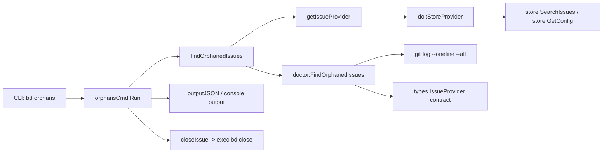

# orphan_detection_command

`orphan_detection_command`（对应 `cmd/bd/orphans.go`）解决的是一个很“工程化”的现实问题：**代码已经提交并且 commit message 里明确提到了某个 issue，但 issue 在数据库里还处于 open / in_progress**。这类“孤儿 issue”不会阻塞编译、也不会触发明显错误，却会持续污染待办池，误导排期和自动化决策。这个模块本质上是一个轻量编排层：把 Git 历史扫描能力（来自 doctor 包）和当前存储中的开放 issue 集合拼起来，给出可读/可机读结果，并可选择批量修复。

## 架构角色与数据流



从架构上看，它不是“检测算法核心”，而是一个 **CLI 入口 + 适配器 + 输出编排器**。核心检测逻辑在 `doctor.FindOrphanedIssues`；`orphans.go` 负责把当前 CLI 运行时的全局 `store` 适配成 `types.IssueProvider`，再把 doctor 的结果转换成本命令的输出模型 `orphanIssueOutput`。

可以把它想象成机场里的“值机柜台”：真正飞行（检测算法）由后端系统完成；柜台负责核验证件（provider 合约）、格式化登机牌（输出模型）、以及在用户确认后触发后续流程（`--fix` 调 `bd close`）。

## 这个模块在解决什么问题（以及为什么不能用朴素方案）

朴素方案通常是“扫一遍 git log，提取 `bd-xxx`，再看这些 issue 有没有关闭”。问题在于这会立即踩到三个坑。

第一，**前缀不一定是 `bd`**。系统允许配置 `issue_prefix`，所以解析 commit 里的 issue 引用必须依赖存储配置，而不是硬编码。这里通过 `IssueProvider.GetIssuePrefix()` 交给 provider 返回真实前缀。

第二，**“开放 issue 集合”不是单一状态**。在本模块中，`doltStoreProvider.GetOpenIssues` 明确拼接 `types.StatusOpen` 与 `types.StatusInProgress` 两次 `SearchIssues` 结果，契合接口注释“open or in_progress”。

第三，**检测逻辑需要复用**。`bd doctor` 和 `bd orphans` 都要识别孤儿 issue，如果各自实现一套 git 解析规则，长期必然漂移。当前设计把算法沉到 `doctor.FindOrphanedIssues`，命令层只做 orchestration。

## 心智模型：三层解耦

理解这个模块最有用的心智模型是“三层”。

第一层是 **数据源抽象层**：`types.IssueProvider`。它只关心“给我当前 open/in_progress 的 issue”和“给我 issue 前缀”。这层让检测逻辑不依赖具体存储类型。

第二层是 **检测引擎层**：`doctor.FindOrphanedIssues(gitPath, provider)`。它做三件事：检查 git 仓库、抓取开放 issue、扫描 `git log --oneline --all` 并用正则匹配 `(<prefix>-...)`，最后取每个 issue 最近期提交信息。

第三层是 **CLI 交互层**：`orphansCmd.Run`。负责参数读取（`--fix`、`--details`、`--json`）、排序展示、确认交互、以及修复动作触发。

这三层拆开后，算法可以独立测试，CLI 也能通过替换函数变量做注入测试（见下文）。

## 组件深潜

### `orphansCmd`（`*cobra.Command`）

这是命令入口，`Use: "orphans"`，在 `init()` 中通过 `rootCmd.AddCommand(orphansCmd)` 注册。`Run` 流程固定为：

1. `findOrphanedIssues(".")`
2. 根据 `jsonOutput` 走 JSON 或人类可读输出
3. 可选展示详情（`--details`）
4. 可选修复（`--fix`）并交互确认

一个关键设计点是 **确定性输出**：先 `sort.Slice` 按 `IssueID` 排序，避免 map / 扫描顺序引发结果抖动，这对 CI 比对和用户心智都很重要。

### `orphanIssueOutput`（struct）

这是命令自己的输出模型，不直接暴露 doctor 包里的 `OrphanIssue`。字段包括：

- `IssueID`
- `Title`
- `Status`
- `LatestCommit`
- `LatestCommitMessage`

`LatestCommit` 与 `LatestCommitMessage` 使用 `omitempty`，意味着没有 commit 命中的场景不会输出空字段，JSON 更干净，也利于下游工具判断“是否有证据链”。

### `doltStoreProvider`（struct + methods）

这是典型适配器，负责把全局 `store` 封装成 `types.IssueProvider`：

- `GetOpenIssues(ctx)`：分别查询 open 和 in_progress，再 `append` 合并。
- `GetIssuePrefix()`：读 `store.GetConfig(ctx, "issue_prefix")`，失败或空值时回退为 `"bd"`。

设计含义是：**检测算法并不知道也不关心 DoltStore**，它只依赖 provider contract。这样 `doctor.FindOrphanedIssues` 在测试里可以挂 mock provider。

### `getIssueProvider()`

当前实现非常直接：若全局 `store != nil`，返回 `&doltStoreProvider{}` 与空 cleanup；否则报错 `no database available`。这是一种“最小可用”的 provider 生命周期接口设计——先把“可能需要 cleanup”这个扩展点留出来，即便当前无资源释放动作。

### `findOrphanedIssues(path string)`

这是 orchestration 函数：

- 获取 provider
- `defer cleanup()`
- 调 `doctorFindOrphanedIssues(path, provider)`
- 将 `doctor.OrphanIssue` 映射为 `[]orphanIssueOutput`

其中 `doctorFindOrphanedIssues` 是一个可替换变量，默认绑定 `doctor.FindOrphanedIssues`。这让测试可以在不修改包依赖的情况下注入假实现。

### `closeIssueRunner` / `closeIssue(issueID string)`

`closeIssue` 只是委托给 `closeIssueRunner`。默认 runner 用 `exec.Command("bd", "close", issueID, "--reason", "Implemented")` 启动子进程。

这是一个很有意图的选择：它没有直接复用 `closeCmd` 的内部逻辑，而是走 CLI 边界。优点是行为与用户手工执行 `bd close` 一致（包括其内部校验/副作用路径）；代价是每个 issue 一次子进程启动，性能和可观测性都更粗粒度。

## 依赖与调用关系分析

从“谁调用它”看，主要入口是 Cobra 命令系统：`rootCmd` 在启动时组装子命令，用户执行 `bd orphans` 后触发 `orphansCmd.Run`。测试层面，`cmd/bd/orphans_test.go` 直接调用函数并通过变量替换验证行为。

从“它调用谁”看，关键依赖链是：

- `doctor.FindOrphanedIssues`：核心检测逻辑（在 `cmd/bd/doctor/git.go`）。
- 全局 `store`：通过 `SearchIssues` / `GetConfig` 提供 issue 数据与前缀配置。
- `outputJSON` / `FatalError` / `ui.Render*`：输出与错误管线。
- `exec.Command`：`--fix` 时触发 `bd close` 子进程。

最关键的数据契约是 [`IssueProvider`](provider_and_lock_contracts.md)（`GetOpenIssues(context.Context) ([]*Issue, error)` 与 `GetIssuePrefix() string`）。`doctor.FindOrphanedIssues` 完全通过这个契约取数据，因此调用方必须保证：

- `GetOpenIssues` 返回的是 open + in_progress 的语义集合；
- `GetIssuePrefix` 在未配置时返回默认 `bd`（接口注释也这样要求）。

## 数据流端到端追踪（一次典型执行）

执行 `bd orphans --details --fix` 时：

命令层先调用 `findOrphanedIssues(".")`，它拿到 `doltStoreProvider`。provider 用 `store.SearchIssues` 拉出 open 与 in_progress issue，并通过 `store.GetConfig("issue_prefix")` 提供前缀。随后 `doctor.FindOrphanedIssues` 在 git 目录跑 `git log --oneline --all`，根据前缀正则匹配 commit 文本中的 issue 引用，把命中的开放 issue 标为 orphan，并记录首个命中的 commit（因为日志是按新到旧，首个即“最新”）。结果回到命令层后被映射、排序、打印。若 `--fix` 且用户确认，命令逐个调用 `closeIssue`，而 `closeIssue` 启动 `bd close <id> --reason Implemented` 子进程完成收口。

## 设计取舍与非显然选择

一个核心取舍是 **复用 doctor 算法 vs 在命令内重写**。当前选择复用，牺牲了一点“命令自治性”，换来语义单一来源，减少未来规则漂移。

第二个取舍是 **接口抽象粒度**。`IssueProvider` 很薄，只暴露两件事；这让调用简单、mock 轻量，但也意味着如果未来 orphan 判定依赖更多字段（例如时间窗口、分支过滤），接口可能要扩展。

第三个取舍是 **修复路径走子进程**。这提高了与 `bd close` 行为一致性，但性能上是 N 个 issue 启 N 次进程；此外错误粒度也只能拿到子进程失败信息，难以直接复用内存内对象状态。

第四个取舍（来自 `doctor.FindOrphanedIssues`）是 **容错偏“静默”**：例如 provider 获取失败、git log 执行失败时返回空列表而非错误。这降低了命令失败率，但会把“无法检测”和“确实没有 orphan”在表现上混淆。命令层虽然包装了 error，但底层很多分支并不返回 error。

## 使用与扩展示例

常见使用：

```bash
bd orphans
bd orphans --details
bd orphans --json
bd orphans --fix
```

测试注入（现有模式）是通过替换包级函数变量：

```go
orig := doctorFindOrphanedIssues
doctorFindOrphanedIssues = func(path string, provider types.IssueProvider) ([]doctor.OrphanIssue, error) {
    // fake result
}
defer func() { doctorFindOrphanedIssues = orig }()
```

同理，修复动作也可替换：

```go
origRunner := closeIssueRunner
closeIssueRunner = func(issueID string) error { return nil }
defer func() { closeIssueRunner = origRunner }()
```

如果你要扩展判定规则，建议优先改 `doctor.FindOrphanedIssues`，保持 `bd doctor` 与 `bd orphans` 一致；`orphans.go` 只做输入适配和输出展示。

## 新贡献者最该注意的坑

第一，`findOrphanedIssues` 注释提到“尊重 `--db` 做跨仓检测”，但当前实现实际只检查全局 `store != nil`，并不在这里显式处理路径路由。不要只看注释，要看真实数据来源。

第二，`--fix` 不会走 in-process 的 `closeCmd`，而是 shell out 到 `bd close`。如果你在 `close` 命令里新增校验或交互，这里会自动受影响；反过来，这里也会继承 `close` 的失败模式。

第三，结果排序只发生在终端文本输出分支，JSON 分支保留原顺序。如果下游系统要求稳定 JSON 顺序，需在 JSON 分支也排序（当前未做）。

第四，`doctor.FindOrphanedIssues` 的正则匹配是基于 `(<prefix>-...)` 形式。提交信息如果不带括号格式（例如只写 `bd-123`）可能不会命中，这属于隐式提交规范契约。

## 参考链接

- [doctor_contracts_and_taxonomy](doctor_contracts_and_taxonomy.md)
- [provider_and_lock_contracts](provider_and_lock_contracts.md)
- [storage_contracts](storage_contracts.md)
- [command_entry_and_output_pipeline](command_entry_and_output_pipeline.md)
