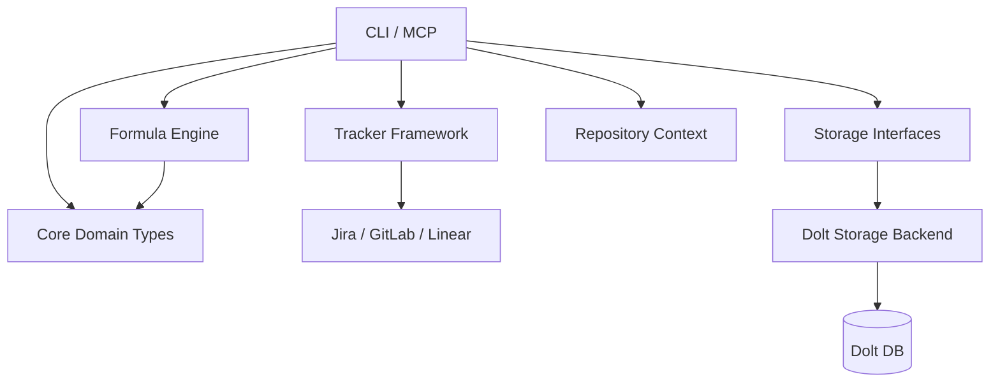

## 1. 项目愿景：什么是 Beads？

`beads` 是一个面向开发者和 AI 智能体的**版本化任务管理系统**。

如果说传统的 Jira 或 GitLab Issues 是“网页上的电子表格”，那么 `beads` 就是“代码化的任务流”。它将复杂的项目需求、任务依赖和执行步骤抽象为**分子（Molecules）**和**公式（Formulas）**。通过使用支持版本控制的数据库（Dolt），`beads` 允许任务像代码一样进行分支、合并和回溯，并能与主流的 Issue Tracker（如 Jira, GitLab, Linear）保持深度同步。

简而言之：**Beads 让项目管理变得像管理代码一样精确、可编程且对 AI 友好。**

---

## 2. 架构总览

`beads` 采用了典型的分层架构，并结合了插件化设计以支持多平台集成。

### 架构叙述
*   **入口层**：用户通过 `cmd/bd` 提供的命令行工具进行交互，或者通过 `integrations/beads-mcp` 让 AI 智能体（如 Claude）直接操作任务。
*   **逻辑层**：[Formula Engine](internal/formula) 负责解析工作流模板，将抽象的“配方”转化为具体的任务图；[Tracker Integration Framework](internal/tracker) 则作为外交官，处理与外部平台的数据交换。
*   **核心层**：[Core Domain Types](internal/types) 定义了全系统通用的语义，确保 CLI、引擎和插件对 `Issue` 或 `Dependency` 的理解完全一致。
*   **持久化层**：[Storage Interfaces](internal/storage) 定义了存储契约，而 [Dolt Storage Backend](internal/storage/dolt) 则是目前的核心实现，利用 Dolt 的特性提供 Git 风格的数据版本管理。

---

## 3. 核心设计决策

在构建 `beads` 时，我们做出了几个关键的架构选择：

*   **接口与实现分离 (Interface-Implementation Separation)**：
    我们定义了严格的 [Storage Interfaces](internal/storage)，而不是让业务逻辑直接依赖 SQL。这使得我们可以轻松地进行单元测试（Mocking），并为未来支持其他后端（如 SQLite 或 Postgres）留下了空间。
*   **领域驱动设计 (DDD)**：
    [Core Domain Types](internal/types) 是系统的“语义地基”。所有的校验逻辑（Validation）、哈希计算（Content Hash）都下沉到类型层，防止业务逻辑在不同模块间产生歧义。
*   **版本化数据语义 (Versioned Data Semantics)**：
    选择 [Dolt Storage Backend](internal/storage/dolt) 是为了让任务具备“可追溯性”。每一次 `bd` 命令的写入都会触发类似 Git 的 Commit，这为 AI 自动化的错误回滚和审计提供了天然的支持。
*   **插件化集成 (Plugin-based Integration)**：
    [Tracker Integration Framework](internal/tracker) 采用了适配器模式。无论是 [Jira Integration](internal/jira) 还是 [GitLab Integration](internal/gitlab)，都只需实现统一的 `IssueTracker` 接口，即可复用核心的冲突检测和同步引擎。

---

## 4. 模块指南

`beads` 的功能被拆分为多个职责明确的模块：

系统的语义基石位于 [Core Domain Types](internal/types)，它定义了什么是 `Issue`、什么是 `Dependency` 以及合法的状态机规则。为了保证数据在多端同步中的一致性，[Validation](internal/validation) 模块提供了严苛的入口质检，确保进入系统的每一条数据都符合模板规范。

在执行层面，[Formula Engine](internal/formula) 是系统的“建筑师”，它能将复杂的 YAML/TOML 模板编译成可执行的任务图。而 [CLI Molecule Commands](cmd/bd) 则负责编排这些任务的生命周期，包括任务的“聚合（Bond）”、“压缩（Squash）”和“销毁（Burn）”。

为了让 AI 更好地参与工作，[MCP Integration](integrations/beads-mcp) 模块将 Beads 的能力暴露给大模型，而 [Compaction](internal/compact) 模块则利用 AI 技术将冗长的执行记录提炼为高信息密度的摘要，优化存储并提升后续检索效率。

最后，底层的 [Beads Repository Context](internal/beads) 负责处理多仓库（Multi-repo）和工作区（Worktree）的定位，确保你在正确的目录下操作正确的数据。

---

## 5. 关键端到端流程

### 流程 A：从模板实例化复杂工作流 (Cooking a Formula)
1.  **解析**：用户执行 `bd cook`，[CLI Formula Commands](cmd/bd) 调用 [Formula Engine](internal/formula) 加载指定的公式文件。
2.  **转换**：引擎处理继承（Extends）和变量替换，生成一个逻辑上的任务子图。
3.  **持久化**：[Storage Interfaces](internal/storage) 开启一个事务，[Dolt Storage Backend](internal/storage/dolt) 将这一组相互关联的 `Issue` 和 `Dependency` 原子性地写入数据库。
4.  **同步**：如果配置了外部关联，[Tracker Integration Framework](internal/tracker) 会将新生成的任务推送到 Jira 或 GitLab。

### 流程 B：跨平台数据同步 (External Sync)
1.  **拉取**：[Tracker Integration Framework](internal/tracker) 触发 `Pull` 动作，调用 [GitLab Integration](internal/gitlab) 获取远程变更。
2.  **映射**：`FieldMapper` 将外部平台的标签（如 `priority::high`）转换为 Beads 内部的结构化字段。
3.  **冲突检测**：系统对比本地 Dolt 记录与远程快照，若两端均有修改，则根据 [Configuration](internal/config) 中定义的策略（如 `ours` 或 `theirs`）解决冲突。
4.  **落库**：更新后的数据通过 [Storage Interfaces](internal/storage) 写入，并生成一个新的 Dolt Commit。