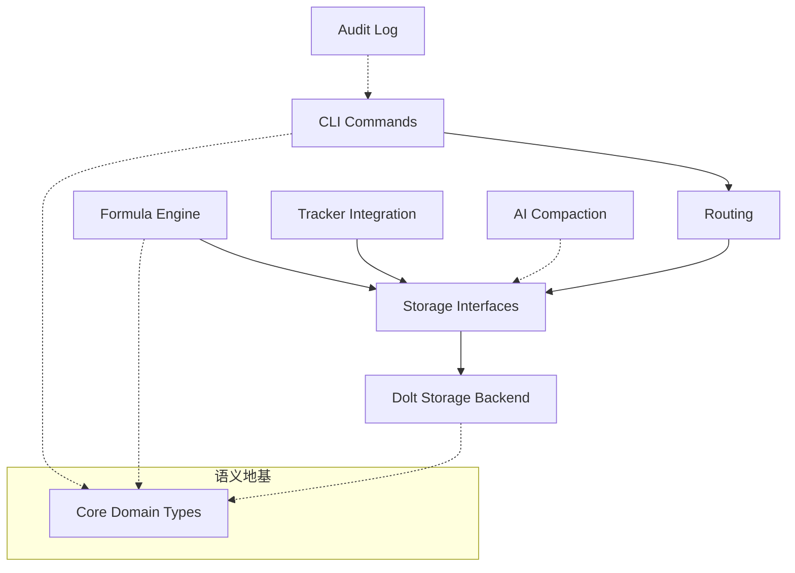

## 1. `beads` 是什么？

简单来说，`beads` 是一个**具备版本控制能力的、AI 原生的工单与工作流编排系统**。

在传统的开发流程中，代码是有版本的（Git），但工单（Issue）和任务状态通常是中心化且静态的。`beads` 改变了这一点：它将工单数据存储在支持分支、合并和克隆的数据库中（Dolt），使得工单可以像代码一样进行分支开发、离线操作和多仓库同步。同时，它内置了强大的公式引擎和 AI 摘要能力，旨在让 AI Agent 和人类开发者能够在一个统一、可追溯的语义环境下高效协作。

---

## 2. 架构一览

`beads` 采用了典型的分层架构，并结合了“端口与适配器”（六边形架构）模式来处理外部集成和存储后端。

### 架构叙述
- **语义地基**：[Core Domain Types](core_domain_types.md) 定义了系统中所有核心对象（如 `Issue`、`Dependency`）的结构和校验逻辑，确保全模块语言一致。
- **存储核心**：[Storage Interfaces](storage_interfaces.md) 定义了数据操作契约，而 [Dolt Storage Backend](dolt_storage_backend.md) 则是其实际的“版本化发动机”，负责 SQL 操作与 Git 语义的映射。
- **编排与集成**：[Formula Engine](formula_engine.md) 将工作流模板编译为可执行任务；[Tracker Integration Framework](tracker_integration_framework.md) 则负责与 GitLab、Jira、Linear 等外部平台同步。
- **智能治理**：[Compaction](compaction.md) 模块利用 LLM 对陈旧工单进行摘要压缩，[Audit](audit.md) 记录所有关键的 AI 交互事实。

---

## 3. 核心设计决策

在构建 `beads` 时，我们做出了几个关键的架构选择：

- **版本化存储 (Versioning as a First-class Citizen)**：我们选择 Dolt 作为主后端，因为它允许工单数据随代码一起分支（Branching）和合并（Merging），解决了多环境下的状态同步冲突。
- **接口驱动的存储抽象 (Interface-Driven Storage)**：通过 [Storage Interfaces](storage_interfaces.md) 隔离业务逻辑与底层数据库，这不仅便于单元测试，也为未来支持 SQLite 或其他后端留下了空间。
- **声明式工作流 (Declarative Workflows)**：工作流不是硬编码的，而是通过 [Formula Engine](formula_engine.md) 解析的 DSL。这使得复杂的依赖关系（如 `DepBlocks`、`DepWaitsFor`）可以被静态校验和动态推导。
- **AI 辅助与人类审计的平衡**：系统允许 AI 参与工单治理（如 [Compaction](compaction.md)），但所有 AI 的决策和调用都必须经过 [Audit](audit.md) 模块记录，确保过程透明可追溯。

---

## 4. 模块指南

`beads` 的功能被划分为多个职责明确的模块：

### 基础与存储层
一切始于 [Core Domain Types](core_domain_types.md)，它定义了工单的“法律文本”。[Storage Interfaces](storage_interfaces.md) 提供了统一的数据访问协议，由 [Dolt Storage Backend](dolt_storage_backend.md) 实现具体的版本化持久化。为了简化本地开发，[Dolt Server](dolt_server.md) 负责自动化管理本地 SQL 服务的生命周期。

### 逻辑与编排层
[Formula Engine](formula_engine.md) 是系统的“工艺设计部”，负责解析复杂的任务模板。[Query Engine](query_engine.md) 提供了一套类 SQL 的 DSL，用于高效过滤和检索工单。当涉及多仓库协作时，[Routing](routing.md) 模块充当“交通指挥官”，决定操作应该落在哪个物理仓库。

### 集成与自动化层
[Tracker Integration Framework](tracker_integration_framework.md) 是对外的变压器，通过 [GitLab Integration](gitlab_integration.md)、[Jira Integration](jira_integration.md) 和 [Linear Integration](linear_integration.md) 适配器与外部生态连接。内部自动化则由 [Hooks](hooks.md) 模块驱动，在工单生命周期的关键节点触发外部脚本。

### 维护与观测层
[Compaction](compaction.md) 模块是系统的“记忆压缩器”，利用 AI 提炼历史。[Validation](validation.md) 模块在入口处进行质量把关。整个系统的运行状态由 [Telemetry](telemetry.md) 进行观测，而所有交互事实则沉淀在 [Audit](audit.md) 的追加日志中。

---

## 5. 典型端到端流程

### 流程一：从模板创建并执行工作流 (Cook to Pour)
1.  **解析**：用户通过 CLI 调用 [CLI Formula Commands](cli_formula_commands.md)，[Formula Engine](formula_engine.md) 加载 `.formula.json` 文件。
2.  **编译**：引擎处理继承和变量替换，生成一个 `TemplateSubgraph`。
3.  **实例化**：[CLI Molecule Commands](cli_molecule_commands.md) 接管该子图，调用 [Molecules](molecules.md) 模块将其写入存储，并标记为 `is_template`。
4.  **执行**：开发者或 AI Agent 通过 [CLI Swarm Commands](cli_swarm_commands.md) 观察任务波次，逐步推进任务状态。

### 流程二：外部平台同步 (External Sync)
1.  **触发**：用户运行同步命令，[CLI Routing Commands](cli_routing_commands.md) 识别目标平台。
2.  **编排**：[Tracker Integration Framework](tracker_integration_framework.md) 启动同步引擎，根据 [Configuration](configuration.md) 中的配置调用对应的适配器（如 [GitLab Integration](gitlab_integration.md)）。
3.  **转换**：适配器将外部 API 的原始数据通过 `FieldMapper` 转换为 `types.Issue`。
4.  **持久化**：引擎检测本地与远端的冲突，最终通过 [Storage Interfaces](storage_interfaces.md) 将一致的数据写入 Dolt 数据库。

---

我们欢迎每一位开发者的贡献！在开始编写代码前，建议先阅读 [CLI Command Context](cli_command_context.md) 了解如何正确获取运行期上下文，并使用 [CLI Doctor Commands](cli_doctor_commands.md) 检查你的开发环境。