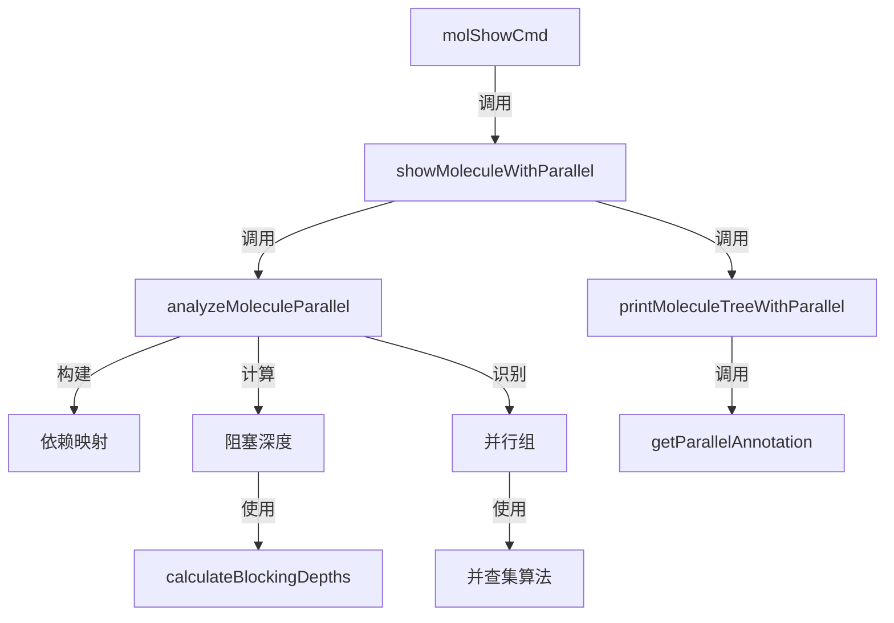

# Parallel Analysis 模块技术深度解析

## 目录
1. [问题与解决方案](#问题与解决方案)
2. [架构与数据流程](#架构与数据流程)
3. [核心组件深度解析](#核心组件深度解析)
4. [依赖分析](#依赖分析)
5. [设计决策与权衡](#设计决策与权衡)
6. [使用指南与示例](#使用指南与示例)
7. [边缘情况与注意事项](#边缘情况与注意事项)
8. [参考资料](#参考资料)

---

## 问题与解决方案

### 问题空间

在复杂的工作流管理系统中，molecule（分子）是由多个步骤组成的有向无环图（DAG）。当用户查看 molecule 详情时，他们往往需要了解：

1. **哪些步骤可以立即开始执行** — 没有未完成的前置依赖
2. **哪些步骤可以并行执行** — 互不阻塞的步骤组
3. **当前步骤被哪些步骤阻塞** — 清晰的依赖关系视图
4. **当前步骤阻塞了哪些后续步骤** — 影响范围分析

传统的线性展示方式无法直观地提供这些信息，用户需要手动分析依赖关系图才能得出结论，这在复杂的 molecule 中非常耗时且容易出错。

### 解决方案

`parallel_analysis` 模块通过对 molecule 子图进行静态分析，自动识别并行可执行的步骤组，并提供丰富的状态信息。它的核心思想是：

- 将 molecule 的步骤视为有向图中的节点
- 依赖关系视为有向边
- 通过图遍历算法计算每个步骤的"阻塞深度"
- 使用并查集（Union-Find）算法识别并行组
- 提供清晰的可视化注释

这种方法让用户能够一目了然地看到 molecule 的执行潜力，从而更好地规划和监控工作流。

---

## 架构与数据流程

### 组件架构图



### 数据流程详解

1. **入口点**：`molShowCmd` 命令处理器接收用户输入的 molecule ID
2. **子图加载**：通过 `loadTemplateSubgraph` 加载 molecule 的完整子图（包括所有步骤和依赖关系）
3. **并行分析**：`analyzeMoleculeParallel` 函数执行核心分析逻辑
   - 构建阻塞关系映射（`blockedBy` 和 `blocks`）
   - 计算每个步骤的阻塞深度
   - 识别可并行执行的步骤组
4. **结果展示**：
   - 如果是 JSON 输出，直接序列化分析结果
   - 如果是终端输出，通过 `printMoleculeTreeWithParallel` 渲染带注释的树形结构

---

## 核心组件深度解析

### ParallelInfo 结构

`ParallelInfo` 是单个步骤的并行分析信息容器。

```go
type ParallelInfo struct {
    StepID        string   `json:"step_id"`
    Status        string   `json:"status"`
    IsReady       bool     `json:"is_ready"`       // 可以立即开始（无阻塞依赖）
    ParallelGroup string   `json:"parallel_group"` // 并行组 ID（同组步骤可并行）
    BlockedBy     []string `json:"blocked_by"`     // 阻塞此步骤的未完成步骤 ID
    Blocks        []string `json:"blocks"`         // 此步骤阻塞的步骤 ID
    CanParallel   []string `json:"can_parallel"`   // 可与此步骤并行执行的步骤 ID
}
```

**设计意图**：
- 将步骤的所有并行相关信息聚合在一个结构中，便于传递和序列化
- `IsReady` 字段是核心判断：步骤处于开放状态且无未完成的阻塞依赖
- `ParallelGroup` 通过组 ID 快速识别可并行的步骤集合
- `BlockedBy` 和 `Blocks` 提供双向依赖视图，帮助理解影响范围

### ParallelAnalysis 结构

`ParallelAnalysis` 是整个 molecule 的并行分析结果容器。

```go
type ParallelAnalysis struct {
    MoleculeID     string                   `json:"molecule_id"`
    TotalSteps     int                      `json:"total_steps"`
    ReadySteps     int                      `json:"ready_steps"`
    ParallelGroups map[string][]string      `json:"parallel_groups"` // 组 ID -> 步骤 ID 列表
    Steps          map[string]*ParallelInfo `json:"steps"`
}
```

**设计意图**：
- 提供 molecule 级别的汇总信息（总步数、就绪步数）
- `ParallelGroups` 是并行分析的核心输出，将可并行的步骤组织在一起
- `Steps` 映射允许快速查找任意步骤的详细信息

### analyzeMoleculeParallel 函数

这是模块的核心函数，执行完整的并行分析流程。

**内部机制**：

1. **依赖映射构建**
   - 创建 `blockedBy` 和 `blocks` 两个映射，分别记录"谁阻塞了我"和"我阻塞了谁"
   - 处理三种依赖类型：
     - `DepBlocks`：直接阻塞关系
     - `DepConditionalBlocks`：条件阻塞关系
     - `DepWaitsFor`：等待门控关系（需要特殊处理 `WaitsForAnyChildren` 逻辑）

2. **就绪状态识别**
   - 遍历所有步骤，检查其阻塞依赖
   - 只有当步骤处于 `Open` 或 `InProgress` 状态且无未完成的阻塞依赖时，才标记为 `IsReady`

3. **阻塞深度计算**
   - 调用 `calculateBlockingDepths` 函数计算每个步骤的阻塞深度
   - 深度 0 表示无阻塞依赖，深度 1 表示被深度 0 的步骤阻塞，依此类推

4. **并行组识别**
   - 按阻塞深度分组步骤
   - 对同一深度的步骤使用并查集算法：
     - 初始化每个步骤为独立组
     - 如果两个步骤互不阻塞，则合并它们的组
     - 最终的组即为可并行执行的步骤集合

**设计亮点**：
- 阻塞深度的引入简化了并行组识别问题——只有同一深度的步骤才可能并行
- 并查集算法高效地处理了组的合并操作，时间复杂度接近线性
- 对 `WaitsForAnyChildren` 的特殊处理确保了门控逻辑的正确性

### calculateBlockingDepths 函数

计算每个步骤的"阻塞深度"——从该步骤到无阻塞步骤的最长路径长度。

**内部机制**：
- 使用递归 DFS 遍历依赖图
- 维护 `visited` 映射防止循环依赖导致的无限递归
- 只考虑未完成的阻塞依赖（已关闭的步骤不影响深度计算）
- 步骤的深度 = 其所有阻塞依赖的最大深度 + 1

**设计意图**：
- 阻塞深度是识别并行组的关键抽象——同一深度的步骤没有相互依赖关系
- 递归实现简洁明了，利用 memoization 避免重复计算
- 对循环依赖的防御性处理提高了鲁棒性

### 辅助函数

#### getParallelAnnotation

为单个步骤生成可视化注释字符串。

**设计意图**：
- 将 `ParallelInfo` 中的结构化数据转换为人类可读的注释
- 使用颜色编码增强可读性：
  - 绿色：就绪或已完成
  - 红色：被阻塞
  - 黄色：进行中
  - 强调色：并行组标识
- 注释格式清晰，信息密度适中

---

## 依赖分析

### 上游依赖

`parallel_analysis` 模块依赖以下核心组件：

1. **MoleculeSubgraph**：整个分析的输入数据结构
   - 包含 `Root`（molecule 根 issue）
   - `Issues`（所有步骤 issue 列表）
   - `Dependencies`（所有依赖关系列表）
   - `IssueMap`（ID 到 issue 的快速查找映射）

2. **types 包**：提供核心领域类型
   - `Issue`：步骤的基本结构
   - `Dependency`：依赖关系定义
   - `Status`：步骤状态枚举
   - `WaitsForGateMetadata`：门控元数据解析

3. **ui 包**：提供终端渲染功能
   - `RenderPass`/`RenderFail`/`RenderWarn`/`RenderAccent`：颜色编码函数

### 下游调用者

该模块主要被 `molShowCmd` 命令处理器调用，作为 `bd mol show --parallel` 命令的核心实现。

### 数据契约

模块对输入数据有以下隐含契约：

1. **MoleculeSubgraph 的完整性**：
   - `Issues` 必须包含 molecule 中的所有步骤
   - `Dependencies` 必须包含所有相关的依赖关系
   - `IssueMap` 必须正确映射所有步骤 ID

2. **依赖关系的正确性**：
   - `DepBlocks` 和 `DepConditionalBlocks` 类型的依赖表示直接阻塞关系
   - `DepWaitsFor` 类型的依赖需要与 `DepParentChild` 关系配合使用
   - `WaitsForAnyChildren` 门控需要正确的元数据格式

---

## 设计决策与权衡

### 1. 阻塞深度 vs. 拓扑排序

**选择**：使用阻塞深度作为并行组识别的基础

**替代方案**：使用拓扑排序识别可并行层

**权衡**：
- 阻塞深度更直观地反映了步骤的"执行层级"
- 拓扑排序在处理复杂依赖图时可能更准确，但实现更复杂
- 阻塞深度在存在条件依赖时可能不够精确，但对于大多数常见场景足够

### 2. 并查集 vs. 其他聚类算法

**选择**：使用并查集算法识别并行组

**替代方案**：
- 图着色算法
- 社区发现算法

**权衡**：
- 并查集实现简单，性能优秀
- 对于"互不阻塞即可并行"的简单规则，并查集完全足够
- 如果未来需要更复杂的并行规则（如资源约束），可能需要更复杂的算法

### 3. 静态分析 vs. 动态模拟

**选择**：静态分析依赖图

**替代方案**：模拟 molecule 执行过程

**权衡**：
- 静态分析更快，不修改状态
- 动态模拟可以处理更复杂的条件逻辑，但实现更复杂
- 当前的静态分析已经能够处理大多数实际场景，包括 `WaitsForAnyChildren` 门控

### 4. 树形展示 vs. 图形展示

**选择**：在树形结构基础上添加注释

**替代方案**：使用专门的图形布局算法

**权衡**：
- 树形展示与非并行模式保持一致，用户体验连贯
- 图形展示可以更直观地显示并行关系，但在终端中实现困难
- 注释方式在保持简单性的同时提供了足够的信息

---

## 使用指南与示例

### 基本使用

通过 `bd mol show --parallel` 命令使用该模块：

```bash
bd mol show my-molecule --parallel
```

### 输出示例

```
🧪 Molecule: My Project
   ID: bd-my-project-123
   Steps: 5 (3 ready)

⚡ Parallel Groups:
   group-1: step-a, step-b
   group-2: step-d, step-e

🌲 Structure:
   My Project [completed]
   ├── Step A [ready | group-1]
   ├── Step B [ready | group-1]
   ├── Step C [blocked | needs: step-a, step-b]
   │   ├── Step D [ready | group-2]
   │   └── Step E [ready | group-2]
```

### JSON 输出

使用 `--json` 标志获取结构化输出：

```bash
bd mol show my-molecule --parallel --json
```

输出将包含完整的 `ParallelAnalysis` 结构，便于程序处理。

---

## 边缘情况与注意事项

### 1. 循环依赖

**问题**：如果 molecule 中存在循环依赖，`calculateBlockingDepths` 函数会返回深度 0 来打破循环。

**影响**：循环依赖中的步骤可能被错误地标记为就绪。

**建议**：确保 molecule 的依赖图是有向无环图（DAG）。

### 2. 条件阻塞

**问题**：`DepConditionalBlocks` 类型的依赖被视为普通阻塞依赖，不考虑条件是否满足。

**影响**：可能会过度保守地标记步骤为被阻塞。

**建议**：如果需要精确处理条件阻塞，可能需要扩展分析逻辑以评估条件。

### 3. 资源约束

**问题**：当前分析只考虑依赖关系，不考虑资源约束（如CPU、内存）。

**影响**：标记为可并行的步骤可能在实际环境中无法同时执行。

**建议**：将并行分析结果视为理论最大值，实际调度时考虑资源约束。

### 4. 已完成步骤的处理

**问题**：已完成的步骤不被视为阻塞依赖，即使它们的输出可能被后续步骤使用。

**设计理由**：这是故意的，因为已完成的步骤不会阻止后续步骤开始执行。

### 5. WaitsForAnyChildren 门控

**问题**：`WaitsForAnyChildren` 门控的处理逻辑较为复杂，容易出错。

**当前实现**：只要有一个子步骤已完成，门控就不被阻塞；否则所有未完成的子步骤都阻塞门控。

**建议**：在使用此门控时仔细测试，确保行为符合预期。

---

## 参考资料

- [Molecule 模块](molecules.md)：了解 molecule 的基本概念和结构
- [Issue 领域模型](issue_domain_model.md)：了解 issue 和依赖关系的核心类型
- [CLI Molecule 命令](cli_molecule_commands.md)：了解其他 molecule 相关命令
