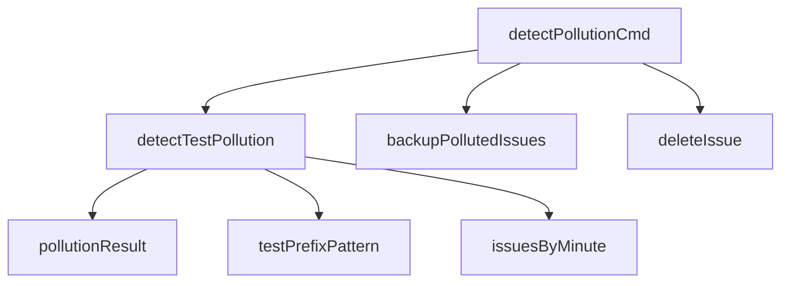

# 污染检测模块 (pollution_detection) 技术深入解析

## 1. 模块概述与问题空间

**污染检测模块**是一个用于识别和清理数据库中意外泄漏的测试数据的工具。在软件开发过程中，开发者经常会在测试环境中创建各种测试问题，但有时这些测试数据会意外地同步或迁移到生产数据库中。本模块的存在就是为了解决这一常见问题，提供一种自动化的方式来检测并可选地清理这些"污染"数据。

### 为什么需要这个模块？

想象一下这样的场景：团队在开发新功能时创建了几十个测试问题，用于验证工作流、集成和边界情况。然后在某个时刻，有人不小心将测试数据库的内容同步到了生产环境，或者某个自动化脚本错误地在生产环境中运行了。结果就是生产数据库中充斥着 "test-1"、"sample-issue"、"tmp-debug" 这类毫无价值但又会干扰正常工作的问题。

手动清理这些数据既耗时又容易出错——你可能会意外删除真实的问题，或者漏掉一些伪装巧妙的测试数据。这个模块正是为了自动化这个过程而设计的。

## 2. 核心概念与心智模型

### 污染检测的心智模型

可以把污染检测模块想象成一个**机场安检系统**：
- 所有"乘客"（问题）都要经过扫描
- 系统使用多种检测手段（模式匹配、上下文分析）来识别可疑人员
- 每个可疑特征都会增加一个"风险评分"
- 超过阈值的乘客会被标记为需要进一步检查或直接移除
- 系统会提供详细的理由说明为什么某个乘客被认为是可疑的

### 核心抽象

该模块围绕两个核心抽象构建：

1. **污染评分系统**：基于启发式规则为每个问题计算一个 0.0 到 1.0+ 的分数，表示它是测试数据的可能性
2. **污染结果** (`pollutionResult`)：将问题、评分和判定理由捆绑在一起的数据结构

## 3. 架构与数据流

### 核心组件



### 数据流程

1. **初始化**：命令解析器接收用户输入（是否清理、是否确认等）
2. **数据获取**：从存储层检索所有问题
3. **检测阶段**：
   - 按分钟分组问题，用于检测快速创建模式
   - 对每个问题应用多个检测规则
   - 累积污染分数和理由
   - 过滤掉分数低于 0.7 阈值的问题
4. **结果分类**：将检测到的问题分为高置信度（≥ 0.9）和中等置信度（0.7-0.9）
5. **输出阶段**：根据用户选择，以人类可读格式或 JSON 输出结果
6. **清理阶段**（可选）：
   - 备份要删除的问题到 JSONL 文件
   - 逐个删除问题
   - 显示清理结果

## 4. 核心组件详解

### pollutionResult 结构体

```go
type pollutionResult struct {
    issue   *types.Issue
    score   float64
    reasons []string
}
```

这个结构体是检测过程的核心输出，它将：
- **issue**：被检测的问题对象
- **score**：污染评分（越高越可能是测试数据）
- **reasons**：为什么被认为是污染的详细理由列表

这种设计允许用户理解系统的判断依据，而不是仅仅给出一个二元的"是/否"答案，这对于减少误判和建立信任非常重要。

### detectTestPollution 函数

这是模块的核心算法，它实现了一个**基于规则的评分系统**。让我们分析其内部机制：

#### 检测规则与权重

该函数使用多个启发式规则，每个规则都有不同的权重：

| 规则 | 权重 | 说明 |
|------|------|------|
| 标题以测试前缀开头 | 0.7 | 最强信号，如 "test-", "sample-", "tmp-" |
| 通用测试标题 | 0.5 | 如 "test issue", "sample issue" |
| 顺序 ID + 简短描述 | 0.4 | 如 "test-123" 且描述少于 20 字符 |
| 快速创建 | 0.3 | 同一分钟内创建 10 个以上问题 |
| 无描述 | 0.2 | 描述为空或只有空白字符 |
| 非常短的描述 | 0.1 | 描述少于 20 字符 |

#### 关键设计决策

1. **基于分钟的分组**：
   ```go
   issuesByMinute := make(map[int64][]*types.Issue)
   for _, issue := range issues {
       minute := issue.CreatedAt.Unix() / 60
       issuesByMinute[minute] = append(issuesByMinute[minute], issue)
   }
   ```
   这是一个聪明的设计，它通过将问题按创建时间分组，可以发现那些在短时间内批量创建的问题——这通常是自动化测试脚本的特征。

2. **阈值过滤**：
   只返回分数 ≥ 0.7 的问题，这个阈值是在误报和漏报之间的一个平衡。

3. **置信度分类**：
   将结果分为高置信度（≥ 0.9）和中等置信度（0.7-0.9），帮助用户优先处理最明显的污染。

### testPrefixPattern 正则表达式

```go
var testPrefixPattern = regexp.MustCompile(`^(test|benchmark|sample|tmp|temp|debug|dummy)[-_\s]`)
```

这个预编译的正则表达式是检测的第一道防线，它匹配常见的测试标题前缀。注意：
- 使用 `^` 锚定到字符串开头
- 包含多种常见前缀
- 允许后跟连字符、下划线或空格
- 在包级别预编译，避免每次调用时重新编译

### isTestIssue 辅助函数

```go
func isTestIssue(title string) bool {
    return testPrefixPattern.MatchString(strings.ToLower(title))
}
```

这个函数是一个简化版的检测器，它只检查标题前缀。值得注意的是，这个函数不仅在污染检测中使用，还在问题创建时用于警告——这是一种"左移"安全实践，在问题进入系统的早期就进行干预。

### backupPollutedIssues 函数

在删除问题之前，这个函数会将它们备份到 JSONL 文件中。这是一个**安全网设计**，确保即使出现误判，数据也不会永久丢失。

## 5. 依赖分析

### 输入依赖

- **Storage 接口** ([storage](storage.md))：通过 `store.SearchIssues()` 获取所有问题，通过 `deleteIssue()` 删除问题
- **types.Issue** ([types](types.md))：核心数据模型
- **ui 包** ([ui](ui.md))：用于格式化输出（如 `ui.RenderMuted()`、`ui.RenderPass()`）

### 输出

- 标准输出：人类可读的检测结果
- JSON 输出：机器可读的检测结果（使用 `--json` 标志）
- 备份文件：`./beads/pollution-backup.jsonl`，包含所有被删除问题的 JSONL 格式

### 调用路径

该模块目前被标记为已弃用，推荐使用 `bd doctor --check=pollution` 代替。这表明该功能已经被整合到更全面的 [doctor](doctor.md) 模块中。

## 6. 设计决策与权衡

### 1. 基于规则 vs 机器学习

**决策**：使用基于规则的评分系统，而非机器学习方法。

**理由**：
- 问题领域相对简单，规则足够覆盖大多数情况
- 规则的可解释性更强——用户可以看到确切的原因
- 不需要训练数据
- 实现和维护更简单

**权衡**：可能会错过一些不遵循常见模式的测试数据，但对于这个用例来说，这是可以接受的。

### 2. 硬编码阈值 vs 可配置阈值

**决策**：使用硬编码的 0.7 阈值。

**理由**：
- 简化用户体验，不需要额外的配置
- 经过实践验证的合理默认值

**权衡**：缺少灵活性，不能适应所有环境。但作为命令行工具，这是一个合理的选择。

### 3. 保守删除策略

**决策**：
- 默认只显示结果，不删除
- 删除前需要确认（除非使用 `--yes`）
- 删除前自动备份

**理由**：
- 数据丢失的风险很高，因此采用保守策略
- 误判的代价太大，所以提供多层安全网

**权衡**：
- 用户体验稍微复杂一些
- 但对于数据安全来说，这是值得的

### 4. 正则表达式预编译

**决策**：在包级别预编译正则表达式。

**理由**：
- 性能优化，避免每次调用时重新编译
- 正则表达式是静态的，不会改变

**权衡**：几乎没有，这是一个明显的最佳实践。

## 7. 使用指南与常见模式

### 基本用法

```bash
# 只检测，不删除
bd detect-pollution

# 检测并删除（需要确认）
bd detect-pollution --clean

# 检测并删除（无需确认）
bd detect-pollution --clean --yes

# JSON 输出
bd detect-pollution --json
```

### 工作流程建议

1. **首先运行只读检测**：查看系统认为的污染问题
2. **手动审核结果**：特别是中等置信度的问题
3. **使用 --clean 标志**：确认无误后再删除
4. **保留备份**：删除后不要立即删除备份文件

## 8. 边缘情况与陷阱

### 误判情况

以下情况可能导致误判：
- 真实问题的标题以 "test" 开头（如 "Test suite improvement"）
- 批量导入的真实问题（会被检测为快速创建）
- 简短但重要的问题（如 "Fix production crash"）

### 漏判情况

以下情况可能导致漏判：
- 测试问题使用非标准前缀
- 测试问题分散创建，不是批量的
- 测试问题有详细的描述和标题

### 操作注意事项

1. **备份文件位置**：备份文件保存在 `.beads/pollution-backup.jsonl`，确保你有足够的磁盘空间
2. **删除操作不可逆**：虽然有备份，但恢复过程需要手动操作
3. **已弃用**：此命令已被弃用，新代码应该使用 `bd doctor --check=pollution`

## 9. 未来扩展方向

如果未来需要增强这个模块，可以考虑：

1. **机器学习增强**：使用历史数据训练一个分类器，作为规则系统的补充
2. **用户反馈循环**：让用户标记误判，系统从中学习
3. **更丰富的上下文**：考虑问题的依赖关系、评论、标签等更多信号
4. **可配置规则**：允许用户自定义规则和权重

## 10. 总结

污染检测模块是一个精心设计的工具，它解决了一个真实而常见的问题：测试数据意外泄漏到生产环境。它采用了基于规则的评分系统，平衡了简单性和有效性，同时提供了多层安全网来防止数据丢失。

虽然现在已经被整合到更全面的 doctor 模块中，但其核心设计思想——可解释的评分、保守的删除策略、安全的备份机制——仍然值得学习和借鉴。
