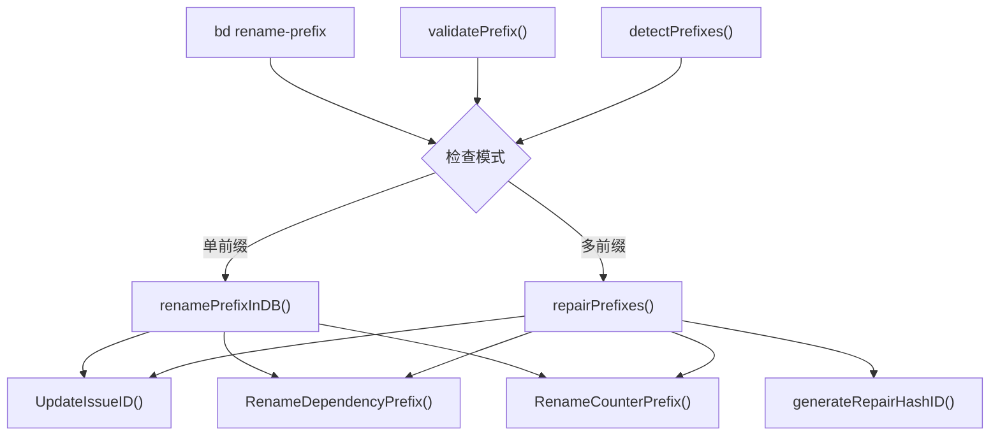

# Prefix Management 模块技术深度剖析

## 概述

`prefix_management` 模块是 Beads 系统中的一个专业维护工具，专注于解决一个核心但罕见的问题：**批量重命名问题 ID 前缀并修复数据库不一致**。这个模块主要通过 `bd rename-prefix` 命令暴露给用户，它不仅仅是简单的字符串替换，而是一个能处理数据迁移、引用修复和多重前缀整合的复杂工具。

## 问题域

### 为什么需要前缀管理？

在 Beads 系统中，每个问题（Issue）都有一个类似 `bd-123` 或 `kw-a3f8e9` 的唯一标识符，其中：
- `bd`、`kw` 等称为**前缀**（prefix）
- `123`、`a3f8e9` 等称为**后缀**（suffix），可以是数字或哈希值

在实际使用中，用户可能面临以下场景：

1. **品牌重塑**：团队从 `knowledge-work-` 更名为 `kw-`
2. **前缀过长**：早期选择的前缀过于冗长，需要简化
3. **数据库损坏**：某些操作导致数据库中出现多个前缀共存的情况
4. **团队标准统一**：合并多个仓库后需要统一命名规范

**为什么不能简单地用 SQL 更新？**
- 问题 ID 不仅存在于 ID 字段，还出现在标题、描述、设计文档等文本字段中
- 依赖关系（Dependency）表存储的 ID 也需要更新
- 计数器（Counter）需要迁移到新前缀
- 可能存在多个不一致的前缀需要修复

## 核心架构

### 模块结构



### 核心组件

1. **`renamePrefixCmd`**：Cobra 命令定义，处理用户输入和流程控制
2. **`validatePrefix()`**：前缀格式验证器
3. **`detectPrefixes()`**：数据库前缀检测器
4. **`issueSort`**：用于排序问题的辅助结构
5. **`renamePrefixInDB()`**：单前缀批量重命名实现
6. **`repairPrefixes()`**：多前缀修复和整合实现
7. **`generateRepairHashID()`**：修复模式下的哈希 ID 生成器

## 组件深度剖析

### 1. 前缀验证器 - `validatePrefix()`

**设计意图**：确保新前缀符合 Beads 的命名规范，防止后续出现问题。

```go
func validatePrefix(prefix string) error {
    prefix = strings.TrimRight(prefix, "-")
    
    // 规则 1: 不能为空
    if prefix == "" {
        return fmt.Errorf("prefix cannot be empty")
    }
    
    // 规则 2: 格式验证 - 小写字母开头，只包含小写字母、数字、连字符
    matched, _ := regexp.MatchString(`^[a-z][a-z0-9-]*$`, prefix)
    if !matched {
        return fmt.Errorf("prefix must start with a lowercase letter...")
    }
    
    // 规则 3: 连字符位置验证
    if strings.HasPrefix(prefix, "-") || strings.HasSuffix(prefix, "--") {
        return fmt.Errorf("prefix has invalid hyphen placement: %s", prefix)
    }
    
    return nil
}
```

**设计细节**：
- 首先去除末尾的连字符，确保用户输入 `kw-` 或 `kw` 都能正常工作
- 使用正则表达式进行格式验证，但补充了额外的连字符位置检查
- 虽然代码中没有明确检查长度限制，但注释中提到最大 8 个字符（这个限制实际在其他地方执行）

### 2. 前缀检测器 - `detectPrefixes()`

**设计意图**：分析数据库中所有问题，识别存在的前缀分布。

```go
func detectPrefixes(issues []*types.Issue) map[string]int {
    prefixes := make(map[string]int)
    for _, issue := range issues {
        prefix := utils.ExtractIssuePrefix(issue.ID)
        if prefix != "" {
            prefixes[prefix]++
        }
    }
    return prefixes
}
```

这个函数依赖于 `utils.ExtractIssuePrefix()` 来智能提取前缀，该函数能处理：
- 简单情况：`bd-123` → `bd`
- 多段前缀：`beads-vscode-1` → `beads-vscode`
- 哈希后缀：`web-app-a3f8e9` → `web-app`
- 避免将英文单词误识别为后缀：`vc-baseline-test` → `vc`

### 3. 单前缀重命名 - `renamePrefixInDB()`

**设计意图**：在所有问题使用同一前缀的情况下，执行批量重命名。

```go
func renamePrefixInDB(ctx context.Context, oldPrefix, newPrefix string, issues []*types.Issue) error {
    // 匹配旧前缀的正则表达式
    oldPrefixPattern := regexp.MustCompile(`\b` + regexp.QuoteMeta(oldPrefix) + `-(\d+)\b`)
    
    replaceFunc := func(match string) string {
        return strings.Replace(match, oldPrefix+"-", newPrefix+"-", 1)
    }
    
    for _, issue := range issues {
        // 1. 生成新 ID
        oldID := issue.ID
        numPart := strings.TrimPrefix(oldID, oldPrefix+"-")
        newID := fmt.Sprintf("%s-%s", newPrefix, numPart)
        issue.ID = newID
        
        // 2. 在所有文本字段中替换 ID 引用
        issue.Title = oldPrefixPattern.ReplaceAllStringFunc(issue.Title, replaceFunc)
        issue.Description = oldPrefixPattern.ReplaceAllStringFunc(issue.Description, replaceFunc)
        // ... 更多字段
        
        // 3. 更新数据库
        if err := store.UpdateIssueID(ctx, oldID, newID, issue, actor); err != nil {
            return fmt.Errorf("failed to update issue %s: %w", oldID, err)
        }
    }
    
    // 4. 更新依赖关系
    if err := store.RenameDependencyPrefix(ctx, oldPrefix, newPrefix); err != nil {
        return fmt.Errorf("failed to update dependencies: %w", err)
    }
    
    // 5. 更新计数器
    if err := store.RenameCounterPrefix(ctx, oldPrefix, newPrefix); err != nil {
        return fmt.Errorf("failed to update counter: %w", err)
    }
    
    // 6. 更新配置
    if err := store.SetConfig(ctx, "issue_prefix", newPrefix); err != nil {
        return fmt.Errorf("failed to update config: %w", err)
    }
    
    return nil
}
```

**重要设计注释**：
```go
// NOTE: Each issue is updated in its own transaction. A failure mid-way could leave
// the database in a mixed state with some issues renamed and others not.
// For production use, consider implementing a single atomic RenamePrefix() method
// in the storage layer that wraps all updates in one transaction.
```

这是一个明确的**技术债务**注释，表明当前实现存在事务隔离问题。

### 4. 多前缀修复 - `repairPrefixes()`

**设计意图**：当数据库中存在多个前缀时（一种损坏状态），将它们全部整合到目标前缀。

这是模块中最复杂的函数，其工作流程如下：

1. **分类**：将问题分为"正确前缀"和"错误前缀"两组
2. **排序**：对错误前缀的问题按前缀字典序和编号排序
3. **生成映射**：为每个错误前缀的问题生成新的哈希 ID（保持正确前缀的问题不变）
4. **执行修复**：
   - 更新问题 ID
   - 在所有文本字段中替换引用
   - 更新依赖关系
   - 更新计数器
   - 更新配置

**关键设计选择**：
- 正确前缀的问题保持原 ID 不变
- 错误前缀的问题获得**新的哈希 ID**，而不是简单地替换前缀
- 使用内容哈希生成新 ID，确保可重复性和冲突避免

```go
// 错误前缀的问题不会简单地变成 targetPrefix-123，
// 而是获得基于内容哈希的新 ID：targetPrefix-a3f8e9
```

### 5. 哈希 ID 生成器 - `generateRepairHashID()`

**设计意图**：在修复模式下为问题生成唯一的、内容相关的 ID。

```go
func generateRepairHashID(prefix string, issue *types.Issue, actor string, usedIDs map[string]bool) (string, error) {
    // 基于问题内容生成哈希
    content := fmt.Sprintf("%s|%s|%s|%d|%d",
        issue.Title,
        issue.Description,
        actor,
        issue.CreatedAt.UnixNano(),
        0, // nonce
    )
    h := sha256.Sum256([]byte(content))
    shortHash := hex.EncodeToString(h[:4]) // 4 bytes = 8 hex chars
    newID := fmt.Sprintf("%s-%s", prefix, shortHash)
    
    // 如果冲突，增加 nonce 重试
    attempts := 0
    for usedIDs[newID] && attempts < 100 {
        attempts++
        content = fmt.Sprintf("%s|%s|%s|%d|%d",
            issue.Title,
            issue.Description,
            actor,
            issue.CreatedAt.UnixNano(),
            attempts,
        )
        // ... 重新生成
    }
    
    return newID, nil
}
```

**设计决策**：
- 使用 4 字节（8 个十六进制字符）的短哈希，平衡简洁性和冲突概率
- 包含 nonce 机制处理批处理内的冲突
- 输入内容包括创建时间戳，确保即使标题和描述相同也能生成不同 ID

## 数据流程分析

### 单前缀重命名流程

```
用户输入 → validatePrefix() → 检测前缀 → 只有一个前缀？
    ↓
是 → 显示预览（dry-run）或执行 renamePrefixInDB()
    ↓
    ├─ 为每个问题生成新 ID
    ├─ 在所有文本字段中替换引用
    ├─ 调用 UpdateIssueID() 更新每个问题
    ├─ 调用 RenameDependencyPrefix() 更新依赖
    ├─ 调用 RenameCounterPrefix() 更新计数器
    └─ 更新配置中的 issue_prefix
```

### 多前缀修复流程

```
多个前缀检测 → 检查 --repair 标志？
    ↓
是 → repairPrefixes()
    ↓
    ├─ 分类问题：正确前缀 vs 错误前缀
    ├─ 排序错误前缀的问题
    ├─ 为错误前缀的问题生成哈希 ID
    ├─ 建立重命名映射
    ├─ 显示预览（dry-run）或执行修复
    │   ├─ 更新问题 ID 和文本引用
    │   ├─ 调用 UpdateIssueID()
    │   ├─ 对所有旧前缀调用 RenameDependencyPrefix()
    │   ├─ 对所有旧前缀调用 RenameCounterPrefix()
    │   └─ 更新配置
    └─ 输出统计信息
```

## 设计决策与权衡

### 1. 两种模式的分离设计

**决策**：将单前缀重命名和多前缀修复作为两个独立路径

**理由**：
- 单前缀情况是简单的 1:1 映射，保持编号连续性很重要
- 多前缀情况更复杂，需要生成新 ID 以避免冲突
- 如果对多前缀情况也尝试保持编号，可能导致 `old-123` 和 `other-123` 都变成 `new-123` 的冲突

**权衡**：代码重复，但逻辑更清晰，每种情况可以采用最适合的策略

### 2. 非原子性操作

**决策**：每个问题在自己的事务中更新，而不是整个操作为一个事务

**理由**：
- 简单性：不需要修改存储层接口
- 进度可见性：用户可以看到哪些已经完成，哪些还没有
- 渐进式修复：即使中途失败，也可以重新运行（虽然可能留下混合状态）

**权衡**：
- 没有回滚机制
- 中途失败可能导致数据库处于不一致状态
- 代码中明确标注了这是一个需要改进的地方

### 3. 修复模式下的哈希 ID 生成

**决策**：在修复模式下，错误前缀的问题获得基于内容的哈希 ID，而不是尝试保留编号

**理由**：
- 避免冲突：多个前缀可能有相同的编号
- 可追溯性：哈希基于内容，相同内容会生成相同 ID（加入时间戳后不完全是，但有相关性）
- 简单性：不需要计算下一个可用编号或处理编号分配

**权衡**：
- 丢失编号连续性
- ID 不再具有顺序意义
- 旧的数字 ID 引用失效

### 4. 文本替换策略

**决策**：使用正则表达式和替换函数在文本字段中进行 ID 替换

**单前缀模式**：
```go
oldPrefixPattern := regexp.MustCompile(`\b` + regexp.QuoteMeta(oldPrefix) + `-(\d+)\b`)
```

**多前缀模式**：
```go
oldPrefixPattern := regexp.MustCompile(`\b[a-z][a-z0-9-]*-[a-z0-9]+\b`)
```

**理由**：
- 精确的单词边界匹配（`\b`）避免部分匹配
- 先构建完整的重命名映射，然后一次性应用所有替换
- 使用函数式替换可以处理复杂的映射关系

**权衡**：
- 正则表达式可能无法捕获所有格式的引用（如带括号的 `(bd-123)`）
- 对于大型数据库，多次正则替换可能较慢

## 依赖分析

### 内部依赖

| 依赖组件 | 用途 | 注释 |
|---------|------|------|
| `utils.ExtractIssuePrefix()` | 提取问题 ID 的前缀 | 智能解析，处理多种格式 |
| `utils.ExtractIssueNumber()` | 提取问题编号 | 用于排序 |
| `dolt.DoltStore.UpdateIssueID()` | 更新问题 ID | 核心存储操作 |
| `dolt.DoltStore.RenameDependencyPrefix()` | 更新依赖关系前缀 | 维护引用完整性 |
| `dolt.DoltStore.RenameCounterPrefix()` | 更新计数器前缀 | 确保新问题编号正确 |
| `git.IsWorktree()` | 检测 git 工作树 | 防止在工作树中运行 |

### 被依赖情况

这个模块主要是一个命令行工具，不被其他内部模块依赖，而是直接被用户调用。

## 使用指南

### 基本用法

```bash
# 简单前缀重命名
bd rename-prefix kw-

# 从长前缀改为短前缀
bd rename-prefix work-  # 从 knowledge-work- 改为 work-

# 预览更改
bd rename-prefix team- --dry-run

# 修复多个前缀
bd rename-prefix mtg- --repair
```

### 输出解释

**单前缀模式**：
```
Renaming 42 issues from prefix 'knowledge-work-' to 'kw-'...
✓ Successfully renamed prefix from knowledge-work- to kw-
```

**修复模式**：
```
Repairing database with multiple prefixes...
  Issues with correct prefix (mtg-): 15
  Issues to repair: 28

  Renamed oldproj-1 -> mtg-a3f8e9
  Renamed oldproj-2 -> mtg-b7c4d2
  ...

✓ Successfully consolidated 3 prefixes into mtg-
  28 issues repaired, 15 issues unchanged
```

### JSON 输出

使用 `--json` 标志可以获得结构化输出：

```json
{
  "old_prefix": "knowledge-work",
  "new_prefix": "kw",
  "issues_count": 42
}
```

修复模式：
```json
{
  "target_prefix": "mtg",
  "prefixes_found": 3,
  "issues_repaired": 28,
  "issues_unchanged": 15
}
```

## 边缘情况与陷阱

### 1. 事务安全性

**问题**：操作不是原子的，中途失败会导致混合状态

**缓解措施**：
- 总是先使用 `--dry-run` 预览
- 在操作前备份数据库
- 如果失败，可以重新运行（但可能需要手动清理）

### 2. Git 工作树限制

**问题**：不能在 git 工作树中运行

**原因**：工作树共享主仓库的 `.beads` 数据库，在工作树中运行可能造成混淆

**解决**：按照提示切换到主仓库运行

### 3. 哈希冲突

**问题**：在修复模式下，理论上可能生成相同的哈希 ID

**缓解**：
- 代码包含冲突检测和重试机制（最多 100 次）
- 包含时间戳和 nonce，使冲突极不可能
- 如果发生冲突，会返回明确的错误

### 4. 部分匹配问题

**问题**：文本替换可能无法捕获所有格式的引用

**示例**：
- `(bd-123)` 中的 `bd-123` 可能不会被匹配（取决于正则表达式）
- Markdown 链接 `[见 bd-123]` 中的 ID 可能不被替换
- 代码注释中的 ID 格式可能不同

**缓解**：操作后手动验证关键引用

### 5. 依赖关系更新

**问题**：依赖关系表中的 ID 更新与问题更新分离

**风险**：如果问题更新成功但依赖更新失败，数据库会处于不一致状态

**缓解**：按顺序执行，先更新问题，再更新依赖，最后更新配置

## 扩展与改进建议

### 1. 原子性操作

**建议**：在存储层实现单一的原子 `RenamePrefix()` 方法

**好处**：
- 全有或全无的语义
- 没有中间不一致状态
- 可以安全重试

### 2. 更全面的文本匹配

**建议**：扩展正则表达式或使用更智能的解析器

**可能的改进**：
- 匹配带括号的 ID：`(bd-123)`、`[bd-123]`
- 匹配 Markdown 引用
- 匹配代码注释中的常见格式

### 3. 预检查和验证

**建议**：在实际修改前添加全面的预检查

**可能的检查**：
- 所有文本引用的完整性检查
- 依赖关系的有效性验证
- 新前缀的可用性检查

### 4. 进度报告和恢复

**建议**：实现断点续传功能

**设计**：
- 将操作计划写入临时文件
- 记录已完成的工作
- 失败后可以从断点继续

## 总结

`prefix_management` 模块是一个专门的维护工具，解决一个看似简单但实际很复杂的问题。它的设计体现了几个关键原则：

1. **实用主义**：在完美和可用之间选择可用，即使有已知限制
2. **明确性**：通过 `--dry-run` 和清晰的输出让用户了解将发生什么
3. **安全性**：添加防护栏（如工作树检测、只读模式检查）
4. **模式分离**：针对不同场景采用不同策略，而不是试图用一个算法解决所有问题

虽然它不是系统中最核心的模块，但对于需要它的用户来说，它是一个重要的安全网和修复工具。

## 相关模块

- [Dolt Storage Backend](dolt_backend.md) - 存储层实现
- [Maintenance and Repository Hygiene](maintenance_and_repository_hygiene.md) - 其他维护工具
- [ID Generation](idgen.md) - ID 生成相关文档