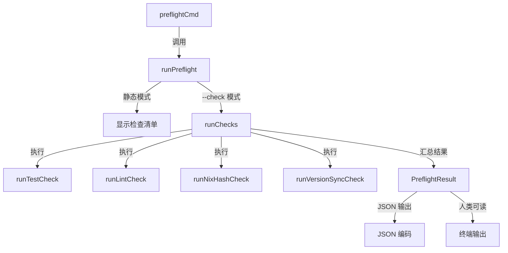

# preflight_checks 模块技术深度解析

## 1. 概述

`preflight_checks` 模块是一个 PR 准备性检查工具，它在代码提交到 CI 之前，帮助开发者发现和修复常见问题。这个模块通过自动化检查来确保代码质量，包括本地测试、代码 lint、Nix 依赖哈希同步、版本号一致性等关键环节。

想象一下，这个模块就像一位严谨的登机检查员，在你"登机"（提交代码到远程仓库）之前，检查你是否带好了所有必要的文件，是否符合登机规范，避免在飞行途中（CI 流程中）出现问题。

## 2. 核心架构



这个模块的架构相对简单直接，主要包含以下几个关键部分：

1. **命令行接口层**：由 `preflightCmd` 定义，处理用户输入的命令和标志
2. **执行控制层**：由 `runPreflight` 和 `runChecks` 组成，决定是显示静态清单还是执行实际检查
3. **检查实现层**：包含四个具体的检查函数，每个函数负责一项特定的检查
4. **结果表示层**：由 `CheckResult` 和 `PreflightResult` 结构体组成，用于存储和输出检查结果

## 3. 核心组件详解

### 3.1 CheckResult 结构体

```go
type CheckResult struct {
    Name    string `json:"name"`
    Passed  bool   `json:"passed"`
    Skipped bool   `json:"skipped,omitempty"`
    Warning bool   `json:"warning,omitempty"`
    Output  string `json:"output,omitempty"`
    Command string `json:"command"`
}
```

`CheckResult` 结构体表示单个预检查的结果。它的设计非常清晰，每个字段都有明确的用途：
- `Name`：检查的名称，用于标识是哪项检查
- `Passed`：表示检查是否通过
- `Skipped`：表示检查是否被跳过（例如，所需工具未安装时）
- `Warning`：表示检查结果是警告级别（不阻止整体通过，但需要注意）
- `Output`：检查的详细输出信息
- `Command`：执行的具体命令，便于用户手动复现

### 3.2 PreflightResult 结构体

```go
type PreflightResult struct {
    Checks  []CheckResult `json:"checks"`
    Passed  bool          `json:"passed"`
    Summary string        `json:"summary"`
}
```

`PreflightResult` 结构体是整个预检查过程的总体结果：
- `Checks`：包含所有单个检查的结果
- `Passed`：表示整体检查是否通过（只有所有非跳过、非警告的检查都通过时才为 true）
- `Summary`：一个简短的总结字符串，描述检查结果

### 3.3 runPreflight 函数

`runPreflight` 是命令的入口函数，它根据用户提供的标志决定执行路径：
- 如果没有 `--check` 标志，它会显示一个静态的检查清单
- 如果有 `--check` 标志，它会调用 `runChecks` 执行实际的检查
- 它还处理 `--fix` 标志（目前尚未实现）和 `--json` 标志

### 3.4 runChecks 函数

`runChecks` 是实际执行检查的核心函数，它的工作流程如下：
1. 依次调用四个检查函数：`runTestCheck`、`runLintCheck`、`runNixHashCheck`、`runVersionSyncCheck`
2. 收集所有检查结果
3. 计算整体结果：统计通过、跳过、警告的检查数量
4. 根据 `--json` 标志决定输出格式：
   - 如果是 JSON 格式，将结果序列化为 JSON 并输出
   - 如果是人类可读格式，格式化输出到终端
5. 如果有任何检查失败，以状态码 1 退出

### 3.5 具体检查函数

#### 3.5.1 runTestCheck

```go
func runTestCheck() CheckResult {
    command := "go test -short ./..."
    cmd := exec.Command("go", "test", "-short", "./...")
    output, err := cmd.CombinedOutput()

    return CheckResult{
        Name:    "Tests pass",
        Passed:  err == nil,
        Output:  string(output),
        Command: command,
    }
}
```

这个函数运行 Go 测试套件的快速版本（`-short` 标志跳过长时间运行的测试）。它直接执行命令并根据退出码判断是否通过。

#### 3.5.2 runLintCheck

```go
func runLintCheck() CheckResult {
    // ...
    // 检查 golangci-lint 是否可用
    if _, err := exec.LookPath("golangci-lint"); err != nil {
        return CheckResult{
            Name:    "Lint passes",
            Passed:  false,
            Skipped: true,
            Output:  "golangci-lint not found in PATH",
            Command: command,
        }
    }
    // 运行 golangci-lint
    // ...
}
```

这个函数运行 `golangci-lint` 进行代码 lint 检查。它首先检查工具是否可用，如果不可用则将检查标记为跳过。

#### 3.5.3 runNixHashCheck

```go
func runNixHashCheck() CheckResult {
    // 检查 go.sum 是否有未提交的更改
    // ...
    if hasChanges {
        return CheckResult{
            Name:    "Nix hash current",
            Passed:  false,
            Warning: true,
            Output:  "go.sum has uncommitted changes - vendorHash in default.nix may need updating",
            Command: command,
        }
    }
    // ...
}
```

这个函数检查 `go.sum` 文件是否有未提交的更改。如果有，它会发出警告，提示可能需要更新 `default.nix` 中的 `vendorHash`。这是一个警告级别的检查，不会阻止整体通过。

#### 3.5.4 runVersionSyncCheck

```go
func runVersionSyncCheck() CheckResult {
    // 读取 version.go 和 default.nix
    // 提取版本号并比较
    // ...
    if goVersion != nixVersion {
        return CheckResult{
            Name:    "Version sync",
            Passed:  false,
            Output:  fmt.Sprintf("Version mismatch: version.go=%s, default.nix=%s", goVersion, nixVersion),
            Command: command,
        }
    }
    // ...
}
```

这个函数检查 `cmd/bd/version.go` 中的版本号是否与 `default.nix` 中的版本号一致。它使用正则表达式从两个文件中提取版本号并进行比较。

## 4. 数据流程

让我们以执行 `bd preflight --check` 命令为例，跟踪数据流程：

1. 用户输入命令，Cobra 框架解析参数并调用 `runPreflight`
2. `runPreflight` 检测到 `--check` 标志，调用 `runChecks`
3. `runChecks` 依次调用四个检查函数：
   - `runTestCheck`：执行 `go test -short ./...`，捕获输出和错误
   - `runLintCheck`：检查 `golangci-lint` 是否存在，然后执行 lint
   - `runNixHashCheck`：检查 `go.sum` 的 git 状态
   - `runVersionSyncCheck`：读取并比较两个文件中的版本号
4. 每个检查函数返回一个 `CheckResult` 结构体
5. `runChecks` 收集所有 `CheckResult`，计算整体结果，创建 `PreflightResult`
6. 根据 `--json` 标志，选择输出格式并输出结果
7. 如果有检查失败，以状态码 1 退出

## 5. 设计决策与权衡

### 5.1 静态清单 vs 自动检查

模块提供了两种模式：静态清单模式和自动检查模式。这种设计有几个优点：
- 对于新用户，静态清单提供了清晰的指导
- 对于有经验的用户，自动检查节省了时间
- 两种模式共享相同的检查逻辑，确保一致性

### 5.2 警告级别概念

模块引入了 `Warning` 字段，允许某些检查结果被标记为警告而不是失败。这种设计：
- 避免了因非关键问题阻止整个流程
- 同时仍向用户提供重要反馈
- 例如，Nix 哈希检查是警告，因为它不一定总是需要更新

### 5.3 直接执行命令 vs 抽象接口

模块直接使用 `exec.Command` 执行外部命令，而不是创建抽象接口。这种设计：
- 简单直接，易于理解和维护
- 但也使得单元测试更加困难（当前代码没有测试）
- 对于这个特定的用例，简单性优先于可测试性

### 5.4 JSON 输出支持

模块支持 `--json` 标志，将结果输出为 JSON 格式。这种设计：
- 便于与其他工具集成
- 允许机器解析结果
- 同时保持人类可读的输出作为默认

## 6. 使用示例与模式

### 6.1 基本使用

```bash
# 显示静态检查清单
bd preflight

# 执行自动检查
bd preflight --check

# 执行自动检查并输出 JSON
bd preflight --check --json
```

### 6.2 集成到 CI/CD 流程

你可以将 `bd preflight --check` 集成到你的 CI 流程中，作为早期的质量门禁：

```yaml
# .github/workflows/pr-checks.yml
name: PR Checks
on: [pull_request]
jobs:
  preflight:
    runs-on: ubuntu-latest
    steps:
      - uses: actions/checkout@v4
      - uses: actions/setup-go@v5
        with:
          go-version: '1.21'
      - name: Install golangci-lint
        run: go install github.com/golangci/golangci-lint/cmd/golangci-lint@latest
      - name: Run preflight checks
        run: bd preflight --check
```

## 7. 边缘情况与陷阱

### 7.1 工具可用性

`runLintCheck` 依赖于 `golangci-lint` 工具。如果该工具不在 PATH 中，检查会被标记为跳过。这是合理的，但用户可能会误以为检查通过了。

### 7.2 文件位置假设

`runVersionSyncCheck` 假设 `cmd/bd/version.go` 和 `default.nix` 文件存在于当前工作目录中。如果从不同的目录运行命令，这些文件可能找不到。

### 7.3 正则表达式脆弱性

版本检查使用正则表达式提取版本号。如果版本字符串的格式发生变化，这些正则表达式可能会失效。

### 7.4 输出截断

在人类可读模式下，失败检查的输出被截断为 500 个字符。这在某些情况下可能会隐藏重要信息。

## 8. 扩展与改进建议

### 8.1 实现 --fix 标志

目前 `--fix` 标志只是一个占位符。可以实现自动修复某些问题，例如：
- 自动运行 `go mod tidy` 更新 go.sum
- 自动同步版本号

### 8.2 添加更多检查

可以添加更多有用的检查，例如：
- 检查是否有未提交的迁移文件
- 检查文档是否已更新
- 检查是否有遗留的调试代码

### 8.3 改进测试覆盖

当前模块没有测试。可以通过抽象命令执行接口来提高可测试性，例如：

```go
type CommandRunner interface {
    Run(name string, args ...string) (output string, err error)
}

type RealCommandRunner struct{}

func (r RealCommandRunner) Run(name string, args ...string) (output string, err error) {
    cmd := exec.Command(name, args...)
    out, err := cmd.CombinedOutput()
    return string(out), err
}
```

### 8.4 配置支持

可以添加配置文件支持，允许用户：
- 自定义要运行的检查
- 配置检查的参数
- 设置特定检查的警告/失败级别

## 9. 相关模块

- [CLI Issue Management Commands](cli_issue_management_commands.md)：`preflight_checks` 是这个模块的子模块
- [CLI Doctor Commands](cli_doctor_commands.md)：另一个用于诊断和修复问题的 CLI 模块
