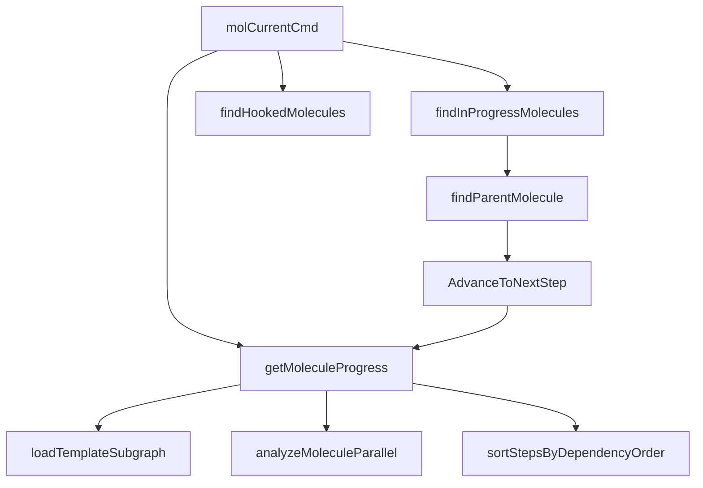

# progress_tracking 模块技术深度解析

## 1. 模块概述

`progress_tracking` 模块是 Beads 系统中用于追踪分子（molecule）工作流执行进度的核心组件。它解决了在复杂工作流中「我们现在在哪里」以及「下一步该做什么」这两个关键问题。

### 问题背景

在没有这个模块之前，用户面对由数十个步骤组成的分子工作流时，需要手动：
- 记住当前正在处理哪个步骤
- 检查哪些步骤已经完成
- 分析哪些步骤已准备好（未被阻塞）
- 确定下一步可以开始什么工作

对于超过 100 个步骤的大型分子，这种手动追踪不仅效率低下，而且容易出错。

### 设计洞察

该模块的核心设计思想是：**将分子工作流视为一个状态机，通过分析依赖关系和问题状态，自动计算当前位置并预测下一步**。这就像在地图应用中，不仅显示你当前的位置，还告诉你接下来可以走哪些路线。

## 2. 核心数据模型

### MoleculeProgress

`MoleculeProgress` 是模块的核心数据结构，它封装了一个分子的完整进度信息：

```go
type MoleculeProgress struct {
    MoleculeID    string        `json:"molecule_id"`
    MoleculeTitle string        `json:"molecule_title"`
    Assignee      string        `json:"assignee,omitempty"`
    CurrentStep   *types.Issue  `json:"current_step,omitempty"`  // 当前进行中的步骤
    NextStep      *types.Issue  `json:"next_step,omitempty"`     // 下一个准备好的步骤
    Steps         []*StepStatus `json:"steps"`                    // 所有步骤的状态列表
    Completed     int           `json:"completed"`                // 已完成步骤数
    Total         int           `json:"total"`                    // 总步骤数
}
```

这个结构的设计体现了**渐进式信息披露**的原则：从高层摘要（完成度百分比）到具体的步骤状态列表，用户可以根据需要获取不同粒度的信息。

### StepStatus

`StepStatus` 表示单个步骤的状态，使用了语义化的状态标签：

```go
type StepStatus struct {
    Issue     *types.Issue `json:"issue"`
    Status    string       `json:"status"`     // "done", "current", "ready", "blocked", "pending"
    IsCurrent bool         `json:"is_current"` // true if this is the in_progress step
}
```

状态机的设计遵循了一个清晰的转换路径：
```
pending → ready → current → done
         ↓
      blocked
```

### ContinueResult

`ContinueResult` 用于捕获步骤推进操作的结果：

```go
type ContinueResult struct {
    ClosedStep   *types.Issue `json:"closed_step"`
    NextStep     *types.Issue `json:"next_step,omitempty"`
    AutoAdvanced bool         `json:"auto_advanced"`
    MolComplete  bool         `json:"molecule_complete"`
    MoleculeID   string       `json:"molecule_id,omitempty"`
}
```

## 3. 架构与数据流

### 核心组件架构



### 数据流向分析

1. **用户请求** → `molCurrentCmd`：用户通过 CLI 命令发起进度查询
2. **分子定位** → `findInProgressMolecules` / `findHookedMolecules`：定位相关的分子
3. **进度计算** → `getMoleculeProgress`：
   - 加载分子的子图结构
   - 分析并行性和就绪状态
   - 为每个步骤分配状态标签
   - 排序步骤
4. **结果呈现** → `printMoleculeProgress` / `outputJSON`：格式化输出结果

## 4. 关键组件深度解析

### getMoleculeProgress 函数

**目的**：加载分子并计算完整的进度信息。

**设计要点**：
- 使用 `analyzeMoleculeParallel` 而非 `GetReadyWork` 来计算就绪状态，这是因为后者会排除临时问题（wisp），而分子步骤通常是临时的。
- 步骤状态的确定遵循优先级：先检查问题的原始状态，再根据依赖关系确定就绪/待处理状态。
- 通过 `sortStepsByDependencyOrder` 确保步骤按照依赖顺序排列，让用户看到的是一个逻辑上连贯的工作流。

**内部机制**：
```go
// 核心状态分配逻辑
switch issue.Status {
case types.StatusClosed:
    step.Status = "done"
    progress.Completed++
case types.StatusInProgress:
    step.Status = "current"
    step.IsCurrent = true
    progress.CurrentStep = issue
case types.StatusBlocked:
    step.Status = "blocked"
default:
    // 检查是否就绪（未被阻塞）
    if readyIDs[issue.ID] {
        step.Status = "ready"
        if progress.NextStep == nil {
            progress.NextStep = issue
        }
    } else {
        step.Status = "pending"
    }
}
```

### findParentMolecule 函数

**目的**：从任意步骤向上遍历父链，找到根分子。

**设计要点**：
- 使用 `visited` 映射防止循环依赖导致的无限循环。
- 支持两种分子根类型：带有模板标签的问题，或者有子问题的史诗问题。
- 这种设计使得模块既可以处理从模板实例化的正式分子，也可以处理临时组合的即兴分子。

### AdvanceToNextStep 函数

**目的**：在关闭一个步骤后，找到下一个就绪步骤并可选地自动认领。

**设计要点**：
- 将「查找下一步」和「自动认领」分离为两个阶段，保持函数的单一职责。
- 通过 `ContinueResult` 结构返回丰富的操作结果信息，让调用者可以根据需要做出不同反应。
- 优雅处理分子完成的情况，提供明确的完成信号。

## 5. 设计决策与权衡

### 1. 大型分子的渐进式显示策略

**决策**：对于超过 100 个步骤的大型分子，默认显示摘要而非完整列表。

**权衡分析**：
- **优点**：避免压倒性的输出，防止对大型分子的慢速查询。
- **缺点**：用户可能无法立即看到所有步骤的详细状态。
- **缓解措施**：提供 `--limit` 和 `--range` 标志，让用户可以按需查看特定部分。

这个决策体现了**用户体验优先**的设计原则——在常见情况下提供简洁的输出，同时为高级用户保留细粒度控制的能力。

### 2. 双重分子发现机制

**决策**：同时支持「从进行中步骤发现」和「从关联的已挂钩问题发现」两种分子定位方式。

**权衡分析**：
- **优点**：提高了模块的鲁棒性，能处理更多使用场景（如巡逻任务等特殊工作流）。
- **缺点**：增加了代码复杂度，可能导致发现的分子集合存在重叠。
- **缓解措施**：使用 `moleculeMap` 去重，确保每个分子只处理一次。

### 3. 依赖顺序排序策略

**决策**：使用简单的依赖计数而非拓扑排序来排列步骤。

**权衡分析**：
- **优点**：实现简单，性能足够好，对于大多数分子工作流已经足够。
- **缺点**：对于复杂的依赖图，可能无法达到最理想的排序效果。
- **缓解措施**：使用稳定排序（`sort.SliceStable`），在依赖计数相同的情况下保持原有的相对顺序。

## 6. 使用指南与最佳实践

### 基本使用

```bash
# 显示当前进行中的分子
bd mol current

# 显示特定分子的进度
bd mol current <molecule-id>

# 查看大型分子的前 50 个步骤
bd mol current <molecule-id> --limit 50

# 查看特定范围的步骤
bd mol current <molecule-id> --range 100-150
```

### 程序化使用

```go
// 加载分子进度
progress, err := getMoleculeProgress(ctx, store, moleculeID)
if err != nil {
    // 处理错误
}

// 推进到下一步
result, err := AdvanceToNextStep(ctx, store, closedStepID, true, actorName)
if err != nil {
    // 处理错误
}
if result.MolComplete {
    // 分子完成，执行清理工作
}
```

## 7. 注意事项与陷阱

### 隐含契约

1. **模板标签的重要性**：模块依赖 `BeadsTemplateLabel` 来识别分子根。确保从模板实例化的分子带有这个标签。

2. **依赖类型的约定**：分子内的依赖关系使用 `types.DepBlocks`，父子关系使用 `types.DepParentChild`。混合使用这些类型可能导致进度计算错误。

3. **临时问题的处理**：由于使用 `analyzeMoleculeParallel` 而非 `GetReadyWork`，模块能够正确处理临时问题（wisp），但这也意味着它不会考虑分子外部的依赖关系。

### 边缘情况

1. **循环依赖**：虽然 `findParentMolecule` 有防止无限循环的保护，但分子内部的循环依赖可能导致步骤状态计算不准确。

2. **空分子**：没有子步骤的分子会显示 0/0 的完成度，这种情况下 `NextStep` 将为 nil。

3. **多个当前步骤**：虽然不常见，但分子可能有多个处于 `in_progress` 状态的步骤。模块会将所有这些步骤标记为「current」，但 `CurrentStep` 字段只会指向其中一个。

## 8. 相关模块参考

- [Molecules](molecules.md)：分子的加载和管理
- [CLI Molecule Commands](cli_molecule_commands.md)：其他分子相关的 CLI 命令
- [Storage Interfaces](storage_interfaces.md)：底层存储接口
- [Core Domain Types](core_domain_types.md)：问题和依赖关系的核心类型定义
