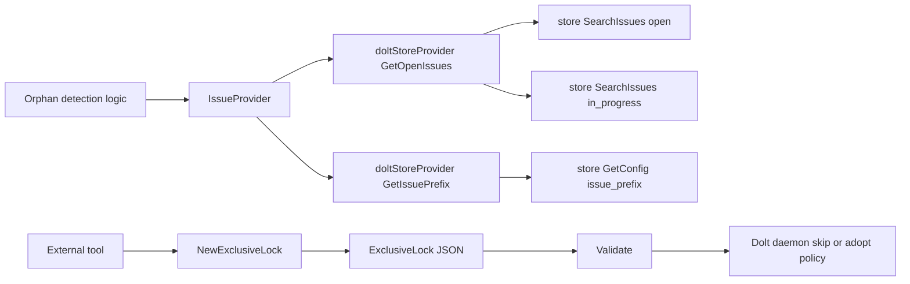

# provider_and_lock_contracts

`provider_and_lock_contracts` 模块看起来很小，但它其实承担了一个“系统边界契约层”的角色：一边把“孤儿问题检测（orphan detection）”需要的最小读能力抽象成 `IssueProvider`，另一边把“外部进程声明独占管理权”抽象成可序列化、可校验的 `ExclusiveLock`。你可以把它想成机场里的两张标准表单：第一张表单规定“查旅客名单”至少要提供哪些字段；第二张表单规定“这个登机口已经被某团队接管”时必须留下哪些可审计信息。模块本身不做业务编排，但它定义了编排赖以成立的公共语言。

## 为什么这个模块存在：它解决的不是“功能”，而是“边界失配”

在真实系统里，孤儿检测逻辑不应该直接绑死某个具体存储实现（例如 Dolt）。否则你会立刻遇到两个问题：第一，测试代价高，任何逻辑测试都要拉起真实存储；第二，演进成本高，未来换后端或引入路由存储时，检测逻辑会被底层 API 细节污染。`IssueProvider` 的存在，就是把“孤儿检测真正关心的能力”压缩成一个最小接口：拿到开放态 issue、拿到 ID 前缀。

同样，独占锁场景里如果只靠“某个进程内部变量”或“OS 文件锁句柄”表达锁状态，跨进程、跨工具链、跨语言的可观察性会很差。`ExclusiveLock` 选择了 JSON 结构化锁元数据：不仅告诉你“锁住了”，还能告诉你“谁锁的、在哪台机器、什么版本、从何时开始”。这对 daemon 与外部工具协作尤其关键，因为它们并不共享内存，也不一定在同一生命周期里运行。

## 心智模型：两个契约，两个方向

这个模块可以用“北向能力契约 + 南向状态契约”来理解。

`IssueProvider` 是北向契约：上层业务（如 orphan 检测）向下索取能力时，只声明“我需要这些，不多不少”。它像一个窄口电源插头，任何后端只要做出这个插头形状就能接入。

`ExclusiveLock` 是南向契约：系统向外暴露当前独占状态时，使用稳定且可互操作的数据格式。它像设备铭牌，不参与执行动作，但为观测、排障、仲裁提供统一事实来源。

## 架构与数据流



从调用关系看，`IssueProvider` 这条链路是清晰的：`cmd.bd.orphans.doltStoreProvider.GetOpenIssues` 通过两次 `store.SearchIssues(...)` 拉取 `StatusOpen` 与 `StatusInProgress`，再拼接返回；`GetIssuePrefix` 则通过 `store.GetConfig(ctx, "issue_prefix")` 获取配置，读取失败或为空时回退到 `"bd"`。这正好与接口注释里的契约一致：无数据应返回空切片、前缀默认值应为 `bd`。

`ExclusiveLock` 这条链路在当前提供的组件里更多体现为“数据契约本身”：`NewExclusiveLock` 采集 `holder/version` 与运行时环境（`PID`、`Hostname`、`StartedAt`），`MarshalJSON/UnmarshalJSON` 提供稳定序列化边界，`Validate` 作为消费前防线。需要注意的是，在你提供的依赖信息中，没有完整展开“谁最终读写 lock 文件并执行 skip 策略”的函数调用闭环；但从结构体注释可知，设计意图是给外部工具与 daemon 协作时使用。

## 组件深潜

### `internal.types.orphans.IssueProvider`

`IssueProvider` 的关键设计点不是“抽象存储”，而是“抽象到刚刚好”。它只保留两个方法：`GetOpenIssues(ctx)` 与 `GetIssuePrefix()`。这意味着孤儿检测流程被强制约束为：只依赖开放态 issue 的快照与前缀规则，不得偷偷依赖事务、分页、复杂查询表达式等底层细节。

`GetOpenIssues(ctx context.Context) ([]*Issue, error)` 返回 `[]*Issue`（指针切片）而不是值切片，说明调用方默认会在后续流程中引用同一实体对象，而不是强调不可变值语义。接口文档特别规定“没有数据时返回空切片而不是 error”，这是一条非常实用的上游契约：调用方可以把“空结果”当正常控制流，减少 `err == nil && len==0` 之外的分支爆炸。

`GetIssuePrefix() string` 没有携带 `context.Context`，也不返回 `error`。这是一个有意识的简化选择：该值被定位为“轻量配置读取 + 默认值回退”，不是强一致配置服务。如果后端读不到配置，契约直接要求回退 `"bd"`，把失败语义变成业务默认语义。

### `cmd.bd.orphans.doltStoreProvider`（`IssueProvider` 的已知实现）

在已提供代码里，`doltStoreProvider.GetOpenIssues` 通过两次独立查询构造结果：一次查 `types.StatusOpen`，一次查 `types.StatusInProgress`，最后 `append(openIssues, inProgressIssues...)`。这种写法比“写一个复合状态查询 API”更朴素，但它把接口与存储能力解耦开：即便底层暂时不支持 `IN (...)` 风格过滤，上层契约仍然可实现。

代价是一次调用会触发两次存储访问；在 issue 数量巨大或高频调用场景，这会是热点路径。当前设计显然把“接口简单与可移植性”放在“查询最优”之前。

`GetIssuePrefix` 的实现同样体现契约优先：读配置失败或空值，统一返回 `"bd"`。也就是说，调用方不必区分“没配”还是“读失败”，但代价是你会损失一部分可观测性（配置读取异常被吞成默认行为）。

### `internal.types.lock.ExclusiveLock`

`ExclusiveLock` 是纯数据结构，但字段设计非常有 operational 语义：

- `Holder`：谁占有锁（例如注释中的 `vc-executor`）
- `PID`：具体进程
- `Hostname`：具体机器
- `StartedAt`：何时开始占有
- `Version`：占有方版本

`NewExclusiveLock(holder, version)` 自动填充 `PID`、`Hostname`、`StartedAt`，减少调用方漏填关键字段的概率。它唯一可能失败的点是 `os.Hostname()`，并通过 `fmt.Errorf("failed to get hostname: %w", err)` 保留原始错误链。

`MarshalJSON` / `UnmarshalJSON` 使用 `type Alias ExclusiveLock` 的写法，这是 Go 里常见的“避免递归调用自身方法”技巧：通过别名把方法集剥离，再交给标准库 `json` 处理。

`Validate()` 明确了最小有效性：`Holder` 非空、`PID > 0`、`Hostname` 非空、`StartedAt` 非零。注意它**没有**校验 `Version`，这说明版本字段是“推荐元数据”而非“锁语义必要字段”。这是一个有意放松的兼容性选择：即便旧工具没写版本，也不至于被判定为无效锁。

## 依赖与契约分析

从模块自身看，`IssueProvider` 与 `ExclusiveLock` 都位于 `internal/types`，它们尽量不依赖高层模块。`IssueProvider` 只依赖 `context.Context` 与域模型 `Issue`；`ExclusiveLock` 只依赖标准库（`os/time/json/fmt`）。这种“低依赖、强约束”的位置，使它适合作为多模块共享契约。

从已知被调用关系看，`IssueProvider` 被 `cmd.bd.orphans.doltStoreProvider` 实现，而该实现依赖存储查询能力（`store.SearchIssues`、`store.GetConfig`）。因此它处于“业务逻辑与存储实现之间的防腐层”。如果上游 orphan 逻辑未来扩展为需要更多状态，它会首先推动 `IssueProvider` 扩口；如果底层存储 API 变化，只要实现层适配，接口消费者可以不动。

`ExclusiveLock` 的注释声明其契约面向“external tools 与 bd daemon”的协作边界。当前提供的依赖片段未完整列出具体读写函数对它的直接调用关系，因此在文档层面应把它定位为“跨进程锁文件 schema”，而不是“锁管理器实现”。

相关背景可参考：[issue_domain_model](issue_domain_model.md)、[storage_contracts](storage_contracts.md)、[store_core](store_core.md)、[Dolt Server](Dolt Server.md)。

## 关键设计取舍

这个模块的设计明显偏向“契约最小化”。`IssueProvider` 不追求通用查询接口，而是只暴露孤儿检测所需最小能力；收益是接口稳定、mock 容易、迁移简单，代价是高阶能力（复合过滤、分页、排序）需要在实现层拼装，可能引入额外 IO。

`GetIssuePrefix` 的“错误即默认值”策略偏向可用性而非严格正确性。对于 CLI/自动化流程，这能避免因配置小故障让主流程中断；但它也可能掩盖配置系统异常，导致输出 quietly 回退到 `bd` 前缀。

`ExclusiveLock` 选择 JSON 结构化元数据而不是仅靠 OS 文件锁，体现了“可观测性与互操作性优先”。纯 OS 锁在同进程竞争上很强，但对跨工具排障不友好；JSON 锁元数据能被人看、被脚本读、被其他语言消费。代价是你需要额外的读写原子性与一致性策略（这部分属于使用它的上层实现责任，不在本模块内）。

## 使用方式与示例

下面是一个最小 `IssueProvider` 使用方式（例如注入 orphan 检测服务）：

```go
func Run(ctx context.Context, p types.IssueProvider) error {
    issues, err := p.GetOpenIssues(ctx)
    if err != nil {
        return err
    }

    prefix := p.GetIssuePrefix() // 默认约定可回退到 "bd"
    _ = prefix

    for _, is := range issues {
        _ = is.ID
    }
    return nil
}
```

一个最小 `ExclusiveLock` 生命周期示例：

```go
lock, err := types.NewExclusiveLock("vc-executor", "1.2.3")
if err != nil {
    return err
}
if err := lock.Validate(); err != nil {
    return err
}

data, err := json.Marshal(lock)
if err != nil {
    return err
}

var parsed types.ExclusiveLock
if err := json.Unmarshal(data, &parsed); err != nil {
    return err
}
if err := parsed.Validate(); err != nil {
    return err
}
```

## 新贡献者最容易踩的坑

第一，`IssueProvider.GetOpenIssues` 的契约强调“无结果返回空切片”。如果你实现时返回 `nil, nil`，多数 Go 调用方仍可工作，但在 JSON 序列化、长度判断、以及测试断言里会出现不一致，建议严格按约定返回空切片。

第二，`doltStoreProvider.GetOpenIssues` 当前是“两次查询再拼接”。这隐含两个风险：其一，底层数据在两次查询间变化会产生短暂不一致；其二，若某实现错误地让同一 issue 同时匹配两个状态（理论上不该发生），会导致重复项。上层如需强一致或去重，应显式处理。

第三，`GetIssuePrefix` 把异常吞成默认值 `"bd"`。这让系统更韧性，但调试时要主动加日志或指标，否则你可能长时间意识不到配置读取故障。

第四，`ExclusiveLock.Validate` 不校验 `Version`，不要误以为它一定有值；消费方若依赖版本进行兼容分支，必须自行处理空版本。

第五，`NewExclusiveLock` 依赖本机 `Hostname`。在容器、沙箱或受限运行环境里，这一步可能失败，调用方应把该错误当作可预期部署问题来处理，而不是当成不可恢复逻辑错误。

## 相关子模块文档

- [IssueProvider 契约详解](issue_provider_contract.md) - 深入探讨 `IssueProvider` 接口的设计意图、使用方式和实现细节
- [ExclusiveLock 结构详解](exclusive_lock_structure.md) - 详细解析 `ExclusiveLock` 的数据结构、验证逻辑和使用场景
