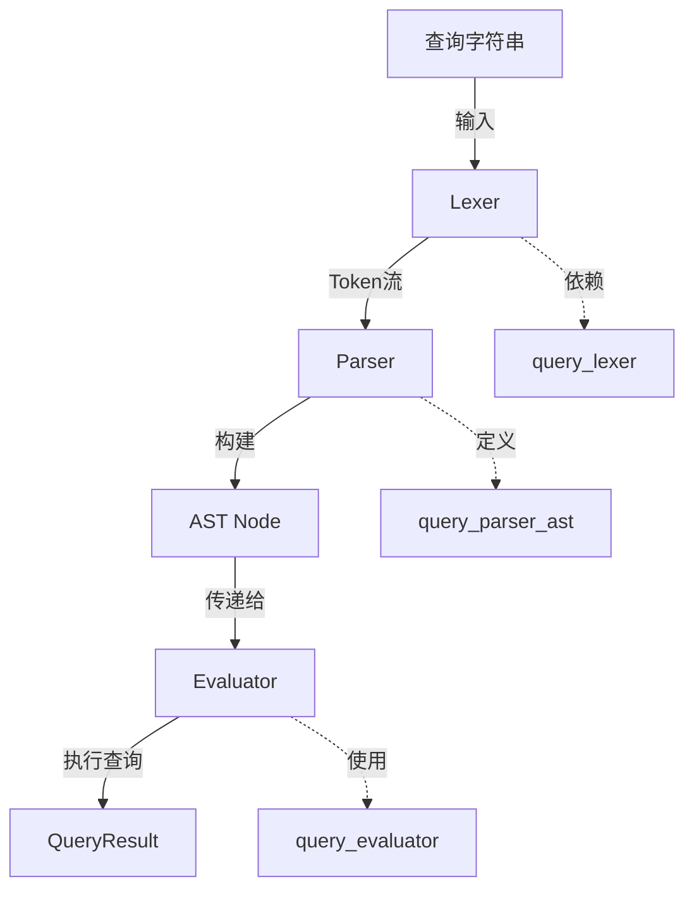

# 查询解析器 AST 模块技术深度解析

## 1. 为什么需要这个模块？

在项目中，我们需要一种灵活且强大的方式来查询问题（Issue）数据。用户可能需要根据状态、优先级、标签、时间戳等各种条件进行复杂的组合查询。

直接编写查询逻辑会导致代码混乱且难以维护，特别是当查询条件变得复杂时（如嵌套的 AND/OR 逻辑）。此外，将查询语言直接暴露给用户需要一个可靠的解析和验证机制。

这就是 `query_parser_ast` 模块的设计初衷：它提供了一种结构化的方式来表示查询逻辑，将人类可读的查询字符串转换为机器可处理的抽象语法树（AST），为后续的查询执行奠定基础。

## 2. 核心概念与抽象

### 2.1 抽象语法树 (AST)

想象一下，一个查询就像一个句子，而 AST 就是这个句子的语法结构树。每个节点代表一个语法单元：

- **叶子节点**：比较表达式（如 `status=open`）
- **内部节点**：逻辑运算符（AND、OR、NOT）

### 2.2 核心类型系统

#### Node 接口

```go
type Node interface {
    node() // marker method
    String() string
}
```

这是所有 AST 节点的基础接口。`node()` 方法是一个标记方法，用于确保只有此包内定义的类型才能实现该接口，这是一种常见的 Go 模式，用于创建封闭的类型层次结构。

#### 具体节点类型

1. **ComparisonNode**：表示字段比较，如 `status=open` 或 `priority>3`
   - 包含字段名、比较操作符、值和值类型
   
2. **AndNode**：表示逻辑 AND 操作
   - 包含左右两个子节点
   
3. **OrNode**：表示逻辑 OR 操作
   - 包含左右两个子节点
   
4. **NotNode**：表示逻辑 NOT 操作
   - 包含一个操作数节点

### 2.3 比较操作符

```go
type ComparisonOp int

const (
    OpEquals ComparisonOp = iota
    OpNotEquals
    OpLess
    OpLessEq
    OpGreater
    OpGreaterEq
)
```

这些操作符定义了比较表达式中支持的所有比较类型。

## 3. 架构与数据流程

### 3.1 整体架构图



### 3.2 解析流程详解

解析过程是一个递归下降解析的典型实现，遵循以下步骤：

1. **词法分析**：由 [Lexer](query-query_lexer.md) 完成，将查询字符串转换为标记（Token）流
2. **语法分析**：由 Parser 完成，将标记流转换为 AST
3. **验证**：确保查询结构正确且使用的字段是已知的

#### 解析过程的关键方法

Parser 采用了经典的递归下降解析方法，按优先级从低到高处理：

```go
func (p *Parser) parseOr() (Node, error)     // 最低优先级
func (p *Parser) parseAnd() (Node, error)
func (p *Parser) parseNot() (Node, error)
func (p *Parser) parsePrimary() (Node, error) // 最高优先级
```

这种设计确保了正确的操作符优先级：NOT > AND > OR。

## 4. 组件深度解析

### 4.1 Parser 结构体

```go
type Parser struct {
    lexer   *Lexer
    current Token
    peeked  *Token
}
```

Parser 维护了词法分析器的引用，以及当前和预读的标记，这使得它能够实现 LL(1) 解析（需要时查看一个标记的未来）。

### 4.2 解析比较表达式

`parseComparison` 方法解析基本的比较表达式：

```go
func (p *Parser) parseComparison() (Node, error) {
    // 期望字段名
    // 期望比较操作符
    // 期望值（标识符、字符串、数字或持续时间）
    // 构建 ComparisonNode
}
```

### 4.3 已知字段验证

模块维护了一个 `KnownFields` 映射，列出了所有可查询的字段：

```go
var KnownFields = map[string]bool{
    "id":          true,
    "title":       true,
    "status":      true,
    // ... 更多字段
}
```

这个映射确保了查询只使用有效的字段名，防止了无效查询的执行。

## 5. 设计决策与权衡

### 5.1 递归下降解析 vs 其他方法

**选择**：使用递归下降解析器

**原因**：
- 简单易懂，代码结构清晰
- 易于调试和维护
- 对于这种复杂度的语法已经足够

**权衡**：
- 对于极其复杂的语法可能性能不够，但对于当前的查询语言完全足够
- 手写解析器而不是使用生成器（如 yacc），增加了一点初始开发成本，但提高了可维护性

### 5.2 标记方法 (node()) 的使用

**选择**：使用标记方法来创建封闭的类型层次结构

**原因**：
- 确保只有包内定义的类型可以实现 Node 接口
- 提供了类型安全，防止外部类型意外实现接口

**权衡**：
- 稍微增加了一点样板代码
- 但获得了更好的封装和类型安全

### 5.3 值类型的保留

**选择**：在 ComparisonNode 中保留值的原始类型信息

**原因**：
- 允许评估器根据值类型进行不同的处理
- 例如，数字比较和字符串比较是不同的

**权衡**：
- 增加了节点的复杂性
- 但提供了更大的灵活性和正确性

## 6. 使用示例与最佳实践

### 6.1 基本使用

```go
// 解析一个简单的查询
query := "status=open AND priority>3"
node, err := query.Parse(query)
if err != nil {
    // 处理错误
}

// node 现在是一个 AndNode，包含两个 ComparisonNode
```

### 6.2 扩展已知字段

如果需要添加新的可查询字段，只需更新 `KnownFields` 映射：

```go
// 在适当的位置
query.KnownFields["new_field"] = true
```

### 6.3 最佳实践

1. **错误处理**：始终检查 Parse 返回的错误
2. **字段验证**：在使用前验证字段名是否在 KnownFields 中
3. **字符串表示**：使用 Node.String() 进行调试，它会生成带括号的明确表达式

## 7. 边缘情况与陷阱

### 7.1 空查询

解析空字符串会返回错误，确保始终检查输入的有效性。

### 7.2 运算符优先级

记住优先级顺序：NOT > AND > OR。如果有疑问，使用括号明确表达意图。

### 7.3 字段名大小写

字段名会被转换为小写，所以 `Status=open` 和 `status=open` 是等效的。

### 7.4 值类型

注意值的类型会影响比较结果，例如 `"3"` 作为字符串和 `3` 作为数字的比较可能不同。

## 8. 依赖关系

- **输入来源**：用户查询字符串
- **依赖模块**：
  - [query_lexer](query-query_lexer.md)：提供词法分析功能
- **被依赖模块**：
  - [query_evaluator](query-query_evaluator.md)：使用生成的 AST 执行查询

## 9. 总结

`query_parser_ast` 模块是查询引擎的核心组件，它将用户友好的查询字符串转换为结构化的 AST，为后续的查询评估提供了基础。其设计采用了经典的编译器模式（词法分析 → 语法分析 → AST），并通过递归下降解析器实现了高效且可维护的代码结构。

对于新加入团队的开发者，理解这个模块的关键在于掌握 AST 的概念、递归下降解析的原理，以及操作符优先级的处理方式。
