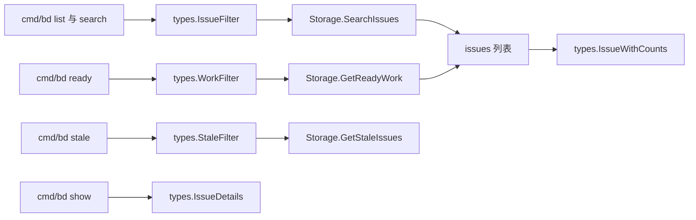

# query_and_projection_types 深度解析

`query_and_projection_types` 模块是系统里“查询意图与返回形状”的合同层。它不执行 SQL、不做索引优化，也不决定 UI 怎么显示；它做的是把“我要查什么”（`IssueFilter` / `WorkFilter` / `StaleFilter`）和“我查出来应该长什么样”（`IssueDetails` / `IssueWithCounts`）稳定地定义下来。你可以把它理解成数据库和上层功能之间的一张“点菜单”：调用方只描述需求，存储层按这份菜单翻译成具体查询，再把结果装进约定好的投影结构。没有这层，CLI、MCP、存储后端会各自发明参数格式和结果格式，系统会很快碎片化。

## 这个模块解决了什么问题

在一个多入口系统里（CLI、MCP、集成同步、公式引擎），最难的不是“能查到数据”，而是“所有人对查询语义保持一致”。朴素做法通常是到处传 `map[string]any`，或者每个命令自己拼 SQL 条件。这会带来三个长期问题：第一，过滤语义漂移，比如有的地方把空 assignee 视为 `NULL`，有的地方视为 `''`；第二，缺少三态表达能力（不筛选 / 必须为 true / 必须为 false），导致大量边界行为无法描述；第三，输出结构不稳定，调用方被迫反复做二次拼装。

这个模块的设计洞察是：把“查询输入”和“投影输出”都提升为核心领域类型。这样一来，查询执行器（如 `DoltStore.SearchIssues`、`DoltStore.GetReadyWork`、`DoltStore.GetStaleIssues`）只需实现这些类型的语义，不需要和每个调用方单独协商协议；而调用方也可以安全演进，只要遵守结构体合同即可。

## 心智模型：它像“数据库查询的 AST + DTO”

可以把这些类型想成两层：

第一层是**查询 AST（抽象查询意图）**，由 `IssueFilter`、`WorkFilter`、`StaleFilter` 组成。它们不是 SQL 字符串，而是领域语义片段：状态、标签语义（AND/OR）、时间窗口、元数据键值、父子关系、是否包含 ephemeral 等。

第二层是**投影 DTO（结果载体）**，由 `IssueDetails`、`IssueWithCounts` 承载。它们不是底表行，而是“面向功能场景”的组合结果，例如展示详情时一次性附带 labels / dependencies / comments，列表 JSON 输出时附带依赖计数与评论计数。

类比一下：查询执行层像厨房，`query_and_projection_types` 像点单系统。点单系统不做菜，但它决定了“你能点什么”和“端出来长什么样”。

## 架构与数据流



从调用路径看，这个模块是一个典型的“契约中枢”。例如 `cmd/bd/list.go` 和 `cmd/bd/search.go` 都构造 `types.IssueFilter`，然后调用 `SearchIssues`；`cmd/bd/ready.go` 构造 `types.WorkFilter` 调用 `GetReadyWork`；`cmd/bd/stale.go` 构造 `types.StaleFilter` 调用 `GetStaleIssues`。与此同时，`cmd/bd/show.go` 在 JSON 路径下把 issue 主体与 labels、依赖、评论拼成 `types.IssueDetails`；`cmd/bd/list.go` 和 `cmd/bd/ready.go` 在 JSON 输出中将基础 issue 包装为 `types.IssueWithCounts`。

存储层（可见于 `internal/storage/storage.Storage` 接口与 `internal/storage/dolt/queries.go`）反过来依赖这些类型来定义参数与返回值。也就是说，模块既服务于上游调用方，也约束下游实现方。

## 组件深潜

## `IssueFilter`

`IssueFilter` 是最通用的 issue 查询过滤器，覆盖文本、结构化字段、时间范围、层级关系、调度属性与 metadata 过滤。最关键的设计点是大量使用指针字段（如 `Status *Status`, `Pinned *bool`, `Ephemeral *bool`）：这不是 Go 风格偏好，而是为了表达三态语义。

以 `Pinned *bool` 为例：`nil` 表示“不限制”；`true` 表示“只看 pinned”；`false` 表示“只看非 pinned”。如果不用指针，零值会和“不筛选”混淆。

在 `DoltStore.SearchIssues` 中，这些字段被逐项翻译为 `WHERE` 子句，并配合参数化占位符构建查询。这里有几个非显而易见的点：

`IssueType` / `ExcludeTypes` 被实现为子查询（`id IN (SELECT id FROM issues WHERE issue_type = ?)`），注释明确说明是为了规避 Dolt 在某些组合谓词下的 `mergeJoinIter` panic。这说明 `IssueFilter` 并非纯语义容器，它的字段设计直接承载了后端执行层的稳定性策略。

`MetadataFields` 在执行时会先排序 key，再生成 `JSON_EXTRACT` 条件。排序不是业务要求，而是为了生成确定性 SQL（测试稳定、行为可复现）。

`ParentID` 语义同时兼容两种父子表达：显式 `parent-child` 依赖和 dotted ID 前缀（且显式依赖优先）。这是一个面向历史兼容的复合语义。

## `WorkFilter`

`WorkFilter` 专注“可领取工作”的查询，语义上不是 `IssueFilter` 子集，而是另一个视角：它天然绑定 ready-work 规则（阻塞、延迟、ephemeral、排序策略）。

`SortPolicy` 是核心抽象之一。它把“ready work 如何排序”从命令层剥离为领域策略：`hybrid`、`priority`、`oldest`。在 `GetReadyWork` 中，`hybrid` 使用“48 小时内按优先级、否则按年龄”策略，体现了“紧急响应 + 防饥饿”的折中。

另一个关键点是 `IncludeDeferred` / `IncludeEphemeral` / `IncludeMolSteps` 这类开关。默认路径偏保守（不含 deferred、不含 ephemeral、不含 mol/wisp steps），只有内部调用者或高级场景才显式放开，避免普通 ready 列表被内部对象污染。

## `StaleFilter`

`StaleFilter` 是刻意收敛的“窄过滤器”：只提供 `Days`、`Status`、`Limit`。它服务的是运维/治理类问题，而不是通用检索。

`DoltStore.GetStaleIssues` 里语义很直接：`updated_at < cutoff` + 状态过滤 + 排除 ephemeral。它的价值不在复杂，而在标准化“陈旧性”定义，让 CLI、自动巡检和后续运维能力共享同一口径。

## `IssueDetails`

`IssueDetails` 是详情页与 RPC/JSON 的聚合投影。它嵌入 `Issue`，再附带 `Labels`、`Dependencies`、`Dependents`、`Comments` 与 `Parent`。

`cmd/bd/show.go` 的 JSON 分支会按需填充这些字段：

- `GetLabels`
- `GetDependenciesWithMetadata`
- `GetDependentsWithMetadata`
- `GetIssueComments`

这种设计的意图是把“展示需要的完整上下文”一次性结构化，而不是让前端/调用方自己拼接多份结果。代价是详情构建需要多次下游调用，但换来消费者心智简单和协议稳定。

## `IssueWithCounts`

`IssueWithCounts` 面向列表输出场景，核心是把基础 issue 和统计信号放在同一对象里：`DependencyCount`、`DependentCount`、`CommentCount`、`Parent`。

在 `cmd/bd/list.go` 与 `cmd/bd/ready.go` 的 JSON 路径中，流程是先拿 issue 列表，再批量拿 labels/依赖记录/计数，最后组装 `[]*types.IssueWithCounts`。这是一种典型“投影后组装”模式：底层保持规范化存储，上层输出面向消费优化。

## 依赖分析：它调用什么、被谁调用

从代码上看，本模块本身几乎不“调用”任何外部逻辑，因为它主要是结构体定义；真正的依赖关系体现在“谁消费这些类型”。

向下游（实现层）的契约体现在 `internal/storage/storage.Storage` 与 `Transaction` 接口：`SearchIssues(..., filter types.IssueFilter)`、`GetReadyWork(..., filter types.WorkFilter)`、`GetBlockedIssues(..., filter types.WorkFilter)` 等方法都把这些类型作为输入协议。

向上游（调用层）的使用最热路径是 CLI：`cmd/bd/list.go`、`cmd/bd/search.go`、`cmd/bd/ready.go`、`cmd/bd/stale.go`、`cmd/bd/show.go`。这些命令把 flags 映射到 filter，再把存储层返回结果映射到 `IssueDetails` / `IssueWithCounts`。

数据合同方面，几个隐式约束非常关键：第一，调用方应通过 `nil` 与非 `nil` 区分筛选意图；第二，`IssueWithCounts.Parent` 与 `IssueDetails.Parent` 是计算字段，不是 issue 基表列；第三，metadata 过滤依赖 `storage.ValidateMetadataKey` 的 key 合法性校验。

## 设计决策与权衡

这个模块的第一个权衡是“显式类型安全 vs 结构体膨胀”。选择是后者：字段多、看起来重，但语义清晰、跨模块协议稳定。对于多团队协作系统，这个取舍合理，因为查询语义漂移的成本远高于结构体维护成本。

第二个权衡是“通用过滤器复用 vs 场景化过滤器分离”。团队没有把 ready/stale 都塞进 `IssueFilter`，而是单独定义 `WorkFilter`、`StaleFilter`。这牺牲了部分统一性，却提升了语义边界清晰度：ready 的规则（阻塞、排序策略、defer）是独立领域概念，不是通用搜索附属品。

第三个权衡是“后端自治 vs 类型先行”。类型层定义得很强，但后端实现并不保证 100% 字段立即生效。比如从 `queries.go` 当前实现看，`IssueFilter.LabelPattern` / `LabelRegex` 与 `WorkFilter` 中部分字段并未在 `GetReadyWork` 中完整消费。这种松耦合让演进更灵活，但也要求贡献者在新增字段时同步补齐执行层，否则会出现“字段存在但行为不生效”的假象。

## 使用方式与示例

下面是最常见的两类用法：构造过滤器查询，以及组装投影输出。

```go
filter := types.IssueFilter{
    Limit: 50,
    LabelsAny: []string{"backend", "infra"},
    Overdue: true,
}

status := types.StatusOpen
filter.Status = &status

issues, err := store.SearchIssues(ctx, "", filter)
if err != nil {
    return err
}
```

```go
sortPolicy := types.SortPolicyHybrid
wf := types.WorkFilter{
    Status:          types.StatusOpen,
    SortPolicy:      sortPolicy,
    IncludeDeferred: false,
}

ready, err := store.GetReadyWork(ctx, wf)
if err != nil {
    return err
}
```

```go
// show/json 场景的典型投影
issue, _ := store.GetIssue(ctx, id)
details := &types.IssueDetails{Issue: *issue}
details.Labels, _ = store.GetLabels(ctx, id)
details.Dependencies, _ = store.GetDependenciesWithMetadata(ctx, id)
details.Dependents, _ = store.GetDependentsWithMetadata(ctx, id)
details.Comments, _ = store.GetIssueComments(ctx, id)
```

## 新贡献者要特别注意的边界与坑

第一个坑是“零值陷阱”。比如 `IssueFilter.Priority *int` 可以表达“未设置”，但 `WorkFilter.Status` 是非指针；当它为空字符串时，`GetReadyWork` 会走默认 `open + in_progress` 逻辑，而 `cmd/bd/ready.go` 又显式写成 `open`。同一个接口在不同调用方式下结果可能不同，这是设计允许但容易误判的地方。

第二个坑是“语义字段不等于已实现字段”。新增或复用过滤字段时，必须检查后端执行函数（尤其 `internal/storage/dolt/queries.go`）是否真的消费了该字段；否则测试通过不了，或更隐蔽地“静默失效”。

第三个坑是 parent 语义的双轨制。系统同时支持 dependency-based parent-child 与 dotted ID 前缀推断，并规定前者优先。任何涉及 parent 的新功能都要遵守这条优先级，否则会出现层级显示/过滤不一致。

第四个坑是 metadata 过滤的输入校验。CLI 层与存储层都会调用 `storage.ValidateMetadataKey`；如果你绕过这个校验直接拼 key，既可能触发错误，也会破坏查询行为一致性。

## 参考文档

- [issue_domain_model](issue_domain_model.md)
- [storage_contracts](storage_contracts.md)
- [store_core](store_core.md)
- [Core Domain Types](Core Domain Types.md)
