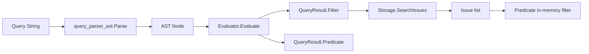

# query_evaluator 模块深度解析

`query_evaluator` 的存在意义，可以用一句话概括：它把“用户写的查询语句”变成“存储层可执行的过滤条件”，并在必要时补上一段内存谓词逻辑，保证语义正确。朴素方案是“所有查询都拉全量 issue 再在内存里过滤”，这当然最容易写，但在真实数据量下会很慢；另一种极端是“只支持存储层原生过滤”，性能好但表达力不足（尤其是复杂 `OR/NOT` 组合）。这个模块选择了中间路线：**能下推就下推，不能下推就混合执行**。这就是它的核心设计洞察。

## 架构角色与数据流



在整个 Query Engine 中，`query_evaluator` 扮演的是“执行计划编排器（planner + transformer）”的角色，而不是 parser 或 storage adapter。上游 [query_parser_ast](query_parser_ast.md) 负责把字符串变 AST，下游 [storage_contracts](storage_contracts.md) 的 `Storage.SearchIssues(ctx, query, filter)` 负责按 `IssueFilter` 走存储查询。`Evaluator` 站在中间，决定这次查询是“纯 Filter 执行”还是“Filter 预筛 + Predicate 精筛”。

关键路径在代码里非常清晰：`EvaluateAt(query, now)` 先调用 `Parse(query)`，得到 `Node` 后创建 `NewEvaluator(now)`，再进入 `(*Evaluator).Evaluate(node)`。`Evaluate` 首先运行 `canUseFilterOnly` 做可下推判定：如果 AST 形态完全可表达为 `types.IssueFilter`，就走 `buildFilter`；否则走 `buildPredicate`，并用 `extractBaseFilters` 做 best-effort 预筛。这个“先判定执行模式，再生成执行工件”的两阶段流程，就是模块最核心的运行时心智模型。

## 这个模块到底解决了什么问题

如果把查询执行比作物流系统，`IssueFilter` 像“仓库分拣规则”，`Predicate` 像“人工复检工位”。仓库规则快、规模化，但规则集有限；人工复检慢，但几乎什么规则都能判。

`query_evaluator` 解决的是这两个世界的拼接问题：

1. 如何把 AST 映射到 `types.IssueFilter` 的字段合同（例如 `status=open` -> `filter.Status`，`priority>1` -> `filter.PriorityMin=2`）。
2. 当表达式超出过滤器表达能力（典型是跨字段 `OR`、复杂 `NOT`）时，如何生成一个正确的布尔求值函数。
3. 在必须走谓词时，如何仍然尽可能利用过滤器缩小候选集，避免“全量扫描 + 全量谓词”。

因此它不是简单的 AST visitor，而是一个“小型查询计划器”。

## 心智模型：一个“分两段执行的查询编译器”

推荐把 `Evaluator` 理解为一个非常轻量的“编译器后端”。输入是 AST，输出不是机器码，而是两个可执行工件：`IssueFilter` 与 `func(*types.Issue) bool`。

- 当语句足够“结构化且可下推”时，只生成 `IssueFilter`，`Predicate=nil`。
- 当语句表达力超过过滤器边界时，生成 `Predicate`，同时抽取一部分安全的基础过滤条件。

这也解释了 `QueryResult` 的设计：它不是“查询结果数据”，而是“查询执行计划”。`RequiresPredicate` 明确告诉调用方是否必须做内存二次过滤，避免调用方猜测 `Predicate` 是否该执行。

## 组件深潜

### `QueryResult`

`QueryResult` 有三个字段：`Filter`、`Predicate`、`RequiresPredicate`。设计上最重要的点是三者之间的契约关系：`Filter` 总是存在；`Predicate` 可空；`RequiresPredicate` 是显式执行信号。即使在复杂查询里，`Filter` 仍会被填充基础条件，这使调用方可以稳定地先走 `SearchIssues`，再按需执行谓词。

这种“稳定输出形状”比“复杂查询时只返回 predicate”更易集成，因为调用方流水线无需分叉太多。

### `Evaluator` 与 `NewEvaluator(now)`

`Evaluator` 只保存一个 `now time.Time`。这个看起来很小的设计，实际解决了测试稳定性和相对时间语义一致性问题。比如 `updated>7d`，如果每次比较都临时 `time.Now()`，一次查询内不同 issue 可能使用不同基准时刻；而注入固定 `now` 后，整次查询有一致时间坐标，并且 `EvaluateAt` 可以在测试中复现实例（`query_test.go` 就这样做）。

### `Evaluate(node Node)`：执行模式选择器

`Evaluate` 是主入口，内部策略是“先 fast-path，再 fallback”。它先创建空 `IssueFilter`，调用 `canUseFilterOnly`。若可纯过滤，直接 `buildFilter` 返回；否则 `buildPredicate`，并设置 `RequiresPredicate=true`，最后执行 `extractBaseFilters`。

这里的非显然设计是：复杂查询并不意味着放弃 filter。`extractBaseFilters` 在 `AND` 链和简单比较上尽量提取可下推条件，且对不兼容条件采用“忽略错误继续”的 best-effort 策略。这是一种典型的 planner 思维：**宁可少优化，也不能错过滤**。

### `canUseFilterOnly` / `canUseLabelsAnyOptimization` / `collectOrLabels`

`canUseFilterOnly` 的判定规则体现了当前存储过滤能力边界。`ComparisonNode` 与 `AND` 链通常可下推；`NOT` 仅允许某些字段（`status`、`type`）的等值取反；`OR` 通常不行，但提供了一个特化优化：若整棵 OR 链全部是 `label=...`，可映射到 `IssueFilter.LabelsAny`。

`collectOrLabels` 是这个优化的关键。它递归检查 OR 子树，一旦发现任何非 `label/labels` 等值比较，就返回 `nil`，保证不会把不等价表达式误映射成 `LabelsAny`。

### `buildFilter` + `applyComparison`：AST 到 `IssueFilter` 的映射层

`buildFilter` 递归遍历 AST，真正做字段语义映射的是 `applyComparison` 及一组 `applyXxxFilter`。从架构角度看，这是一层“字段语义适配器”，把 query DSL 翻译到 `types.IssueFilter` 合同。

比较有代表性的映射包括：

- `priority<3` -> `PriorityMax=2`，`priority>1` -> `PriorityMin=2`，这是把不等式变成区间过滤。
- `id=bd-*` -> `IDPrefix="bd-"`，把通配语义下推为前缀匹配。
- `created=2025-02-01` -> 同日 `[dayStart, dayEnd)` 区间过滤，而非时间戳完全相等。
- `metadata.<key>=<value>` 与 `has_metadata_key=<key>`：先经过 `storage.ValidateMetadataKey` 校验后写入 `MetadataFields` / `HasMetadataKey`。

注意这里存在一个有意取舍：某些语义在 filter 模式被主动拒绝，例如 `owner` 在 `applyOwnerFilter` 中直接返回“requires predicate mode”。这表示底层过滤合同当前没有对应能力，模块通过报错驱动上层进入 predicate 路径，而不是静默降级成错误语义。

### `applyNot`

`NOT` 在 filter 模式是受限的：只支持 `NOT status=...` 与 `NOT type=...`。它们分别映射到 `ExcludeStatus` 和 `ExcludeTypes`。对于其他字段 `NOT`，函数直接报错。

这限制看似保守，但保证了下推后语义是确定且安全的；否则容易出现德摩根转换不完整导致误筛。

### 时间处理：`parseTimeValue` / `parseDurationAgo` / `compareTime`

时间相关逻辑是这个模块最容易踩坑的部分。`parseTimeValue` 根据 `ComparisonNode.ValueType` 分流：若是 `TokenDuration`，按“距 now 的过去时间”解释（`7d` -> `now-7d`）；否则调用 `timeparsing.ParseRelativeTime`。

`timeparsing.ParseRelativeTime`（见 [range_expression_engine](range_expression_engine.md) 之外的时间解析实现，源码在 `internal/timeparsing/parser.go`）采用分层策略：紧凑 duration、绝对时间、自然语言。`query_evaluator` 借这个能力支持 `updated>tomorrow`、`created<2025-01-15` 等表达。

`compareTime` 对 `OpEquals` 做“同一天”比较，而不是 `time.Equal`。这与 `applyCreatedFilter` 等在 filter 模式里把等值展开为天区间保持一致，是一个重要的跨路径语义对齐点。

### `buildPredicate` / `buildComparisonPredicate`

当查询不能纯 filter 表达时，`buildPredicate` 递归生成闭包并组合布尔逻辑：`AND` 组合两个谓词，`OR` 组合两个谓词，`NOT` 包装取反。你可以把它看成把 AST 重新“解释执行”一遍。

`buildComparisonPredicate` 与 `applyComparison` 形成一对镜像分发器：前者面向内存 Issue 对象字段，后者面向 `IssueFilter`。新增查询字段时，通常需要在这两边同时扩展，否则会出现“filter-only 可用 / predicate 不可用”或反过来的不一致。

### 元数据谓词：`buildMetadataPredicate` / `buildHasMetadataKeyPredicate`

这两个函数专门处理 OR/复杂表达式下 metadata 场景。实现策略是运行时解析 `issue.Metadata` JSON，读取顶层 key 后比较。

这里有个明显的性能-正确性折中：每次谓词调用都 `json.Unmarshal`，性能不是最优，但实现简单、语义直接，且只在 predicate 路径触发（通常是复杂查询，候选集已经被基础 filter 缩小）。如果未来 metadata 查询成为热点，可考虑缓存或在存储层增强下推能力。

### 便捷入口：`Evaluate` 与 `EvaluateAt`

包级 `Evaluate(query)` 只是 `EvaluateAt(query, time.Now())` 的语法糖。`EvaluateAt` 的作用是把 parser 与 evaluator 串起来：先 `Parse(query)`，再 `NewEvaluator(now).Evaluate(node)`。

这个分层让 API 同时满足两类需求：普通业务走 `Evaluate`，测试/可复现执行走 `EvaluateAt`。

## 依赖关系与数据契约分析

从现有代码可确认的调用关系如下：

- `query_evaluator` 调用 [query_parser_ast](query_parser_ast.md) 的 `Parse`、并依赖 AST 类型 `Node` / `ComparisonNode` / `AndNode` / `OrNode` / `NotNode` 与 `ComparisonOp`。
- `query_evaluator` 调用 `internal/timeparsing.ParseRelativeTime` 与 `ParseCompactDuration` 完成时间解释。
- `query_evaluator` 调用 `storage.ValidateMetadataKey` 约束 metadata key 合法性。
- `query_evaluator` 输出 `types.IssueFilter`，契约目标是 [storage_contracts](storage_contracts.md) 的 `Storage.SearchIssues(ctx, query, filter)`。
- `Predicate` 的输入契约是 `*types.Issue`，字段读取覆盖 `Status/Priority/IssueType/Assignee/Owner/Labels/CreatedAt/UpdatedAt/ClosedAt/Metadata` 等。

关于“谁调用 `EvaluateAt`”这一点，在当前提供组件里能明确看到 parser 与 evaluator 的直接关系、以及 storage 的过滤合同，但没有给出完整函数级 `depended_by` 列表，因此无法在这里精确点名某个 CLI 命令函数。可以确定的是，任何需要把 query string 转为 `IssueFilter + 谓词` 的上游都会依赖该入口。

## 设计决策与权衡

这个模块最关键的权衡是“简单统一 vs 执行效率”。团队没有选择“永远 predicate”这条最简单路径，而是选择了双模式执行，代码复杂一些，但大多数简单查询可直接下推到存储层，吞吐更好。

第二个权衡是“表达力 vs 可下推性”。比如 `OR` 大多不能下推，但对 `label=... OR label=...` 做了专门优化映射到 `LabelsAny`。这是典型的热点特化：不追求通用 OR 下推，而是抓住常见场景做低风险优化。

第三个权衡是“严格语义边界 vs 用户宽容”。模块对字段与操作符组合限制非常明确，遇到不支持就报错，而不是尝试“猜测用户意图”。这提高了可预期性，但会让某些输入看起来“明明像能查，为什么报错”。

第四个权衡是“性能 vs 实现复杂度”在 metadata predicate 上的体现：选择每次解析 JSON，保证行为直观且局部闭环，代价是复杂查询下的 CPU 成本。

## 使用方式与常见模式

典型调用方式如下：

```go
result, err := query.EvaluateAt("(status=open OR status=blocked) AND priority<2", now)
if err != nil {
    return err
}

issues, err := store.SearchIssues(ctx, "", result.Filter)
if err != nil {
    return err
}

if result.RequiresPredicate {
    filtered := make([]*types.Issue, 0, len(issues))
    for _, is := range issues {
        if result.Predicate(is) {
            filtered = append(filtered, is)
        }
    }
    issues = filtered
}
```

如果你不需要固定时间基准，可用便捷入口：

```go
result, err := query.Evaluate("updated>7d AND label=backend")
```

新增字段时的安全扩展路径通常是：先在 parser 层确认字段名可被词法/语法接受（字段本身 parser 不做语义校验），然后在 evaluator 的 `applyComparison` 和 `buildComparisonPredicate` 同步增加分支，并补充对应测试。

## 新贡献者最该注意的边界与坑

第一个坑是 filter 与 predicate 语义漂移。很多字段在两条路径都有实现，修改一边忘记另一边，会产生“同一个查询在不同执行模式下结果不一致”。尤其是时间等值、空值语义（`none/null`）和大小写比较（`EqualFold`）这些细节。

第二个坑是 `extractBaseFilters` 的“忽略错误”策略。它是优化，不是语义主路径。你不能依赖它抛错来阻止非法表达式；真正的错误应在 `buildPredicate` 或前序阶段保证。这里若误加“激进提取”可能导致过筛（false negative），这是比性能退化更严重的问题。

第三个坑是 `NOT` 支持范围。filter 模式下非常受限；如果扩展 `NOT` 下推，一定要明确等价变换和存储过滤能力，否则很容易错。

第四个坑是时间解释的参考时刻。`Evaluate()` 使用 `time.Now()`，而 `EvaluateAt()` 可注入固定时间。写测试或重放查询时应优先使用 `EvaluateAt()`，否则结果会漂移。

第五个坑是 metadata key 校验依赖 `ValidateMetadataKey`（格式 `[a-zA-Z_][a-zA-Z0-9_.]*`）。不要绕过校验直接写入 `MetadataFields`，否则会破坏与存储层的一致约束。

## 参考阅读

- AST 结构与解析优先级： [query_parser_ast](query_parser_ast.md)
- Token 词法规则： [query_lexer](query_lexer.md)
- `IssueFilter` 与 `Issue` 数据合同： [query_and_projection_types](query_and_projection_types.md)、[issue_domain_model](issue_domain_model.md)
- 存储查询接口： [storage_contracts](storage_contracts.md)
- Metadata key 规则： [metadata_validation](metadata_validation.md)
