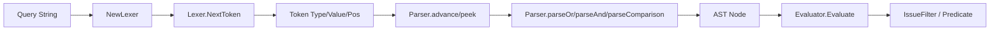

# query_lexer 模块深度解析

`query_lexer` 的职责可以用一句话概括：**把“人写的查询字符串”翻译成“解析器能稳定消费的词法 token 流”**。它像机场安检前的分拣台——先把混在一起的文本（字段名、运算符、字符串、数字、时长、括号）拆成标准化小件，后面的 [query_parser_ast](query_parser_ast.md) 才能按优先级和语法规则拼 AST。没有这一层，Parser 就得一边读字符一边做语法判断，错误定位和扩展都会迅速变复杂。

## 架构定位与数据流



在调用链上，关键路径是：`EvaluateAt(query, now)` -> `Parse(query)` -> `NewParser(input)` -> `NewLexer(input)`，随后 `Parser.advance()` 和 `Parser.peek()` 反复调用 `Lexer.NextToken()` 拉取 token。也就是说，`query_lexer` 是 Query Engine 的“入口变压器”：它不理解业务语义（例如 status 是否合法），只保证语法颗粒度正确，供 Parser 进行结构化解释，再由 Evaluator 进行语义与执行策略决策。

一个重要直觉是：**Lexer 输出是契约，不是建议**。例如 Parser 的 `parseComparison()` 强依赖“字段必须是 `TokenIdent`、操作符必须是比较类 token、值必须是 `TokenIdent/TokenString/TokenNumber/TokenDuration` 之一”。如果 Lexer 改变 token 分类规则，Parser 会直接失配。

## 心智模型：一个最小状态机 + 单向游标

理解这个模块最有效的模型是：**它维护一个单向游标，在输入字符串上逐字符推进；每次决定“当前字符触发哪种读取子程序”**。核心状态是 `Lexer{input, pos, width}`：

- `pos`：当前读取位置（字节索引）
- `width`：上一次读取宽度（当前实现恒为 1）
- `next/peek/backup`：前进、预读、回退一格

`NextToken()` 是调度中心：
先 `skipWhitespace()`，再看第一个非空白字符属于哪一类：
- 单字符/双字符运算符与分隔符：`(` `)` `,` `=` `!=` `<` `<=` `>` `>=`
- 引号开头：进入 `readString()`
- 数字或符号 `+/-` 开头：进入 `readNumberOrDuration()`
- 标识符起始：进入 `readIdent()`
- 其余：直接报错并带位置

这套设计的价值在于把复杂度局部化：字符串转义只在 `readString()` 处理；时长后缀判断只在 `readNumberOrDuration()` 处理；关键字识别只在 `readIdent()` 处理。

## 核心组件深挖

### `Token` 与 `TokenType`

`Token` 结构是 `{Type, Value, Pos}`。其中 `Pos` 是错误消息和调试体验的关键——Parser 的大多数错误都能回报“位置 + 期望类型”。`TokenType` 定义了词法层面的完整字母表，包括布尔关键字、比较运算符、括号、逗号、字符串、数字、时长、EOF。

`TokenType.String()` 的存在不只是美化日志；Parser 报错时会直接打印 token 类型，这降低了排查语法问题的成本。

### `Lexer`

`Lexer` 本身刻意保持轻量、可变状态、单线程语义。它不是可复用迭代器工厂，而是一次性扫描器：创建一次，消费到 EOF。

`NewLexer(input string)` 不做预校验，意味着“尽早返回”策略：只有真正扫描到异常字符时才失败。这让 happy path 更快，也让错误上下文更准确。

### `NextToken()`：热路径

这是最频繁调用的方法，也是模块最热路径。几个非显然设计点：

1. `!` 只允许组成 `!=`，单独出现会给出提示“did you mean '!=' or 'NOT'?”，这是面向用户输入错误的引导型报错。
2. `+/-` 会先假定数值入口，再在 `readNumberOrDuration()` 里强制“符号后必须是数字”，避免把 `-foo` 误判成标识符。
3. 返回 `TokenEOF` 而不是 `nil`，让上层循环 (`Tokenize` 或 Parser advance) 无需特殊终止协议。

### `readString(quote rune, startPos int)`

支持单引号和双引号，支持 `\n`, `\t`, `\\`, `\"`, `\'`。如果转义序列未知，不报错，按“原字符”写入（如 `\x` -> `x`）。这是一种容错优先选择：减少用户输入因小转义差异而失败，但也意味着它不是严格字符串语法校验器。

### `readNumberOrDuration(startPos int)`

先读可选号，再读连续数字；若紧跟单字符时长后缀（`h/d/w/m/y`，大小写都可）则产出 `TokenDuration`，否则 `TokenNumber`。

注意这是“紧凑时长”语法（如 `7d`），不是通用 duration 语法。`7days` 不会被识别为 duration。

### `readIdent(startPos int)`

标识符首字符限制为字母或 `_`，后续可包含字母、数字、`_`、`-`、`.`。然后对完整值做 `strings.ToUpper` 判定 `AND/OR/NOT`，因此关键字大小写不敏感；但 `Token.Value` 保留原始大小写。

这保证了 `status=open and priority>1` 也能被正确词法化。

### `Tokenize()`

批量模式接口，持续调用 `NextToken()` 直到 `TokenEOF`。Parser 本身是按需拉 token（`advance/peek`），所以 `Tokenize()` 更多用于测试、调试或离线检查。

## 依赖与契约分析

`query_lexer` 对外部依赖非常薄：仅 `fmt`、`strings`、`unicode`。它不触碰存储层、不触碰业务类型。

但它对上游/下游契约很强：

- 下游 [query_parser_ast](query_parser_ast.md) 依赖它的 token 分类稳定性。
  - `parseOr/parseAnd/parseNot` 依赖 `TokenOr/TokenAnd/TokenNot`
  - `parseComparison` 依赖值类型落在 `TokenIdent/TokenString/TokenNumber/TokenDuration`
- 更上层 [query_evaluator](query_evaluator.md)（若文档存在）间接受益于 `TokenDuration`，因为 Parser 会把 `ValueType` 保留下来，Evaluator 的 `parseTimeValue` 据此决定是按 compact duration 还是相对时间解析。

因此，这个模块虽然小，但处在“语法入口 choke point”：改动少量规则即可影响整个查询链路。

## 设计取舍

当前实现整体偏向**简单、可读、可维护**，而非“语法最强”或“unicode 最完备”。

第一，采用手写扫描器而非正则大拼接或生成器工具。收益是行为可控、报错可定制、扩展点明确；代价是需要手工维护状态机细节。

第二，词法层显式区分 `TokenDuration` 与 `TokenNumber`。这让 Evaluator 无需猜测 `7d` 是否是字符串，提高语义层正确性；代价是词法规则要承担一点业务约定（时长后缀集合）。

第三，关键字识别内建（`AND/OR/NOT`）。这简化 Parser；但意味着这些词不能以裸标识符语义出现（若需要可用引号包裹）。

## 新贡献者最该注意的坑

最容易踩坑的是字符处理边界：`next()` 按字节读取并将其转成 `rune`，`width` 固定为 1。这对 ASCII 查询语法没问题，但**不是完整 UTF-8 rune 扫描**。如果未来要支持更复杂的多字节标识符规则，`next/peek/backup/pos` 必须一起重构。

其次，`TokenComma` 已定义且 Lexer 能产出，但当前 Parser 的 `parseComparison()` 还不消费列表语法。也就是说，词法层为潜在能力预留了空间，语法层尚未接入；修改其中一侧时要检查另一侧是否同步演进。

再者，错误位置是以字节偏移表示，不是“可视字符列号”。在含多字节字符输入时，用户看到的位置可能与终端列数不完全一致。

最后，若你新增一个字段语法（例如新运算符或新字面量），要把这条链路成套打通：Lexer token 类型 -> Parser 可接受值类型/运算符 -> Evaluator 过滤与谓词语义 -> `query_test.go` 覆盖正反例。仅改 Lexer 通常不够。

## 使用示例

```go
// 增量拉取 token（Parser 内部就是这种模式）
lex := NewLexer(`(status=open OR status=blocked) AND updated>7d`)
for {
    tok, err := lex.NextToken()
    if err != nil {
        panic(err)
    }
    if tok.Type == TokenEOF {
        break
    }
    fmt.Printf("%s %q @%d\n", tok.Type.String(), tok.Value, tok.Pos)
}
```

```go
// 一次性词法化（测试/调试更常用）
lex := NewLexer(`title="hello world" AND priority<=2`)
tokens, err := lex.Tokenize()
if err != nil {
    // handle lexer error
}
_ = tokens
```

## 相关模块

- 语法层与 AST 构建： [query_parser_ast](query_parser_ast.md)

