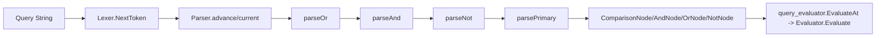

# query_parser_ast 深度解析

`query_parser_ast` 模块的核心价值，是把用户输入的查询字符串（例如 `status=open AND priority>1`）变成一棵**结构化的语法树（AST）**，让后续执行层可以“按结构理解语义”，而不是靠脆弱的字符串拼接与正则猜测。你可以把它想成一个“海关分拣中心”：Lexer 先把原始文本拆成标准包裹（Token），Parser 再按优先级规则把包裹装进正确货架（AST 节点）。没有这层 AST，后续 [query_evaluator](query_evaluator.md) 很难安全地处理 `AND/OR/NOT/括号` 的组合语义，也很难给出准确错误位置。

## 架构角色与数据流



在架构上，这个模块是 Query Engine 的**语法前端（front-end transformer）**。它不做业务过滤、也不访问存储；它只负责把“字符序列”变成“语义结构”。

端到端关键路径如下：

1. 上游传入 query string，通常通过 `Parse(input)` 这个便捷函数进入。
2. `Parse(input)` 内部创建 `NewParser(input)`，然后调用 `(*Parser).Parse()`。
3. `Parser` 通过 `advance()`（以及可选的 `peek()`）从 [query_lexer](query_lexer.md) 的 `Lexer.NextToken()` 拉取 token 流。
4. `(*Parser).Parse()` 按固定优先级链路调用：`parseOr -> parseAnd -> parseNot -> parsePrimary -> parseComparison`。
5. 产出根节点 `Node`（可能是 `ComparisonNode`、`AndNode`、`OrNode`、`NotNode` 的组合）。
6. 下游 [query_evaluator](query_evaluator.md) 在 `EvaluateAt()` 中调用 `Parse(query)`，拿到 AST 后再决定是纯 `IssueFilter` 还是 `Predicate` 模式执行。

这条路径里最“热”的调用是 `advance()` 与各层 `parse*` 递归/循环；它们决定了语法正确性和错误定位质量。

## 心智模型：一条“优先级传送带”

理解这个模块最有效的方式，是把它看成一条分层传送带：

- 最外层 `parseOr` 负责最低优先级（`OR`）。
- 中层 `parseAnd` 负责中优先级（`AND`）。
- 内层 `parseNot` 负责一元操作（`NOT`）。
- 最内层 `parsePrimary` 处理原子单元（括号表达式或比较表达式）。

这就是经典递归下降（recursive descent）解析策略。它的设计意图不是“炫技”，而是把优先级和结合性写进代码结构本身，读代码就能读出语法规则。

## 组件深潜

### `Node`（interface）

`Node` 定义了 AST 的公共协议：

- `node()`：marker method，用于把非 AST 类型排除在外。
- `String() string`：用于可读化输出（调试、测试断言、日志）。

设计上采用 marker method 而不是空接口，是为了让类型系统帮助收敛 AST 范围，减少“误把别的结构当语法节点”这种错误。

### `ComparisonNode`（struct）

这是查询原子表达式，例如 `status=open`。字段包括：

- `Field string`
- `Op ComparisonOp`
- `Value string`
- `ValueType TokenType`

最重要的设计点是 `ValueType`。它保留了词法阶段的类型信息（`TokenIdent/TokenString/TokenNumber/TokenDuration`），这样下游 evaluator 在处理时间、数字、字符串时不必再猜测原始字面量类别，尤其对 `updated>7d` 这类场景很关键。

### `AndNode` / `OrNode` / `NotNode`

这三个节点是布尔组合层：

- `AndNode{Left, Right}`
- `OrNode{Left, Right}`
- `NotNode{Operand}`

`AndNode` 与 `OrNode` 都是二叉结构，解析中使用循环逐步折叠，因此形成左结合树（例如链式 `a AND b AND c` 变成 `((a AND b) AND c)`）。`NotNode` 是一元节点，`parseNot()` 递归调用自身，因此 `NOT` 是右结合（代码注释已明确）。

### `Parser`（struct）

`Parser` 持有三个状态：

- `lexer *Lexer`
- `current Token`
- `peeked *Token`

这是一个小型单 token 缓冲的流式解析器。`advance()` 负责前进；`peek()` 提供“看一眼但不消费”的能力。当前实现中主要使用 `advance()` 路径，`peek()` 是明显的扩展预留点（例如未来加入更复杂语法时进行前瞻判断）。

### `NewParser(input string) *Parser`

构造函数非常薄，只做依赖装配：`lexer: NewLexer(input)`。这保持了 parser 的职责单一：它依赖 token 流，不关心字符串扫描细节。

### `(*Parser).Parse() (Node, error)`

这是模块入口。内部流程有三个关键防线：

1. 首次 `advance()` 拉取首 token；
2. `TokenEOF` 立即报 `empty query`，避免空输入落入模糊语义；
3. 完成 `parseOr()` 后强校验 `current` 必须是 `TokenEOF`，否则报 `unexpected token ... (expected end of query)`。

第三点尤其重要：它防止“前缀合法、尾部垃圾被悄悄忽略”的隐性错误。

### `advance()` 与 `peek()`

`advance()` 优先消费 `peeked`，否则调用 `lexer.NextToken()`。`peek()` 则在无缓存时从 lexer 读取并缓存。两者共同维护“消费/不消费”的 token 语义边界。

设计取舍是：只维护一个 token 的 lookahead，复杂度低、性能稳定；代价是某些需要多 token 前瞻的语法未来需要调整结构。

### `parseOr()`, `parseAnd()`, `parseNot()`, `parsePrimary()`, `parseComparison()`

这五层构成完整语法骨架：

- `parseOr()`：先吃 `parseAnd()`，再在 `TokenOr` 循环里持续折叠。
- `parseAnd()`：同理处理 `TokenAnd`。
- `parseNot()`：遇到 `TokenNot` 时先前进，再递归解析 operand。
- `parsePrimary()`：优先处理括号子表达式；否则走比较表达式。
- `parseComparison()`：强约束 `field op value` 三段式，并在 field 侧做 `strings.ToLower()` 归一化。

这里一个非显而易见但很关键的点是：**字段名在解析期被 lower-case 归一化**，而值不做统一降级。这与下游 evaluator 的字段分发逻辑（按小写字段名 switch）直接耦合，能减少大小写分支复杂度。

### `Parse(input string) (Node, error)`（包级便捷函数）

这是对 `NewParser + Parser.Parse` 的封装，给调用方一个无状态入口。下游最典型调用在 [query_evaluator](query_evaluator.md) 的 `EvaluateAt()`。

### `KnownFields`（变量）

`KnownFields` 提供了可查询字段白名单及别名（如 `desc`、`created_at`、`labels`、`spec_id`）。它的存在表达了语义层面的“合法字段集合”。

需要注意：在 `parser.go` 中，`parseComparison()` **并未**直接使用 `KnownFields` 做校验；字段合法性是在 evaluator 阶段由 `applyComparison` / `buildComparisonPredicate` 决定（未知字段会报 `unknown field`）。这是一种“语法与语义分离”的设计选择。

## 依赖关系与契约分析

从当前代码可确认的依赖关系是：

- 本模块调用：
  - [query_lexer](query_lexer.md) 的 `NewLexer`、`Lexer.NextToken`；
  - `Token` / `TokenType`（包括 `TokenIdent`, `TokenString`, `TokenNumber`, `TokenDuration`, `TokenAnd`, `TokenOr`, `TokenNot`, 括号和比较运算符 token）。
- 调用本模块：
  - [query_evaluator](query_evaluator.md) 的 `EvaluateAt()` 直接调用 `Parse(query)`，并依赖 AST 节点类型（`ComparisonNode`、`AndNode`、`OrNode`、`NotNode`）做后续过滤构建。

核心数据契约包括：

1. **Token 契约**：parser 假设 lexer 会提供正确的 token 序列和 `Pos` 位置信息；错误消息直接使用 `Pos`。
2. **字段归一化契约**：parser 输出的 `ComparisonNode.Field` 一律小写；evaluator 按小写字段分支。
3. **值类型契约**：`ComparisonNode.ValueType` 保留词法类型；evaluator 用它区分 duration/time 等解释路径。

如果上游 lexer 改了 token 命名或关键字判定，parser 的 `switch p.current.Type` 会立即失配；如果下游 evaluator 不再按小写字段处理，则 parser 的 `strings.ToLower` 语义需要同步调整。

## 关键设计决策与权衡

### 1) 递归下降而非生成器/parser-combinator

选择递归下降让优先级与语法结构直观落在函数层级里，可维护性强、调试直接。代价是语法扩展需要手工改多处 `parse*` 函数，但对于当前语言规模（布尔组合 + 比较）这是合适折中。

### 2) AST 与执行解耦

parser 只关心“能否构成合法语法”，不关心“字段是否业务合法”。这降低 parser 复杂度并提升复用性。代价是某些错误（如未知字段）会在 evaluator 才暴露，而不是 parse 阶段立即报错。

### 3) 单 token lookahead

实现简单，内存/逻辑开销低。对于现有语法足够，但未来若加入更复杂结构（例如函数调用、列表字面量的歧义处理）可能需要更强前瞻机制。

### 4) 解析阶段字段降级（lowercase）

这把“字段名大小写不敏感”的策略前移到 AST 层，简化后续语义分发。代价是保留原始字段写法的能力消失（若未来要做“原样回显”或精细错误提示，需额外存储原值）。

## 使用方式与示例

最常见入口是包级 `Parse`：

```go
node, err := query.Parse("(status=open OR status=blocked) AND priority<2")
if err != nil {
    // 处理语法错误
}
fmt.Println(node.String())
// 输出: ((status=open OR status=blocked) AND priority<2)
```

如果你要在更大流程中直接执行查询，通常走 evaluator 入口（其内部会调用 parser）：

```go
result, err := query.EvaluateAt("updated>7d AND status=open", now)
if err != nil {
    // 可能是 parse error，也可能是语义/字段 error
}
_ = result
```

## 新贡献者需要特别注意的点

第一，`KnownFields` 在 parser 中不是强校验源，别误以为“加了字段就能直接生效”。真正的执行语义还要在 evaluator 的 `applyComparison` 与 `buildComparisonPredicate` 对应分支补齐。

第二，操作符支持是**字段相关**的，不是全局统一。parser 允许语法上出现多种比较符，但 evaluator 对具体字段会限制（例如某些字段仅支持 `=` 或 `!=`）。所以新增字段时必须明确其操作符矩阵。

第三，错误位置信息依赖 lexer `Token.Pos`。如果你调整 lexer 的字符推进策略，可能影响 parser 报错体验。

第四，`parseNot()` 的右结合特性是有意设计，不要随意改成循环，否则会改变 AST 形态，进而影响 evaluator 的逻辑等价性假设。

第五，当前 AST 节点的 `String()` 主要用于调试与测试快照，不应当被当作稳定序列化格式对外承诺。

## 边界条件与已知限制

- 空查询会在 `Parser.Parse()` 直接报 `empty query`。
- 括号不匹配会在 `parsePrimary()` 报 `expected ')' ...`。
- 比较表达式必须严格是 `field op value`。
- parser 不负责字段合法性与业务语义合法性，这些错误会下沉到 evaluator。
- 虽有 `TokenComma`，但在当前 parser 语法中没有消费逗号列表的规则。

## 参考阅读

- 词法规则与 token 定义： [query_lexer](query_lexer.md)
- AST 执行与过滤策略： [query_evaluator](query_evaluator.md)
