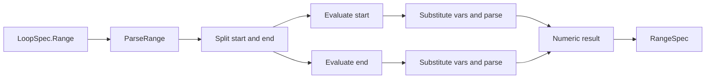

# range_expression_engine 模块深度解析

`range_expression_engine`（代码在 `internal/formula/range.go`，包名 `formula`）本质上是 Formula 系统里的“微型数学解释器”。它解决的不是通用计算问题，而是一个很具体、很关键的问题：当 `LoopSpec.Range` 允许写成 `"1..2^{disks}"` 这类表达式时，系统必须在运行前把这段字符串稳定地变成可迭代的整数边界。如果没有这个模块，循环只能支持硬编码常量；而一旦支持变量和运算，朴素的 `strings.Split("..") + strconv.Atoi(...)` 就立刻失效。

## 1) 这个模块解决了什么问题

在 Formula 里，循环不只是 `count: 10` 这种固定次数，还支持 `range: "start..end"` 的计算边界。边界可能是常量、变量，或者带运算符的表达式。问题在于：调用方需要的是确定的整数区间，而作者提供的是带语义的文本表达式。这个模块的职责就是完成这次“语义降维”——从字符串 DSL 到 `RangeSpec{Start, End}`。

更重要的是，它把错误尽量前置并结构化：空表达式、格式错误、非法字符、除零、括号不匹配等，都在解析阶段给出可定位错误，而不是等到循环展开时出现不可解释行为。

## 2) 心智模型：两层解析器，像“先切区间，再算两端”

可以把它想成一个两级流水线。

第一级是“区间外壳解析”：`ParseRange` 先确认整体长得像 `start..end`，把左右两端表达式拆出来。

第二级是“表达式求值”：每一端交给 `EvaluateExpr`，它先做变量替换（`{name}` -> 值），再分词（tokenize），再用递归下降解析器按优先级计算结果。

这个设计和编译器很像：先做语法框架，再处理内部表达式。好处是模块边界清晰，错误信息也更具体（例如“start 端失败”还是“end 端失败”）。

## 3) 架构角色与数据流



从 Formula Engine 的模块关系看，它是一个**纯转换/验证子模块**：输入是字符串和变量 map，输出是 `RangeSpec` 或错误；它不依赖存储、不依赖执行引擎状态。

和其他模块的连接点主要有两处：

- 上游语义来源是 [formula_schema_and_composition](formula_schema_and_composition.md) 中 `LoopSpec.Range`（注释明确支持表达式和变量）。
- 配方加载与实例化流程在 [formula_loading_and_resolution](formula_loading_and_resolution.md) 中组装公式对象，随后运行期会在需要展开范围循环时使用本模块（`LoopSpec` 注释写明 range 在 cook time 计算）。

> 说明：当前提供的信息没有完整 `depended_by` 函数级图，所以“具体哪一个函数调用 `ParseRange`”无法在此精确点名；但字段合同和注释已明确其架构位置。

## 4) 组件深潜（按设计意图）

### `RangeSpec`

`RangeSpec` 非常克制，只保留 `Start` 与 `End`（均为 inclusive）。这是一种有意的“窄接口”设计：下游循环展开只关心边界，不应耦合表达式内部细节。

### `ParseRange(expr string, vars map[string]string) (*RangeSpec, error)`

这是模块主入口，做三件事：清洗输入、拆分区间、分别求值。拆分靠正则 `^(.+)\.\.(.+)$`，意味着它要求至少有一侧字符，不接受空边界。

一个很实用的设计点是错误包装：start 和 end 分别包上上下文（`evaluating range start ...` / `end ...`），排查时能立刻定位是哪一端的问题。

### `EvaluateExpr(expr string, vars map[string]string) (int, error)`

`EvaluateExpr` 是表达式引擎入口。流程是：`substituteVars` -> `tokenize` -> `parseExpr`。内部计算用 `float64`，最后 `int(result)` 返回。这代表一个关键取舍：实现简洁、支持小数中间值，但最终结果会截断而非四舍五入。

### `substituteVars(expr string, vars map[string]string) string`

变量语法是 `{name}`，匹配正则 `\{(\w+)\}`。设计上它对未知变量“保留原样”，而不是立即报错。这让替换函数保持纯文本职责；真正错误会在后续 `tokenize` 遇到 `{` 时暴露。

### `token` / `tokenType` / `tokenize`

这是词法层。支持数字、`+ - * / ^`、括号和 EOF。`-` 处理有两层保险：

- 词法阶段可直接把 `-12` 识别成一个 number token；
- 语法阶段 `parseUnary` 仍支持一元负号。

这种“部分重叠”并不优雅，但能覆盖 `-3` 和 `-(1+2)` 两类输入，降低调用方踩坑概率。

### `exprParser` 与递归下降解析函数族

`parseExpr` 入口调用 `parseAddSub`，再逐级下探到 `parseMulDiv`、`parsePow`、`parseUnary`、`parsePrimary`。本质是手写优先级语法器。

`parsePow` 用递归实现右结合（`2^3^2 = 2^(3^2)`），这是非显然但正确的数学选择。`parseMulDiv` 内部显式拦截除零。`parsePrimary` 负责括号匹配，遇不到右括号会返回 `expected closing parenthesis`。

### `ValidateRange(expr string) error`

`ValidateRange` 是“轻量语法预检”，用于公式校验阶段。它会验证 `start..end` 格式，并用占位变量替换后调用 `tokenize` 检查两端是否合法字符序列。

注意它**不会完整求值**，也**不会完整语法求值**（只 tokenization，不执行 `parseExpr`），因此它的定位是“早期粗筛”，不是“最终正确性证明”。

## 5) 关键设计取舍与为什么这样做

这个模块最明显的取舍是：不用通用表达式库，而用几十行手写解析器。收益是零第三方依赖、语义完全可控、错误文案贴近业务；代价是语法能力有限，未来扩展新操作符要手工维护优先级链。

第二个取舍是把变量替换放在词法前，并对未知变量延迟报错。这让 `substituteVars` 保持简单，也允许上层在不同阶段复用它；但副作用是错误位置不如“变量不存在”那样直观，通常会表现为 `unexpected character '{'`。

第三个取舍是内部 `float64` 计算、外部 `int` 输出。它让幂运算和除法实现非常直接，但也引入精度/截断语义：`5/2` 返回 `2`（截断），不是报错或保留小数。对循环边界来说，这个选择偏“务实”，但调用方必须知晓。

第四个取舍是 `ParseRange` 只负责解析，不强制 `Start <= End`。这把“升序/降序如何处理”的语义留给调用方循环逻辑，实现上解耦，但也意味着新贡献者不能假设这里会自动兜底。

## 6) 使用方式与示例

```go
spec, err := formula.ParseRange("1..2^{n}", map[string]string{"n": "3"})
if err != nil {
    return err
}
fmt.Println(spec.Start, spec.End) // 1 8
```

仅校验语法可用 `ValidateRange`：

```go
if err := formula.ValidateRange("{start}..(2^{k}-1)"); err != nil {
    // 适合在公式加载/校验阶段尽早反馈
}
```

如果你只需要求某一端表达式：

```go
v, err := formula.EvaluateExpr("(2^3 + 1) / 3", nil)
// v == 3（float 结果 3.0 -> int 3）
```

## 7) 新贡献者最该注意的边界与坑

第一，`EvaluateExpr` 最终 `int(result)` 是截断语义。任何非整数结果都会被静默截断，这在范围边界上可能制造 off-by-one。

第二，`ValidateRange` 目前只做分词级检查，不会捕获所有语法问题。例如括号是否配平、表达式是否可完整归约、除零等，仍要以 `ParseRange/EvaluateExpr` 结果为准。

第三，未知变量不会在替换阶段报错，而是在分词时报非法字符。这会让错误信息看起来像“语法错”，本质却是“变量没提供”。

第四，`rangePattern` 使用贪婪匹配；异常输入（如多个 `..`）可能被拆成意外的左右表达式，最终在后续阶段报错。不要把它当作严格 grammar parser。

第五，`parsePow` 支持右结合，这是正确但容易与部分语言直觉不同；写测试时要明确 `2^3^2` 的期望是 `512`。

## 8) 参考阅读

- [formula_schema_and_composition](formula_schema_and_composition.md)：`LoopSpec.Range` 与循环语义定义
- [formula_loading_and_resolution](formula_loading_and_resolution.md)：公式加载、继承、变量与校验流程
- [condition_evaluation_runtime](condition_evaluation_runtime.md)：另一套运行时表达式求值子系统（条件 DSL）
