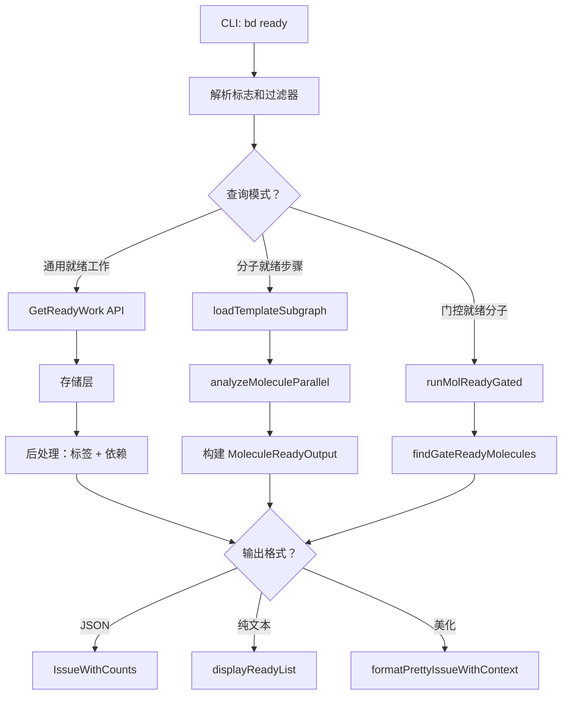

# Ready Work Query 模块技术深度解析

## 概述

`ready_work_query` 模块是 Beads 系统的核心工作发现组件，负责回答一个看似简单但实际非常复杂的问题：**在一个相互依赖的任务网络中，哪些工作现在可以执行？**

这不是一个简单的状态过滤器。该模块处理复杂的依赖关系解析、分子（molecule）工作流协调、门控（gate）等待机制，以及各种任务属性过滤。就像在一个繁忙的机场调度塔台，它从众多航班中找出哪些可以立即起飞，哪些需要等待，哪些航线已经关闭。

## 核心概念与心智模型

### 问题空间

在任务规划系统中，确定"准备就绪"的工作面临几个关键挑战：

1. **依赖复杂性**：任务可能有多个前置依赖，有些可能已完成，有些可能仍然阻塞
2. **状态语义**：简单的 `status=open` 不足以描述任务的可执行性 —— 一个任务可能开放但被其他任务阻塞
3. **工作流结构**：分子（molecule）是包含多个步骤的复合工作单元，需要特殊的并行执行分析
4. **门控同步**：任务可能在等待外部事件（如 CI 运行、PR 合并或人工审核），这些需要特殊处理

### 关键抽象

1. **`WorkFilter`**：可组合的查询规范，封装了所有过滤条件（状态、类型、优先级、标签、元数据等）
2. **`MoleculeReadyStep`**：分子工作流中的可执行步骤，包含并行执行信息
3. **`ParallelInfo`**：描述任务之间的并行执行关系

### 心智模型：餐厅厨房类比

想象一个餐厅厨房：
- **任务** = 待做的菜单项
- **依赖** = 准备步骤（必须先切菜才能炒菜）
- **分子** = 套餐（包含多个协调的菜品）
- **门控** = 等待食材送达或厨师可用

该模块就像厨房经理，评估所有订单，找出哪些现在可以开始烹饪，哪些需要等待，以及哪些可以并行准备以优化厨房吞吐量。

## 架构与数据流



### 主要操作流程

#### 1. 通用就绪工作查询

这是默认模式，用于发现整个系统中的可执行工作：

1. **过滤器构建**：将 CLI 标志（如 `--priority`、`--label`、`--type`）转换为 `types.WorkFilter` 结构体
2. **目录感知标签作用域**：如果未提供标签，应用目录级标签默认值
3. **存储查询**：调用 `activeStore.GetReadyWork(ctx, filter)` 执行阻塞感知查询
4. **后处理增强**：对于 JSON 输出，通过额外查询丰富结果：
   - `GetLabelsForIssues()`
   - `GetDependencyCounts()`
   - `GetDependencyRecordsForIssues()`
   - `GetCommentCounts()`
5. **显示**：渲染为纯文本、美化格式或 JSON

#### 2. 分子就绪步骤查询

当使用 `--mol` 标志时，该模块执行分子特定的就绪分析：

1. **分子解析**：将部分 ID 解析为完整分子 ID
2. **子图加载**：通过 `loadTemplateSubgraph()` 加载整个分子工作流
3. **并行分析**：使用 `analyzeMoleculeParallel()` 确定哪些步骤已就绪
4. **就绪步骤收集**：筛选已就绪的步骤并构建 `MoleculeReadyStep` 记录
5. **输出**：显示包含并行执行信息的结构化结果

## 组件深度解析

### WorkFilter 结构体

`WorkFilter` 是查询模块的核心，封装了丰富的过滤语义。

**主要功能**：
- **状态过滤**：`Status="open"`（默认）排除进行中、已阻塞、已延期的工作
- **属性过滤**：优先级、类型、经办人、标签（AND/OR 语义）
- **层次过滤**：`ParentID` 用于筛选史诗或父任务的子任务
- **元数据过滤**：`MetadataFields` 和 `HasMetadataKey` 支持自定义扩展
- **延期包含**：`IncludeDeferred` 可选择显示未来的延期任务
- **临时包含**：`IncludeEphemeral` 显示短暂存在的 wisp 任务

**设计洞察**：
该结构体使用指针类型（如 `*int`、`*string`）来区分"未设置"和"设置为空值"。这对于正确处理像 `priority=0`（表示 P0 关键优先级）这样的边缘情况至关重要。

### MoleculeReadyStep 结构体

```go
type MoleculeReadyStep struct {
    Issue         *types.Issue  `json:"issue"`
    ParallelInfo  *ParallelInfo `json:"parallel_info"`
    ParallelGroup string        `json:"parallel_group,omitempty"`
}
```

**角色**：表示分子工作流中的单个就绪步骤，包含其并行执行上下文。

**关键字段**：
- `Issue`：实际的任务对象
- `ParallelInfo`：描述该步骤可以与哪些其他步骤并行运行
- `ParallelGroup`：用于分组协调执行的并行组名称（如果有）

### MoleculeReadyOutput 结构体

```go
type MoleculeReadyOutput struct {
    MoleculeID     string               `json:"molecule_id"`
    MoleculeTitle  string               `json:"molecule_title"`
    TotalSteps     int                  `json:"total_steps"`
    ReadySteps     int                  `json:"ready_steps"`
    Steps          []*MoleculeReadyStep `json:"steps"`
    ParallelGroups map[string][]string  `json:"parallel_groups"`
}
```

**角色**：提供分子就绪查询的完整结构化输出，包括整体进度和并行执行机会。

**设计洞察**：
此输出格式专为代理消费设计，使自动化系统能够：
1. 识别就绪的工作
2. 理解并行执行关系
3. 协调多步骤工作流的执行

### 关键函数

#### `buildParentEpicMap()`

```go
func buildParentEpicMap(ctx context.Context, s *dolt.DoltStore, issues []*types.Issue) map[string]string
```

**用途**：构建从子任务 ID 到父史诗标题的映射，用于在美化显示中添加上下文。

**工作流程**：
1. 获取所有就绪任务的依赖记录
2. 识别父子关系（`DepParentChild` 类型）
3. 加载父任务并筛选史诗
4. 返回子任务 ID 到史诗标题的映射

**设计洞察**：
这是一个优化，在单次传递中为多个任务收集父上下文，避免了 N+1 查询问题。

#### `displayReadyList()`

```go
func displayReadyList(issues []*types.Issue, parentEpicMap map[string]string)
```

**用途**：以美化格式显示就绪任务，包含可选的父史诗上下文。

**功能**：
- 显示带有状态和优先级符号的任务
- 包含父史诗标题以提供上下文
- 显示图例帮助用户理解状态符号

#### `runMoleculeReady()`

```go
func runMoleculeReady(_ *cobra.Command, molIDArg string)
```

**用途**：执行分子特定的就绪步骤查询和显示。

**关键步骤**：
1. 使用 `utils.ResolvePartialID()` 解析分子 ID
2. 使用 `loadTemplateSubgraph()` 加载分子子图
3. 使用 `analyzeMoleculeParallel()` 分析并行执行机会
4. 收集就绪步骤
5. 以结构化格式显示结果，突出显示并行执行机会

## 依赖分析

### 入站依赖（调用此模块的组件）

- **CLI 层**：`readyCmd` 和 `blockedCmd` Cobra 命令
- **代理系统**：发现可执行工作的自动化代理

### 出站依赖（此模块调用的组件）

| 依赖 | 用途 |
|------|------|
| `internal.types.types.WorkFilter` | 定义查询参数 |
| `internal.types.types.Issue` | 核心任务数据模型 |
| `internal.types.types.Dependency` | 任务关系模型 |
| `internal.storage.storage.Storage` | 数据访问契约 |
| `internal.storage.dolt.DoltStore` | 具体存储实现 |
| `internal.ui` | 终端显示格式化 |
| `internal.utils` | 辅助函数（ID 解析、标签规范化等） |

### 数据契约

**与存储层的契约**：
```go
GetReadyWork(ctx context.Context, filter types.WorkFilter) ([]*types.Issue, error)
GetBlockedIssues(ctx context.Context, filter types.WorkFilter) ([]*types.BlockedIssue, error)
```

**与并行分析器的契约**：
```go
analyzeMoleculeParallel(subgraph *TemplateSubgraph) *ParallelAnalysis
```

## 设计决策与权衡

### 1. 过滤逻辑的位置：存储层 vs 应用层

**决策**：复杂的阻塞感知过滤在存储层内部实现，而非在应用层后处理。

**理由**：
- **性能**：存储层可以利用索引和高效查询计划
- **正确性**：阻塞语义与数据模型紧密耦合，集中管理更合适
- **一致性**：确保所有消费者（CLI、代理、API）看到相同的就绪工作定义

**权衡**：
- 降低了灵活性（更改过滤语义需要存储层更改）
- 增加了存储实现的复杂度

### 2. 指针与值类型在 WorkFilter 中的使用

**决策**：对可选字段使用指针类型（如 `*int`、`*string`），而非零值哨兵。

**理由**：
- 明确区分"未设置"和"设置为空值"
- 正确处理 `priority=0`（表示 P0，不是未设置）

**权衡**：
- 增加了使用复杂度（需要 nil 检查）
- 引入了轻微的内存开销

### 3. 两步增强模式用于 JSON 输出

**决策**：首先获取就绪任务，然后使用单独的查询增强它们的标签、依赖关系等。

**理由**：
- 关注点分离（过滤 vs 丰富）
- 更简单的存储 API
- 对于不需要丰富数据的消费者更高效

**权衡**：
- N+1 查询模式的潜在风险（尽管已优化为批量查询）
- 潜在的一致性问题（如果数据在查询之间发生变化）

### 4. 目录感知标签默认值

**决策**：如果未明确提供标签，自动应用目录级标签。

**理由**：
- 改善开发人员体验（在 monorepo 中自动限定范围）
- 减少显式标志的需要

**权衡**：
- 隐性行为可能会让新用户感到惊讶
- 配置和 CLI 之间的耦合更紧密

## 使用方法与示例

### 基本就绪工作查询

```bash
# 显示默认限制的就绪工作
bd ready

# 显示所有就绪工作
bd ready -n 0

# 按优先级过滤
bd ready -p 0  # P0 关键
```

### 标签过滤

```bash
# 必须具有所有这些标签（AND）
bd ready -l backend -l critical

# 必须具有至少一个这些标签（OR）
bd ready --label-any frontend --label-any ux

# 组合 AND + OR
bd ready -l backend --label-any bug --label-any tech-debt
```

### 分子工作流查询

```bash
# 显示分子中的就绪步骤
bd ready --mol bd-patrol

# JSON 输出用于代理消费
bd ready --mol bd-patrol --json
```

### 元数据过滤（高级）

```bash
# 过滤元数据字段
bd ready --metadata-field component=checkout --metadata-field env=prod

# 检查元数据键是否存在
bd ready --has-metadata-key integration-test
```

## 边缘情况与注意事项

### 1. 优先级为 0 不等于未设置

使用 `--priority 0` 显式过滤 P0 任务时，代码使用 `cmd.Flags().Changed()` 来区分显式设置的 `0` 和未设置的标志。在程序化使用此模块时，正确处理这种区别至关重要。

### 2. 空结果处理

当未找到就绪工作时，模块会：
1. 检查是否存在任何开放任务
2. 显示适当的上下文消息（"所有任务都有阻塞依赖" vs "没有开放任务"）
3. 即使在空结果情况下也显示提示

这种额外的上下文可以防止用户对系统状态的误解。

### 3. 截断检测与处理

当结果受到 `--limit` 限制时，模块会：
1. 检测结果是否被截断
2. 如果是，重新查询无限制以获取总计数
3. 显示截断通知

这种平衡了性能和用户体验 - 我们默认显示有限的结果，但让用户知道还有更多可用的。

### 4. 目录标签与显式标志

目录级标签仅在未提供显式标签标志时应用。这确保显式用户意图优先于隐式默认值。

### 5. JSON 输出的最佳努力丰富

JSON 输出中，标签、依赖关系和计数的丰富是"最佳努力"的 —— 如果这些次要查询失败，模块仍然会输出主要任务数据，而不会完全失败。这种优雅降级确保了部分结果优于无结果。

## 延伸阅读

- [架构概述](/architecture) - 了解系统整体架构
- [分子工作流](/workflows/molecules) - 深入了解分子执行模型
- [门控机制](/workflows/gates) - 了解异步协调原语
