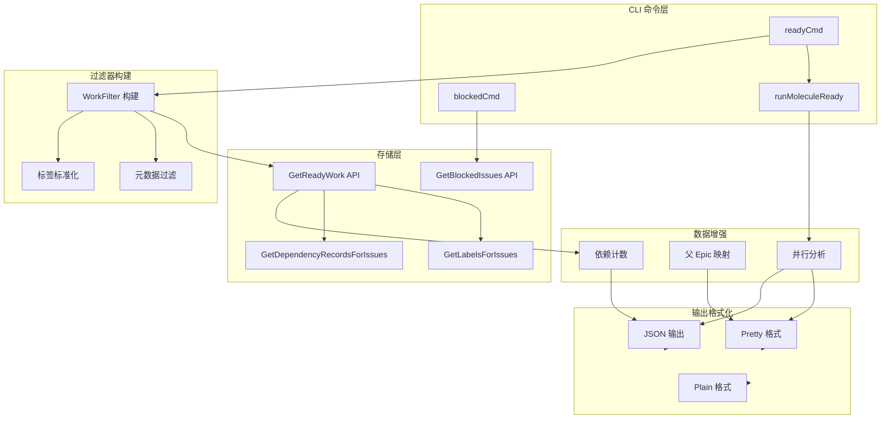

# ready_work_query 模块深度解析

## 概述：为什么需要"就绪工作"查询？

想象你是一个大型项目的技术负责人，面前有 200 个 open 状态的 issue。如果简单地按状态过滤，你会看到所有 200 个。但真正能立刻开始做的可能只有 15 个——其余的都在等别人完成前置任务。这就是 `ready_work_query` 模块要解决的核心问题：**在依赖关系复杂的系统中，区分"状态上开放"和"实际上可执行"的工作**。

这个模块实现了 Beads 系统中"就绪工作"的查询逻辑，它不是简单的 `status=open` 过滤，而是**依赖感知（blocker-aware）**的语义分析。模块通过两个核心命令暴露功能：

- `bd ready` — 查找所有没有活跃阻塞依赖的 open issue
- `bd ready --mol <molecule-id>` — 查找特定 molecule 内可并行执行的步骤

关键设计洞察：**就绪性不是 issue 的固有属性，而是依赖图的动态计算结果**。一个 issue 可能昨天被阻塞，今天阻塞它的依赖关闭后就变成了就绪状态。模块通过将阻塞逻辑下推到存储层（`GetReadyWork` API），避免了在应用层加载全量依赖图的性能陷阱。

---

## 架构与数据流



### 数据流详解

**标准就绪查询路径**（`bd ready`）：

1. **标志解析** → 从 CLI 标志提取过滤条件（assignee、priority、labels 等）
2. **标签标准化** → 调用 `utils.NormalizeLabels` 去重、修剪、移除空值
3. **目录感知标签作用域** → 如果未显式提供 labels，应用 `config.GetDirectoryLabels()`（GH#541）
4. **WorkFilter 构建** → 组装结构化过滤器，包含元数据过滤（GH#1406）
5. **存储层查询** → 调用 `activeStore.GetReadyWork(ctx, filter)`
6. **数据增强** → 为 JSON 输出补充 labels、dependency counts、parent 信息
7. **格式化输出** → 根据 `--json`/`--pretty`/`--plain` 选择输出格式

**Molecule 就绪查询路径**（`bd ready --mol <id>`）：

1. **Molecule 解析** → 通过 `utils.ResolvePartialID` 支持短 ID
2. **子图加载** → 调用 `loadTemplateSubgraph` 获取 molecule 的完整依赖图
3. **并行分析** → 调用 `analyzeMoleculeParallel` 计算每个步骤的就绪状态
4. **就绪步骤收集** → 过滤 `ParallelInfo.IsReady == true` 的步骤
5. **输出** → 包含并行组信息的结构化输出

---

## 核心组件深度解析

### MoleculeReadyOutput

**设计目的**：为 `bd ready --mol` 命令提供结构化的 JSON 输出，不仅包含就绪步骤列表，还包含并行执行所需的元数据。

```go
type MoleculeReadyOutput struct {
    MoleculeID     string               `json:"molecule_id"`
    MoleculeTitle  string               `json:"molecule_title"`
    TotalSteps     int                  `json:"total_steps"`
    ReadySteps     int                  `json:"ready_steps"`
    Steps          []*MoleculeReadyStep `json:"steps"`
    ParallelGroups map[string][]string  `json:"parallel_groups"`
}
```

**关键字段解析**：

- `TotalSteps` / `ReadySteps` — 提供进度概览，Agent 可以快速判断 molecule 的执行阶段（刚开始/进行中/接近完成）
- `Steps` — 详细的就绪步骤列表，每个步骤包含完整的 `Issue` 对象和 `ParallelInfo`
- `ParallelGroups` — **这是并行调度的关键**，将可并行执行的步骤分组，Agent 可以一次性调度整个组

**使用场景**：这个结构主要被 Agent 系统消费（通过 MCP 集成），用于自动化 molecule 执行。Agent 读取 `ParallelGroups`，选择一个组，然后并行启动组内所有步骤。

### MoleculeReadyStep

**设计目的**：封装单个就绪步骤的完整上下文，包括 issue 本身、并行分析结果、所属并行组。

```go
type MoleculeReadyStep struct {
    Issue         *types.Issue  `json:"issue"`
    ParallelInfo  *ParallelInfo `json:"parallel_info"`
    ParallelGroup string        `json:"parallel_group,omitempty"`
}
```

**设计权衡**：为什么同时包含 `ParallelInfo` 和 `ParallelGroup`？

- `ParallelGroup` 是冗余的（可以从 `ParallelInfo.ParallelGroup` 获取），但作为顶层字段方便 JSON 查询和排序
- 这种"扁平化 + 嵌套"的混合设计是典型的 API 优化模式：顶层字段用于常见查询，嵌套对象用于深度分析

**ParallelInfo 的关键语义**：

- `IsReady` — 核心判断：当前步骤是否可以开始执行（无阻塞依赖）
- `ParallelGroup` — 并行组 ID，相同组的步骤可以安全并行执行
- `BlockedBy` — 阻塞当前步骤的步骤 ID 列表（用于调试"为什么这个步骤还没就绪"）
- `CanParallel` — 可以与当前步骤并行执行的其他步骤 ID（用于动态调度决策）

### readyCmd（核心命令）

**架构角色**：就绪查询的**编排器**，负责：
1. 解析用户意图（CLI 标志）
2. 构建查询过滤器
3. 调用存储层 API
4. 增强返回数据
5. 格式化输出

**关键设计决策**：

#### 1. 为什么 `bd ready` 不等于 `bd list --ready`？

这是模块文档中明确强调的区别：

```
Note: 'bd list --ready' is NOT equivalent - it only filters by status=open.
```

- `bd list --ready` — 简单过滤 `status=open`，**不考虑依赖阻塞**
- `bd ready` — 调用 `GetReadyWork` API，**依赖感知的阻塞分析**

这个区别至关重要。想象一个场景：issue A 状态是 open，但它依赖 issue B（也是 open）。`bd list --ready` 会显示 A，但 `bd ready` 不会——因为 A 实际上不能开始做。

#### 2. 为什么就绪逻辑下推到存储层？

模块调用 `activeStore.GetReadyWork(ctx, filter)` 而不是在应用层过滤。原因：

- **性能**：避免加载全量 issue 和依赖关系到内存
- **一致性**：存储层可以原子地计算阻塞状态，避免竞态条件
- **索引优化**：存储层可以利用依赖关系的索引加速查询

**代价**：这增加了存储接口的复杂性，`GetReadyWork` 需要理解业务语义（什么是"阻塞"）。

#### 3. 标签过滤的 AND/OR 语义

```go
Labels    []string // AND: 必须包含 ALL 这些标签
LabelsAny []string // OR: 必须包含 AT LEAST ONE
```

这个设计支持复杂的过滤场景：
- `--label bug --label security` — 同时是 bug 且与安全相关
- `--label-any frontend --label-any backend` — 前端或后端
- `--label bug --label-any frontend,backend` — 是 bug 且属于前端或后端

**目录感知标签作用域**（GH#541）：如果用户未显式提供 labels，自动应用 `config.GetDirectoryLabels()`。这意味着在特定目录下运行 `bd ready` 会自动过滤到该目录相关的 issue，减少跨目录噪音。

#### 4. 元数据过滤（GH#1406）

```go
// Metadata filters
metadataFieldFlags, _ := cmd.Flags().GetStringArray("metadata-field")
if len(metadataFieldFlags) > 0 {
    filter.MetadataFields = make(map[string]string, len(metadataFieldFlags))
    for _, mf := range metadataFieldFlags {
        k, v, ok := strings.Cut(mf, "=")
        // ...
        filter.MetadataFields[k] = v
    }
}
```

这允许基于 issue 的 `Metadata` JSON 字段进行过滤。例如：
- `--metadata-field component=auth` — 过滤 metadata.component == "auth" 的 issue
- `--has-metadata-key review_status` — 过滤存在 metadata.review_status 键的 issue

**验证**：模块对 metadata key 调用 `storage.ValidateMetadataKey`，防止无效键名。

#### 5. 截断检测与总数计算

```go
// Check if results were truncated by the limit
totalReady := len(issues)
truncated := false
if filter.Limit > 0 && len(issues) == filter.Limit {
    countFilter := filter
    countFilter.Limit = 0
    allIssues, countErr := activeStore.GetReadyWork(ctx, countFilter)
    if countErr == nil && len(allIssues) > len(issues) {
        totalReady = len(allIssues)
        truncated = true
    }
}
```

**设计洞察**：用户设置 `--limit 10` 时，如果返回正好 10 条，他们应该知道是否有更多结果。模块通过二次查询（无 limit）获取真实总数，然后显示 "Showing 10 of 47 ready issues"。

**性能权衡**：二次查询会增加延迟，但只在截断时发生，且对用户透明度至关重要。

#### 6. 父 Epic 映射构建

```go
parentEpicMap := buildParentEpicMap(ctx, activeStore, issues)
```

这个辅助函数为每个 issue 查找其父 issue（如果是 epic），用于 pretty 格式显示。实现策略：

1. 批量获取所有 issue 的依赖记录
2. 提取 parent-child 依赖关系
3. 批量获取父 issue 信息
4. 过滤出类型为 epic 的父 issue
5. 构建 childID → epicTitle 映射

**优化点**：使用批量 API（`GetDependencyRecordsForIssues`）而非逐个查询，减少 N+1 问题。

### blockedCmd

**设计目的**：显示被阻塞的 issue 及其阻塞源，帮助理解"为什么这个工作不能开始"。

**关键特性**：

- 调用 `store.GetBlockedIssues(ctx, blockedFilter)` 获取阻塞 issue
- 对每个阻塞源调用 `resolveBlockedByRefs` 解析外部引用（bd-k0pfm）
- 显示 "Blocked by N open dependencies: [id1, id2, ...]"

**与 readyCmd 的对称性**：`ready` 显示可执行的，`blocked` 显示不可执行的及原因。两者结合给出完整的工作流视图。

### runMoleculeReady

**设计目的**：针对 molecule 执行场景，找出 molecule 内所有可并行执行的步骤。

**执行流程**：

1. **Molecule 解析** — 支持短 ID（`utils.ResolvePartialID`）
2. **子图加载** — `loadTemplateSubgraph` 获取 molecule 的完整 issue 图和依赖关系
3. **并行分析** — `analyzeMoleculeParallel` 计算：
   - 每个步骤的状态（ready/blocked/completed）
   - 并行组划分
   - 阻塞关系
4. **就绪步骤收集** — 过滤 `IsReady == true` 的步骤
5. **输出** — 包含并行组信息的结构化输出

**并行组语义**：

ParallelGroup 是 molecule 编译时确定的元数据，标识哪些步骤可以安全并行执行。例如：

```
ParallelGroups:
  "phase-1": ["step-1", "step-2", "step-3"]  # 这三个可以并行
  "phase-2": ["step-4", "step-5"]            # 等 phase-1 完成后并行
```

Agent 读取这个信息后，可以：
1. 启动 phase-1 的所有步骤（并行）
2. 等待 phase-1 完成
3. 启动 phase-2 的所有步骤（并行）

**输出增强**：对于每个就绪步骤，显示 "Can run with: [step-2, step-3]"，帮助理解并行机会。

---

## 依赖分析

### 模块调用什么（下游依赖）

| 依赖 | 调用点 | 原因 |
|------|--------|------|
| `internal.types.types.WorkFilter` | 构建查询过滤器 | 结构化过滤条件，传递给存储层 |
| `internal.types.types.Issue` | 存储返回、输出构建 | 核心数据模型 |
| `internal.types.types.BlockedIssue` | blockedCmd 输出 | 扩展的 issue 类型，包含阻塞源 |
| `internal.storage.storage.Storage.GetReadyWork` | 核心查询 | 依赖感知的就绪工作查询 |
| `internal.storage.storage.Storage.GetBlockedIssues` | blockedCmd | 获取阻塞 issue 列表 |
| `internal.storage.storage.Storage.GetDependencyRecordsForIssues` | 数据增强 | 批量获取依赖关系，计算 parent、dep counts |
| `internal.storage.storage.Storage.GetLabelsForIssues` | JSON 输出增强 | 批量获取 labels |
| `internal.storage.storage.Storage.GetStatistics` | 空结果提示 | 判断是"无就绪工作"还是"无 open issue" |
| `utils.NormalizeLabels` | 标签预处理 | 标准化标签输入 |
| `config.GetDirectoryLabels` | 标签作用域 | 目录感知的标签过滤 |
| `storage.ValidateMetadataKey` | 元数据过滤验证 | 防止无效 metadata key |
| `utils.ResolvePartialID` | molecule 解析 | 支持短 ID |
| `loadTemplateSubgraph` | molecule 子图加载 | 获取 molecule 完整依赖图 |
| `analyzeMoleculeParallel` | 并行分析 | 计算步骤就绪状态和并行组 |
| `ui.Render*` | 格式化输出 | 终端 UI 渲染（优先级、类型、ID 等） |

### 什么调用模块（上游依赖）

从模块树看，`ready_work_query` 位于：

```
CLI Molecule Commands
  └─ molecule_progress_and_dispatch
      └─ ready_work_query (current module)
```

**直接调用者**：
- `cmd.bd.ready` 包自身（命令注册和标志定义）
- `cmd.bd.mol_ready_gated`（通过 `runMolReadyGated`， gated 模式）

**间接调用者**：
- MCP 集成（`integrations.beads-mcp`）— 通过 CLI 封装暴露 `ReadyWorkParams`
- Agent 系统 — 通过 MCP 或直接 CLI 调用获取可执行工作

**数据契约**：

1. **输入契约**（CLI 标志 → WorkFilter）：
   - `--limit` → `WorkFilter.Limit`
   - `--priority` → `WorkFilter.Priority`
   - `--assignee` → `WorkFilter.Assignee`
   - `--label` → `WorkFilter.Labels` (AND)
   - `--label-any` → `WorkFilter.LabelsAny` (OR)
   - `--metadata-field` → `WorkFilter.MetadataFields`
   - `--mol` → 触发 molecule 模式
   - `--gated` → 触发 gate-resume 模式

2. **输出契约**（存储 → CLI → 用户/MCP）：
   - 人类可读格式：带 emoji 和格式化的终端输出
   - JSON 格式：`[]*types.IssueWithCounts` 或 `MoleculeReadyOutput`

---

## 设计决策与权衡

### 1. 同步 vs 异步查询

**选择**：同步查询（直接调用 `GetReadyWork` 等待返回）

**原因**：
- 就绪查询通常是交互式命令，用户等待结果
- 存储层已优化，查询延迟可接受
- 简化错误处理和超时逻辑

**代价**：
- 对于大型依赖图，查询可能较慢
- 无法流式返回结果（必须等全部计算完成）

**缓解**：使用 `--limit` 限制返回数量，存储层可以提前终止。

### 2. 应用层过滤 vs 存储层过滤

**选择**：存储层过滤（`GetReadyWork` 在存储层实现阻塞逻辑）

**原因**：
- **性能**：避免加载全量 issue 和依赖关系到内存
- **一致性**：存储层可以原子地计算阻塞状态
- **索引优化**：存储层可以利用依赖关系索引

**代价**：
- 存储接口更复杂，需要理解业务语义
- 测试存储层需要模拟阻塞逻辑

**对比**：如果放在应用层，需要：
1. 获取所有 open issue
2. 获取所有依赖关系
3. 在内存中构建依赖图
4. 遍历图计算就绪状态

对于 1000+ issue 的项目，这会消耗大量内存和 CPU。

### 3. 继承 vs 组合（MoleculeReadyStep）

**选择**：组合（`MoleculeReadyStep` 包含 `Issue` 和 `ParallelInfo`）

**原因**：
- `Issue` 是核心领域模型，不应被修改
- `ParallelInfo` 是分析结果，生命周期独立
- 组合允许灵活扩展（未来可以添加更多分析结果）

**对比**：如果继承 `Issue`，会：
- 污染核心领域模型
- 难以序列化（JSON 标签冲突）
- 不利于未来扩展

### 4. 严格验证 vs 宽松过滤

**选择**：严格验证（metadata key 验证、sort policy 验证、mol-type 验证）

**原因**：
- 早期失败优于静默错误
- 用户立即知道输入有问题
- 防止存储层收到无效查询

**实现**：
```go
if err := storage.ValidateMetadataKey(k); err != nil {
    fmt.Fprintf(os.Stderr, "Error: invalid --metadata-field key: %v\n", err)
    os.Exit(1)
}
```

### 5. 默认排除 Ephemeral/Mol 步骤

**选择**：默认排除 ephemeral issue 和 molecule 步骤

```go
// By default, GetReadyWork excludes ephemeral issues (wisps).
// By default, GetReadyWork excludes mol/wisp steps.
```

**原因**：
- Ephemeral issue（如 wisps）是临时性的，不应作为常规工作显示
- Molecule 步骤通常通过 `--mol` 专门查询，不应污染主就绪列表

**扩展点**：通过 `IncludeEphemeral` 和 `IncludeMolSteps` 标志允许覆盖。

### 6. 标签 AND/OR 分离

**选择**：两个独立标志 `--label` (AND) 和 `--label-any` (OR)

**原因**：
- 语义清晰，用户容易理解
- 支持组合使用（`--label bug --label-any frontend,backend`）
- 避免复杂的布尔表达式解析

**对比**：如果使用单个标志支持布尔表达式（如 `--label "bug AND (frontend OR backend)"`）：
- 更灵活，但解析复杂
- 用户学习成本高
- 容易出错

---

## 使用指南与示例

### 基本就绪查询

```bash
# 显示前 10 个就绪工作
bd ready

# 显示前 50 个
bd ready -n 50

# 按优先级排序（默认）
bd ready -s priority

# 按创建时间排序（最老的优先）
bd ready -s oldest

# 混合排序（优先级 + 时间）
bd ready -s hybrid
```

### 过滤条件

```bash
# 按优先级过滤
bd ready -p 0        # 只显示 P0
bd ready -p 1        # 只显示 P1

# 按负责人过滤
bd ready -a alice    # 分配给 alice 的
bd ready -u          # 未分配的

# 按标签过滤（AND）
bd ready -l bug -l security  # 同时有 bug 和 security 标签

# 按标签过滤（OR）
bd ready --label-any frontend --label-any backend  # frontend 或 backend

# 组合使用
bd ready -l bug --label-any frontend,backend  # bug 且 (frontend 或 backend)

# 按类型过滤
bd ready -t task
bd ready -t bug
bd ready -t mr       # 别名：mr → merge-request

# 按父 Epic 过滤（显示该 Epic 的所有后代）
bd ready --parent bd-epic-123

# 按 Molecule 类型过滤
bd ready --mol-type swarm
bd ready --mol-type patrol
```

### 元数据过滤（GH#1406）

```bash
# 精确匹配 metadata 字段
bd ready --metadata-field component=auth
bd ready --metadata-field component=auth --metadata-field tier=backend

# 存在性检查
bd ready --has-metadata-key review_status
```

### Molecule 就绪查询

```bash
# 显示特定 molecule 的就绪步骤
bd ready --mol bd-patrol

# JSON 输出（用于 Agent 消费）
bd ready --mol bd-patrol --json
```

**JSON 输出示例**：

```json
{
  "molecule_id": "bd-patrol-abc123",
  "molecule_title": "Daily Patrol",
  "total_steps": 15,
  "ready_steps": 3,
  "steps": [
    {
      "issue": {
        "id": "bd-step-001",
        "title": "Check service health",
        "priority": 1,
        "issue_type": "task"
      },
      "parallel_info": {
        "step_id": "bd-step-001",
        "status": "open",
        "is_ready": true,
        "parallel_group": "phase-1",
        "blocked_by": [],
        "blocks": ["bd-step-004"],
        "can_parallel": ["bd-step-002", "bd-step-003"]
      },
      "parallel_group": "phase-1"
    }
  ],
  "parallel_groups": {
    "phase-1": ["bd-step-001", "bd-step-002", "bd-step-003"],
    "phase-2": ["bd-step-004", "bd-step-005"]
  }
}
```

### 跨 Rig 查询

```bash
# 查询另一个 rig 的数据库
bd ready --rig gastown
bd ready --rig gt-
```

### 输出格式控制

```bash
# JSON 输出
bd ready --json

# Plain 格式（简单编号列表）
bd ready --plain

# Pretty 格式（默认，带 emoji 和树状结构）
bd ready --pretty

# 禁用 Pretty（同 --plain）
bd ready --pretty=false
```

---

## 边界情况与注意事项

### 1. 空结果的不同含义

模块区分两种"无结果"情况：

```go
if len(issues) == 0 {
    hasOpenIssues := false
    if stats, statsErr := activeStore.GetStatistics(ctx); statsErr == nil {
        hasOpenIssues = stats.OpenIssues > 0 || stats.InProgressIssues > 0
    }
    if hasOpenIssues {
        fmt.Printf("\n%s No ready work found (all issues have blocking dependencies)\n\n", ui.RenderWarn("✨"))
    } else {
        fmt.Printf("\n%s No open issues\n\n", ui.RenderPass("✨"))
    }
}
```

- **情况 A**：有 open issue，但都被阻塞 → "No ready work found (all issues have blocking dependencies)"
- **情况 B**：根本没有 open issue → "No open issues"

**为什么重要**：用户需要知道是"工作被阻塞了"（需要解决依赖）还是"没有工作了"（可以休息了）。

### 2. 截断检测的二次查询

当结果被 `--limit` 截断时，模块会二次查询获取真实总数：

```go
if filter.Limit > 0 && len(issues) == filter.Limit {
    countFilter := filter
    countFilter.Limit = 0
    allIssues, countErr := activeStore.GetReadyWork(ctx, countFilter)
    if countErr == nil && len(allIssues) > len(issues) {
        totalReady = len(allIssues)
        truncated = true
    }
}
```

**注意事项**：
- 这会增加一次存储查询，可能影响性能
- 如果第一次查询返回少于 limit 条，不会触发二次查询（正确，因为没截断）
- 如果二次查询失败，静默忽略（`countErr` 未处理），`truncated` 保持 false

**潜在问题**：如果存储层在两次查询之间有新 issue 关闭或依赖变化，总数可能不准确。但在交互式 CLI 场景下，这种不一致性可接受。

### 3. 标签标准化与目录作用域

```go
// Normalize labels: trim, dedupe, remove empty
labels = utils.NormalizeLabels(labels)
labelsAny = utils.NormalizeLabels(labelsAny)

// Apply directory-aware label scoping if no labels explicitly provided
if len(labels) == 0 && len(labelsAny) == 0 {
    if dirLabels := config.GetDirectoryLabels(); len(dirLabels) > 0 {
        labelsAny = dirLabels
    }
}
```

**注意事项**：
- 如果用户显式提供 `--label ""`（空标签），标准化后会变成空数组
- 目录标签只在**未显式提供任何标签**时应用
- 如果用户提供了 `--label bug`，目录标签**不会**被添加

**潜在陷阱**：用户可能期望目录标签始终生效，但实际只在无显式标签时生效。这是设计选择（避免过度过滤），但可能违反直觉。

### 4. Priority=0 的处理

```go
// Use Changed() to properly handle P0 (priority=0)
if cmd.Flags().Changed("priority") {
    priority, _ := cmd.Flags().GetInt("priority")
    filter.Priority = &priority
}
```

**为什么用 `Changed()`**：因为 priority 的默认值是 0，如果直接读取 `GetBool("priority")`，无法区分"用户显式设置 -p 0"和"用户未设置 priority"。

**正确做法**：使用 `cmd.Flags().Changed("priority")` 检查用户是否显式设置了该标志。

### 5. Molecule 模式的存储层要求

```go
// Molecule-ready requires direct store access for subgraph loading
if store == nil {
    FatalError("no database connection")
}
```

**注意事项**：Molecule 模式需要直接访问存储层（`store`），不能通过远程 API。这是因为：
- 需要加载完整的 molecule 子图
- 需要执行并行分析（依赖图遍历）
- 这些操作在远程 API 场景下效率低下

**影响**：如果配置为远程模式，`bd ready --mol` 可能失败或行为异常。

### 6. 外部引用解析（blockedCmd）

```go
// Resolve external refs to show real issue info (bd-k0pfm)
resolved := resolveBlockedByRefs(ctx, blockedBy)
```

**注意事项**：`resolveBlockedByRefs` 函数在提供的代码中未定义，但在其他地方实现。它负责将外部引用（如 "gh-123"）解析为人类可读的 issue 信息。

**潜在问题**：如果外部系统不可达，解析可能失败或超时。模块未显示错误处理逻辑，可能静默失败。

### 7. JSON 输出的数据增强

```go
if jsonOutput {
    // Populate labels and dependencies for JSON output
    for _, issue := range issues {
        issue.Labels = labelsMap[issue.ID]
        issue.Dependencies = allDeps[issue.ID]
    }
    
    // Build response with counts + computed parent
    issuesWithCounts := make([]*types.IssueWithCounts, len(issues))
    for i, issue := range issues {
        counts := depCounts[issue.ID]
        if counts == nil {
            counts = &types.DependencyCounts{DependencyCount: 0, DependentCount: 0}
        }
        // Compute parent from dependency records
        var parent *string
        for _, dep := range allDeps[issue.ID] {
            if dep.Type == types.DepParentChild {
                parent = &dep.DependsOnID
                break
            }
        }
        issuesWithCounts[i] = &types.IssueWithCounts{
            Issue:           issue,
            DependencyCount: counts.DependencyCount,
            DependentCount:  counts.DependentCount,
            CommentCount:    commentCounts[issue.ID],
            Parent:          parent,
        }
    }
    outputJSON(issuesWithCounts)
    return
}
```

**注意事项**：
- JSON 输出会增强原始 issue 数据，添加 labels、dependencies、counts、parent
- 如果任何增强查询失败（`labelsMap`、`depCounts` 等为空），优雅降级（使用空值或默认值）
- Parent 是从依赖记录**计算**的，不是 issue 的直接字段（符合 Decision 004：边模式整合）

**性能影响**：JSON 输出需要额外 4 次批量查询（labels、dep counts、all deps、comment counts），可能显著增加延迟。

---

## 扩展点

### 1. 添加新的过滤条件

要添加新的过滤条件（如 `--created-after`）：

1. 在 `WorkFilter` 中添加字段：
   ```go
   type WorkFilter struct {
       // ...
       CreatedAfter *time.Time
   }
   ```

2. 在 `readyCmd` 中添加标志解析：
   ```go
   createdAfter, _ := cmd.Flags().GetString("created-after")
   if createdAfter != "" {
       t, _ := time.Parse(time.RFC3339, createdAfter)
       filter.CreatedAfter = &t
   }
   ```

3. 在存储层实现过滤逻辑（`GetReadyWork`）

### 2. 自定义排序策略

要添加新的排序策略：

1. 在 `SortPolicy` 类型中添加新值：
   ```go
   type SortPolicy string
   const (
       SortHybrid   SortPolicy = "hybrid"
       SortPriority SortPolicy = "priority"
       SortOldest   SortPolicy = "oldest"
       SortNewest   SortPolicy = "newest"  // 新增
   )
   ```

2. 在 `readyCmd` 的验证逻辑中允许新值：
   ```go
   if !filter.SortPolicy.IsValid() {
       FatalError("invalid sort policy '%s'. Valid values: hybrid, priority, oldest, newest", sortPolicy)
   }
   ```

3. 在存储层实现排序逻辑

### 3. 自定义输出格式

要添加新的输出格式（如 CSV）：

1. 添加新标志：
   ```go
   readyCmd.Flags().Bool("csv", false, "Output in CSV format")
   ```

2. 在输出逻辑中添加分支：
   ```go
   csv, _ := cmd.Flags().GetBool("csv")
   if csv {
       outputCSV(issues)
       return
   }
   ```

3. 实现 `outputCSV` 函数

---

## 相关模块

- [issue_domain_model](issue_domain_model.md) — Issue 核心领域模型定义
- [query_and_projection_types](query_and_projection_types.md) — 查询和投影类型（WorkFilter、IssueWithCounts 等）
- [storage_contracts](storage_contracts.md) — 存储接口契约（GetReadyWork、GetBlockedIssues）
- [molecule_progress_and_dispatch](molecule_progress_and_dispatch.md) — Molecule 进度跟踪和调度
- [gate_discovery](gate_discovery.md) — Gate-resume 发现逻辑（`bd ready --gated`）
- [mcp_models_and_data_contracts](mcp_models_and_data_contracts.md) — MCP 集成数据模型

---

## 总结

`ready_work_query` 模块是 Beads 系统中**工作发现**的核心入口。它的设计哲学是：

1. **依赖感知** — 就绪性不是状态，而是依赖图的计算结果
2. **存储层优化** — 将复杂逻辑下推到存储层，避免应用层 N+1 问题
3. **灵活过滤** — 支持多维度过滤（标签、元数据、优先级、负责人等）
4. **Molecule 支持** — 专门为 molecule 执行场景提供并行分析
5. **用户友好** — 区分空结果的不同含义，提供截断提示，支持多种输出格式

对于新贡献者，关键理解点是：**这个模块不是简单的 CRUD 查询，而是依赖图的分析引擎**。它通过存储层 API 暴露复杂的图遍历逻辑，同时保持 CLI 接口的简洁性。
