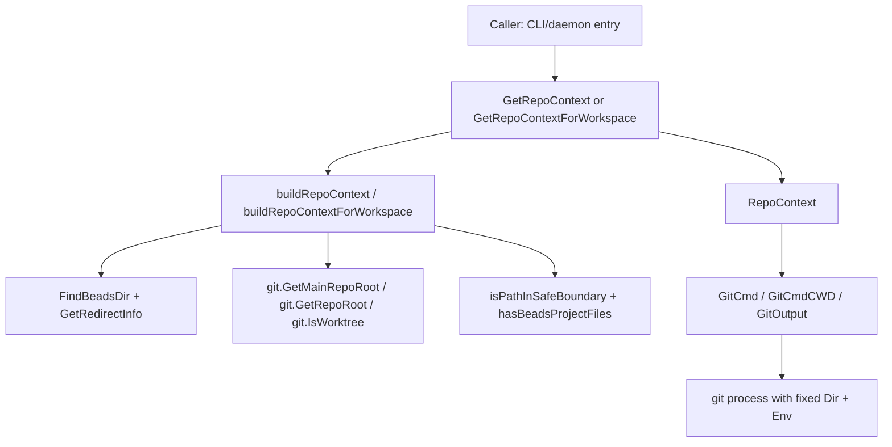

# repo_context_resolution_and_git_execution 深度解析

`repo_context_resolution_and_git_execution` 模块解决的是一个很“隐形但致命”的问题：**同一条 git 命令，在错误目录执行时，语法完全正确，却会悄悄操作错仓库**。在单仓库、无 worktree、无 `BEADS_DIR` 重定向的理想环境里，`os.Getwd()` 往往“够用”；但真实环境里，用户可能在 worktree 中执行命令，`.beads` 可能被 redirect 到另一个仓库，甚至守护进程要同时处理多个 workspace。这个模块的价值，就是把“当前上下文到底对应哪个仓库”这件事做成一个可信、可缓存、可验证的决策层，并把 git 执行强制绑定到该决策结果上。

## 架构角色与心智模型

可以把 `RepoContext` 想成“机场塔台 + 跑道调度器”的组合：

- `FindBeadsDir`、`GetRedirectInfo` 负责“识别应该去哪个机场”（路径解析）
- `RepoContext` 负责“发布统一航路信息”（`RepoRoot` / `CWDRepoRoot` / `IsWorktree`）
- `GitCmd` 负责“强制飞机落在指定跑道”（通过 `cmd.Dir` 和 `GIT_DIR`/`GIT_WORK_TREE`）

也就是说，它不是业务逻辑层，而是一个**上下文编排与执行护栏层**：上游把“我要跑 git 子命令”交给它，下游得到“在正确 repo 中执行过安全约束的 `exec.Cmd`”。

## 架构与数据流



主路径可以分成两条：

第一条是“上下文解析路径”。`GetRepoContext()` 通过 `sync.Once` 首次调用 `buildRepoContext()`，在这里整合 `FindBeadsDir()`、`GetRedirectInfo()`、`isExternalBeadsDir()`、`git.GetMainRepoRoot()` 和 `git.GetRepoRoot()` 的结果，最终形成一个进程级缓存的 `RepoContext`。这条路径的目标是得到“统一真相”。

第二条是“命令执行路径”。调用方拿到 `RepoContext` 后，不应直接 `exec.Command("git", ...)`，而是走 `GitCmd()` 或 `GitOutput()`。这条路径把 repo 决策显式落到进程属性：`cmd.Dir = rc.RepoRoot`，并通过环境变量钉死 git 的仓库绑定，避免 worktree 或父进程环境污染导致“命令跑偏”。

## 核心组件深挖

## `type RepoContext struct`

`RepoContext` 的设计关键不在字段数量，而在字段之间的语义分离。`RepoRoot` 和 `CWDRepoRoot` 同时存在，明确区分了“**beads 数据应操作的仓库**”与“**用户当前所在仓库**”。这在重定向或 worktree 场景下非常关键：用户在 A 干活，beads 数据在 B，两个事实都要保留，不能被单个“当前仓库”概念抹平。

`IsRedirected` 不是冗余布尔值，而是行为开关。`Role()` 会把 redirected 情况直接判为 `Contributor`；这说明“路径事实”会驱动“权限/角色语义”，属于跨层设计连接点。

## `GetRepoContext() (*RepoContext, error)` 与缓存策略

这个函数用 `sync.Once` 做进程内单例初始化。选择缓存而不是每次重算，背后是一个典型权衡：

- 收益：避免重复文件系统探测和 git probing
- 代价：上下文默认视为“命令生命周期内不变”

代码注释明确这一前提：CWD 和 `BEADS_DIR` 在单次命令执行中通常不变。换句话说，这是一种**面向 CLI 短生命周期进程**的优化假设。为测试场景提供了 `ResetCaches()`，但该函数明确“非线程安全”，只应在单线程测试中调用。

## `buildRepoContext() (*RepoContext, error)`：决策主引擎

这是模块“怎么思考”的核心函数，步骤顺序本身就是设计意图。

首先通过 `FindBeadsDir()` 找 `.beads`，随后立刻执行 `isPathInSafeBoundary()`（SEC-003）。这体现了“先认证边界，再继续解析”的安全优先级。然后调用 `GetRedirectInfo()` 判断是否处于重定向模式；如果未显式重定向，再用 `isExternalBeadsDir()` 基于 `git common dir` 做跨仓库判定（兼容 worktree / bare repo 场景）。

当判定为 external 时，`RepoRoot` 通过 `repoRootForBeadsDir()` 推导；否则走 `git.GetMainRepoRoot()`。这里的取舍是“正确仓库优先于当前目录直觉”：宁可多做一次 repo root 推导，也不能把命令留在 CWD 里碰运气。

## `isExternalBeadsDir(beadsDir string) (bool, error)` 与 `getGitCommonDirForPath`

这组函数的非显式价值在于：它们不用“路径前缀比较”判断是否同仓库，而是比较 `git rev-parse --git-common-dir`。这对 worktree 特别重要，因为 worktree 的工作目录不同，但可能共享同一个 git common dir。

`getGitCommonDirForPath()` 还处理了相对路径输出、`filepath.Clean` 和 `EvalSymlinks`，尽量把“字符串不同但实际同址”的情况归一化。这是一种偏正确性的实现，代价是多一次系统调用与路径解析开销。

## `GitCmd(ctx, args...) *exec.Cmd`：执行护栏

`GitCmd` 是本模块最值得强制使用的 API。它做了三层保护：

1. `cmd.Dir = rc.RepoRoot`：把进程工作目录绑定到 beads 仓库
2. 设置 `GIT_DIR` 与 `GIT_WORK_TREE`：覆盖 worktree/父环境导致的 git 目标漂移（注释中指向 GH#2538）
3. 清空 `GIT_HOOKS_PATH` 与 `GIT_TEMPLATE_DIR`：降低在不可信仓库中触发代码执行的风险（SEC-001 / SEC-002）

这不是“便利封装”，而是“安全与正确性策略注入点”。如果调用方绕过它直接执行 git，等于绕过模块存在的核心理由。

## `GitCmdCWD(ctx, args...) *exec.Cmd`

这个函数保留了另一种语义：命令要反映“用户当前工作仓库”而不是 beads 仓库，例如状态展示类命令。它只在 `CWDRepoRoot` 非空时设置 `cmd.Dir`，否则让命令沿用进程 CWD。和 `GitCmd` 相比，这里刻意更“宽松”，用于展示类场景而非数据写入路径。

## `GetRepoContextForWorkspace(workspacePath string)` 与 `buildRepoContextForWorkspace`

这条路径专门给长生命周期进程（注释提到 daemon，DMN-001）使用，不走全局缓存，也不尊重 `BEADS_DIR`。设计理由很直接：守护进程要处理多个 workspace，缓存与全局环境变量都会造成跨 workspace 污染。

函数会临时 `os.Chdir(absWorkspace)`，再 `defer` 恢复原目录，并调用 `git.ResetCaches()` 确保 git 相关缓存刷新。这个实现非常实用，但也暴露了一个隐含约束：**它修改进程级 CWD**。在并发环境里，如果多个 goroutine 同时依赖 CWD，这会有竞态风险。因此它适合“串行工作区解析”模型，不适合无隔离并发调用。

`buildRepoContextForWorkspace()` 里还能看到与 CLI 路径不同的契约：要求 `<repoRoot>/.beads` 存在，经过 `FollowRedirect` 后必须通过 `hasBeadsProjectFiles`。这让 daemon 模式更偏“严格校验”。

## `Validate() error`

`Validate` 很克制，只检查 `BeadsDir` 和 `RepoRoot` 是否仍存在，不重新计算上下文。它像“健康探针”而不是“自愈器”。好处是低成本、低副作用；代价是检测粒度有限（比如 repo 切换、权限变化、role 配置变化不会被捕获）。

## 角色相关 API：`Role` / `IsContributor` / `IsMaintainer` / `RequireRole`

这组 API 体现了一个重要设计：**路径上下文可隐式推导角色**。`Role()` 在 `IsRedirected` 为真时直接返回 `Contributor`，否则读 `git config --get beads.role`。也就是说，外部仓库模式被视为贡献者工作流，优先级高于本地显式配置。

这让 fork 场景更无摩擦，但也引入了行为耦合：如果未来“重定向不一定代表 contributor”这一业务假设变化，角色判定逻辑需要重构。

## 依赖关系与调用契约

从源码可确认，本模块直接依赖以下能力：

- 来自 [repository_discovery_and_redirect](repository_discovery_and_redirect.md) 的路径发现相关函数：`FindBeadsDir`、`GetRedirectInfo`、`FollowRedirect`、`hasBeadsProjectFiles`
- 来自 git 层（`github.com/steveyegge/beads/internal/git`）的仓库判定与缓存管理：`GetMainRepoRoot`、`GetRepoRoot`、`IsWorktree`、`GetGitCommonDir`、`ResetCaches`
- 标准库 `os/exec`、`filepath`、`os`、`strings`、`sync`

本模块向上游提供的是稳定语义接口：

- 上游若要“正确执行 beads 仓库 git 操作”，契约是先 `GetRepoContext()` 再用 `GitCmd`/`GitOutput`
- 上游若是多 workspace 进程，契约是使用 `GetRepoContextForWorkspace()`，并接受其“非缓存 + 临时切目录”的行为
- 上游若依赖角色语义，契约是 `RequireRole()` 的错误 `ErrRoleNotConfigured` 代表应触发初始化/配置流程

由于提供的依赖图未列出具体 `depended_by` 函数清单，这里无法精确点名所有调用者；但从 API 设计和注释可明确，它面向 CLI 命令入口与 daemon 工作区调度两类调用面。

## 关键设计取舍

这个模块在多个维度做了“偏正确性与安全”的选择。

在性能与正确性之间，`GitCmd` 通过显式环境变量覆盖和路径钉死，牺牲了一点简洁性，换来了 worktree 下的稳定行为。`Role()` 每次读取 git config（注释约 1ms）而不是缓存，也是在“配置实时性”与“极致性能”之间偏前者。

在灵活性与可预测性之间，`GetRepoContext()` 采用进程级缓存，简化常规 CLI 路径；而 `GetRepoContextForWorkspace()` 则完全反过来，强调每次新鲜解析。两套路径并存，看起来复杂，但恰好对应“短命令”和“长服务”两种运行模型。

在自治与耦合之间，模块把角色推断 (`Role`) 与路径重定向 (`IsRedirected`) 耦合在一起，简化了 fork 贡献者流程；但这也把业务语义绑定到了底层路径机制，后续演进需要谨慎。

## 使用方式与示例

```go
rc, err := beads.GetRepoContext()
if err != nil {
    return err
}

// 在 beads 仓库执行 git（推荐）
cmd := rc.GitCmd(ctx, "status", "--short")
out, err := cmd.Output()
if err != nil {
    return err
}
_ = string(out)

// 读取 role（重定向场景会隐式返回 contributor）
if err := rc.RequireRole(); err != nil {
    // err == beads.ErrRoleNotConfigured
    return err
}
```

```go
// daemon / 多 workspace 场景
rc, err := beads.GetRepoContextForWorkspace("/path/to/workspace")
if err != nil {
    return err
}

if err := rc.Validate(); err != nil {
    return err
}
```

## 新贡献者需要特别注意的坑

最容易踩的坑是“拿到 `RepoContext` 后仍手写 `exec.Command("git", ...)`”。这样会绕过 `GitCmd` 的目录与环境保护，worktree 场景会复发 GH#2538 类问题。

第二个坑是误用缓存语义。`GetRepoContext()` 是进程级一次性解析，适合普通 CLI；如果你在同一进程内切换 workspace，不要指望它自动刷新，应改用 `GetRepoContextForWorkspace()` 或在受控测试中 `ResetCaches()`。

第三个坑是忽略 `isPathInSafeBoundary()` 的失败分支。它会拒绝敏感系统路径和其他用户 home，某些测试环境若把 `BEADS_DIR` 指到这些路径会直接失败，这不是 bug，而是安全策略。

第四个坑是并发调用 workspace API。`GetRepoContextForWorkspace()` 通过 `os.Chdir` 改变全局 CWD；若并发执行，可能相互干扰。新代码若要并发处理多个 workspace，需要进程隔离或串行化这段调用。

## 参考

- [repository_discovery_and_redirect](repository_discovery_and_redirect.md)
- [repo_role_and_target_selection](repo_role_and_target_selection.md)
- [storage_contracts](storage_contracts.md)
