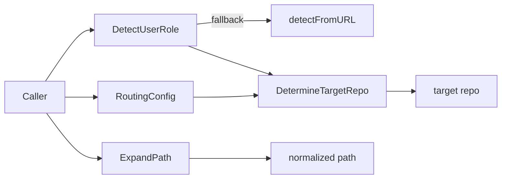

# repo_role_and_target_selection

`repo_role_and_target_selection` 模块的职责可以用一句话概括：**在多仓库/多角色协作场景里，决定“当前用户应该把新 issue 发到哪个仓库”**，并把路径输入规范化到可用状态。它看起来很小，但解决的是一个非常真实的协作痛点：同一套 CLI 既要服务有写权限的维护者，也要服务只能在 fork 或下游仓库提变更的贡献者。如果没有一个统一、可回退、可迁移的“角色识别 + 目标仓库选择”层，命令层就会散落大量 if/else，行为不一致且难以演进。

---

## 1. 这个模块在解决什么问题？

在理想世界里，CLI 只要把 issue 写到“当前仓库”就行。但现实是：

1. 用户身份不是固定的。有人是主仓维护者（maintainer），有人是外部贡献者（contributor）。
2. 仓库拓扑不是单一的。可能有 upstream、fork、镜像、或本地未配置 remote 的仓库。
3. 兼容性不能一刀切。历史用户可能没有配置新的 `beads.role`，但工具仍要可用。

这个模块把这些复杂性压缩成两个核心决策：

- `DetectUserRole(repoPath)`：先判断“你是谁”（维护者/贡献者）；
- `DetermineTargetRepo(config, userRole, repoPath)`：再判断“应该写去哪”。

可以把它类比成“机场值机前台”：先识别旅客身份（会员/普通旅客），再按规则把人引导到对应柜台（优先柜台/普通柜台/默认柜台）。

关键设计洞察在于：**角色识别必须有“首选真相源 + 兼容性回退链”**。因此代码优先读取 git config 的 `beads.role`（显式声明），失败时才退回 URL 启发式（并给出迁移警告），从而兼顾正确性与平滑升级。

---

## 2. 心智模型：一个“判定管线 + 兜底策略”的微型路由器

理解这个模块最好的方式，不是把它看成 5 个独立函数，而是看成一个两阶段管线：

- 阶段 A（身份判定）：`DetectUserRole` → `detectFromURL`
- 阶段 B（目标仓路由）：`DetermineTargetRepo`
- 辅助阶段（输入归一化）：`ExpandPath`

`RoutingConfig` 则是这条管线的“策略包”。它不做逻辑，只携带决策所需的配置。

### 架构图（基于已提供依赖关系）



> 注：在给定依赖图中，模块内唯一显式函数调用关系是 `DetectUserRole -> detectFromURL`。其他调用方（具体哪些 CLI 命令调用它）在当前材料里未直接给出，因此这里只描述抽象调用者 `Caller`。

数据流上，它是“先判角色，再选目标仓”，并在必要时把用户输入路径做本地展开（`~`、相对路径）。这是一个典型的**决策编排层（orchestration layer）**，不是存储层也不是领域模型层。

---

## 3. 组件深潜（逐个解释“为什么这样写”）

## `RoutingConfig`（struct）

`RoutingConfig` 提供了路由决策的全部输入开关：

- `Mode`：`"auto"` 或其他（隐含非 auto）
- `DefaultRepo`
- `MaintainerRepo`
- `ContributorRepo`
- `ExplicitOverride`

它的设计重点是“**少而明确**”：把策略约束成几个高信号字段，而不是做通用规则引擎。这样做牺牲了高度可编程性，但换来可预测、可文档化、可测试的行为。

特别是 `ExplicitOverride`，它代表“命令行强制指定仓库”的语义，优先级最高，避免用户在临时场景里被自动路由“绑死”。

---

## `DetectUserRole(repoPath string) (UserRole, error)`

这是角色识别入口函数，内部策略是三段式：

1. `git config --get beads.role`（首选）
2. 配置缺失/无效时打印 warning 并退回 `detectFromURL`（兼容路径）
3. 返回 `UserRole`

### 为什么先用 `beads.role`

因为 remote URL 不能可靠表达权限语义。比如很多 fork 贡献者也用 SSH URL，看起来像“可写”，但写的是 fork，不是主仓。显式配置比推断更稳定，这属于“**正确性优先于便利推断**”的选择。

### 为什么保留 URL 回退

这是典型迁移策略：新机制上线时，不立即打断旧用户工作流。warning（写到 `stderr`）起到“软提醒”作用，让用户逐步迁移。

### 细节与副作用

- 依赖可替换变量 `gitCommandRunner` 执行 git 命令，便于测试注入（尽管当前代码片段未展示测试）。
- 如果 `beads.role` 取值不是 `maintainer`/`contributor`，不会报错中断，而是继续回退。这个容错策略偏“可用性”。
- 有副作用：向 `os.Stderr` 输出 warning。

---

## `detectFromURL(repoPath string) UserRole`

这是被标注为 deprecated 的启发式探测函数，只由 `DetectUserRole` 调用（依赖图已确认）。

它做的事情是：

1. 先尝试 `git remote get-url --push origin`
2. 失败则尝试 `git remote get-url origin`
3. 若仍失败（无 remote），默认 `Maintainer`
4. 对 URL 做字符串模式判断：
   - `git@` / `ssh://` / 含 `@` → `Maintainer`
   - 否则 → `Contributor`

### 设计意图

这里不是“精确权限检测”，而是“在缺少显式配置时尽量不阻塞”。默认本地无 remote 即 maintainer，也体现出偏本地单仓项目的实用主义假设。

### 风险点

URL 启发式天然有误判空间，尤其 `strings.Contains(pushURL, "@")` 较宽松。它符合“兼容兜底”定位，但不适合作为长期主路径。

---

## `DetermineTargetRepo(config *RoutingConfig, userRole UserRole, repoPath string) string`

这是仓库选择核心，逻辑是明确的优先级链：

1. `ExplicitOverride`（最高）
2. `Mode == "auto"` 时按 `userRole` 选择 `MaintainerRepo` / `ContributorRepo`
3. `DefaultRepo`
4. `"."`（当前仓库）

它像一个“路由优先级匹配器”：从最具体规则一路降级到最保守默认值。

### 为什么是这个顺序

- 用户显式输入应该压过自动策略（尊重操作者意图）。
- 角色路由只在 `auto` 模式生效，避免隐式行为污染其他模式。
- `DefaultRepo` 保证配置层可提供全局兜底。
- 最终 `"."` 保证函数总能返回可用值，不把错误传播给调用者。

### 关于 `repoPath` 参数

在当前实现中 `repoPath` 未被使用。这通常意味着：

- 要么是为了保持 API 对称/未来扩展预留；
- 要么是历史重构后遗留。

在未看到调用方前，不建议贸然移除，因为这会改变函数签名并影响上游调用约定。

---

## `ExpandPath(path string) string`

这个辅助函数做路径归一化：

1. 空串或 `"."` 原样返回；
2. 若 `~/...`，展开到用户 home；
3. 若是相对路径，转绝对路径；
4. 任一步失败则保守返回原值。

它体现的是“**尽力而为，不中断主流程**”策略：路径展开失败不报错，而是把原路径交给后续逻辑处理。这减少了命令入口处的硬失败。

---

## 4. 依赖关系与数据契约

从当前代码可见，该模块对外部系统的耦合主要是两类：

第一类是 **Git CLI 进程调用**。`DetectUserRole`/`detectFromURL` 通过 `gitCommandRunner` 间接调用 `git config`、`git remote get-url`。这意味着它依赖：

- 运行环境存在 `git` 可执行文件；
- `repoPath` 若非空，应是可作为 `cmd.Dir` 的有效仓库路径；
- git 命令输出格式符合预期（可 `TrimSpace` 后用于字符串匹配）。

第二类是 **本地 OS 路径能力**。`ExpandPath` 依赖 `os.UserHomeDir` 与 `filepath.Abs/IsAbs`。

数据契约方面：

- `DetectUserRole` 返回 `UserRole`（`maintainer` / `contributor`）与 `error`。当前实现里多数异常会被吞并并回退，因此 `error` 面向未来扩展多于当前强错误语义。
- `DetermineTargetRepo` 保证返回非空可用路径语义（最差 `"."`）。
- `RoutingConfig.Mode` 只有 `"auto"` 被特殊处理，其他值都走“非 auto”分支。

关于“谁调用它”：在给出的模块树中，该模块归属 Routing 下的 `repo_role_and_target_selection`，按职责应被 CLI 路由相关命令或仓库选择流程调用；但当前材料没有精确到函数级的 depended_by 列表，因此不能声称具体命令名与调用点。

---

## 5. 关键设计决策与权衡

这个模块最值得关注的，不是算法复杂度，而是产品化权衡。

**第一组权衡：正确性 vs 兼容性**。
代码选择“显式配置优先 + 启发式回退”。如果只保留显式配置，行为最正确但升级成本高；如果只靠 URL 推断，零配置方便但误判风险大。当前实现把两者叠加，并通过 warning 推动迁移，是较稳妥的中间路径。

**第二组权衡：灵活性 vs 可预测性**。
`RoutingConfig` 没有引入复杂规则 DSL，只提供固定字段和固定优先级。这样扩展性受限，但新人更容易推断行为，运维也更容易排查“为什么选了这个 repo”。

**第三组权衡：失败即中断 vs 尽量继续**。
无论是角色检测还是路径展开，都偏向 graceful degradation（降级运行）。这提升 CLI 交互韧性，但也可能掩盖配置错误（例如错误的 `beads.role` 值只触发回退，不 hard fail）。

---

## 6. 使用方式与示例

下面是符合当前 API 的典型使用片段：

```go
cfg := &routing.RoutingConfig{
    Mode:            "auto",
    MaintainerRepo:  "../upstream-repo",
    ContributorRepo: ".",
    DefaultRepo:     ".",
}

role, err := routing.DetectUserRole(".")
if err != nil {
    return err
}

target := routing.DetermineTargetRepo(cfg, role, ".")
target = routing.ExpandPath(target)

// 后续用 target 打开/写入仓库
```

如果用户通过命令行显式指定 `--repo`，通常映射到 `ExplicitOverride`：

```go
cfg.ExplicitOverride = "~/work/my-fork"

target := routing.DetermineTargetRepo(cfg, role, ".")
// target == "~/work/my-fork"
resolved := routing.ExpandPath(target)
```

这个顺序（先 determine，再 expand）更直观：先决定“逻辑目标”，再做“路径物理归一化”。

---

## 7. 新贡献者需要特别注意的边界与坑

首先，`DetectUserRole` 会向 `stderr` 打 warning。这对交互式 CLI 很有价值，但在某些机器消费场景（例如脚本按 stdout/stderr 严格解析）可能产生噪音。若改动输出策略，需要评估兼容影响。

其次，`detectFromURL` 是 deprecated heuristic，不应继续扩展新规则来“修修补补”。更合理方向是推动 `beads.role` 配置覆盖率，并逐步弱化该路径。

再次，`DetermineTargetRepo` 当前不校验返回路径是否存在。它只负责“选择”，不负责“验证/打开”。不要把存储层职责塞进来，否则会让模块从“纯决策器”变成“决策+I/O 混合体”。

另外，`ExpandPath` 只处理 `~/` 前缀，不处理 `~user/` 这种 shell 语义；并且失败时静默回原值。调用方若需要强保证，应在后续显式校验。

最后，`repoPath` 在 `DetermineTargetRepo` 中未使用。改签名前先做全局调用分析，避免破坏上游 API 稳定性。

---

## 8. 与其他模块的关系（参考阅读）

要完整理解路由体系，建议结合以下文档：

- [route_resolution_and_storage_routing](route_resolution_and_storage_routing.md)：路径/ID 到具体存储实例的解析与路由。
- [configuration](configuration.md)：`MultiRepoConfig`、运行时配置覆盖等上游配置来源。
- [cli_routing_commands](cli_routing_commands.md)：命令层如何把用户输入转为路由参数（若该文档存在于当前文档集）。

本模块关注“选哪个 repo”，而不是“如何打开 repo”或“如何读写 issue”。把这个边界守住，是后续演进（例如引入更丰富角色模型）时保持可维护性的关键。
