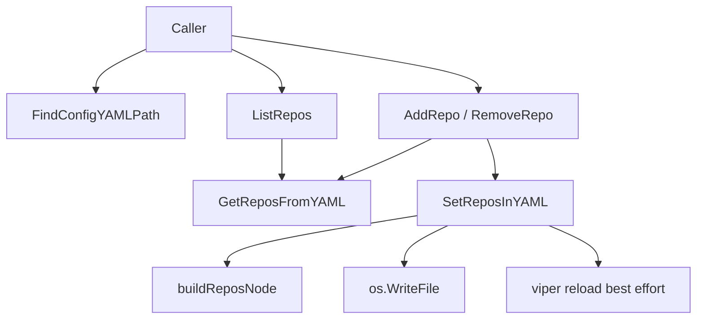

# repos_yaml_management

`repos_yaml_management` 模块（对应 `internal/config/repos.go`）解决的是一个看起来很小、但在工程里非常“黏手”的问题：**如何安全地在 `.beads/config.yaml` 中读写 `repos` 这一小段配置，而不把整个配置文件搞坏**。如果用最朴素的做法（定义一个大 struct 后整文件反序列化再序列化），你很快会遇到两个痛点：第一，用户手写的注释和格式会丢失；第二，系统其它配置段可能被“顺手改写”。这个模块的设计核心就是把自己当成“YAML 局部外科手术器”：只触碰 `repos` 节点，尽可能不干扰其他内容，并且提供 `AddRepo/RemoveRepo/ListRepos` 这种可以直接被上层命令调用的语义化操作。

## 这个模块在解决什么问题（Problem Space）

在多仓场景里，`.beads/config.yaml` 的 `repos` 段承担了路由入口的职责：`primary` 表示主仓，`additional` 表示额外仓列表。问题在于，这个文件不是纯机器生成的临时文件，而是长期存在、可能被人手工维护的配置资产。工程需求通常同时要求三件事：

1. 可编程地增删仓库；
2. 不破坏用户已有配置结构；
3. 操作完成后立即生效（尽量减少“改了配置但进程还没看到”的窗口）。

`repos_yaml_management` 的存在就是为了把这三件事揉在一起：提供稳定 API，最小化 YAML 结构扰动，并在写回后尝试触发配置重载。

## 心智模型（Mental Model）

可以把这个模块想成一个“配置文件里的局部补丁器（patcher）”。

- `ReposConfig` 是**意图层模型**：上层只关心“主仓是谁、附加仓有哪些”。
- YAML `Node` 操作是**载体层模型**：底层关心“如何保留原文结构、精准替换某个 key 的值节点”。
- `AddRepo/RemoveRepo/ListRepos` 是**用例层模型**：给调用方一个接近业务语言的接口，避免每个调用方自己做 YAML 解析和边界处理。

如果类比现实世界：它不像“重建整栋楼”，更像“在不搬空住户的前提下更换一扇窗”。你知道要改哪里（`repos`），也知道不能动哪里（其它配置段和尽量多的原始格式）。

## 架构与数据流



这个模块在架构上是一个很典型的“配置子域适配层”：上层调用语义 API，下层绑定文件系统与 YAML 库。

一次关键写操作（以 `AddRepo` 为例）的端到端路径是：调用方先拿到 `configPath`（通常来自 `FindConfigYAMLPath`），然后 `AddRepo` 先通过 `GetReposFromYAML` 读取当前状态，执行业务规则（如 `primary` 默认置为 `"."`、去重检查），最后委托 `SetReposInYAML` 做结构化写回。`SetReposInYAML` 内部先把文件解析成 `yaml.Node` 树，定位 `repos` 键，替换或删除对应值节点，再编码写盘，最后尝试 `v.ReadInConfig()` 做运行时刷新。

读路径更轻：`ListRepos -> GetReposFromYAML`，它按“容错优先”的策略处理缺失文件或缺失 `repos` 段，返回空 `ReposConfig`，让调用方无需为“未初始化状态”写大量分支。

## 组件深潜（Component Deep-Dive）

### `type ReposConfig struct`

`ReposConfig` 是模块的核心 DTO，字段只有两个：`Primary string` 与 `Additional []string`。它刻意保持极简，因为它的职责不是表达所有配置，而是只表达 `repos` 子树。这个“窄模型”设计减少了跨模块耦合：即便 `config.yaml` 其他段落演进，这里也不必跟着扩展。

`Additional` 的 tag 带有 `flow`，但要注意：当前写入路径并不依赖 struct 自动序列化，而是走 `yaml.Node` 手动构建，因此最终样式更受 `buildReposNode` 影响。

### `type configFile struct`

`configFile` 只包含 `root yaml.Node`，并且在当前文件中没有被公开操作。它体现了一个设计意图：该模块原本把“文件抽象”与“节点树”绑定在一起，但当前实现主要通过函数式流程操作局部变量 `root`。这意味着模块偏向“无状态函数工具集”，而不是富对象。

### `FindConfigYAMLPath() (string, error)`

这个函数通过 `os.Getwd()` 拿当前目录，然后向上逐级查找 `.beads/config.yaml`。这是典型的“从工作目录推导项目根”的策略，避免要求每个调用方都传入绝对路径。

它的隐含契约是：配置文件必须位于某级父目录下的 `.beads/config.yaml`，否则返回错误。这个约束把“仓库上下文发现”前置成一个统一规则，也降低了调用方各自实现路径探测的不一致风险。

### `GetReposFromYAML(configPath string) (*ReposConfig, error)`

读逻辑采取了“宽松解析、窄输出”。函数先 `os.ReadFile`，若文件不存在返回空 `ReposConfig`（不是错误）；然后把 YAML 解到 `map[string]interface{}`，只提取 `repos.primary` 与 `repos.additional`。这不是最类型安全的方案，但它有一个现实优点：当配置文件包含本模块不认识的结构时，不会因为强类型 struct 不匹配而整体失败。

代价是：类型断言路径较长，且对异常结构（比如 `repos` 不是 map）在运行时才报错。也就是说，它牺牲了一部分编译期保证，换取了面对“用户手写 YAML”时的鲁棒性。

### `SetReposInYAML(configPath string, repos *ReposConfig) error`

这是最关键的写入函数，承担三个任务：

第一，加载现有 YAML 并修复基础文档形态。对于空文件或只有注释的文件，它会显式构造 `DocumentNode -> MappingNode`，确保后续节点操作有稳定前提。

第二，执行局部替换。它在顶层 mapping 中线性扫描 key/value 成对节点寻找 `repos`，然后用 `buildReposNode` 的结果更新、追加或删除该段。这里的“删除语义”很重要：当 `repos` 为空时，它不是写入空 map，而是直接移除 `repos` 段，保持配置简洁。

第三，落盘并尝试热刷新。它用 `yaml.NewEncoder` 设置缩进为 2，写回文件权限 `0600`，随后如果包级变量 `v != nil` 则调用 `v.ReadInConfig()`。这里的刷新失败被设计为非致命，反映的判断是：**磁盘状态是事实来源，内存态刷新失败可以延后**。

### `buildReposNode(repos *ReposConfig) *yaml.Node`

这是“意图模型到 YAML 节点模型”的转换器。若 `repos == nil` 或者两个字段都为空，返回 `nil`，由调用方解释为“删除 `repos` 段”。这是一种简洁的 sentinel 设计：`nil` 不是错误，而是“无配置”的语义值。

它给 `primary` 和 `additional` 条目使用了 `yaml.DoubleQuotedStyle`，这意味着路径会被稳定地写成带双引号字符串。这样可以减少某些路径字符被 YAML 推断成特殊类型的风险，代价是输出风格更统一、但可能与用户原始风格不完全一致。

### `AddRepo(configPath, repoPath string) error`

`AddRepo` 是业务规则最集中的入口。流程是先读、再校验、再写：

- 如果 `primary` 为空，自动设为 `"."`（多仓约定）；
- 在 `additional` 中做精确字符串去重；
- 追加新路径并写回。

关键点在于它没有做路径标准化（如 `./x` 与 `x` 归一），因此“重复”的定义是字面相等。这个选择简单直接，但把路径规范责任留给调用方或上游命令。

### `RemoveRepo(configPath, repoPath string) error`

`RemoveRepo` 会线性过滤 `additional`，未找到则返回错误。删除后若 `additional` 为空，会把 `primary` 也清空，触发后续 `SetReposInYAML` 删除整个 `repos` 段。这个联动体现了模块对“空配置应最小化表示”的偏好。

### `ListRepos(configPath string) (*ReposConfig, error)`

`ListRepos` 只是 `GetReposFromYAML` 的语义化别名。它存在的价值主要是 API 可读性：调用方表达的是“列出仓库配置”，而不是“解析 YAML”。

## 依赖分析（What it calls / What calls it）

从代码可确认的下游依赖非常集中：

- 标准库：`os`（读写文件、路径存在性、cwd），`filepath`（向上遍历目录），`fmt`（错误包装），`strings.Builder`（编码缓存）；
- 第三方：`gopkg.in/yaml.v3`（YAML 解析、Node AST、编码器）；
- 包内隐式依赖：包级变量 `v`（用于 `ReadInConfig` 热刷新）。

从你提供的模块树可见，该模块归属 `Configuration -> repos_yaml_management`，同层还有 [runtime_config_resolution](runtime_config_resolution.md) 与 `metadata_json_config`。但当前输入没有更细粒度 `depended_by` 图，因此无法严格列出哪些具体命令直接调用了 `AddRepo/RemoveRepo/ListRepos`。可以确定的是：它的接口形态明显为上层命令/配置流程设计，而非底层存储引擎消费。

数据契约上，最重要的是 `ReposConfig <-> YAML repos section` 的映射关系：

- 输入 YAML 中 `repos` 若非 map，会报错；
- `additional` 仅接受序列中的字符串元素，非字符串元素会被忽略；
- 空 `ReposConfig` 在写入时被解释为删除 `repos` 段。

## 设计决策与权衡（Tradeoffs）

这个模块最值得注意的决策是“读时 map，写时 Node”。读路径用 `map[string]interface{}` 很务实，代码短且容错；写路径用 `yaml.Node` 则是为了保留结构、精准修改。这种混合策略比“全 struct”更灵活，但也引入风格不对称：读和写不是同一抽象层，维护者需要同时理解动态类型断言与 AST 操作。

第二个权衡是“简单一致性优先于强规范化”。例如 `AddRepo` 的去重是字面比较，不做 realpath/clean；`RemoveRepo` 也同理。这样避免了路径语义在不同 OS/工作目录下的复杂行为，但可能出现语义重复项。

第三个权衡是“持久化成功优先于运行时刷新成功”。`SetReposInYAML` 把 `v.ReadInConfig()` 失败视为非致命，保证命令不会因内存刷新问题回滚磁盘变更。这个选择对 CLI 场景通常是合理的，但如果未来出现强一致热更新需求，这里会成为设计张力点。

## 使用方式与示例

典型用法是先定位配置文件，再执行语义操作：

```go
configPath, err := FindConfigYAMLPath()
if err != nil {
    return err
}

if err := AddRepo(configPath, "../shared-repo"); err != nil {
    return err
}

repos, err := ListRepos(configPath)
if err != nil {
    return err
}
fmt.Println(repos.Primary, repos.Additional)
```

如果你已经明确知道路径，也可以直接调用：

```go
repos := &ReposConfig{
    Primary: ".",
    Additional: []string{"../repo-a", "../repo-b"},
}
if err := SetReposInYAML("/path/to/.beads/config.yaml", repos); err != nil {
    return err
}
```

当你想清空 `repos` 段时，可以传空配置或 `nil` 给 `SetReposInYAML`（`buildReposNode` 会返回 `nil`，触发删除）。

## 新贡献者需要注意的坑（Edge Cases & Gotchas）

最容易踩坑的是路径语义。模块不做 canonicalization，因此 `repo`、`./repo`、`../x/../repo` 会被视为不同值。若你在上层新增命令，最好在进入 `AddRepo/RemoveRepo` 前统一规范路径。

其次是 YAML 容错边界。`GetReposFromYAML` 对缺失文件很宽容，但对结构错误（如 `repos: []`）会直接报错；这意味着“文件不存在”和“文件损坏”在行为上是两类状态，调用方应区分处理。

再者是并发写入：模块当前没有文件锁，也没有 CAS 机制。并发命令同时修改 `config.yaml` 时，后写者可能覆盖前写者。若未来出现并发配置操作，需要在上层或此处引入锁策略。

最后是 `v` 的隐式依赖。`SetReposInYAML` 里热刷新是 best-effort，且依赖包级变量存在与初始化时机。调试“改完配置但当前进程行为没变化”时，应先确认 `ReadInConfig` 实际是否成功执行。

## 参考文档

- [runtime_config_resolution](runtime_config_resolution.md)：运行时配置解析与覆盖逻辑。
- [Storage_Interfaces](Storage_Interfaces.md)：配置如何最终影响存储行为（跨模块视角）。
- [Configuration](Configuration.md)：从模块边界层面串联 `repos_yaml_management` 与其他配置子模块。
