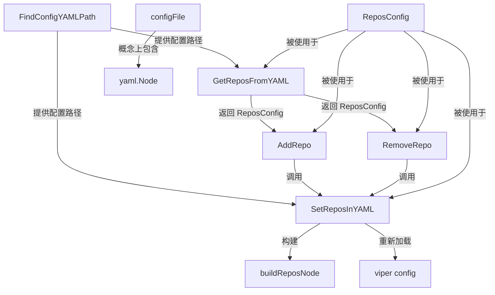

# Repository Configuration 模块深度技术解析

## 1. 问题空间与设计意图

### 为什么需要这个模块？

在多仓库项目协作环境中，开发者需要管理多个相关的代码仓库。`repository_configuration` 模块解决了**如何持久化、读取和修改仓库配置**这一核心问题。

想象一下，你在一个微服务架构中工作，每个微服务都有自己的仓库，但你需要同时在这些仓库之间协调工作。手动管理这些仓库路径不仅繁琐，而且容易出错。一个简单的解决方案可能是直接读写一个 YAML 文件，但这样会遇到几个问题：

1. **配置文件位置不固定**：项目可以在任何目录下，需要能向上查找配置
2. **需要保留用户注释**：直接反序列化再序列化会丢失用户添加的注释
3. **需要原子性操作**：修改配置时不应破坏其他配置项
4. **需要即时生效**：配置修改后应能立即被系统其他部分感知

`repository_configuration` 模块的设计洞察是：**使用 YAML 节点树而非直接反序列化到结构体，在保留完整文档结构的同时实现精确的配置修改**。

## 2. 核心抽象与 mental model

### 关键抽象

这个模块围绕两个核心结构体构建：

1. **`ReposConfig`**：仓库配置的业务抽象，包含主仓库和附加仓库列表
2. **`configFile`**：YAML 文档的底层表示，使用 `yaml.Node` 保留完整结构

### 类比理解

可以把 `repository_configuration` 模块想象成一个**精密的文件编辑机器人**：

- `FindConfigYAMLPath` 就像机器人的**定位系统**，从当前位置向上搜索，找到正确的文件
- `GetReposFromYAML` 是**阅读器**，它读取文件并提取出我们关心的仓库信息
- `SetReposInYAML` 是**精密操作器**，它小心翼翼地修改文件中的特定部分，同时不破坏其他内容和注释
- `AddRepo`/`RemoveRepo` 是**高级操作按钮**，提供友好的用户交互接口

这种分层设计让模块既能处理底层的文件格式细节，又能提供简洁的业务操作接口。

## 3. 架构与数据流程

### 组件架构图



### 数据流程详解

#### 读取配置流程

当调用 `ListRepos` 时：
1. 首先通过 `FindConfigYAMLPath` 定位配置文件
2. `GetReposFromYAML` 读取文件内容
3. 使用通用 `map[string]interface{}` 解析 YAML，避免丢失未知字段
4. 提取并转换 `repos` 部分为 `ReposConfig` 结构体
5. 返回结果给调用者

#### 修改配置流程

当调用 `AddRepo` 或 `RemoveRepo` 时：
1. 读取当前配置到 `ReposConfig`
2. 在内存中修改 `ReposConfig`
3. 调用 `SetReposInYAML` 写回文件
4. `SetReposInYAML` 使用 `yaml.Node` 解析整个文档，保留所有结构和注释
5. 找到或创建 `repos` 节点
6. 通过 `buildReposNode` 构建新的 `repos` 节点
7. 替换或添加 `repos` 节点到文档树
8. 编码并写回文件
9. 尝试重新加载 viper 配置，使更改立即生效

## 4. 核心组件深度解析

### ReposConfig 结构体

```go
type ReposConfig struct {
    Primary    string   `yaml:"primary,omitempty"`
    Additional []string `yaml:"additional,omitempty,flow"`
}
```

**设计意图**：这是仓库配置的核心业务模型。`Primary` 表示主工作目录，`Additional` 是其他关联仓库的列表。使用 `omitempty` 确保空值不会被序列化，保持配置文件简洁。

**关键点**：
- `flow` 标签让 `Additional` 序列化为单行格式，更适合路径列表
- 这是模块中唯一暴露给外部的业务数据结构

### FindConfigYAMLPath 函数

**设计意图**：解决配置文件位置发现问题。在协作环境中，用户可以在项目的任何子目录下运行命令，需要能自动找到项目根目录下的 `.beads/config.yaml`。

**实现机制**：从当前工作目录开始，逐级向上检查每个目录是否包含 `.beads/config.yaml`，直到找到文件或到达文件系统根目录。

**使用场景**：所有需要访问配置的命令都应首先调用此函数来定位配置文件。

### GetReposFromYAML 函数

**设计意图**：安全地读取仓库配置，同时不破坏配置文件中的其他内容。

**实现亮点**：
- 使用 `map[string]interface{}` 而非直接反序列化到 `ReposConfig`，这样可以避免丢失配置文件中的其他部分
- 对不存在的文件返回空配置而非错误，提供更好的用户体验
- 严格的类型检查确保即使配置格式有误也不会导致程序崩溃

**返回值语义**：总是返回一个非 nil 的 `ReposConfig` 指针，即使配置文件不存在或没有 repos 部分。

### SetReposInYAML 函数

这是模块中最复杂也最关键的函数，体现了模块的核心设计思想。

**设计意图**：修改 repos 配置的同时，保留配置文件中的所有其他内容、注释和格式。

**实现机制**：
1. 使用 `yaml.Node` 而非结构体来解析和操作 YAML 文档
2. 手动处理文档结构，确保即使是空文件也能正确初始化
3. 精确查找和替换 `repos` 节点，不影响其他配置项
4. 对空配置进行清理，移除不必要的 `repos` 部分

**关键设计决策**：
- 使用双引号样式（`yaml.DoubleQuotedStyle`）序列化路径，避免特殊字符问题
- 固定缩进为 2 空格，保持一致的格式
- 即使 viper 重新加载失败，也不会影响配置已写入磁盘的事实

### buildReposNode 函数

**设计意图**：将 `ReposConfig` 转换为 `yaml.Node` 树，为 `SetReposInYAML` 提供可插入的配置节点。

**关键点**：
- 当配置为空时返回 nil，这样 `SetReposInYAML` 可以完全移除 `repos` 部分
- 路径值使用双引号，避免空格和特殊字符引起的问题

### AddRepo/RemoveRepo/ListRepos 函数

这些是模块的**公共 API 门面**，提供了简洁的业务操作接口。

**设计意图**：封装底层的读写操作，提供符合用户直觉的操作接口。

**关键业务规则**：
- `AddRepo`：如果 `Primary` 未设置，默认设为 "."（当前目录）
- `RemoveRepo`：如果移除后没有附加仓库了，同时清空 `Primary`
- 都包含重复检查和存在性检查，提供清晰的错误信息

## 5. 依赖关系分析

### 入站依赖（谁使用此模块）

从模块树可以看出，`repository_configuration` 属于 `Configuration` 大模块，被以下部分使用：
- **CLI Routing Commands**：如 `cmd.bd.routed.RoutedResult` 等
- **CLI Setup Commands**：可能需要配置仓库
- 其他需要访问多仓库配置的 CLI 命令

### 出站依赖（此模块使用谁）

- **YAML 处理**：`gopkg.in/yaml.v3` 用于 YAML 解析和生成
- **文件系统操作**：标准库 `os` 和 `path/filepath`
- **Viper 配置**：全局 `v` 变量（代码中提到但未展示定义）

### 数据契约

此模块与外部的交互契约非常清晰：
- **输入**：文件系统路径字符串，仓库路径字符串
- **输出**：`ReposConfig` 结构体，或错误
- **副作用**：修改 `.beads/config.yaml` 文件，可能重新加载 viper 配置

## 6. 设计决策与权衡

### 1. 使用 yaml.Node 而非结构体直接序列化

**选择**：使用 `yaml.Node` 树来操作配置文件，而非直接反序列化到结构体再序列化。

**权衡**：
- ✅ **优点**：保留了用户的注释、空行和原始格式
- ✅ **优点**：不会丢失配置文件中的其他未知字段
- ❌ **缺点**：代码复杂度大幅增加，需要手动处理 YAML 节点
- ❌ **缺点**：需要处理各种边缘情况（如空文件、非映射根节点等）

**为什么这样选择**：用户体验优先。开发者会在配置文件中添加注释，丢失这些注释会让用户感到沮丧。

### 2. 两级 API 设计（底层读写 + 高级操作）

**选择**：提供底层的 `GetReposFromYAML`/`SetReposInYAML`，同时也提供高级的 `AddRepo`/`RemoveRepo`/`ListRepos`。

**权衡**：
- ✅ **优点**：高级 API 简单易用，底层 API 提供灵活性
- ✅ **优点**：职责分离，每个函数只做一件事
- ❌ **缺点**：API 表面积变大，需要维护更多函数

**为什么这样选择**：符合"不同抽象层级"的设计原则，让简单的事情简单，复杂的事情可能。

### 3. 向上查找配置文件的策略

**选择**：从当前目录向上查找 `.beads/config.yaml`。

**权衡**：
- ✅ **优点**：用户可以在项目的任何子目录下运行命令
- ❌ **缺点**：在嵌套项目结构中可能找到错误的配置文件
- ❌ **缺点**：有一定的性能开销（虽然在这个场景下可以忽略）

**为什么这样选择**：这是 Git 等工具的标准行为，用户已经习惯了这种工作方式。

### 4. Viper 重新加载的"尽力而为"策略

**选择**：在 `SetReposInYAML` 中尝试重新加载 viper 配置，但失败时不返回错误。

**权衡**：
- ✅ **优点**：配置写入成功就可以认为操作成功，viper 重新加载是锦上添花
- ✅ **优点**：即使 viper 有问题，配置文件也已经正确更新
- ❌ **缺点**：在某些情况下，配置修改可能不会立即在当前进程中生效

**为什么这样选择**：写入磁盘是核心操作，重新加载是优化。不应让优化失败影响核心功能的成功状态。

## 7. 使用指南与常见模式

### 基本用法示例

#### 列出当前配置的仓库

```go
configPath, err := repos.FindConfigYAMLPath()
if err != nil {
    log.Fatal(err)
}

reposConfig, err := repos.ListRepos(configPath)
if err != nil {
    log.Fatal(err)
}

fmt.Printf("Primary repo: %s\n", reposConfig.Primary)
fmt.Printf("Additional repos: %v\n", reposConfig.Additional)
```

#### 添加一个仓库

```go
configPath, err := repos.FindConfigYAMLPath()
if err != nil {
    log.Fatal(err)
}

err = repos.AddRepo(configPath, "../other-service")
if err != nil {
    log.Fatal(err)
}
```

#### 移除一个仓库

```go
configPath, err := repos.FindConfigYAMLPath()
if err != nil {
    log.Fatal(err)
}

err = repos.RemoveRepo(configPath, "../other-service")
if err != nil {
    log.Fatal(err)
}
```

#### 底层 API 直接操作

```go
configPath, err := repos.FindConfigYAMLPath()
if err != nil {
    log.Fatal(err)
}

// 读取
reposConfig, err := repos.GetReposFromYAML(configPath)
if err != nil {
    log.Fatal(err)
}

// 修改
reposConfig.Primary = "./new-primary"
reposConfig.Additional = []string{"../repo1", "../repo2"}

// 写回
err = repos.SetReposInYAML(configPath, reposConfig)
if err != nil {
    log.Fatal(err)
}
```

### 配置文件格式

`.beads/config.yaml` 中的 repos 部分格式如下：

```yaml
repos:
  primary: "."
  additional:
    - "../service-a"
    - "../service-b"
```

## 8. 边缘情况与注意事项

### 已知的边缘情况

1. **空配置文件**：模块会正确处理空文件或只有注释的文件，创建必要的结构
2. **非映射根节点**：如果 YAML 根节点不是映射（例如是一个列表），模块会替换它为映射
3. **repos 部分格式错误**：如果 repos 不是映射，`GetReposFromYAML` 会返回错误
4. **additional 不是列表**：会被安全地忽略，不会导致程序崩溃

### 隐含契约与注意事项

1. **路径是相对的**：仓库路径通常是相对于配置文件所在目录的相对路径
2. **Primary 的特殊含义**：当 Primary 为 "." 时，通常表示配置文件所在的目录本身
3. **文件权限**：写入配置文件时使用 0600 权限，确保只有当前用户可以读写
4. **并发安全**：这个模块不提供并发安全保证。如果多个进程同时修改配置，可能会导致竞态条件
5. **Viper 同步**：viper 重新加载失败不会影响配置已写入磁盘的事实，但当前进程可能仍在使用旧配置

### 常见陷阱

1. **忘记检查 FindConfigYAMLPath 的错误**：直接使用路径可能会导致在错误位置创建配置文件
2. **假设路径是绝对的**：路径通常是相对的，使用前应该相对于配置文件目录解析
3. **手动修改配置文件格式**：虽然模块会尽力保留格式，但大量手动编辑可能会导致模块修改时格式变化

## 9. 总结

`repository_configuration` 模块是一个看似简单但实际上设计精巧的组件。它解决了多仓库环境中的配置管理问题，其核心价值在于：

1. **用户体验优先**：保留注释和格式，让开发者感觉配置文件是"自己的"
2. **健壮性**：处理各种边缘情况，从不合理的配置中优雅恢复
3. **分层设计**：简单的事情简单做，复杂的事情也能做

这个模块展示了一个重要的设计原则：**有时候，为了更好的用户体验，值得在实现复杂度上做出妥协**。直接使用结构体序列化会简单得多，但使用 `yaml.Node` 树的额外复杂性换来了对用户友好的配置文件处理能力。
