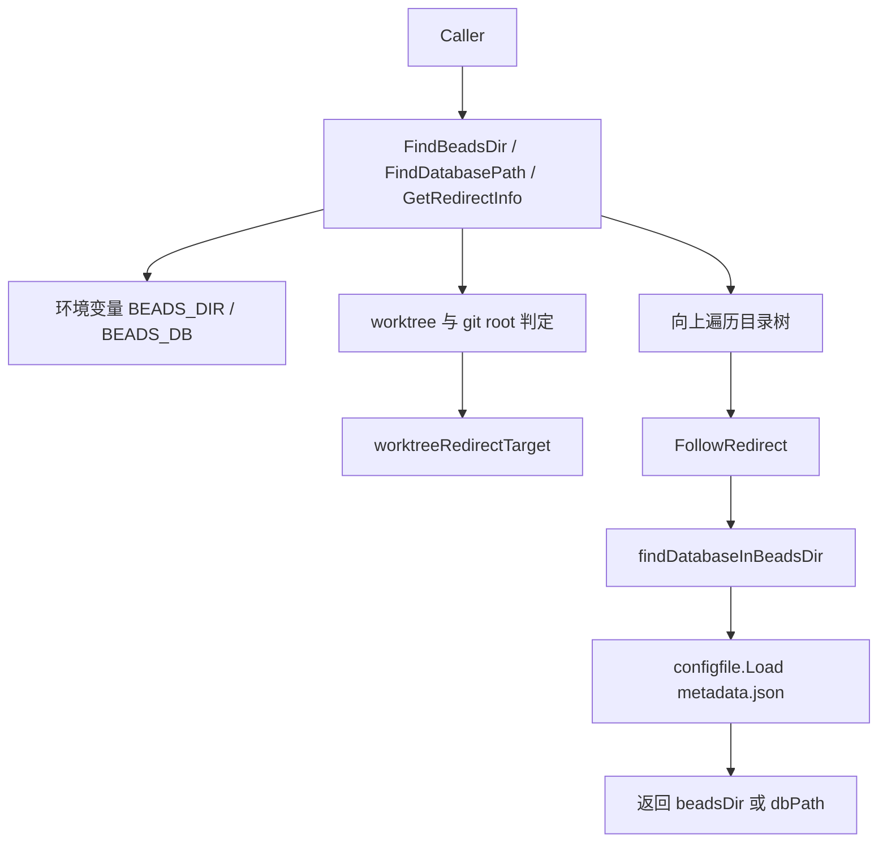

# repository_discovery_and_redirect 深度解析

`repository_discovery_and_redirect` 模块的本质，是给 `bd` 提供一个“不会走错仓库”的定位器。你在任意目录执行命令时，它要回答两个问题：**真正应该使用哪个 `.beads` 目录**，以及 **这个目录里的数据库到底在哪里**。如果只用“当前目录往上找 `.beads`”这种朴素策略，在 git worktree、符号链接、环境变量覆盖、以及 `.beads/redirect` 重定向存在时都会失真，最终表现为“找不到库”或“写进了错误库”。这个模块存在的意义，就是把这些真实世界的路径歧义收敛成一套可预测的发现流程。

## 架构角色与数据流



从架构定位看，它是一个**仓库上下文发现层（context discovery layer）**，不是存储引擎也不是业务层。它不打开 `Storage`、不执行事务、也不关心 issue 领域对象；它只负责“把环境解析成正确路径”。

数据流有三条主线。第一条是目录发现：`FindBeadsDir()` 侧重“有没有可用项目目录”。第二条是数据库发现：`FindDatabasePath()` 侧重“具体数据库路径是什么”。第三条是重定向态势感知：`GetRedirectInfo()` 侧重“本地 `.beads` 是否被 redirect 到别处”。三条线共享同一组基础能力：`FollowRedirect()`、worktree 判定、git 边界限制、以及配置文件解析。

## 心智模型：把它当“带路牌的停车场引导系统”

可以把这个模块想成大型停车场入口的引导系统。`BEADS_DIR/BEADS_DB` 是人工指定车位；`.beads/redirect` 是“此入口关闭，请去 B 区”的路牌；git worktree/main repo 关系是“你在分入口，但账务在主楼”；`metadata.json` 是车位登记系统，告诉你真正的数据落点。

这个比喻的关键点是：它不是“算一个路径字符串”那么简单，而是在多个信息源冲突时做优先级裁决，并尽量给出可运行结果（必要时回退）。

## 组件深挖

### `FollowRedirect(beadsDir string) string`

这是整个模块最核心的路径正规化器。它读取 `<beadsDir>/redirect`，提取第一条非空且非注释行作为目标路径；相对路径按 `beadsDir` 的父目录（即项目根）解析；然后调用 `utils.CanonicalizePath` 做规范化，并用 `os.Stat` 校验目标必须是目录。

设计上有两个很重要的取舍。第一，只支持**单跳重定向**：如果目标目录里也有 `redirect`，会打印警告但不会继续追链。这样做牺牲了“多级灵活性”，换来行为可预测与避免环路复杂度。第二，失败即回退原路径：读文件失败、目标无效、内容为空，都会返回输入的 `beadsDir`，把异常转化为“未重定向”。这是一种偏可用性的策略。

### `GetRedirectInfo() RedirectInfo` 与 `checkRedirectInDir`

`GetRedirectInfo` 解决的不是“找目录”，而是“解释当前是否处于重定向状态”。它先调用 `findLocalBdsDirInRepo()` 强制检查 git 仓库根下的本地 `.beads`，再回退到 `findLocalBeadsDir()`。

这个顺序背后的意图很关键：即使 `BEADS_DIR` 已经被外部环境直接设成“重定向目标”，系统仍希望识别“本地仓库其实配置了 redirect”，避免重定向事实被环境变量掩盖。`checkRedirectInDir` 则把“有 redirect 文件但解析失败”的场景显式区分出来：此时 `IsRedirected` 仍为 `false`。

### `findLocalBdsDirInRepo()` 与 `findLocalBeadsDir()`

这两个函数看起来相似，但语义不同。前者是“忽略环境变量，优先找 git repo 的真实本地 `.beads`”；后者是“按运行时优先级找本地 `.beads`”，会优先 `BEADS_DIR`，处理 worktree 覆盖，再考虑 main repo，最后才是从 CWD 向上遍历。

这里的非显式设计点是：在 worktree 场景，`findLocalBeadsDir` 会优先返回 worktree 本地 `.beads`（当存在 redirect 文件），而不是直接解析目标。这保证调用方可以先观察“是否存在覆盖配置”，再决定是否 `FollowRedirect`。

### `findDatabaseInBeadsDir(beadsDir string, _ bool) string`

这是数据库解析核心。它先尝试 `configfile.Load(beadsDir)` 读取 `metadata.json`（兼容旧 `config.json` 的迁移由配置模块内部处理），并把配置当“单一事实源”：

- 若配置为 Dolt server mode（`cfg.IsDoltServerMode()`），即使本地没有目录，也返回 `cfg.DatabasePath(beadsDir)`。
- 否则按 embedded 模式要求本地目录存在，存在才返回。
- 若无配置，再回退检查 `<beadsDir>/dolt`。

注意第二参数是未使用的 `_ bool`，说明接口曾经或未来可能区分“是否告警”等行为，目前实现选择保留签名稳定性而不使用该参数。

### `FindDatabasePath() string`

这是对外最常用入口之一，优先级非常明确：

1. `BEADS_DIR`（首选，且先 `FollowRedirect`）
2. `BEADS_DB`（已废弃但兼容）
3. `findDatabaseInTree()` 自动发现

最后找不到就返回空字符串，不会 fallback 到 `~/.beads`。这点是有意设计：防止误把用户主目录中的全局状态当成当前项目数据库。

### `hasBeadsProjectFiles(beadsDir string) bool`

它是 `FindBeadsDir()` 的安全阀，防止把“仅包含守护进程注册文件”的目录误判为项目。判定条件包括 `metadata.json`、`config.yaml`、`dolt/` 或有效 `*.db`（排除 `.backup` 与 `vc.db`）。

这看似细节，实则是“正确性优先于宽松匹配”的关键：宁可少认，也不误认。

### `FindBeadsDir() string`

这个函数解决“是否存在可用 beads 项目目录”，不要求一定能立刻解析出数据库。流程是：

- 先看 `BEADS_DIR`（并跟随 redirect）
- worktree 下优先 `worktreeRedirectTarget()`，再回退 main repo 的 `.beads`
- 再从 CWD 向上找 `.beads`
- 搜索受 git root / worktree root 边界限制
- 每一步都要过 `hasBeadsProjectFiles` 校验

其设计重点在边界控制：向上遍历一旦越过当前 git 上下文，就停止，避免扫到无关父目录里的 `.beads`。

### `worktreeRedirectTarget()`

这是 worktree 逻辑的复用锚点。它仅在 `git.IsWorktree()` 下工作，读取当前 worktree 的 `.beads/redirect` 并调用 `FollowRedirect`。一个很实用的细节是：若 redirect 文件存在但内容无效，函数会返回 worktree 的原始 `.beads`，让上层至少能知道“这里有重定向意图”。

### `findDatabaseInTree()`

这是自动发现数据库的“重路径（hot path）”。它会：

- 从 `os.Getwd()` 开始，并先 `filepath.EvalSymlinks` 统一路径视图
- worktree 下先尝试 per-worktree redirect target
- 再尝试 main repo `.beads`
- 最后做向上遍历
- 全程在 git root 边界内停止

与 `FindBeadsDir` 的区别是它最终目标是 `dbPath`，所以每次命中 `.beads` 后都调用 `findDatabaseInBeadsDir`。

### `FindAllDatabases() []DatabaseInfo`

名字看似“全量”，但实现上是“返回最近的可用数据库（最多一个）”。它一旦命中最近 `.beads` 并解析到数据库就停止。注释也明确这是为了支持嵌套 workspace：上层目录视为 out-of-scope。

它还做了 symlink 去重（`EvalSymlinks` + `seen` map）并保证返回空切片而不是 `nil`，这对调用方处理更稳定。

### 结构体：`RedirectInfo` 与 `DatabaseInfo`

`RedirectInfo` 是“重定向诊断模型”，字段分别表达是否重定向、本地目录、目标目录。`DatabaseInfo` 是“发现结果模型”，包含 `Path`、`BeadsDir` 和 `IssueCount`（当前用 `-1` 表示未知）。这两个结构体都刻意保持轻量，强调传递定位信息而非业务状态。

## 依赖分析与契约

从依赖关系看，本模块主要调用四类能力：

- Git 上下文：`git.GetRepoRoot`、`git.IsWorktree`、`git.GetMainRepoRoot`
- 配置解析：`configfile.Load`（并依赖 `Config` 的 `IsDoltServerMode`、`DatabasePath` 语义）
- 路径正规化：`utils.CanonicalizePath`
- 文件系统原语：`os.*`、`filepath.*`、`strings.*`

谁调用它方面，依赖图明确显示外层公开 API 通过包装函数转发到本模块，例如：

- `beads.FindDatabasePath -> internal.beads.beads.FindDatabasePath`
- `beads.FindBeadsDir -> internal.beads.beads.FindBeadsDir`
- `beads.FindAllDatabases -> internal.beads.beads.FindAllDatabases`
- `beads.GetRedirectInfo -> internal.beads.beads.GetRedirectInfo`

这意味着它在分层中的角色是“internal 实现 + 外层 `beads` 包公开入口”的后端实现层。

数据契约上最脆弱的点在配置模块：`findDatabaseInBeadsDir` 假设 `configfile.Load` 返回 `nil,nil` 代表“无配置但非错误”，并依赖 `DatabasePath(beadsDir)` 在 server/embedded 模式下含义稳定。如果该契约变化，数据库发现行为会整体漂移。

## 关键设计取舍

这个模块整体偏向“保守、可恢复、低惊讶”的策略。

在正确性 vs 易用性上，它大量采用回退策略：redirect 解析失败回原目录、自动发现失败返回空字符串、路劲遍历受 git 边界限制。这降低了误报和误写风险，但也意味着错误可能被“温和吞掉”，需要通过 stderr 告警和 `BD_DEBUG_ROUTING` 来观察。

在灵活性 vs 简单性上，选择支持 worktree/main repo/per-worktree redirect 三层语义，确实增加了代码分支复杂度；但对于真实团队的多工作区开发，这是必要复杂度，而不是过度设计。

在性能 vs 鲁棒性上，目录向上遍历与多次 `os.Stat` 显然不是最轻量路径，但它避免了缓存一致性问题，也让行为对临时文件系统变化更即时。

## 使用方式与示例

```go
// 1) 找数据库路径
if dbPath := beads.FindDatabasePath(); dbPath != "" {
    // 可用于后续 beads.Open / OpenFromConfig（见其他模块）
}

// 2) 只判断项目目录是否存在
if beadsDir := beads.FindBeadsDir(); beadsDir != "" {
    // 当前上下文可识别为 beads 项目
}

// 3) 获取重定向信息（用于 UI/诊断）
ri := beads.GetRedirectInfo()
if ri.IsRedirected {
    // ri.LocalDir -> ri.TargetDir
}
```

如果你在 internal 层扩展，直接使用：

```go
info := internal_beads.GetRedirectInfo() // 实际标识符为 internal.beads.beads.GetRedirectInfo
_ = info
```

## 新贡献者最容易踩的坑

第一，`FollowRedirect` 遇到“目标目录里还有 redirect”时只是告警，不会继续跟链，但仍会返回第一跳目标；不要误以为它会拒绝该目标。

第二，`FindAllDatabases` 名字容易误导。它不是扫描所有父级仓库，而是命中最近一个就停。改行为前要先确认 CLI/上层是否依赖这个“最近优先”约束。

第三，`FindBeadsDir` 与 `FindDatabasePath` 语义不同：前者判断“项目目录是否有效”，后者判断“数据库路径是否可用”。不要把两者混用成同一健康检查。

第四，worktree 逻辑有显式优先级（worktree redirect > main repo > 向上搜索）。如果改顺序，会直接影响多工作区团队的数据落点。

第五，本模块大量返回空字符串而非错误，这是 API 设计选择。若你新增“硬错误”，要评估是否破坏现有调用方的无数据库模式（例如 `--no-db`）。

## 参考

- [repo_context_resolution_and_git_execution](repo_context_resolution_and_git_execution.md)
- [metadata_json_config](metadata_json_config.md)
- [storage_contracts](storage_contracts.md)
- [Dolt Storage Backend](Dolt Storage Backend.md)
