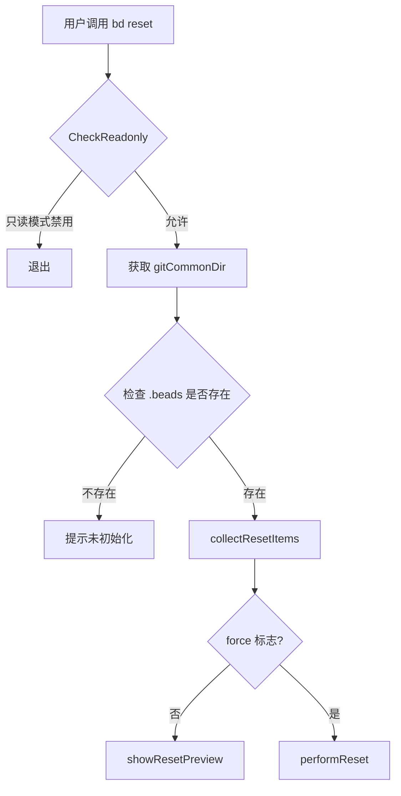

# Repository Reset 模块技术深度解析

## 1. 问题空间与模块存在意义

在使用 Beads 工具管理项目时，用户可能会遇到需要完全重置工具状态的情况。例如：配置错误、数据损坏、想要重新开始使用工具，或者从测试环境切换到生产环境等。直接手动删除相关文件既繁琐又容易遗漏，还可能破坏项目的 Git 配置。

Repository Reset 模块的核心任务就是提供一个安全、全面且可逆（在执行前提供预览）的方式，将 Beads 工具从当前仓库中完全移除，恢复到未初始化的状态。它解决了手动清理时可能出现的不彻底、误操作和风险高等问题。

## 2. 心智模型与核心抽象

可以将 Repository Reset 模块想象成一个**专业的搬家清理团队**。当你决定彻底搬出房子时，他们会：

1. **先进行一次全面清点**（`collectResetItems`）：列出所有需要搬走和清理的物品（文件、配置），不会遗漏任何角落。
2. **给你一份清单确认**（`showResetPreview`）：在动手之前，让你清楚地知道他们会做什么，避免误解。
3. **得到许可后才开始工作**（`--force` 标志）：确保你真的想这么做，因为这是不可撤销的。
4. **有条不紊地进行清理**（`performReset`）：按照预定的步骤，安全地移除每一项物品，甚至会帮你恢复之前的旧设置（如备份的 Git 钩子）。

核心抽象是 `resetItem` 结构体，它封装了每一项需要被重置的资源的信息：类型、路径和描述。整个重置过程就是围绕着识别、展示和处理这些 `resetItem` 展开的。

## 3. 架构与数据流程

### 3.1 架构概览

Repository Reset 模块是一个相对独立的 CLI 命令模块，它不依赖其他复杂的业务逻辑模块，主要与文件系统、Git 命令行工具以及 UI 渲染模块交互。



### 3.2 核心流程详解

1. **入口与安全检查**：命令由 `runReset` 函数入口。首先调用 `CheckReadonly` 确保不在只读模式下运行，然后获取 Git 仓库的公共目录（`gitCommonDir`），因为 Git 钩子和工作树通常是跨工作树共享的。
2. **收集重置项**：`collectResetItems` 函数是核心的“侦察兵”，它会遍历检查多种可能的 Beads 相关资源，并将它们封装成 `resetItem` 列表。
3. **预览与执行**：
   - 如果没有 `--force` 标志，调用 `showResetPreview` 向用户展示将要发生的操作，这是一种安全机制。
   - 如果有 `--force` 标志，调用 `performReset` 实际执行删除和配置修改操作。

## 4. 核心组件深度解析

### 4.1 `resetItem` 结构体

```go
type resetItem struct {
    Type        string `json:"type"`
    Path        string `json:"path"`
    Description string `json:"description"`
}
```

这是整个模块的基础数据结构。
- **Type**：标识项的类型（"hook", "config", "gitattributes", "worktrees", "directory"），决定了在 `performReset` 中如何处理它。
- **Path**：文件系统路径或配置项标识。
- **Description**：给用户看的友好描述。

### 4.2 `collectResetItems(gitCommonDir, beadsDir string) []resetItem`

**设计意图**：将“发现需要重置的内容”与“实际执行重置”分离，这是命令行工具中常见的“DRY - Don't Repeat Yourself”原则的体现，也使得干运行（Dry-run）模式变得简单。

**工作流程**：
1. **Git 钩子检查**：遍历 `pre-commit`, `post-merge` 等标准钩子，通过 `isBdHook` 检查其内容是否包含 Beads 标识。
2. **合并驱动配置**：通过 `hasMergeDriverConfig` 检查 Git 配置中是否存在 `merge.beads`。
3. **Git 属性检查**：通过 `hasGitattributesEntry` 检查 `.gitattributes` 文件。
4. **工作树目录**：检查 `gitCommonDir/beads-worktrees`。
5. **主数据目录**：最后加入 `.beads` 目录本身。

### 4.3 `performReset(items []resetItem, _, _ string)`

**设计意图**：实际执行变更，它是一个基于 `resetItem.Type` 的状态机。

**关键点**：
- **错误收集而非立即失败**：该函数不会因为某一项删除失败就中止整个过程，而是将错误收集起来最后一并报告。这确保了即使某个文件被锁定，其他能清理的部分依然会被清理。
- **钩子备份恢复**：在删除 Beads 钩子时，会自动检查是否存在 `.backup` 文件并将其恢复，这体现了对用户原有配置的尊重。
- **幂等性考量**：对于 Git 配置项的移除，使用了 `_ = exec.Command(...).Run()`，忽略错误，因为配置项可能已经不存在了。

### 4.4 `removeGitattributesEntry()`

这是一个精细的文件操作函数，展示了如何安全地修改配置文件而不破坏用户的其他设置。
- 它不仅仅是删除包含 `merge=beads` 的行，还会删除相关的注释行，以及清理遗留下的空行。
- 如果修改后 `.gitattributes` 变空了，它会直接删除该文件，保持工作区整洁。

## 5. 依赖分析

Repository Reset 模块是一个“末端”模块，被 CLI 框架直接调用。它的依赖很清晰：

* **被调用**：由 Cobra 命令框架（`resetCmd`）驱动。
* **内部调用**：
  * `git` 包：获取仓库路径。
  * `ui` 包：渲染警告、成功/失败信息。
  * 标准库 `os`, `os/exec`, `path/filepath` 等：文件系统操作。
* **对外影响**：
  * 修改 Git 配置（`git config`）。
  * 修改 `.gitattributes`。
  * 删除文件和目录。

## 6. 设计决策与权衡

1. **默认干运行（Dry-run by default）**：
   - **决策**：默认只显示预览，必须加 `--force` 才执行。
   - **权衡**：牺牲了一点便捷性（用户必须多打几个字），但极大地提高了安全性。对于破坏性操作，这是绝对正确的选择。

2. **硬编码的钩子名称与识别方式**：
   - **决策**：在代码中直接写死了钩子名称列表，并通过扫描文件内容前几行是否包含特定字符串来判断是否为 Beads 钩子。
   - **权衡**：这不是最“优雅”的解耦方式，但对于 CLI 工具来说，这种方式简单、直接、易于调试，且避免了维护复杂的钩子注册机制。

3. **使用 `os/exec` 调用 Git 命令**：
   - **决策**：没有使用 Go 的 Git 库，而是直接通过 `exec` 调用 `git config`。
   - **权衡**：这依赖于用户环境中安装了 Git 且在 PATH 中。但作为一个集成进 Git 工作流的工具，假设 Git 存在是合理的。直接调用命令行通常比链接库更稳定，且与用户手动执行的行为保持一致。

## 7. 用法与示例

### 基本用法

查看将要重置的内容（推荐先运行此命令）：
```bash
bd reset
```

确认无误后执行重置：
```bash
bd reset --force
```

### 输出示例（干运行）

```
⚠ Reset preview (dry-run mode)

The following will be removed:

  • Remove git hook: pre-commit
    .git/hooks/pre-commit
  • Remove beads entry from .gitattributes
    .gitattributes
  • Remove .beads directory (database, JSONL, config)
    .beads

⚠ This operation cannot be undone!

To proceed, run: bd reset --force
```

## 8. 边缘情况与注意事项

1. **非 Git 仓库**：如果当前目录不是 Git 仓库，命令会直接报错退出。
2. **权限问题**：如果 `.beads` 目录下有权限受限的文件，`os.RemoveAll` 可能会失败。
3. **`.gitattributes` 的修改**：`removeGitattributesEntry` 只会删除与 `merge=beads` 相关的行。如果你在该区域附近手动添加了自定义注释，这些注释可能会被意外删除（尽管逻辑尝试只删除 Beads 相关注释）。
4. **钩子备份**：只有当 Beads 安装钩子时创建了 `.backup` 文件时，恢复才会生效。如果用户手动替换了钩子，备份机制可能不适用。
5. **JSON 输出模式**：当全局 `jsonOutput` 为 true 时，所有的 UI 打印都会变成结构化 JSON 输出。

## 9. 总结

Repository Reset 模块是一个设计精良的“清理工具”。它的价值不在于复杂的算法，而在于其**对安全性的重视**（默认干运行）、**对细节的把控**（恢复备份钩子、清理空行）以及**用户体验的优化**（清晰的预览列表）。它是一个典型的“小而美”的模块，代码虽短，但很好地完成了它的单一职责。
