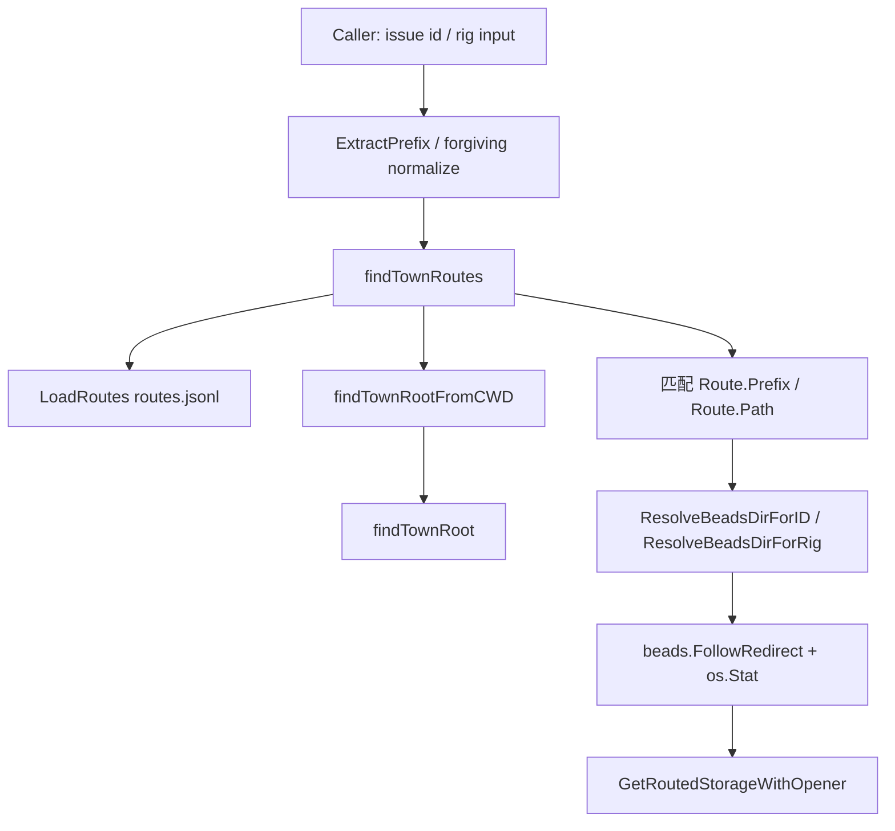

# route_resolution_and_storage_routing 深度解析

`route_resolution_and_storage_routing` 解决的是一个很现实的问题：当你在当前仓库里拿到一个 issue ID（比如 `gt-abc123`），这个 issue 可能并不属于“当前 `.beads` 数据库”，而是属于同一个 town 下的另一个 rig。朴素做法是“总在本地库查”，结果要么查不到、要么误写到错误数据库。这个模块就是一层“分诊台”：先看 ID/rig 的前缀和路由规则，再决定该去哪个 `.beads` 目录，必要时再打开对应存储。

## 架构与数据流



从角色上看，这个模块是 **路由解析层 + 存储路由网关**，不是业务规则层。它并不关心 issue 的字段，也不做同步策略，它只负责“ID/rig -> 目标 `.beads` 目录 ->（可选）打开目标 `DoltStore`”。

数据流上有两条主线。第一条是“只做解析”：例如 `ResolveToExternalRef` 把一个带前缀 ID 映射为 `external:<project>:<id>`。第二条是“解析 + 开连接”：`GetRoutedStorageWithOpener` 先调用 `ResolveBeadsDirForID`，确认需要跨库后，再通过调用方提供的 `StorageOpener` 打开目标存储。

## 心智模型：把它当“邮政分拣中心”

理解这段代码最好的比喻是邮政分拣。`routes.jsonl` 就像“邮编到投递站”的映射表：

- `Route.Prefix` 是邮编前缀（例如 `gt-`）
- `Route.Path` 是投递站相对路径（例如 `beads/mayor/rig`）
- `findTownRoutes` 是先确定当前城市（town root）再读取分拣表
- `ResolveBeadsDirForID` 是按邮编决定包裹应该进哪个站
- `GetRoutedStorageWithOpener` 则是在确认站点后，真的去开门进入那个站点数据库

这个模型也解释了为什么“只看当前目录”不够：在 multi-rig/town 场景下，当前进程所在目录和目标 issue 所在目录可以不同。

## 组件深挖（按职责分组）

### 1) 路由规则载入与容错

`LoadRoutes(beadsDir string) ([]Route, error)` 从 `<beadsDir>/routes.jsonl` 逐行读取 JSONL。这里有两个重要设计选择。

第一，它把“没有路由文件”当作正常情况（返回 `nil, nil`），这让单仓库场景零配置可用。第二，它会跳过空行、注释行、以及 malformed JSON 行，而不是整体失败；这是明显偏向可用性的选择，避免一行坏数据让整套路由瘫痪。

`LoadTownRoutes(beadsDir string)` 只是 `findTownRoutes` 的薄封装，隐藏了 town-root 搜索细节，提供更直接的调用入口。

### 2) 字符串语义提取（轻量但关键）

`ExtractPrefix(id string) string` 用第一个 `-` 提取前缀（包含连字符）。它是 `ResolveBeadsDirForID` 和 `ResolveToExternalRef` 的共同前置步骤。隐含契约是：路由机制默认 ID 形态接近 `<prefix>-<suffix>`。

`ExtractProjectFromPath(path string) string` 取路由路径第一段。模块把这个“第一段”当作 rig/project 名称，用于 `LookupRigByName` 和 `ResolveToExternalRef` 的 `external:<project>:...` 生成。也就是说，`Route.Path` 的第一段有语义，不只是任意目录字符串。

### 3) Rig 查找（严格与宽松两种入口）

`LookupRigByName(rigName, beadsDir string)` 是严格匹配：加载本地路由后，用 `ExtractProjectFromPath(route.Path)` 与 `rigName` 比较。

`LookupRigForgiving(input, beadsDir string)` 背后调用 `lookupRigForgivingWithTown`，接受更宽松输入：`bd-`、`bd`、`beads` 都可。设计意图很明确：这是面向人和 agent 的 UX 优化，降低调用方在参数规范化上的负担。

`lookupRigForgivingWithTown` 除了返回 `Route`，还返回 `townRoot`。这是后续 `ResolveBeadsDirForRig` 能正确拼接目标路径的关键（尤其在 town 级路由场景）。

### 4) 目录解析（核心决策点）

`ResolveBeadsDirForRig(rigOrPrefix, currentBeadsDir)` 面向 `--rig/--prefix` 这类显式跨库意图。它先宽松查 route，再把 `Route.Path` 解析成目标 `.beads` 路径：

- `route.Path == "."` 时代表 town 级 `.beads`
- 否则按 `filepath.Join(townRoot, route.Path, ".beads")`

之后调用 `beads.FollowRedirect`，再用 `os.Stat` 确认目录存在。也就是说，这个函数不仅“算路径”，还“做存在性校验”。

`ResolveBeadsDirForID(ctx, id, currentBeadsDir)` 是按 ID 自动路由的主入口。它先从 `findTownRoutes` 拿可用路由，再拿 `ExtractPrefix(id)` 进行匹配。匹配成功后与 `ResolveBeadsDirForRig` 一样做路径拼接、redirect、目录校验；若无匹配或目标不存在，则回退本地 `currentBeadsDir`。

这个“失败即回退本地”的策略体现出保守设计：宁可不路由，也不因为路由缺失阻断本地工作流。

### 5) town 根定位（symlink 场景的非显式复杂度）

`findTownRoot(startDir string)` 通过向上查找 `mayor/town.json` 判定 town root。

`findTownRootFromCWD()` 不从 `currentBeadsDir` 起步，而从 `os.Getwd()` 起步。配合 `findTownRoutes` 的注释可见，这是专门为 symlink `.beads` 设计：如果 `.beads` 是符号链接，直接从解析后的真实路径向上走，可能会落到错误 town；从 CWD 走能更接近“用户实际所在 town 语义”。

`findTownRoutes(currentBeadsDir)` 先尝试当前 beadsDir 的 `routes.jsonl`，再在 CWD 上行找 town root 并去 `<townRoot>/.beads/routes.jsonl` 读取。这是整个模块最关键的“本地优先 + town 兜底”路由发现策略。

### 6) 存储路由封装

`RoutedStorage` 把 `*dolt.DoltStore`、目标目录、是否路由打包，`Close()` 负责关闭连接。

`GetRoutedStorageForID` 已标记 DEPRECATED，内部直接转发到 `GetRoutedStorageWithOpener`。

`GetRoutedStorageWithOpener(ctx, id, currentBeadsDir, opener)` 体现了解耦设计：模块本身不硬编码如何打开存储，而是要求调用方注入 `StorageOpener`。只有在 `ResolveBeadsDirForID` 判断为跨目录且目标与当前不同时才会打开新存储，否则返回 `nil` 让调用方继续用现有连接。

## 依赖关系与契约

基于提供的依赖图，模块内部热点链路是：`GetRoutedStorageWithOpener -> ResolveBeadsDirForID -> findTownRoutes -> (LoadRoutes + findTownRootFromCWD -> findTownRoot)`。这是“按 ID 打开路由存储”的主路径。

同图可见，`ResolveToExternalRef` 依赖 `LoadRoutes + ExtractPrefix + ExtractProjectFromPath`，它是“只做引用转换”的另一条轻路径。

对外依赖方面，这个模块直接调用：

- `beads.FollowRedirect`：处理 `.beads` 重定向/符号链接落点
- `*dolt.DoltStore`：通过 `RoutedStorage` 承载真实存储连接（参考 [Dolt Storage Backend](Dolt Storage Backend.md)）

而“谁调用本模块”的跨模块详细图在当前材料中未给出；能确认的是本模块公开 API（如 `ResolveBeadsDirForID`、`GetRoutedStorageWithOpener`）就是 Routing 子系统给上层命令/业务层的边界。

## 设计取舍

这个模块明显偏向“鲁棒运行”而不是“严格失败”。例如 `LoadRoutes` 跳过坏行、`ResolveBeadsDirForID` 在路由失败时回退本地。好处是线上不容易被配置瑕疵击穿；代价是错误可能被静默吞掉，问题定位依赖 `BD_DEBUG_ROUTING`。

它也在“灵活性 vs 简洁性”上做了选择：通过 `LookupRigForgiving` 和 `route.Path=="."` 特例支持多种输入和 town 级语义，提升可用性；但也引入额外隐式规则，新贡献者如果不知道这些约定，很容易改坏兼容行为。

在“耦合 vs 可替换”上，`GetRoutedStorageWithOpener` 通过 opener 注入把开库细节外置，降低了对单一 backend 工厂的耦合。这是一个清晰的扩展点，也解释了旧 API 被标记 deprecated 的原因。

## 使用方式与示例

```go
ctx := context.Background()

opener := func(ctx context.Context, beadsDir string) (*dolt.DoltStore, error) {
    // 由调用方决定如何创建 store
    return dolt.Open(ctx, beadsDir)
}

rs, err := GetRoutedStorageWithOpener(ctx, "gt-abc123", currentBeadsDir, opener)
if err != nil {
    return err
}
if rs != nil {
    defer rs.Close()
    // 使用 rs.Storage 操作路由到的数据库
} else {
    // 未路由，继续使用当前已有 storage
}
```

如果你只是做显示层转换而不需要开库，可用 `ResolveToExternalRef(id, beadsDir)`，例如得到 `external:beads:bd-abc`。

## 新贡献者需要特别注意的坑

第一，`routes.jsonl` 是 JSONL（逐行 JSON），不是单个 JSON 数组；并且坏行会被静默跳过。改解析逻辑时不要破坏这种“部分可用”策略。

第二，symlink `.beads` 是真实场景，`findTownRootFromCWD` 不是多余代码。若改为统一从 `currentBeadsDir` 上溯，可能把 town root 解析错。

第三，`Route.Path` 第一段被当作 project 名，且 `"."` 有特殊语义。改路径格式时要同步审视 `ExtractProjectFromPath` 与路径拼接逻辑。

第四，`GetRoutedStorageWithOpener` 返回 `nil, nil` 有两种语义：未路由，或路由目标等于当前目录。调用方必须按“nil 表示继续用现有 storage”来处理。

第五，调试路由问题优先打开 `BD_DEBUG_ROUTING`，否则很多分支（如目标不存在、town fallback）只会静默回退。

## 参考

- [repo_role_and_target_selection](repo_role_and_target_selection.md)
- [Dolt Storage Backend](Dolt Storage Backend.md)
- [storage_contracts](storage_contracts.md)
