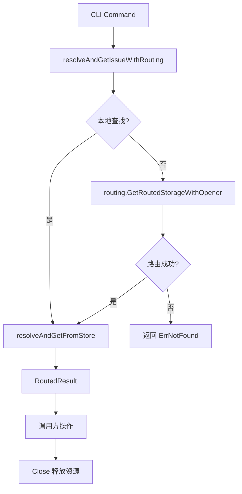

# routing_core 模块技术深度解析

## 1. 问题背景与模块定位

### 问题空间

在现代软件项目中，经常会遇到**跨仓库（repo）的问题管理**场景。比如：
- 主项目（town repo）维护核心功能，而子模块（rig repos）负责特定领域
- 团队使用不同的问题跟踪系统，但希望能够无缝引用和操作不同系统中的问题
- 单个仓库变得过于庞大，需要将问题分配到不同的物理存储中

传统的解决方案要么是**强制集中式存储**（失去了分布式的灵活性），要么是**完全隔离的多仓库**（失去了跨仓库的可见性和操作能力）。

### 解决方案：路由层

`routing_core` 模块提供了一个**透明的路由层**，使得用户可以在当前仓库中无缝地操作其他仓库中的问题，就像这些问题存在于本地一样。

---

## 2. 核心抽象与心智模型

### 核心抽象

`routing_core` 模块有两个核心数据结构：

1. **Route**：定义了从问题 ID 前缀到目标仓库的映射关系
   ```go
   type Route struct {
       Prefix string  // Issue ID prefix (e.g., "gt-")
       Path   string  // Relative path to .beads directory
   }
   ```

2. **RoutedStorage**：封装了路由后的存储连接
   ```go
   type RoutedStorage struct {
       Storage  *dolt.DoltStore  // 实际的存储连接
       BeadsDir string           // 目标仓库的 .beads 目录
       Routed   bool             // 是否为路由存储（非本地）
   }
   ```

### 心智模型

可以将 `routing_core` 模块想象成一个**智能邮局**：
- 当你需要发送一封信（操作一个问题）时，邮局首先检查本地邮箱
- 如果本地找不到，邮局会查看邮编（问题 ID 前缀）
- 根据邮编，邮局会将信件转发到对应的分局（目标仓库）
- 整个过程对发件人（用户）是透明的

---

## 3. 架构与数据流程

### 架构图



### 数据流程详解

#### 核心查找流程：resolveAndGetIssueWithRouting

这是模块的核心函数，它实现了一个**两级查找策略**：

1. **本地优先**：首先在当前仓库中查找问题
   - 这样可以确保本地创建的问题（如 agent beads）优先使用本地副本
   - 避免了路由到可能过期的远程副本

2. **路由备用**：如果本地找不到，则使用前缀路由查找

#### 关键辅助函数

1. **resolveAndGetFromStore**：在指定存储中解析并获取问题
2. **beadsDirOverride**：检查是否通过环境变量覆盖了 beads 目录
3. **isNotFoundErr**：统一处理不同类型的"未找到"错误

---

## 4. 组件深度解析

### RoutedResult 结构体

```go
type RoutedResult struct {
    Issue      *types.Issue
    Store      *dolt.DoltStore  // 包含该问题的存储（可能是路由后的）
    Routed     bool              // 是否通过路由找到
    ResolvedID string            // 解析后的完整问题 ID
    closeFn    func()            // 关闭路由存储的函数
}
```

**设计亮点**：
- 封装了问题、存储和路由状态的完整上下文
- 通过 `closeFn` 实现了资源的安全释放
- `ResolvedID` 确保了即使使用部分 ID 也能获得完整标识

### 路由决策逻辑

模块中有几个关键的路由决策点：

1. **是否需要路由**：`needsRouting` 函数检查问题 ID 是否会被路由到其他仓库
2. **BEADS_DIR 覆盖**：如果设置了 `BEADS_DIR` 环境变量，则强制使用本地存储
3. **前缀匹配**：通过 `routes.jsonl` 文件中的前缀规则进行路由

---

## 5. 依赖分析

### 上游依赖

- **CLI 命令层**：如 `cmd/bd/routed.go` 中的命令调用路由功能
- **配置系统**：提供仓库路径和路由规则

### 下游依赖

- **internal.routing.routes**：提供路由数据结构
- **internal.storage.dolt**：提供实际的存储实现
- **internal/types**：提供问题数据结构

### 关键契约

1. **调用方必须调用 Close()**：`RoutedResult` 返回后，调用方必须调用 `Close()` 释放资源
2. **本地优先策略**：模块保证本地存储中的问题优先被找到
3. **错误处理契约**：模块统一处理各种"未找到"错误

---

## 6. 设计决策与权衡

### 决策 1：本地优先策略

**选择**：总是先在本地存储中查找问题，然后再考虑路由。

**原因**：
- 确保本地创建的问题（如 agent beads）使用本地副本
- 避免了路由到可能过期的远程副本
- 符合用户的直觉期望

**权衡**：
- 优点：数据一致性好，用户体验直观
- 缺点：在某些情况下可能会多一次本地查找的开销

### 决策 2：透明路由

**选择**：对用户完全透明，用户不需要知道问题实际在哪里。

**原因**：
- 简化了用户的心智模型
- 使得跨仓库操作变得 seamless
- 符合"关注点分离"原则

**权衡**：
- 优点：用户体验好，使用简单
- 缺点：隐藏了一些复杂性，可能导致用户对实际存储位置的误解

### 决策 3：资源封装

**选择**：通过 `RoutedResult` 封装所有必要的资源，并提供 `Close()` 方法。

**原因**：
- 确保资源的正确释放
- 简化调用方的代码
- 避免资源泄漏

**权衡**：
- 优点：资源管理安全，调用方代码简洁
- 缺点：增加了一个额外的抽象层

---

## 7. 使用示例与最佳实践

### 基本使用模式

```go
// 获取带有路由的问题
result, err := resolveAndGetIssueWithRouting(ctx, localStore, id)
if err != nil {
    return err
}
defer result.Close()  // 确保资源释放

// 使用 result.Issue 和 result.Store 进行操作
// ...
```

### 解析外部依赖

```go
// 解析外部依赖引用
externalDeps, err := resolveExternalDepsViaRouting(ctx, issueStore, issueID)
if err != nil {
    return err
}
```

### 打开其他仓库的存储

```go
// 打开另一个 rig 的存储
targetStore, err := openStoreForRig(ctx, "gt-")
if err != nil {
    return err
}
defer targetStore.Close()
```

---

## 8. 边缘情况与陷阱

### 常见陷阱

1. **忘记调用 Close()**：
   - 后果：资源泄漏，可能导致文件句柄耗尽
   - 解决：总是使用 `defer result.Close()`

2. **BEADS_DIR 覆盖**：
   - 陷阱：设置了 `BEADS_DIR` 环境变量后，路由会被禁用
   - 解决：注意检查环境变量

3. **部分 ID 解析**：
   - 陷阱：部分 ID 在不同仓库中可能有歧义
   - 解决：尽量使用完整 ID

### 边缘情况

1. **循环路由**：A 仓库路由到 B 仓库，B 仓库又路由回 A 仓库
   - 当前处理：简单的前缀匹配不会导致循环，因为每个 ID 只路由一次

2. **路由规则变更**：`routes.jsonl` 文件在运行时被修改
   - 当前处理：每次路由都会重新读取文件，所以会使用最新规则

3. **网络问题**：路由到远程仓库时网络失败
   - 当前处理：返回适当的错误，调用方负责处理

---

## 9. 相关模块

- [routing_config](routing-routing_config.md)：路由配置模块
- [storage_interfaces](storage-storage_contracts.md)：存储接口定义
- [dolt_storage_backend](dolt_storage_backend-transaction_management.md)：Dolt 存储实现
