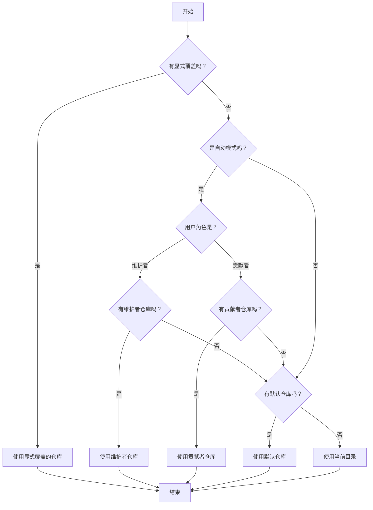

# Routing Config 模块深度解析

## 1. 问题定位：为什么需要路由配置？

在多仓库协作的开发场景中，不同角色的用户（维护者 vs 贡献者）通常需要将问题（issue）创建在不同的仓库中。例如：
- 维护者可能希望在核心仓库中直接创建问题
- 贡献者可能需要在 fork 仓库中创建问题，然后通过 PR 提交

`routing_config` 模块解决的核心问题是：**如何根据用户角色和配置规则，智能地决定新问题应该创建在哪个仓库中？**

如果没有这个模块，每个命令都需要手动指定仓库路径，既容易出错，又破坏了用户体验。

## 2. 核心抽象与心智模型

理解这个模块的关键是掌握两个核心抽象：

### 2.1 用户角色（UserRole）
这是一个简单但重要的区分：
- **Maintainer（维护者）**：对仓库有直接写入权限的用户
- **Contributor（贡献者）**：通常只有读取权限，需要通过 fork 和 PR 来贡献

### 2.2 路由配置（RoutingConfig）
可以把 `RoutingConfig` 想象成一个**决策表**，它根据以下因素做出仓库选择：
- 模式（Mode）：自动决策还是显式指定
- 用户角色（UserRole）：维护者还是贡献者
- 显式覆盖：用户是否通过命令行标志强制指定

**类比**：这就像邮件分拣系统——根据发件人身份（用户角色）和分拣规则（配置），将邮件（新问题）投递到正确的邮箱（仓库）。

## 3. 数据流程与决策树

让我们追踪一个典型的仓库决策过程：



### 3.1 决策优先级
这个决策树体现了清晰的优先级顺序：
1. **显式覆盖优先**：用户直接指定的仓库最高优先级
2. **自动模式其次**：根据用户角色选择对应仓库
3. **默认仓库再次**：没有角色匹配时使用默认值
4. **当前目录兜底**：完全没有配置时使用当前目录

## 4. 核心组件详解

### 4.1 UserRole 类型
```go
type UserRole string

const (
    Maintainer  UserRole = "maintainer"
    Contributor UserRole = "contributor"
)
```
这是一个简单的枚举类型，用于明确区分用户角色。

### 4.2 RoutingConfig 结构
```go
type RoutingConfig struct {
    Mode             string // "auto" or "explicit"
    DefaultRepo      string // Default repo for new issues
    MaintainerRepo   string // Repo for maintainers (in auto mode)
    ContributorRepo  string // Repo for contributors (in auto mode)
    ExplicitOverride string // Explicit --repo flag override
}
```

每个字段的设计意图：
- **Mode**：控制决策策略，"auto" 表示自动决策，"explicit" 表示需要显式指定
- **DefaultRepo**：兜底配置，当其他规则都不匹配时使用
- **MaintainerRepo/ContributorRepo**：角色特定的仓库配置
- **ExplicitOverride**：命令行标志的直接覆盖，最高优先级

### 4.3 DetectUserRole 函数
这个函数负责探测用户角色，有两个探测策略：

1. **首选：显式配置**
   - 读取 git config 中的 `beads.role` 设置
   - 这是最可靠的方式，用户可以完全控制自己的角色

2. **降级：URL 启发式**（已弃用）
   - 通过分析远程 URL 推断角色
   - SSH URL 或包含认证信息的 URL 通常表示维护者
   - 纯 HTTPS URL 通常表示贡献者
   - 已弃用的原因是 SSH URL 并不总是表示写入权限（例如 fork 的仓库）

3. **兜底：本地项目**
   - 如果没有远程仓库，默认是维护者角色

**设计洞察**：函数采用了"优雅降级"策略——优先使用最可靠的方式，但为了向后兼容保留了旧的启发式方法，同时通过警告提示用户迁移。

### 4.4 DetermineTargetRepo 函数
这是核心决策函数，实现了前面描述的决策树。它的设计体现了几个重要原则：

1. **优先级清晰**：显式覆盖 > 自动模式 > 默认值 > 当前目录
2. **防御性编程**：检查每个配置值是否为空，避免空值导致的问题
3. **无副作用**：纯函数，只做决策，不修改任何状态

### 4.5 ExpandPath 函数
这个函数处理路径展开，解决两个常见问题：
- 将 `~` 展开为用户主目录
- 将相对路径转换为绝对路径

**设计洞察**：函数采用"尽力而为"策略——如果展开失败，就返回原始路径，而不是报错，这样不会因为路径问题阻塞整个流程。

## 5. 依赖关系与集成点

### 5.1 输入依赖
- **git 命令**：用于读取配置和远程 URL
- **文件系统**：用于路径操作和主目录查找

### 5.2 输出契约
- **UserRole**：明确的角色类型，不是任意字符串
- **仓库路径**：经过展开处理的路径字符串

### 5.3 被谁调用
这个模块通常被 CLI 命令层调用，特别是创建新问题的命令。它为这些命令提供仓库选择逻辑，让命令可以专注于自己的核心功能。

## 6. 设计决策与权衡

### 6.1 决策优先级的选择
**选择**：显式覆盖 > 自动模式 > 默认值 > 当前目录

**理由**：
- 显式覆盖优先级最高，因为用户最清楚自己想要什么
- 自动模式其次，因为这是最常用的场景
- 默认值再次，提供合理的兜底
- 当前目录最后，完全没有配置时的安全选项

### 6.2 优雅降级策略
**选择**：保留旧的 URL 启发式方法，但添加警告

**权衡**：
- ✅ 向后兼容，不会破坏现有用户
- ✅ 引导用户迁移到更可靠的显式配置
- ❌ 代码稍微复杂一些，需要维护两种探测逻辑

**替代方案**：直接移除旧方法，但这会导致现有用户突然改变行为，体验不好。

### 6.3 尽力而为的路径展开
**选择**：展开失败时返回原始路径，而不是报错

**权衡**：
- ✅ 鲁棒性强，不会因为路径问题阻塞整个流程
- ❌ 可能导致后续操作失败，但那时错误信息会更明确

**设计洞察**：这是一种"延迟失败"策略——让问题在更具体的上下文中暴露，而不是在通用的路径展开函数中失败。

## 7. 使用指南与最佳实践

### 7.1 推荐配置方式
1. **显式设置用户角色**（最可靠）：
   ```bash
   git config --global beads.role maintainer  # 或 contributor
   ```

2. **配置路由规则**：
   - 对于维护者：设置 `MaintainerRepo` 为核心仓库
   - 对于贡献者：设置 `ContributorRepo` 为 fork 仓库
   - 设置合理的 `DefaultRepo` 作为兜底

### 7.2 常见模式
**模式 1：单仓库维护者**
- Mode: "auto"
- MaintainerRepo: "."
- DefaultRepo: "."

**模式 2：多仓库协作**
- Mode: "auto"
- MaintainerRepo: "/path/to/core-repo"
- ContributorRepo: "/path/to/fork-repo"
- DefaultRepo: "/path/to/core-repo"

### 7.3 扩展点
如果需要自定义用户角色探测逻辑，可以：
1. 修改 `DetectUserRole` 函数，添加新的探测策略
2. 保持决策优先级不变，只添加新的探测方式
3. 确保向后兼容，不要破坏现有用户

## 8. 边缘情况与陷阱

### 8.1 常见边缘情况
1. **没有远程仓库**：默认是维护者角色
2. **SSH URL 但没有写入权限**：URL 启发式会误判，建议显式配置角色
3. **路径包含 ~**：确保 `ExpandPath` 被正确调用
4. **相对路径**：注意当前工作目录的影响

### 8.2 避免的陷阱
1. **不要依赖 URL 启发式**：它已被弃用，不够可靠
2. **不要忽略警告**：看到 "beads.role not configured" 警告时，应该运行 `bd init` 配置
3. **不要硬编码路径**：使用 `ExpandPath` 处理所有用户提供的路径
4. **不要改变决策优先级**：保持现有的优先级顺序，避免用户困惑

## 9. 总结

`routing_config` 模块是一个精心设计的决策系统，它通过清晰的抽象和优雅的降级策略，解决了多仓库环境下的问题路由问题。它的设计体现了几个重要原则：

- **优先级清晰**：决策顺序明确，用户意图优先
- **向后兼容**：保留旧功能但引导迁移
- **鲁棒性强**：尽力而为，不轻易失败
- **无副作用**：纯函数设计，易于测试和理解

这个模块虽然代码量不大，但它是整个系统用户体验的重要组成部分——好的路由配置让用户感觉不到它的存在，只是自然地做正确的事。
