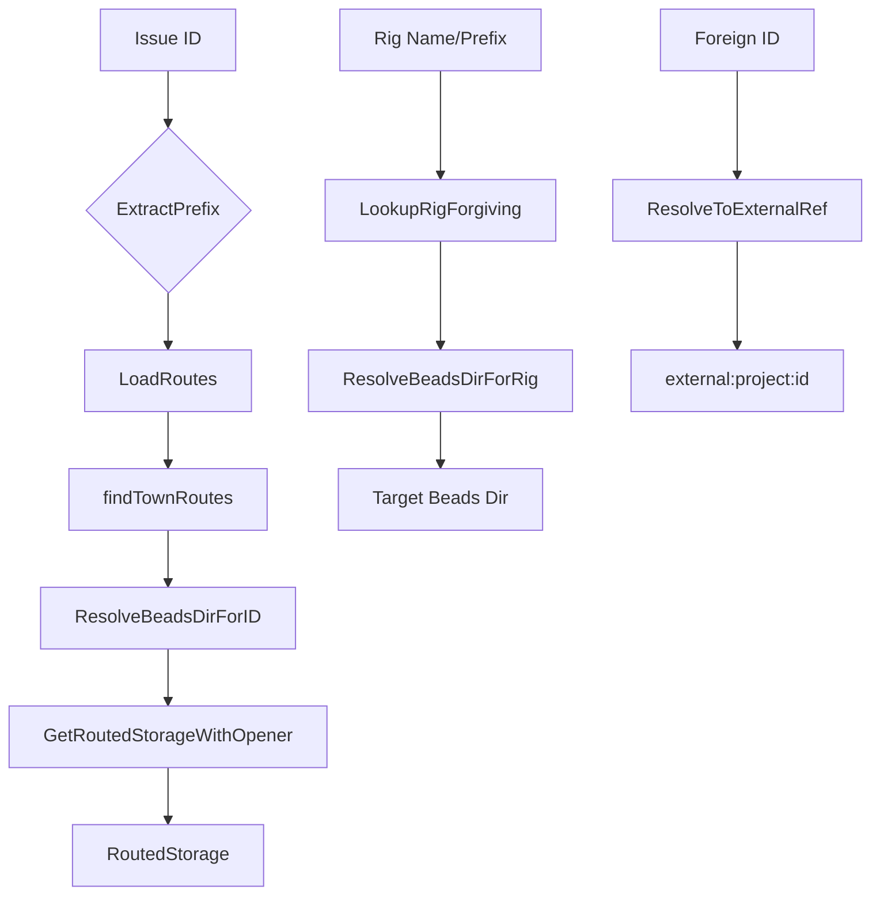

# routing_core 模块技术深度文档

## 1. 问题与目标

### 1.1 问题空间

在多项目、多团队协作的环境中，通常会遇到以下挑战：

- 多个独立的 beads 仓库需要协同工作
- 不同团队/项目有自己的 issue 前缀（如 "bd-", "gt-", "mol-"）
- 需要能够无缝地访问和操作其他仓库中的 issue
- 在 "Gas Town" 这种多 rig 架构中，需要一个统一的路由机制

想象一下，你在一个包含多个子项目的大型代码库中工作，每个子项目都有自己的 issue 跟踪系统。当你看到一个 issue ID 时，你需要知道它属于哪个项目，如何访问它，以及如何与它交互。这就是 routing_core 模块要解决的问题。

### 1.2 设计目标

routing_core 模块的核心目标是提供一个**前缀驱动的路由层**，让系统能够：

1. 根据 issue ID 的前缀自动路由到正确的 beads 目录
2. 支持灵活的查找方式（前缀、项目名、部分匹配）
3. 处理多级目录结构和符号链接
4. 提供透明的重定向机制
5. 支持 "town-level" 的集中路由配置

## 2. 核心抽象与架构

### 2.1 核心抽象

#### Route - 路由规则
`Route` 是最基础的抽象，它定义了从 issue ID 前缀到 beads 目录路径的映射关系：

```go
type Route struct {
    Prefix string `json:"prefix"` // Issue ID 前缀（如 "gt-"）
    Path   string `json:"path"`   // 指向 .beads 目录的相对路径
}
```

这个设计非常简洁，但却能表达丰富的路由关系。每个路由规则都是一个 JSON 对象，存储在 `routes.jsonl` 文件中。

#### RoutedStorage - 路由后的存储连接
`RoutedStorage` 封装了路由后的存储连接，包含三个关键信息：

- 实际的存储连接
- 目标 beads 目录路径
- 是否经过路由的标志

这个抽象让调用者可以透明地处理本地和远程存储，而不需要知道具体的路由逻辑。

### 2.2 架构视图



### 2.3 数据流向

路由模块的典型数据流向如下：

1. **输入**：Issue ID 或 rig 标识符
2. **解析**：提取前缀或标准化输入
3. **查找**：加载路由配置并匹配规则
4. **解析**：将路径解析为实际的 beads 目录
5. **重定向**：跟随符号链接和重定向
6. **输出**：路由后的存储连接或目录路径

## 3. 核心组件详解

### 3.1 Route 结构体

**设计意图**：`Route` 是整个路由系统的基础构建块，它建立了 issue ID 前缀和文件系统路径之间的映射关系。

**为什么这样设计**：
- 使用 JSON 格式便于人类阅读和编辑
- 前缀匹配是一种简单而强大的路由机制
- 相对路径提供了灵活性，不依赖于绝对路径

### 3.2 路由加载机制

#### LoadRoutes 函数

```go
func LoadRoutes(beadsDir string) ([]Route, error)
```

**功能**：从指定的 beads 目录加载 `routes.jsonl` 文件。

**设计特点**：
- 容忍文件不存在（返回空切片而不是错误）
- 跳过空行和注释行
- 忽略格式错误的行
- 只保留前缀和路径都不为空的有效路由

**为什么这样设计**：这种容错设计使得配置文件更加健壮，局部错误不会导致整个配置加载失败。

#### LoadTownRoutes 和 findTownRoutes 函数

这些函数实现了 "town-level" 路由配置的查找机制：

**关键设计决策**：
- 从当前工作目录开始向上查找 town 根目录
- 通过 `mayor/town.json` 文件识别 town 根目录
- 优先使用当前 beads 目录的路由配置，然后回退到 town 级别
- 正确处理符号链接的 .beads 目录

**为什么需要从 CWD 开始查找**：当 .beads 是符号链接时，从实际的 beads 目录路径开始查找可能会找到错误的 town 根目录。从 CWD 开始查找可以确保找到正确的上下文。

### 3.3 前缀提取和路径解析

#### ExtractPrefix 函数

```go
func ExtractPrefix(id string) string
```

**功能**：从 issue ID 中提取前缀（包括连字符）。

**设计特点**：简单而高效，只查找第一个连字符。

**边界情况**：
- 没有连字符的 ID 返回空字符串
- 只返回第一个连字符之前的部分（包括连字符）

#### ExtractProjectFromPath 函数

```go
func ExtractProjectFromPath(path string) string
```

**功能**：从路由路径中提取项目名称（第一部分）。

**设计意图**：支持通过项目名称进行路由查找，提供更好的用户体验。

### 3.4 路由查找机制

#### LookupRigForgiving 函数

```go
func LookupRigForgiving(input, beadsDir string) (Route, bool)
```

**功能**：使用灵活的匹配方式查找路由。

**支持的输入格式**：
- 完整前缀（如 "bd-"）
- 无前缀的前缀（如 "bd"）
- 项目名称（如 "beads"）

**设计意图**：提供良好的用户体验，让用户可以使用他们最习惯的方式来指定 rig。

**实现细节**：内部调用 `lookupRigForgivingWithTown`，该函数同时返回找到的 town 根目录，供其他函数使用。

### 3.5 目录解析函数

#### ResolveBeadsDirForRig 函数

```go
func ResolveBeadsDirForRig(rigOrPrefix, currentBeadsDir string) (beadsDir string, prefix string, err error)
```

**功能**：为给定的 rig 标识符解析对应的 beads 目录。

**关键步骤**：
1. 使用灵活匹配查找路由
2. 解析目标路径（特殊处理 "." 表示 town beads 目录）
3. 跟随重定向
4. 验证目标目录存在且是目录

**返回值**：
- `beadsDir`：目标 beads 目录路径
- `prefix`：该 rig 的 issue 前缀
- `err`：错误信息

**设计特点**：同时返回目录路径和前缀，这样调用者就不需要再次查找前缀。

#### ResolveBeadsDirForID 函数

```go
func ResolveBeadsDirForID(ctx context.Context, id, currentBeadsDir string) (string, bool, error)
```

**功能**：确定包含给定 issue ID 的 beads 目录。

**查找策略**：
1. 首先根据 ID 前缀查找路由
2. 如果找到匹配的路由，解析并验证目标路径
3. 如果没有找到路由或验证失败，使用本地目录

**设计特点**：
- 优先使用路由，但在路由无效时优雅回退
- 返回 `routed` 标志，让调用者知道是否进行了路由
- 支持调试日志（通过 `BD_DEBUG_ROUTING` 环境变量）

### 3.6 外部引用解析

#### ResolveToExternalRef 函数

```go
func ResolveToExternalRef(id, beadsDir string) string
```

**功能**：将外部 issue ID 转换为外部引用格式。

**输出格式**：`external:<project>:<id>`

**设计意图**：提供一种标准化的方式来引用外部 issue，便于系统其他部分处理跨项目引用。

### 3.7 RoutedStorage 相关

#### RoutedStorage 结构体

```go
type RoutedStorage struct {
    Storage  *dolt.DoltStore
    BeadsDir string
    Routed   bool
}
```

**设计意图**：封装路由后的存储连接，提供统一的接口。

**为什么需要这个结构体**：
- 让调用者可以透明地处理本地和路由存储
- 保留原始上下文信息（是否经过路由）
- 提供统一的关闭机制

#### GetRoutedStorageWithOpener 函数

```go
func GetRoutedStorageWithOpener(ctx context.Context, id, currentBeadsDir string, opener StorageOpener) (*RoutedStorage, error)
```

**功能**：为给定的 issue ID 获取路由后的存储连接。

**设计特点**：
- 使用依赖注入的方式提供存储打开逻辑
- 避免不必要的存储打开（如果目标与当前相同）
- 标记为已弃用的 `GetRoutedStorageForID` 函数内部调用此函数

**为什么使用 opener 函数**：这是一个很好的依赖注入示例，它允许调用者控制如何创建存储连接，而不是在路由模块内部硬编码。

## 4. 依赖关系分析

### 4.1 输入依赖

routing_core 模块依赖以下外部组件：

1. **internal/beads**：使用 `beads.FollowRedirect` 函数处理重定向
2. **internal/storage/dolt**：使用 `dolt.DoltStore` 作为存储接口
3. **标准库**：使用了多个标准库包（bufio, encoding/json, os, path/filepath, strings）

### 4.2 被依赖关系

从模块树可以看出，routing_core 是 routing 模块的子模块，可能被以下组件使用：

- CLI Routing Commands（cmd.bd.routed）
- 其他需要跨仓库操作的组件

### 4.3 数据契约

#### 输入契约

- **routes.jsonl**：每行一个 JSON 对象，包含 `prefix` 和 `path` 字段
- **Issue ID**：格式为 `prefix-*` 的字符串
- **Beads 目录路径**：有效的文件系统路径

#### 输出契约

- **Route**：有效的前缀和路径组合
- **RoutedStorage**：有效的存储连接和目录路径
- **外部引用**：格式为 `external:<project>:<id>` 的字符串

## 5. 设计决策与权衡

### 5.1 使用 JSONL 格式

**决策**：使用 JSONL（JSON Lines）格式存储路由配置。

**为什么**：
- 易于手动编辑和版本控制
- 每行独立，局部错误不影响整体
- 支持注释（虽然不是标准 JSON）

**权衡**：
- 失去了一些标准 JSON 工具的支持
- 需要自定义解析逻辑

### 5.2 灵活的查找策略

**决策**：支持多种输入格式（前缀、无前缀前缀、项目名）。

**为什么**：
- 提供良好的用户体验
- 适应不同用户的习惯
- 减少用户记忆负担

**权衡**：
- 增加了实现复杂度
- 可能存在歧义（如前缀和项目名相同的情况）

### 5.3 从 CWD 开始查找 town 根

**决策**：在查找 town 根目录时，从当前工作目录开始而不是从 beads 目录路径开始。

**为什么**：
- 正确处理符号链接的 .beads 目录
- 确保找到正确的上下文

**权衡**：
- 增加了实现复杂度
- 依赖于当前工作目录的正确性

### 5.4 容错设计

**决策**：在加载路由配置时，忽略错误的行而不是失败整个加载。

**为什么**：
- 提高系统的健壮性
- 局部错误不影响整体功能

**权衡**：
- 可能隐藏配置错误
- 需要额外的调试手段来发现问题

### 5.5 依赖注入的存储打开

**决策**：使用 `StorageOpener` 函数类型来打开存储连接。

**为什么**：
- 提高可测试性
- 增加灵活性
- 减少耦合

**权衡**：
- 增加了 API 复杂度
- 要求调用者提供 opener 函数

## 6. 使用与示例

### 6.1 配置 routes.jsonl

```jsonl
# 本地 rig
{"prefix": "bd-", "path": "."}

# 其他 rig
{"prefix": "gt-", "path": "gastown/mayor/rig"}
{"prefix": "mol-", "path": "molecules/team/rig"}
```

### 6.2 解析 issue ID

```go
beadsDir, routed, err := ResolveBeadsDirForID(ctx, "gt-123", currentBeadsDir)
if err != nil {
    // 处理错误
}
if routed {
    // 使用路由后的目录
}
```

### 6.3 查找 rig

```go
route, found := LookupRigForgiving("gt", currentBeadsDir)
if found {
    // 使用找到的路由
}
```

### 6.4 获取路由存储

```go
opener := func(ctx context.Context, beadsDir string) (*dolt.DoltStore, error) {
    return dolt.OpenStore(beadsDir)
}

routedStorage, err := GetRoutedStorageWithOpener(ctx, "gt-123", currentBeadsDir, opener)
if err != nil {
    // 处理错误
}
defer routedStorage.Close()

if routedStorage != nil {
    // 使用路由后的存储
}
```

## 7. 边界情况与注意事项

### 7.1 符号链接处理

**问题**：当 .beads 目录是符号链接时，从 beads 目录路径开始查找 town 根可能会找到错误的目录。

**解决方案**：从当前工作目录开始查找 town 根目录。

**注意事项**：确保当前工作目录正确。

### 7.2 路由配置错误

**问题**：routes.jsonl 中的错误行可能被忽略，导致路由不生效。

**解决方案**：
- 使用 `BD_DEBUG_ROUTING` 环境变量启用调试日志
- 仔细检查 routes.jsonl 文件

### 7.3 路径解析

**问题**：路由路径可能包含特殊字符或相对路径组件。

**解决方案**：
- 使用 `filepath.Join` 等安全的路径操作函数
- 验证解析后的路径是否存在且是目录

### 7.4 性能考虑

**注意事项**：
- 路由查找涉及文件系统操作，可能相对较慢
- 在性能敏感的代码路径中，考虑缓存路由配置
- 避免在循环中重复加载路由配置

## 8. 扩展与未来方向

### 8.1 可能的扩展点

1. **更复杂的路由规则**：支持正则表达式或通配符匹配
2. **路由优先级**：支持路由优先级，解决冲突
3. **动态路由**：支持运行时添加/修改路由
4. **路由验证**：提供路由配置验证工具

### 8.2 当前限制

1. **简单的前缀匹配**：只支持简单的前缀匹配
2. **无路由优先级**：多个路由匹配时，使用第一个匹配的
3. **静态配置**：路由配置是静态的，需要重启才能生效

## 9. 参考

- [Dolt Storage Backend](dolt_storage_backend.md)：了解存储层的实现
- [Beads Repository Context](beads_repository_context.md)：了解 beads 目录的结构
- [Configuration](configuration.md)：了解系统配置的其他方面