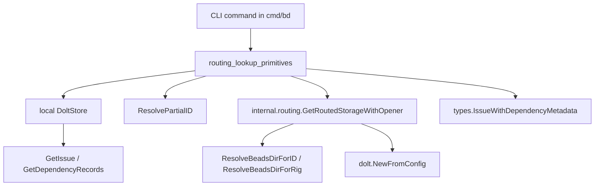

# routing_lookup_primitives

`routing_lookup_primitives`（对应 `cmd/bd/routed.go` 这组原语）本质上是在做一件很现实的事：**当你手里只有一个 issue ID（可能是短 ID、可能带前缀、可能是 external 引用）时，帮你找到“正确的数据库”并拿到可用的 issue 数据**。如果没有这层，CLI 命令会默认只查当前仓库；在多 rig / town 场景下，这会让跨仓库查询和依赖展示出现“明明存在却查不到”的假阴性。

它不是完整的路由系统本身，而是 CLI 侧的“查找与降级编排层”：优先本地、必要时按前缀路由、失败时优雅退化，并且负责生命周期（关闭被临时打开的 routed store）。

## 架构角色与数据流



可以把它想象成“机场转机柜台”：你先在当前航站楼（本地 store）查票；查不到再看转机规则（routes.jsonl）；如果需要转场则临时开一个新柜台（routed store），办完业务立刻关掉。

关键路径有三条：

1. **ID 解析+读取路径**：`resolveAndGetIssueWithRouting` → `resolveAndGetFromStore` → `utils.ResolvePartialID` + `GetIssue`。这是“短 ID/歧义 ID”最热路径。
2. **直接 ID 读取路径**：`getIssueWithRouting` 先本地 `GetIssue`，再按 prefix fallback。
3. **external 依赖补全路径**：`resolveExternalDepsViaRouting` 读取原始 dependency 记录后，逐条外部引用进行跨库解析，补上 `IssueWithDependencyMetadata`。

## 心智模型：三层决策

读这组代码建议始终带着三层判断：

第一层是**是否允许路由**。`dbPath == ""` 或 `BEADS_DIR` 被显式设置（`beadsDirOverride()`）时，直接禁用 prefix 路由，所有查询都留在本地。这是一个强约束：环境变量显式指定数据库时，不要“聪明地”跳库。

第二层是**本地优先**。`resolveAndGetIssueWithRouting` 的注释里写得很清楚：某些 bead（例如 agent bead）即便前缀可路由，也应先以 town/hq 的 canonical copy 为准。也就是“先信本地事实，再做跨库猜测”。

第三层是**失败语义控制**。`isNotFoundErr` 不只识别 `storage.ErrNotFound`，还兼容 `ResolvePartialID` 的纯文本错误（`"no issue found matching"`）。这说明当前依赖接口在错误建模上并不完全统一，这个模块主动做了“错误语义归一化”。

## 组件深潜

### `RoutedResult`

`RoutedResult` 是这个模块最核心的数据契约，字段含义非常直接：

- `Issue`: 解析到的 issue
- `Store`: 该 issue 所在 store（可能是本地，也可能是路由后的）
- `Routed`: 是否发生跨库路由
- `ResolvedID`: 最终解析出的完整 ID
- `closeFn`: 内部资源回收钩子

设计重点在 `Close()`：调用者无需知道底层是否真的开了 routed store，只要在使用后统一 `result.Close()` 即可。这是典型的“条件资源分配 + 无脑释放”模式，降低调用方心智负担。

### `resolveAndGetIssueWithRouting(ctx, localStore, id)`

这是最完整、最“语义正确”的入口：先解析 partial ID，再获取 issue，并带路由 fallback。

实现顺序体现了几个设计意图：

- 无 `dbPath` 或显式 `BEADS_DIR`：直接本地解析，不做路由。
- 先本地 `resolveAndGetFromStore`：保障 canonical 数据优先。
- 仅当错误是“not found”才路由：其他错误（例如连接错误）直接抛出，避免误把系统故障当成“去别处找找看”。
- 路由成功后绑定 `closeFn`：把 routed storage 的关闭职责封装进结果对象。

### `resolveAndGetFromStore(ctx, s, id, routed)`

这个函数把“解析 ID”和“读 issue”拆成明确两步：`ResolvePartialID` → `GetIssue`。这样做好处是调用者拿到的是确定 ID（`ResolvedID`），后续日志、展示、关联查询都更稳定。

代价是：比直接 `GetIssue(id)` 多一步查询/解析成本，但换来 partial ID 体验和一致性。

### `getIssueWithRouting(ctx, localStore, id)`

相比上面的解析版，这个函数更“轻”：直接按给定 ID 查，不做 partial 解析。它保留了同样的本地优先和路由 fallback 结构，但错误策略更保守：当路由失败时，尽量返回原始本地错误，维持旧行为兼容性（注释里称 “current behavior”）。

适用场景通常是调用方已经确定 ID 是完整且可信的。

### `getRoutedStoreForID(ctx, id)` 与 `needsRouting(id)`

这两个是“判路由”辅助原语：

- `getRoutedStoreForID`：若需要路由，直接返回 `*routing.RoutedStorage`。
- `needsRouting`：只回答布尔问题，并比较目标目录是否不同。

`needsRouting` 用于“要不要绕开某些本地优化路径（如 daemon）”这类决策，非常轻量。

### `openStoreForRig(ctx, rigOrPrefix)`

这是“按 rig 显式打开库”的入口。它先通过 `findTownBeadsDir()` 找 town 上下文，再调用 `routing.ResolveBeadsDirForRig`，最后用 `dolt.NewFromConfigWithOptions(... ReadOnly: true)` 打开目标库。

`ReadOnly: true` 是重要取舍：这个函数设计目标是查询，不是修改。只读连接能减少误操作风险，也更符合跨仓库浏览语义。

### `resolveExternalDepsViaRouting(ctx, issueStore, issueID)`

这是很有价值的“数据修复层”。背景是：`GetDependenciesWithMetadata` 使用 JOIN，遇到 `external:*` 这种本地 issues 表不存在的引用时会被静默丢弃。该函数通过以下策略补洞：

1. 用 `GetDependencyRecords` 拿原始边数据；
2. 过滤 `DependsOnID` 以 `external:` 开头的记录；
3. 解析 `external:project:id` 的第三段为目标 ID；
4. 调 `resolveAndGetIssueWithRouting` 跨库补全 issue；
5. 若仍失败，构造占位 issue（`(unresolved external dependency)`）保证 UI/输出层可见。

这里优先“可观测性完整”而不是“强一致失败”：宁可给占位，也不把边吞掉。

### `resolveBlockedByRefs(ctx, refs)`

与上一函数类似，但面向展示层：把 blocker 引用列表转成更可读文本。local ID 原样返回；`external:*` 则尝试解成 `"<id>: <title>"`，失败时至少退化为目标 ID（而非整个 external 前缀串）。

## 依赖关系与契约

从调用方向看，这个模块位于 `cmd/bd` 命令层，向下依赖三类能力：

- 路由解析能力：`internal.routing`（如 `GetRoutedStorageWithOpener`、`ResolveBeadsDirForID`、`ResolveBeadsDirForRig`），详见 [route_resolution_and_storage_routing](route_resolution_and_storage_routing.md)
- 存储读写能力：`*dolt.DoltStore`（`GetIssue`、`GetDependencyRecords`、关闭生命周期等），详见 [Dolt Storage Backend](Dolt Storage Backend.md)
- 领域类型契约：`types.Issue`、`types.Dependency`、`types.IssueWithDependencyMetadata`，详见 [issue_domain_model](issue_domain_model.md)

关键数据契约有两个：

- **ID 契约**：支持完整 ID、partial ID、`external:project:id` 三种形态；不同函数支持集不同。
- **错误契约**：理想 sentinel 是 `storage.ErrNotFound`，但当前还存在字符串匹配兜底（`isNotFoundErr`），这是一个显式技术债信号。

关于“谁调用它”：从当前提供代码看，这些函数都在 `cmd/bd/routed.go` 内作为 CLI 路由查找原语存在；更上层具体命令入口未在本次提供片段中展开，因此不在此猜测具体调用链。

## 设计取舍

最明显的取舍是**正确性优先于最短路径性能**。例如本地优先 + 路由 fallback 可能带来一次额外查询，但避免了跨库命中“非 canonical 副本”的风险。

第二个取舍是**兼容性优先于接口纯度**。`isNotFoundErr` 的字符串匹配不是优雅做法，但它让模块在上游错误语义不一致时仍能稳定决策。

第三个取舍是**自治封装优先于调用方控制**。通过 `RoutedResult.Close()` 内聚资源回收，调用者更简单；代价是调用者若忘记 `Close()` 仍可能泄漏连接。这是典型的 Go 资源管理折中。

## 使用方式与示例

常见模式是：

```go
result, err := resolveAndGetIssueWithRouting(ctx, localStore, inputID)
if err != nil {
    return err
}
defer result.Close()

fmt.Printf("issue=%s routed=%v resolved=%s\n", result.Issue.ID, result.Routed, result.ResolvedID)
// 后续所有关联查询优先使用 result.Store，保证同库一致性
```

如果你只需要判断是否跨库：

```go
if needsRouting(id) {
    // 可选择绕开本地 daemon / 走直连逻辑
}
```

解析 external 依赖时：

```go
deps, err := resolveExternalDepsViaRouting(ctx, issueStore, issueID)
if err != nil {
    return err
}
// deps 中可能包含占位 issue，用于保留依赖可见性
```

## 边界条件与新贡献者注意事项

最容易踩坑的是资源释放：凡是拿到 `RoutedResult`，都应在成功路径尽早 `defer result.Close()`。否则 routed store 可能长期占用。

第二个坑是全局上下文依赖。多个函数依赖 `dbPath`、`store`、`findTownBeadsDir()` 这类外部符号（定义不在本片段中）。改动这些全局约束时，路由行为会发生系统性变化。

第三个坑是 `external:` 解析格式非常严格：使用 `SplitN(..., 3)` 并要求第三段非空。任何变种格式都将被忽略或降级。

第四个坑是错误传播策略不统一：有些分支返回原始本地错误，有些返回路由错误或 `ErrNotFound`。在新增调用点时，要先明确你需要“诊断友好”还是“行为兼容”。

## 参考

- [route_resolution_and_storage_routing](route_resolution_and_storage_routing.md)
- [Dolt Storage Backend](Dolt Storage Backend.md)
- [Storage Interfaces](Storage Interfaces.md)
- [issue_domain_model](issue_domain_model.md)
