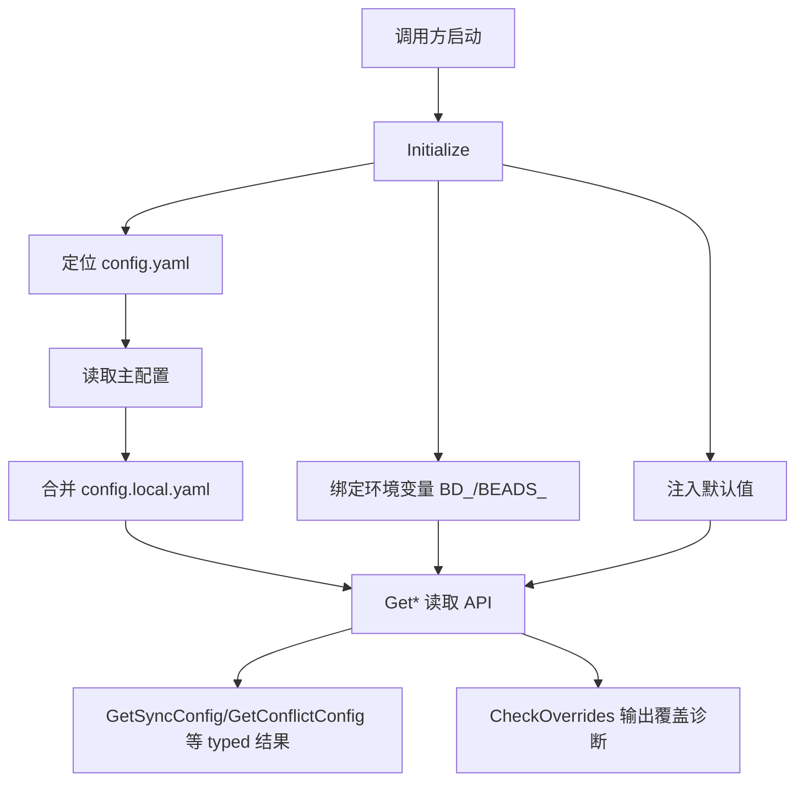

# runtime_config_resolution

`runtime_config_resolution` 可以理解为 Beads 的“运行时配置裁决层”。它要解决的不是“读一个 YAML 文件”这么简单，而是：当同一个配置键可能同时来自默认值、`config.yaml`、`config.local.yaml`、环境变量、命令行 flag 时，系统应该用哪个值、为什么用这个值、能不能解释清楚覆盖关系。朴素方案（到处 `os.Getenv` + 局部 YAML 解析）会很快失控：优先级不一致、测试环境串味、CLI 与 daemon 行为不一致。这个模块的设计目标是把配置解析变成**单点、可预测、可追踪**的流程。

## 架构与数据流



从架构角色看，它是一个**配置编排器 + 轻量转换器**：底层依赖 `viper` 做多源配置聚合，上层把原始 key/value 转成语义化结构（例如 `SyncConfig`、`ConflictConfig`、`FederationConfig`、`MultiRepoConfig`），并补上覆盖来源诊断（`ConfigOverride`）。

关键数据流有三条。第一条是“启动解析流”：`Initialize()` 决定配置文件路径（`BEADS_DIR` > 向上查找项目 `.beads/config.yaml` > `~/.config/bd/config.yaml` > `~/.beads/config.yaml`），然后设定默认值、启用环境变量映射、读取主配置并尝试合并 `config.local.yaml`。第二条是“运行时读取流”：所有 `GetString/GetBool/GetInt/...` 以及 `GetSyncConfig` 这类 typed accessor 都从同一个全局 `v` 获取最终生效值。第三条是“覆盖解释流”：`GetValueSource()` + `CheckOverrides()` 把“谁覆盖了谁”显式化，供 CLI 在 verbose 模式做可解释输出。

## 心智模型：把它当成“机场安检分流线”

想象每个配置键是一位旅客，进入安检线后会依次经过几道检查口：默认值柜台、配置文件柜台、环境变量柜台、最后是命令行 flag 的人工优先通道。谁在后面、谁优先级高，流程里写得非常明确。`runtime_config_resolution` 做的事，就是既保证分流规则一致，又保留“审计记录”（比如 `ConfigOverride`）告诉你最后为什么放行这个值。

这个模型还有一个重要点：模块并不试图让每个调用方自己做裁决，而是把裁决集中在 `config` 包里。这种集中化牺牲了部分“局部自治”，换来全局一致性。

## 组件深潜（按设计意图）

### `Initialize()`：配置生命周期入口

`Initialize()` 是整个模块最关键的入口。它采用全局单例 `var v *viper.Viper`，并在一次初始化中完成四件事：配置文件发现、环境变量绑定、默认值注入、文件加载与本地覆写合并。

这里最有价值的设计不是“能读配置”，而是“读配置时避免隐式污染”。例如测试场景中，通过 `BEADS_TEST_IGNORE_REPO_CONFIG` 跳过 module root 下的 `.beads/config.yaml`，避免 `go test` 意外吃到仓库本地配置；同时又允许临时测试仓库继续使用自己的配置文件。这是典型的工程化权衡：为可测试性增加了一段路径判定复杂度。

### `GetValueSource(key)` 与 `CheckOverrides(...)`：可解释覆盖

配置系统常见痛点是“值变了但不知道谁改的”。`GetValueSource` 把来源抽象为 `ConfigSource`（`default/config_file/env_var/flag`），`CheckOverrides` 再结合显式传入的 flag set 信息，产出 `[]ConfigOverride`。

注意这里有个非显而易见但很务实的选择：flag 优先级不交给 viper，而是由调用方（注释提到 `main.go`）单独处理，再把“哪些 flag 被显式设置”传进来。这样做避免了把 Cobra flag 生命周期强耦合到 viper 绑定逻辑里，代价是调用方要遵守这个隐式契约：**只有真实 `WasSet=true` 的 flag 才应传入**。

### `SaveConfigValue(key, value, beadsDir)` + `setNestedKey(...)`：最小写回策略

写配置时，这个模块没有直接把 `v.AllSettings()` 整体回灌到 YAML，而是先读取现有文件，再只更新目标 key。原因很关键：`viper` 内部是“合并态”（包含 defaults/env/override），若直接全量写回，会把运行时层叠状态污染进持久文件。

`setNestedKey` 用点路径（如 `sync.mode`）递归写入 map，保证可以写嵌套字段。这是简洁方案，但也意味着它依赖 YAML 结构可被 `map[string]interface{}` 正常承载，不保留注释与原始格式。

### typed 视图：`GetSyncConfig` / `GetConflictConfig` / `GetFederationConfig` / `GetMultiRepoConfig`

这组函数的价值在于把“字符串键空间”提升为“领域语义对象”。例如 `GetConflictConfig()` 把全局策略和字段级策略聚合到 `ConflictConfig`；`GetSyncConfig()` 提供 `Mode/ExportOn/ImportOn` 一次读取。

其中 `GetFieldStrategies()` 的实现值得关注：它会校验 `conflict.fields` 的策略值，仅接受 `sync.go` 中 `validFieldStrategies` 定义的集合；非法值通过 `logConfigWarning` 警告并跳过，而不是 hard fail。这体现了模块对“可用性优先”的取舍：尽量不中断主流程，但明确提示配置错误。

### `ResolveExternalProjectPath(projectName)`：路径语义修正

该函数专门修复一个运行时一致性问题：相对路径不应相对 CWD，而应相对仓库根（通过 `ConfigFileUsed()` 从 `.beads/config.yaml` 反推）。这让 daemon、子目录执行、脚本调用得到一致结果。若拿不到 config 文件才 fallback 到 CWD（兼容旧行为）。

### `GetStringFromDir(beadsDir, key)`：绕开全局状态的“旁路读取”

这是为库调用场景准备的：在未调用 `Initialize()` 时，直接从 `<beadsDir>/config.yaml` 读单键。它故意做成“失败即空字符串”，保证调用方可以容忍配置缺失而不中断。代价是错误信息被吞掉，适合兜底读取，不适合严格配置校验路径。

### `GetIdentity(flagValue)`：跨来源身份决策链

优先级链是显式编码的：flag > `BEADS_IDENTITY`/config > `git config user.name` > hostname > `unknown`。这比仅依赖配置文件鲁棒得多，尤其对首次使用者或临时环境。

## 依赖关系与契约

从代码可见，本模块主要调用：

- 外部库：`github.com/spf13/viper`（多源配置聚合）、`gopkg.in/yaml.v3`（YAML 读写）。
- 标准库：`os/path/filepath/strings/time/os/exec`（文件发现、路径解析、环境变量、git 用户名探测）。
- 同包依赖：`sync.go` 中的 `GetSyncMode`、`GetConflictStrategy`、`GetSovereignty`、`FieldStrategy` 校验集合等。

关于“谁调用它”，给定依赖图数据主要暴露 `depends_on` 方向；当前提供片段未包含本模块完整 `depended_by` 清单。因此可以确定的是：该模块以全局 getter API 形式面向 CLI/运行时路径提供配置，且注释已明确 flag 覆盖逻辑由 `main.go` 一侧协同处理。

模块对调用方的隐式契约主要有三条：第一，`Initialize()` 应在应用启动早期调用；第二，测试若需重复初始化应显式 `ResetForTesting()`（并接受其“非线程安全”约束）；第三，若要做覆盖诊断，调用方必须准确传入 `flagOverrides` 的 `WasSet` 状态。

## 设计取舍

这个模块最核心的取舍是“全局一致性优先于局部纯净”。全局 `v` 单例让任何命令路径都能拿到一致配置，减少参数层层透传；但代价是状态共享，需要 `ResetForTesting()`，并且天然不鼓励并发重初始化。

第二个取舍是“宽容读取 + 警告降级”。例如冲突字段策略非法时，不会中断运行，而是跳过并告警。这对 CLI 用户体验友好，但也意味着错误可能在业务效果上“静默退回默认行为”。

第三个取舍是“运行时合并态与持久态分离”。读取用 viper 合并，写回用 YAML 最小更新，避免污染配置文件。这是正确性导向的选择，牺牲了实现简洁度。

## 使用示例

```go
// 启动时初始化
if err := config.Initialize(); err != nil {
    return err
}

// 读取 typed 配置
syncCfg := config.GetSyncConfig()
conflictCfg := config.GetConflictConfig()
_ = syncCfg
_ = conflictCfg

// 检查覆盖（比如 CLI 在解析 flags 后）
overrides := config.CheckOverrides(map[string]struct {
    Value  interface{}
    WasSet bool
}{
    "json": {Value: true, WasSet: true},
})
for _, ov := range overrides {
    config.LogOverride(ov)
}

// 持久化单个配置键
if err := config.SaveConfigValue("sync.export_on", "change", ".beads"); err != nil {
    return err
}
```

## 新贡献者要特别小心的点

`GetValueSource()` 通过 `os.Getenv(...) != ""` 判断环境变量来源，这意味着“被设置为空字符串”的环境变量不会被识别为 env override。若你要支持“显式置空也算覆盖”，这里是一个敏感点。

`Initialize()` 合并 `config.local.yaml` 时会调用 `v.SetConfigFile(localConfigPath)` 后 `MergeInConfig()`。这对结果是正确的，但如果你后续依赖 `ConfigFileUsed()` 的“原始主配置路径语义”，要确认调用时机与预期一致。

`GetFieldStrategies()` 使用 `GetStringMapString("conflict.fields")`，因此配置值会按字符串解析；若未来要支持更复杂字段结构（非 string），这个 API 需要升级。

`ResolveExternalProjectPath()` 会检查路径存在性，不存在直接返回空字符串。调用方必须把空字符串当作“未配置或无效路径”处理，而不是默认当前目录。

## 参考阅读

- [metadata_validation](metadata_validation.md)：元数据 schema 的结构定义与验证上下文。
- [storage_contracts](storage_contracts.md)：配置最终如何影响存储层能力契约。
- [store_core](store_core.md)：Dolt 存储核心行为，理解 `sync/federation` 配置的下游语义。
- [Dolt_Server](Dolt_Server.md)：与 Dolt 运行时相关的配置语义背景。
