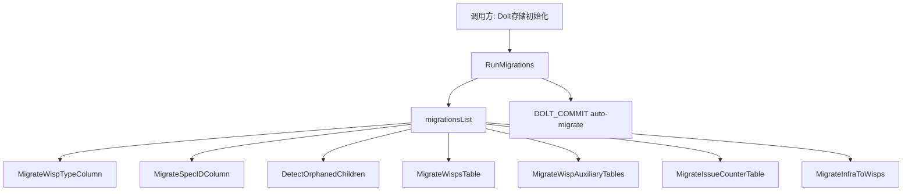

# schema_migrations 模块深度解析

`schema_migrations` 的存在，本质上是在解决一个“**持续演进中的本地数据库，如何安全升级**”的问题。Dolt 作为底层存储，schema 会随着产品功能增长不断变化；如果每次升级都要求用户手动执行 SQL，或者靠“一次性初始化脚本”覆盖所有历史版本，结果通常是脆弱、不可重复、难以回滚。这个模块的设计意图是：把 schema 演进收敛成一组**有序、可重复执行（idempotent）**的迁移步骤，在每次启动/初始化路径中自动执行，从而把“版本差异”变成工程上可控的常规流程。

## 架构角色与数据流

从架构职责看，这个模块不是业务层，也不是通用 SQL 执行器，它更像 Dolt 存储层里的“**启动时整备器（bootstrap orchestrator）**”：维护迁移清单、按顺序调用具体迁移、并在最后触发一次 Dolt commit 来固化 schema 变更。



这条链路里，`RunMigrations(db *sql.DB)` 是控制面入口。它并不实现每个迁移细节，而是遍历 `migrationsList`，逐个调用 `Migration.Func`。也就是说，`schema_migrations` 把“执行顺序与错误边界”集中管理，而把“每个 schema 变化怎么做”下沉到 `internal/storage/dolt/migrations` 包中。这个分层非常关键：调用方只需要知道“跑迁移”，不需要知道“迁移细节”。

当所有迁移函数都成功后，模块执行：

```sql
CALL DOLT_COMMIT('-Am', 'schema: auto-migrate')
```

这里体现了 Dolt 特有的语义：schema 变更需要被 commit 到 Dolt 历史中，才能作为可追踪状态存在。代码同时容忍 `nothing to commit`，因为在幂等迁移模型下，重复执行本来就可能“无变更”。

## 心智模型：把它想成“数据库海关通道”

一个很实用的理解方式是：把 `migrationsList` 想成机场海关的检查序列。

- 每个 `Migration` 是一个检查岗（`Name` + `Func`）。
- 旅客（当前数据库）必须按固定顺序过岗。
- 每个岗都应该能识别“你已经检查过了”，因此重复通过不会出错（幂等）。
- 任何一个岗失败，整条通道立即停止并返回明确错误。
- 全部通过后，盖一个总章（`DOLT_COMMIT`）。

这也是为什么代码明确写了两条规则：

1. 迁移是有序的（`migrationsList` 的顺序即执行顺序）。
2. 新迁移必须追加在尾部（避免重排造成旧环境行为变化）。

## 组件深潜

### `type Migration struct`

```go
type Migration struct {
    Name string
    Func func(*sql.DB) error
}
```

这个结构非常克制：只保留“标识”和“执行函数”。没有版本号字段、没有依赖图、没有条件表达式。设计上的含义是：该模块选择了**线性迁移日志**而非复杂 DAG 迁移框架。对当前项目来说，这是一种偏工程效率的决策——维护成本低、可读性高、排障路径短。

`Name` 的主要价值是错误定位与外部可见性（例如 `ListMigrations`）。`Func` 的签名固定为 `func(*sql.DB) error`，意味着迁移执行上下文被刻意缩减到最核心的数据库连接，避免把外部状态（配置、上下文对象等）耦合进迁移函数。

### `var migrationsList = []Migration{...}`

这是迁移系统的“事实来源（source of truth）”。当前注册顺序是：

1. `wisp_type_column` -> `migrations.MigrateWispTypeColumn`
2. `spec_id_column` -> `migrations.MigrateSpecIDColumn`
3. `orphan_detection` -> `migrations.DetectOrphanedChildren`
4. `wisps_table` -> `migrations.MigrateWispsTable`
5. `wisp_auxiliary_tables` -> `migrations.MigrateWispAuxiliaryTables`
6. `issue_counter_table` -> `migrations.MigrateIssueCounterTable`
7. `infra_to_wisps` -> `migrations.MigrateInfraToWisps`

这里隐含的契约是：**顺序即依赖**。例如如果后续迁移依赖某列/某表已存在，就必须排在对应迁移之后。由于代码没有自动依赖解析，顺序正确性完全依赖维护者 discipline。

### `RunMigrations(db *sql.DB) error`

它是模块的主入口，内部逻辑分两阶段：

第一阶段，遍历迁移列表并执行：

```go
for _, m := range migrationsList {
    if err := m.Func(db); err != nil {
        return fmt.Errorf("dolt migration %q failed: %w", m.Name, err)
    }
}
```

设计重点有三点：

- **Fail-fast**：一个失败就立即返回，不继续后续迁移，避免在未知中间态上叠加改动。
- **带名称包装错误**：`%q` 注入迁移名，使排障能直接定位失败步骤。
- **幂等假设外置**：函数本身不做“是否已执行”记录，而是要求每个迁移函数自己判断和保护。

第二阶段，尝试提交 Dolt schema 变更：

```go
_, err := db.Exec("CALL DOLT_COMMIT('-Am', 'schema: auto-migrate')")
if err != nil {
    if !strings.Contains(strings.ToLower(err.Error()), "nothing to commit") {
        log.Printf("dolt migration commit warning: %v", err)
    }
}
```

这里的非显性设计是：commit 失败并不会导致 `RunMigrations` 返回错误（除非前面迁移函数失败）。它把 commit 异常视为“告警级”而非“阻断级”。这提高了可用性（某些环境下仍可继续），但也带来一致性风险（见后文 tradeoff）。

### `CreateIgnoredTables(db *sql.DB) error` 与 `createIgnoredTables(db *sql.DB) error`

这组函数是一个针对 Dolt 分支行为的补丁入口。注释指出：`dolt_ignore` 的表（`wisps`, `wisp_*`）只存在 working set，不会随分支继承。因此新分支可能缺这些表。

`CreateIgnoredTables` 作为导出函数，供其他包（尤其测试辅助）调用；实际实现放在私有函数 `createIgnoredTables`，只做两件事：

1. `migrations.MigrateWispsTable(db)`
2. `migrations.MigrateWispAuxiliaryTables(db)`

这个设计体现了“**场景化最小迁移**”：不是每次都跑全量 `RunMigrations`，而是在明确需求（重建 ignore 表）下执行子集迁移。

### `ListMigrations() []string`

`ListMigrations` 只是把 `migrationsList` 映射成名称数组返回。看似简单，但它提供了一个稳定的外部观察窗口：CLI/诊断工具可以拿到“当前二进制内置了哪些迁移”，用于比对环境状态。

## 依赖关系分析

从已提供源码可确认的依赖如下：

- 本模块调用：
  - `internal/storage/dolt/migrations` 包内函数（如 `MigrateWispTypeColumn` 等），负责具体 schema 变更。
  - `database/sql` 的 `*sql.DB` 和 `Exec`，负责执行 SQL（含 Dolt 存储过程调用）。
  - `fmt`、`strings`、`log`，用于错误包装、特殊错误识别、告警输出。

- 本模块对外提供：
  - `RunMigrations(db *sql.DB) error`
  - `CreateIgnoredTables(db *sql.DB) error`
  - `ListMigrations() []string`
  - 以及类型 `Migration`

关于“谁调用本模块”，在你给出的代码片段中没有直接调用点，因此不能在这里做精确断言。根据模块树位置（`Dolt Storage Backend -> schema_migrations`）可以合理推断其处于 Dolt 存储初始化路径，但具体入口函数需要查看 [store_core](store_core.md) 或相关初始化代码才能完全确认。

## 关键设计取舍

这个模块最核心的取舍是“**简单线性编排**”对比“**通用迁移框架**”。它没有引入 schema version 表、没有迁移依赖图、没有事务级回滚编排。好处是认知负担小、实现短小、迁移新增成本低。代价是：

- 对“迁移幂等性”的纪律要求很高；
- 顺序错误只能靠 code review/测试捕获；
- 不支持复杂分支迁移策略（例如条件分叉、部分回滚）。

另一个明显取舍是 `DOLT_COMMIT` 失败仅记日志。这是在“可靠提交”与“启动可用性”之间偏向后者。对于开发体验友好，但在严格一致性场景下，可能希望把某些 commit 异常升级为返回错误。

## 如何使用与扩展

典型使用（初始化时执行）：

```go
if err := dolt.RunMigrations(db); err != nil {
    return err
}
```

当你新增迁移时，遵循当前模块的约定流程：

```go
var migrationsList = []Migration{
    // ...existing migrations
    {"new_feature_x", migrations.MigrateNewFeatureX},
}
```

务必注意“追加，不重排”。重排会改变历史环境升级路径，可能导致线上/本地库行为分裂。

如果你在分支切换或测试隔离时只需要补齐 ignore 表：

```go
if err := dolt.CreateIgnoredTables(db); err != nil {
    return err
}
```

若需要展示当前内置迁移：

```go
names := dolt.ListMigrations()
```

## 新贡献者最容易踩的坑

第一类坑是把迁移写成“只能执行一次”的脚本。这里的系统假设是迁移可重复执行，因此迁移函数本身要先检查对象是否存在、列是否已添加、状态是否已符合目标。

第二类坑是修改已有迁移逻辑以“修复旧问题”。在这个模式下，更安全的方式通常是新增一个后继迁移，而不是改写历史迁移语义。否则已执行过旧迁移的环境与新环境会出现不可见分叉。

第三类坑是依赖 `DOLT_COMMIT` 一定成功。当前实现不会把 commit 异常上抛（除迁移执行失败外），所以如果你的后续流程强依赖“迁移已提交到 Dolt 历史”，需要在调用侧增加额外校验。

第四类坑是忽略分支语义。`wisps`/`wisp_*` 这类 ignore 表在新分支可能缺失，这也是 `CreateIgnoredTables` 存在的直接原因。不要假设“主分支有表，所有分支就都有”。

## 参考阅读

- [store_core](store_core.md)：确认迁移在 Dolt 存储生命周期中的调用时机。
- [transaction_layer](transaction_layer.md)：理解迁移与事务层的边界（迁移在何种连接/事务语义下执行）。
- [storage_contracts](storage_contracts.md)：从存储接口视角看 schema 迁移对上层行为兼容性的影响。
