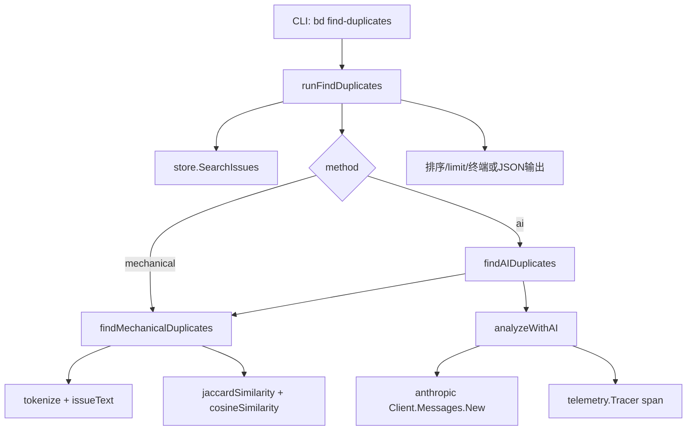

# semantic_duplicate_detection

`semantic_duplicate_detection` 模块（实现位于 `cmd/bd/find_duplicates.go`）解决的是一个很现实的问题：团队里会出现“意思相同、措辞不同”的 issue。`bd duplicates` 那类基于精确内容键的检测只能抓到完全一致或近乎一致的文本，但抓不住“同一个 bug 被两个人用不同语言描述”的场景。这个模块的设计核心不是追求学术上最强语义检索，而是在 CLI 场景里做一个**分层筛查器**：先用便宜、快速的机械相似度把候选对缩小，再按需用 LLM 做语义裁决，最终给用户一份可人工复核的候选重复对清单。



从架构角色看，它是一个典型的 **CLI orchestration + scoring pipeline**：`runFindDuplicates` 负责参数读取、输入集构造、分支到检测策略、结果后处理与输出；具体检测逻辑拆成机械路径和 AI 路径。你可以把它想成机场安检两道门：第一道是金属探测门（机械相似度，便宜、快、覆盖广），第二道是人工开包检查（LLM 语义判断，贵但更懂上下文）。不是每个人都进第二道；只有第一道“滴滴响”的候选才会进入 AI。

## 问题空间与设计心智模型

在 issue 管理里，“重复”其实有三个层级。第一级是字面重复（exact duplicate），第二级是词面近似（同词不同顺序），第三级是语义重复（词面不同但任务本质一致）。`semantic_duplicate_detection` 重点处理第二、三级，尤其是第三层。

纯粹 naive 方案是“两两都丢给 LLM 比较”。问题是 issue 数量一上来，比较对数是 `O(n²)`，再乘上 LLM 请求成本，费用、时延、稳定性都会失控。该模块的设计 insight 是：**把“是否值得调用 AI”先变成一个廉价可计算问题**。所以它先做 token 向量化并计算混合相似度，拿到候选后再让 AI 精判，形成“召回优先预筛 + 精确裁决”的两段式链路。

## 关键数据流（端到端）

一次标准调用 `bd find-duplicates --method ai --threshold 0.5` 的路径如下。

`runFindDuplicates` 先从 flags 读取 `method/threshold/status/limit/model`。如果 `model` 为空，使用 `config.DefaultAIModel()`。然后它对 `method` 做白名单校验（仅 `mechanical` 或 `ai`），并在 AI 模式下要求存在 `ANTHROPIC_API_KEY`。接着它构造 `types.IssueFilter`，调用 `store.SearchIssues(ctx, "", filter)` 拉取 issue。若用户没显式传 `--status`，代码会在内存里再过滤一次，默认排除 `types.StatusClosed`。

拿到 issue 集合后，`runFindDuplicates` 根据 `method` 分流：

- `mechanical` 路径进入 `findMechanicalDuplicates`
- `ai` 路径进入 `findAIDuplicates`

两条路径都会返回 `[]duplicatePair`。之后统一在 `runFindDuplicates` 里做相似度降序排序、`--limit` 裁剪、以及 JSON/终端格式化输出。这意味着输出协议是“后处理统一化”的：无论检测器内部怎么实现，外层只关心 `duplicatePair`。

## 组件深潜

### `duplicatePair`

这是模块内部与输出层共享的核心载体，字段是 `IssueA`、`IssueB`、`Similarity`、`Method`、`Reason`。设计上它把“事实”（哪两个 issue）与“判断元数据”（分值、方法、解释）捆在一起，方便统一排序和渲染。`Reason` 是可选项，主要由 AI 路径填充，用于给人工复核提供可解释性。

### `runFindDuplicates`

这是 orchestrator。它不做复杂算法，但承担了所有流程性约束：参数解析、方法选择、前置校验、数据拉取、默认状态策略、输出控制。一个不明显但很重要的设计是默认行为：如果不传 `--status`，它自动过滤关闭项，减少历史噪音；但如果显式传了状态（包括 `all`），就尊重用户意图。

这里与上游/下游有几个隐含契约：

- 它假设 `store.SearchIssues` 能返回足够完整的 `types.Issue`（至少有 `ID/Title/Description/Status`）
- 它假设全局 `jsonOutput`、`outputJSON`、`FatalError`、`rootCtx`、`store` 已在 CLI 运行环境完成初始化
- 它将最终输出稳定在 pair 列表语义上，便于脚本消费

### `tokenize` 与 `issueText`

`issueText` 只拼 `Title + Description`，不纳入 label、评论、依赖关系等字段，体现出“实现简洁优先”的选择。`tokenize` 的规则是：小写化、按“非字母/非数字/非连字符”分词、丢弃长度为 1 的 token、统计词频。

保留 `-` 这个细节很实用：像 `null-pointer`、`cross-team` 这类工程词不会被硬拆碎。但副作用也明显：它没有 stemming、同义词归一、停用词处理，因此对改写句式或跨语言文本并不鲁棒。

### `jaccardSimilarity` 与 `cosineSimilarity`

两者都基于 `map[string]int` 词频向量。`jaccardSimilarity` 这里不是纯集合版，而是按词频的交并比（近似 multiset Jaccard）；`cosineSimilarity` 则从向量角度衡量方向一致性。`findMechanicalDuplicates` 把两者简单平均：

```go
similarity := (jaccard + cosine) / 2
```

这是个“工程上够好”的折中：Jaccard 抑制长文本噪音，Cosine 对重复关键词敏感，平均后比单一指标更稳，但没有额外权重学习和领域调参成本。

### `findMechanicalDuplicates`

这个函数先对所有 issue 做一次预分词缓存（避免在双重循环里重复 tokenize），然后执行全对比较 `for i ... for j := i+1 ...`。复杂度本质仍是 `O(n²)`，但 tokenization 成本被前移并去重了。

命中阈值就产出 `duplicatePair{Method: "mechanical"}`。它的职责是“尽量快地给出可疑对”，不是给最终真相；因此在 AI 模式里它也被复用为 pre-filter。

### `findAIDuplicates`

这是语义路径的策略控制器。它有三层限流思路：

第一层，`preFilterThreshold := threshold * 0.5`，并设置下限 `0.15`，先用机械算法“广撒网”；第二层，候选数封顶 `maxCandidates := 100`，超出时按机械分高低截断；第三层，把候选分批（`batchSize := 10`）送到 `analyzeWithAI`。

这相当于把“召回率、成本、时延”三者绑在一起做了硬编码平衡：允许漏掉机械分低但语义很近的边缘案例，换来 API 成本和交互时延可控。

### `analyzeWithAI`

这是最关键的“语义裁决器”。它把每个候选对格式化成 prompt，要求模型返回严格 JSON（含 `pair_index/is_duplicate/confidence/reason`），然后调用 `client.Messages.New(...)`。调用外围包了 telemetry span：记录模型名、batch 大小、输入/输出 token、耗时，便于运营和排障。

鲁棒性策略上，它做了三件事：

1. 失败回退：API 调用失败时打印 warning，并返回原始 `candidates`（即机械结果）
2. 格式兼容：尝试从文本中截取 `[` 到 `]` 之间内容，兼容模型输出 markdown code block
3. 边界防护：忽略越界的 `pair_index`

不过这里有一个非常值得注意的行为：失败或解析异常时返回的是 `candidates`，其 `Method` 通常仍是 `"mechanical"`，`Similarity` 也是机械分。也就是说，用户在 `--method ai` 下可能得到实际来自机械回退的结果，这在运维上是合理降级，但在结果语义上是“软降级而非硬失败”。

## 依赖关系与数据契约

从当前代码可直接确认的下游依赖：

- 配置：`config.DefaultAIModel()`（提供 AI 默认模型）
- 存储查询：`store.SearchIssues(ctx, "", filter)`（输入 `types.IssueFilter`，输出 `[]*types.Issue`）
- 类型契约：`types.Issue` 与 `types.IssueFilter`（来自 [Core Domain Types](Core%20Domain%20Types.md)）
- CLI 框架：`cobra.Command`（命令注册、flags）
- AI SDK：`anthropic.Client` 与 `client.Messages.New(...)`
- 可观测性：`telemetry.Tracer(...)` + OpenTelemetry attribute/codes
- 终端呈现：`ui.RenderWarn/RenderAccent/RenderPass`

上游调用方面，这个模块通过 `findDuplicatesCmd` 在 `init()` 里 `rootCmd.AddCommand(findDuplicatesCmd)` 注册，因此它由 CLI 命令分发链触发（属于 CLI Orphans & Duplicate Commands 下的 `semantic_duplicate_detection` 子模块），并与 [exact_duplicate_detection_and_merge](exact_duplicate_detection_and_merge.md) 形成互补：前者偏语义近似，后者偏精确匹配。

## 设计取舍（为什么这么选）

最核心的取舍是“准确率上限”换“可用性下限”。纯 AI 可以更懂语义，但成本高、脆弱；纯机械稳定便宜，但语义能力弱。当前实现选了混合策略，并且把失败路径降级到机械结果，确保命令几乎总能给出可用输出。这非常符合 CLI 工具的操作哲学：宁可给次优答案，也别让用户空手而归。

第二个取舍是“简单实现”优先于“可扩展检索架构”。现在没有倒排索引、ANN 向量库、并发 worker 池，直接 `O(n²)` 比较，代码短小、可审计、维护成本低。代价是 issue 数量很大时会明显变慢，尤其 AI 模式还叠加外部 API 延迟。

第三个取舍是“硬编码策略”优先于“配置驱动策略”。`0.5` 的 pre-filter 系数、`0.15` 下限、`100` 候选上限、`10` 批大小都写死在代码里。好处是行为可预测；坏处是不同仓库规模/文本风格下不一定最优。

## 使用方式与实践建议

最常见用法：

```bash
# 默认机械模式
bd find-duplicates

# 降低阈值，提升召回
bd find-duplicates --threshold 0.4

# AI 语义模式
ANTHROPIC_API_KEY=... bd find-duplicates --method ai

# 指定模型
bd find-duplicates --method ai --model claude-3-5-sonnet-latest

# 只看 open / JSON 给脚本
bd find-duplicates --status open --json
```

如果你在做批量治理，建议先机械模式低阈值跑一轮看噪声，再切 AI 模式聚焦人工复核；并优先消费 JSON 输出，把 pair 导入你自己的 triage 流程。

## 新贡献者最该注意的坑

首先，`threshold` 没有做 0~1 的强校验，传异常值会导致行为怪异（例如负值几乎全命中）。其次，AI 回退路径会静默退化到机械结果，调用方若要严格区分来源，不能只看 CLI 参数，必须看每个 pair 的 `Method` 字段。

再者，`analyzeWithAI` 的 JSON 提取策略是“截第一个 `[` 到最后一个 `]`”，对复杂自然语言前后缀并不稳健；任何提示词变更都要回归测试解析逻辑。还有，description 被截断到 500 字符，长 issue 的关键语义可能刚好在截断后，导致 AI 判错。

最后，性能上要牢记它是全对比较。仓库 issue 量上千时，机械比较与 prompt 构造都会放大。若要扩展，请优先考虑在 `findMechanicalDuplicates` 之前增加 blocking（如按标签/状态/时间窗口分桶）而不是直接加大 AI 配额。

## 可扩展点（不破坏现有心智模型）

一个安全的扩展方式是新增检测方法但保持 `runFindDuplicates -> []duplicatePair` 契约不变，例如增加 `--method hybrid-v2`，内部替换 tokenizer 或相似度融合策略。另一个方式是把 `maxCandidates/batchSize/preFilterThreshold` 暴露为 flags 或配置项，但要保证默认值延续当前行为，避免脚本兼容性问题。

## 相关模块参考

- [exact_duplicate_detection_and_merge](exact_duplicate_detection_and_merge.md)：精确重复检测与合并语义，对比理解两类“重复”定义
- [Core Domain Types](Core%20Domain%20Types.md)：`types.Issue`、`types.IssueFilter` 等数据契约
- [Configuration](Configuration.md)：默认 AI 模型配置来源
- [Telemetry](Telemetry.md)：统一 tracing/指标语义（本模块通过 `telemetry.Tracer` 打点）
