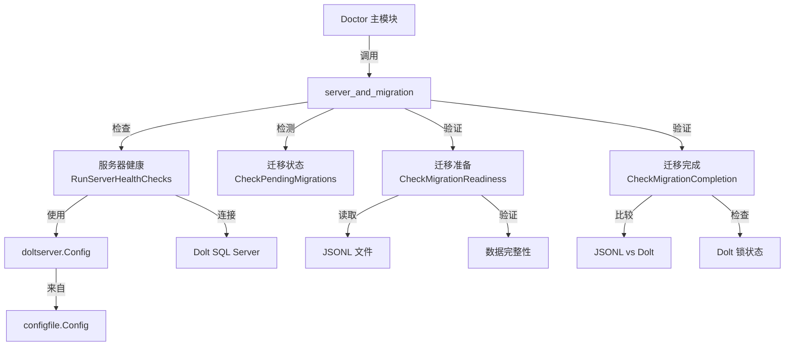

# 服务器与迁移诊断模块 (server_and_migration)

## 概述

`server_and_migration` 模块是 Beads 诊断系统 (`doctor`) 的核心组成部分，专注于 Dolt 服务器模式的健康检查和数据库迁移验证。该模块解决了两个关键问题：1) 确保 Dolt 服务器模式配置正确且可正常访问；2) 在从 SQLite/JSONL 迁移到 Dolt 时提供全面的数据完整性验证和错误检测。

## 架构

本模块主要由以下三个部分组成：

1. **服务器健康检查** (`server.go`)：负责验证 Dolt 服务器连接、数据库存在性和架构兼容性
2. **迁移检测** (`migration.go`)：识别待执行的迁移任务
3. **迁移验证** (`migration_validation.go`/`migration_validation_nocgo.go`)：提供迁移前后的验证功能，包含 CGO 和非 CGO 两个实现版本



## 核心组件详解

### 1. 服务器健康检查 (Server Health Checks)

#### ServerHealthResult

`ServerHealthResult` 结构是所有服务器健康检查的聚合结果容器：

```go
type ServerHealthResult struct {
    Checks    []DoctorCheck `json:"checks"`
    OverallOK bool          `json:"overall_ok"`
}
```

它包含了一系列 `DoctorCheck` 条目和一个整体状态标志，便于机器解析和人类理解。

#### RunServerHealthChecks 函数

`RunServerHealthChecks` 是服务器健康检查的入口点，执行以下步骤：

1. **配置验证**：加载并验证 `metadata.json` 配置
2. **后端检查**：确保后端是 Dolt
3. **服务器模式检查**：验证是否配置了服务器模式
4. **连接性测试**：通过 TCP 连接验证服务器可达性
5. **Dolt 版本检查**：连接并查询 Dolt 版本信息
6. **数据库存在性**：验证目标数据库是否存在
7. **架构兼容性**：检查关键表和元数据
8. **连接池健康**：报告连接池统计信息
9. **过期数据库检测**：查找测试/临时数据库残留

这些检查按照依赖顺序执行，任何关键检查失败都会提前终止并返回错误结果。

### 2. 迁移检测 (Migration Detection)

#### PendingMigration

`PendingMigration` 结构表示一个待执行的迁移：

```go
type PendingMigration struct {
    Name        string // 迁移名称，如 "sync"
    Description string // 描述，如 "为多克隆配置同步分支"
    Command     string // 执行命令，如 "bd migrate sync beads-sync"
    Priority    int    // 优先级：1=关键，2=推荐，3=可选
}
```

#### DetectPendingMigrations 函数

目前该函数的实现是预留的框架，实际功能尚未实现。这为未来添加自动迁移检测功能提供了扩展点。

### 3. 迁移验证 (Migration Validation)

#### MigrationValidationResult

这是迁移验证的核心数据结构，设计用于机器解析（特别是 Claude 等自动化工具）：

```go
type MigrationValidationResult struct {
    Phase              string         // "pre-migration" 或 "post-migration"
    Ready              bool           // 迁移是否可以进行/成功完成
    Backend            string         // 当前后端类型
    JSONLCount         int            // JSONL 中的问题数量
    SQLiteCount        int            // SQLite 中的问题数量（迁移前）
    DoltCount          int            // Dolt 中的问题数量（迁移后）
    MissingInDB        []string       // JSONL 中有但数据库中缺失的问题 ID（样本）
    MissingInJSONL     []string       // 数据库中有但 JSONL 中缺失的问题 ID（样本）
    Errors             []string       // 阻止迁移的错误
    Warnings           []string       // 非阻塞警告
    JSONLValid         bool           // JSONL 是否可解析
    JSONLMalformed     int            // 格式错误的 JSONL 行数
    DoltHealthy        bool           // Dolt 数据库是否健康
    DoltLocked         bool           // Dolt 是否有未提交的更改
    SchemaValid        bool           // 架构是否完整
    RecommendedFix     string         // 建议的修复命令
    ForeignPrefixCount int            // 非本地前缀问题数量（跨环境污染）
    ForeignPrefixes    map[string]int // 前缀 -> 数量映射
}
```

#### 关键验证函数

1. **CheckMigrationReadiness**：
   - 验证 JSONL 文件的存在和完整性
   - 检查当前后端类型
   - 确保没有阻止迁移的问题
   - 为自动化工具提供详细的机器可读输出

2. **CheckMigrationCompletion**：
   - 验证 Dolt 数据库的存在和健康状态
   - 比较 Dolt 与 JSONL 中的问题数据
   - 检查 Dolt 锁状态和未提交更改
   - 检测跨环境污染问题

3. **CheckDoltLocks**：
   - 专门检查 Dolt 数据库的锁状态
   - 忽略 wisp 表（临时表，预期会有未提交更改）

## 设计决策与权衡

### 1. CGO 与非 CGO 构建分离

该模块采用了构建标签（build tags）来分离 CGO 和非 CGO 实现：
- **原因**：Dolt 存储层需要 CGO，而有些环境可能不支持
- **实现**：`migration_validation.go`（CGO 可用）和 `migration_validation_nocgo.go`（CGO 不可用）
- **权衡**：增加了代码重复，但确保了在各种环境下的兼容性

### 2. 服务器端口解析策略

```go
// 使用 doltserver.DefaultConfig 解析端口（环境变量 > 配置 > 派生端口）
// cfg.GetDoltServerPort() 会回退到 3307，这在独立模式下是错误的
port := doltserver.DefaultConfig(beadsDir).Port
```

这一设计决策反映了对配置优先级的深思熟虑：
- 优先使用环境变量，便于容器化部署
- 其次使用配置文件，保持灵活性
- 最后使用默认值，但纠正了原配置中的默认端口问题

### 3. 使用 SHOW DATABASES 而非 INFORMATION_SCHEMA

```go
// 使用 SHOW DATABASES 而不是 INFORMATION_SCHEMA.SCHEMATA 来避免
// 因幻像目录条目导致的崩溃 (R-006, GH#2051, GH#2091)
rows, err := db.QueryContext(ctx, "SHOW DATABASES")
```

这是一个基于实际错误经验的务实选择，优先考虑稳定性而非理论上的"正确性"。

### 4. 连接池配置

```go
// 设置连接池限制
db.SetMaxOpenConns(2)
db.SetMaxIdleConns(1)
db.SetConnMaxLifetime(30 * time.Second)
```

对于健康检查这种短连接操作，采用了非常保守的连接池配置，避免对服务器造成不必要的压力。

## 使用示例

### 服务器健康检查

```go
// 运行服务器健康检查
result := doctor.RunServerHealthChecks("/path/to/repo")

if !result.OverallOK {
    fmt.Println("Server health check failed:")
    for _, check := range result.Checks {
        if check.Status != doctor.StatusOK {
            fmt.Printf("- %s: %s\n", check.Name, check.Message)
        }
    }
}
```

### 迁移准备检查

```go
// 检查是否准备好迁移到 Dolt
check, result := doctor.CheckMigrationReadiness("/path/to/repo")

if result.Ready {
    fmt.Println("Ready to migrate!")
    // 执行迁移...
} else {
    fmt.Println("Migration not ready:")
    for _, err := range result.Errors {
        fmt.Printf("- %s\n", err)
    }
}
```

### 迁移完成验证

```go
// 迁移后验证
check, result := doctor.CheckMigrationCompletion("/path/to/repo")

if result.Ready {
    fmt.Printf("Migration successful! %d issues in Dolt\n", result.DoltCount)
} else {
    fmt.Println("Migration verification failed:")
    for _, err := range result.Errors {
        fmt.Printf("- %s\n", err)
    }
}
```

## 边缘情况与注意事项

1. **数据库命名**：
   - 新数据库使用下划线命名，但支持连字符的旧数据库（带警告）
   - 会验证数据库标识符的合法性

2. **跨环境污染检测**：
   - 系统会检测带有非本地前缀的问题，防止跨环境数据污染
   - 这些问题会在迁移验证中标记为警告

3. **临时数据库**：
   - 系统会识别并警告测试和临时数据库残留
   - 这些数据库会浪费内存并可能影响性能

4. **JSONL 验证**：
   - 只有当所有行都格式错误时才会阻塞迁移
   - 部分格式错误会被警告但不会阻止迁移

5. **Dolt 锁**：
   - wisp 表的未提交更改会被忽略（因为它们是临时的）
   - 其他表的未提交更改会产生警告

6. **CGO 依赖**：
   - Dolt 相关功能需要 CGO
   - 在非 CGO 环境中会返回适当的 "N/A" 消息

## 与其他模块的关系

- **[doltserver](doltserver.md)**：使用其默认配置来解析服务器端口
- **[configfile](configfile.md)**：用于加载和检查 metadata.json 配置
- **[storage/dolt](storage_dolt.md)**：用于 Dolt 数据库的操作和查询
- **[doctor](doctor.md)**：作为诊断系统的一部分，被主 doctor 模块调用

## 未来扩展方向

1. **完善迁移检测**：`DetectPendingMigrations` 函数目前是一个框架，可以实现具体的迁移检测逻辑
2. **自动修复**：添加自动修复常见迁移问题的功能
3. **更多服务器检查**：扩展服务器健康检查以覆盖更多故障场景
4. **性能基准**：添加数据库性能基准测试功能
