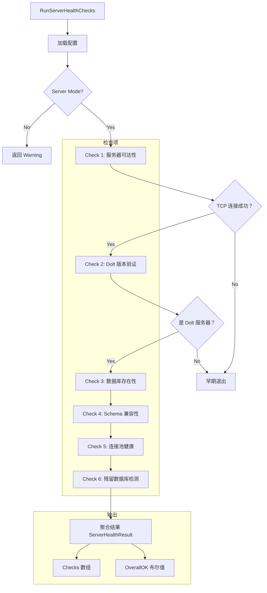

# Server Health Checks 模块深度解析

## 概述：为什么需要这个模块

想象你正在运营一个分布式系统，其中数据库服务器是一个独立部署的组件。当用户报告"系统变慢"或"连接失败"时，你如何快速定位问题？是网络不通？服务器没启动？数据库不存在？还是 schema 版本不匹配？

`server_health_checks` 模块正是为了解决这个**诊断困境**而存在的。当 Beads 运行在 **Dolt Server 模式**（相对于默认的 Embedded 模式）时，系统依赖一个独立运行的 Dolt SQL 服务器。这个模块提供了一套**系统化的健康检查流程**，像医生的体检清单一样，逐项验证服务器的健康状态。

这个模块的核心设计洞察是：**健康检查必须是分层的、可组合的、并且能够给出可操作的修复建议**。它不是简单地返回"成功/失败"，而是返回一个结构化的诊断报告，告诉用户哪里出了问题、为什么出错、以及如何修复。

## 架构与数据流



### 架构角色解析

这个模块在系统中扮演**诊断网关**的角色：

1. **配置验证层**：首先确认系统确实配置为 Server 模式，避免在不相关的场景下运行检查
2. **连接性探测层**：通过 TCP 连接测试网络可达性，这是最基础也最快的检查
3. **身份验证层**：确认连接的是 Dolt 服务器而非普通 MySQL，防止配置错误
4. **数据完整性层**：验证数据库和 schema 的存在性与兼容性
5. **资源健康层**：检查连接池状态，预防资源泄漏
6. **运维清理层**：识别测试残留数据库，这是该模块的独特价值点

### 数据流追踪

健康检查的数据流遵循**管道 - 过滤器模式**：

```
配置文件 → 检查配置 → [检查 1 → 检查 2 → ... → 检查 6] → 聚合结果 → JSON 输出
                              ↓
                          早期退出（关键失败时）
```

每个检查函数接收必要的输入（如 `*sql.DB`、配置参数），返回一个 [`DoctorCheck`](../cmd.bd.doctor.types.DoctorCheck.md) 结构体。主函数 [`RunServerHealthChecks`](#runserverhealthchecks) 负责编排这些检查，并根据结果决定是否继续执行后续检查。

## 组件深度解析

### ServerHealthResult

**设计目的**：作为健康检查的统一输出契约，封装所有检查结果和总体健康状态。

```go
type ServerHealthResult struct {
    Checks    []DoctorCheck `json:"json:"checks"`
    OverallOK bool          `json:"overall_ok"`
}
```

这个结构体的设计体现了**诊断报告的思维模型**：
- `Checks` 数组保存每个独立检查的详细信息，允许用户查看每个维度的状态
- `OverallOK` 布尔值提供快速判断，适合自动化脚本和 CI/CD 集成

**关键设计决策**：为什么使用数组而不是 map？因为检查的**顺序有意义**——它们按依赖关系排列，前面的检查失败会导致后面的检查不执行。数组保持了这种执行顺序的可追溯性。

### RunServerHealthChecks

**签名**：`func RunServerHealthChecks(path string) ServerHealthResult`

**核心职责**：编排所有健康检查，管理执行流程和早期退出逻辑。

**内部机制**：

1. **配置加载阶段**：首先加载 `metadata.json` 配置文件，验证后端类型和 Dolt 模式。这里有一个重要的设计细节——如果配置加载失败，函数会**立即返回**，不会尝试后续的网络连接。这遵循了"快速失败"原则。

2. **模式验证阶段**：检查 `dolt_mode` 是否为 `"server"`。如果不是，返回一个 Warning 级别的检查结果，说明健康检查仅适用于 Server 模式。这个设计避免了在 Embedded 模式下运行无意义的检查。

3. **端口解析策略**：这里有一个微妙的实现细节：
   ```go
   port := doltserver.DefaultConfig(beadsDir).Port
   ```
   代码注释解释了为什么不用 `cfg.GetDoltServerPort()`——后者会回退到 3307，但 standalone 模式下需要动态推导端口。这体现了**配置优先级的设计**：环境变量 > 配置文件 > 路径推导默认值。

4. **检查执行阶段**：按顺序执行 6 个检查，每个检查失败时更新 `OverallOK` 标志。前两个检查（可达性和版本）失败时会**早期退出**，因为后续检查依赖有效的数据库连接。

**副作用**：函数会打开数据库连接，但通过 `defer` 确保在函数返回前关闭（最佳努力清理）。

**返回契约**：
- `OverallOK = true`：所有检查通过
- `OverallOK = false`：至少一个检查失败（Error 或 Warning）

### checkServerReachable

**设计目的**：在最底层验证网络连通性，不依赖任何应用层协议。

**实现策略**：使用 `net.DialTimeout` 进行 TCP 连接测试，超时时间 5 秒。选择 TCP 层而不是应用层的原因是：**如果 TCP 都连不上，没必要尝试更高层的协议握手**。

**关键参数**：
- `host`: 服务器主机名（从配置获取）
- `port`: 服务器端口（从 `doltserver.DefaultConfig` 推导）

**设计权衡**：为什么不用 MySQL 协议直接连接？因为 TCP 连接更快、更轻量，能更快失败。将协议验证留给后续的 `checkDoltVersion`。

### checkDoltVersion

**设计目的**：验证连接的确实是 Dolt 服务器，而非普通 MySQL 或其他 SQL 数据库。

**核心洞察**：Dolt 服务器提供特有的 `dolt_version()` 函数。通过查询这个函数，可以**指纹识别**服务器类型。

**实现细节**：

1. **密码管理**：密码从环境变量 `BEADS_DOLT_PASSWORD` 读取，而不是配置文件。这是**安全边界的设计**——敏感信息不应该出现在版本控制的配置文件中。

2. **连接池配置**：
   ```go
   db.SetMaxOpenConns(2)
   db.SetMaxIdleConns(1)
   db.SetConnMaxLifetime(30 * time.Second)
   ```
   这里使用非常保守的连接池设置，因为健康检查是**一次性诊断操作**，不是长期运行的服务。过多的连接会浪费服务器资源。

3. **错误分类**：函数会区分"连接失败"和"不是 Dolt 服务器"两种错误。后者的错误消息会明确建议用户检查是否连接到了 vanilla MySQL。

**返回值设计**：返回 `(DoctorCheck, *sql.DB)` 对，既返回检查结果，也返回已建立的数据库连接供后续检查复用。这避免了**重复建立连接的开销**。

### checkDatabaseExists

**设计目的**：验证配置的数据库存在且可访问。

**实现策略**：使用 `SHOW DATABASES` 而非 `INFORMATION_SCHEMA.SCHEMATA`。代码注释解释了原因：后者在遇到 phantom catalog entries 时会崩溃（引用了 R-006, GH#2051, GH#2091 等 issue）。这是一个**从生产事故中学习的设计决策**。

**命名验证**：函数包含 `isValidIdentifier` 检查，确保数据库名符合 SQL 标识符规范。但有一个特殊处理——如果名称包含连字符（`-`）但替换为下划线后有效，会返回 Warning 而非 Error。这体现了**向后兼容性**的设计：旧项目使用连字符命名，新项目使用下划线，系统支持两者但鼓励迁移。

**SQL 注入防护**：`USE` 语句无法使用参数化查询，但代码在拼接前先验证了标识符合法性，并使用了反引号引用：
```go
_, err = db.ExecContext(ctx, "USE `"+database+"`") // #nosec G201
```
`#nosec G201` 注释告诉静态分析工具这是经过审查的安全代码。

### checkSchemaCompatible

**设计目的**：验证数据库 schema 与当前 Beads 版本兼容。

**检查策略**：
1. 查询 `issues` 表的行数，验证表存在
2. 查询 `metadata` 表中的 `bd_version` 键，验证版本信息

**设计洞察**：如果 `issues` 表存在但 `metadata` 表不存在，返回 Warning 而非 Error，建议运行 `bd migrate`。这区分了**完全损坏**（表不存在）和**需要升级**（schema 过旧）两种状态。

### checkConnectionPool

**设计目的**：诊断连接池状态，识别潜在的资源泄漏。

**实现**：调用 `db.Stats()` 获取连接池统计信息，包括：
- `OpenConnections`: 当前打开的连接数
- `InUse`: 正在使用的连接数
- `Idle`: 空闲连接数
- `MaxIdleClosed` / `MaxLifetimeClosed`: 因策略关闭的连接数

**设计决策**：这个检查总是返回 `StatusOK`，因为连接池统计信息是**诊断数据**而非健康判断依据。异常值会在 `Detail` 字段中展示，供用户参考。

### checkStaleDatabases

**设计目的**：识别并报告测试/开发过程中遗留的临时数据库。

**问题背景**：在开发和测试过程中，会创建大量临时数据库（如 `testdb_*`、`beads_pt*` 等）。这些数据库如果不清理，会**浪费服务器内存**并在高并发场景下**降低性能**。

**实现机制**：
1. 查询所有数据库列表
2. 过滤掉已知的生产数据库（`information_schema`、`mysql`）
3. 匹配预定义的残留前缀列表

**前缀列表设计**：
```go
var staleDatabasePrefixes = []string{
    "testdb_",      // BEADS_TEST_MODE=1 时的临时路径 FNV 哈希
    "doctest_",     // doctor 测试助手
    "doctortest_",  // doctor 测试助手
    "beads_pt",     // gastown patrol_helpers_test.go 随机前缀
    "beads_vr",     // gastown mail/router_test.go 随机前缀
    "beads_t",      // 协议测试随机前缀（t + 8 位十六进制）
}
```

这个列表是**从代码库中归纳出来的经验知识**，每个前缀都对应特定的测试场景。

**输出策略**：如果找到残留数据库，返回 Warning 级别，并在 `Detail` 中列出前 10 个，在 `Fix` 中建议运行 `bd dolt clean-databases`。这体现了**可操作诊断**的设计理念。

## 依赖分析

### 上游依赖（被谁调用）

`server_health_checks` 模块被 [`cmd.bd.doctor`](../cmd.bd.doctor.md) 命令系统调用，具体是 `bd doctor --server` 命令。调用者期望获得一个结构化的诊断报告，用于：
- 在终端展示给用户
- 在自动化脚本中解析判断
- 在支持工单中附加诊断信息

### 下游依赖（调用谁）

| 依赖模块 | 调用目的 | 契约要求 |
|---------|---------|---------|
| [`internal.configfile`](../internal.configfile.configfile.Config.md) | 加载和解析配置文件 | 返回 `*Config` 或 error |
| [`internal.doltserver`](../internal.doltserver.doltserver.Config.md) | 推导默认端口配置 | 返回 `Config` 结构体 |
| `database/sql` + MySQL 驱动 | 执行数据库查询 | 标准 Go SQL 接口 |
| [`cmd.bd.doctor.types`](../cmd.bd.doctor.types.DoctorCheck.md) | 构造检查结果 | `DoctorCheck` 结构体定义 |

### 数据契约

**输入契约**：
- `path string`: Beads 仓库路径，用于定位 `.beads/` 目录和 `metadata.json`

**输出契约**：
- `ServerHealthResult`: JSON 可序列化的结构体，包含检查数组和总体状态

**隐式契约**：
- 配置文件必须存在且可解析
- 如果配置为 Server 模式，必须提供有效的 host 配置
- 密码必须通过 `BEADS_DOLT_PASSWORD` 环境变量提供（如果服务器需要认证）

## 设计决策与权衡

### 1. 顺序执行 vs 并行执行

**选择**：顺序执行，早期退出

**理由**：健康检查存在**依赖关系**——如果 TCP 连接失败，没必要尝试数据库查询。顺序执行可以：
- 更快失败（不需要等待所有检查完成）
- 减少资源消耗（不建立不必要的连接）
- 提供更清晰的诊断路径（第一个失败的检查通常是根本原因）

**权衡**：在服务器健康的情况下，总执行时间会比并行执行长。但对于诊断工具，**快速定位问题**比**快速确认健康**更重要。

### 2. 保守的连接池配置

**选择**：`MaxOpenConns=2`, `MaxIdleConns=1`

**理由**：健康检查是**诊断操作**，不是生产负载。过多的连接会：
- 浪费服务器资源
- 在并发诊断场景下加剧服务器压力
- 掩盖真实的连接池问题

**权衡**：如果未来需要并发执行多个检查，可能需要调整这个配置。但当前设计优先保证**对生产环境的最小侵入**。

### 3. 密码从环境变量读取

**选择**：`os.Getenv("BEADS_DOLT_PASSWORD")` 而非配置文件

**理由**：安全边界设计。配置文件通常会被版本控制，而密码不应该出现在版本控制系统中。环境变量是**进程隔离的**，更适合传递敏感信息。

**权衡**：增加了部署复杂度——用户需要确保环境变量正确设置。但这是安全性的必要代价。

### 4. 使用 SHOW DATABASES 而非 INFORMATION_SCHEMA

**选择**：`SHOW DATABASES`

**理由**：从生产事故中学习。代码注释引用了多个 issue（R-006, GH#2051, GH#2091），说明 `INFORMATION_SCHEMA.SCHEMATA` 在遇到 phantom catalog entries 时会崩溃。`SHOW DATABASES` 更健壮。

**权衡**：`SHOW DATABASES` 是 MySQL 特有语法，降低了可移植性。但 Beads 已经绑定 Dolt/MySQL 生态，这个权衡是可接受的。

### 5. 残留数据库前缀的硬编码

**选择**：在代码中硬编码前缀列表

**理由**：这些前缀是从**代码库测试实践中归纳出来的**，是领域知识。将它们硬编码在代码中：
- 确保检查逻辑与测试代码同步更新
- 避免配置文件膨胀
- 提供明确的文档（每个前缀都有注释说明来源）

**权衡**：添加新的测试前缀需要修改代码并重新编译。但测试前缀的变化频率很低，这个权衡是可接受的。

## 使用指南

### 基本用法

```bash
# 运行服务器健康检查
bd doctor --server

# 在脚本中检查退出码
bd doctor --server && echo "健康" || echo "有问题"
```

### 输出示例

```json
{
  "checks": [
    {
      "name": "Server Config",
      "status": "ok",
      "message": "Dolt mode is 'server'",
      "category": "federation"
    },
    {
      "name": "Server Reachable",
      "status": "ok",
      "message": "Connected to 127.0.0.1:3307",
      "category": "federation"
    },
    {
      "name": "Dolt Version",
      "status": "ok",
      "message": "Dolt 1.35.0",
      "category": "federation"
    },
    {
      "name": "Database Exists",
      "status": "ok",
      "message": "Database 'beads' accessible",
      "category": "federation"
    },
    {
      "name": "Schema Compatible",
      "status": "ok",
      "message": "1234 issues (bd 2.1.0)",
      "category": "federation"
    },
    {
      "name": "Connection Pool",
      "status": "ok",
      "message": "Pool healthy",
      "detail": "open: 1, in_use: 1, idle: 0",
      "category": "federation"
    },
    {
      "name": "Stale Databases",
      "status": "warning",
      "message": "3 stale test/polecat databases found",
      "detail": "Found 3 stale databases (of 15 total):\n  testdb_abc123\n  beads_pt456\n  beads_t789def0",
      "fix": "Run 'bd dolt clean-databases' to drop stale databases",
      "category": "maintenance"
    }
  ],
  "overall_ok": false
}
```

### 配置要求

服务器健康检查仅在以下配置下运行：

```json
{
  "backend": "dolt",
  "dolt_mode": "server",
  "dolt_server_host": "127.0.0.1",
  "dolt_database": "beads"
}
```

密码通过环境变量提供：

```bash
export BEADS_DOLT_PASSWORD="your-password"
bd doctor --server
```

## 边界情况与注意事项

### 1. Embedded 模式下的行为

如果在 Embedded 模式下运行 `bd doctor --server`，模块会返回一个 Warning 级别的检查结果，说明健康检查仅适用于 Server 模式。这不是错误，而是**配置不匹配的提示**。

### 2. 连字符数据库名称

旧项目可能使用连字符命名数据库（如 `my-beads-db`）。模块会：
- 接受这种命名（向后兼容）
- 返回 Warning 建议迁移到下划线命名
- 使用反引号引用数据库名以支持连字符

**迁移路径**：导出数据 → `bd init --force` → 重新导入

### 3. 连接泄漏风险

每个检查函数都使用 `defer` 关闭资源，但在早期退出路径中可能存在边缘情况。代码采用**最佳努力清理**策略：
```go
if db != nil {
    _ = db.Close() // Best effort cleanup
}
```

下划线忽略错误是因为在诊断工具中，清理失败通常不影响主要功能。

### 4. 超时设置

所有数据库操作都有 5-10 秒的超时限制。如果服务器响应慢于这个阈值，检查会失败。这可能导致**误报**——服务器实际健康但暂时响应慢。

**缓解策略**：在高负载环境下，考虑增加超时时间或多次重试。

### 5. 残留数据库检测的局限性

`checkStaleDatabases` 依赖硬编码的前缀列表。如果测试代码添加了新的前缀模式但未更新此列表，残留数据库不会被检测到。

**维护责任**：添加新的测试数据库前缀时，应同步更新 `staleDatabasePrefixes` 列表。

## 相关模块

- **[服务器与迁移验证](../服务器与迁移验证.md)** — 父模块，聚合服务器检查和迁移验证的完整诊断系统
- [`cmd.bd.doctor`](../cmd_bd_doctor.md) — 诊断命令系统，调用本模块
- [`cmd.bd.doctor.types`](../cmd_bd_doctor_types.md) — 检查结果数据结构定义
- [`internal.configfile`](../internal_configfile_configfile.md) — 配置文件加载
- [`internal.doltserver`](../internal_doltserver_doltserver.md) — Dolt 服务器配置
- [`internal.storage.dolt`](../internal_storage_dolt_store.md) — Dolt 存储后端
